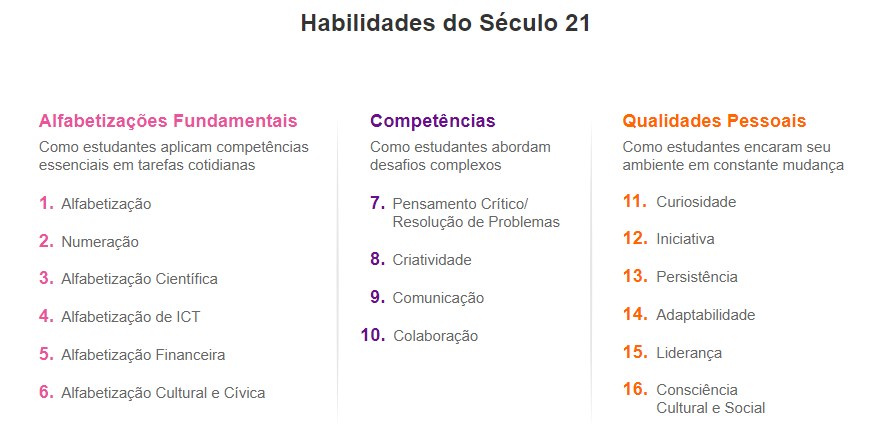
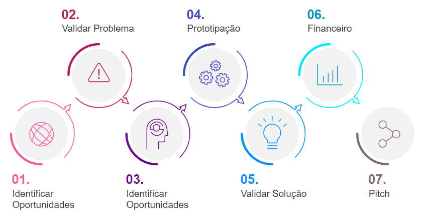

<h1>FASE 1 - APP WORLD</h1>
<h2>Capítulo 03: Um mundo de oportunidades. 🌎</h2>

<h2>1. UM MUNDO DE OPORTUNIDADES</h2>

## 1.1 O que é o Startup One?

- é um programa que tem como objetivo estimular a criação de um projeto inovador, ou seja, transformar um problema em uma solução, uma oportunidade de negócio em um projeto de Startup que seja de alto impacto, alto grau de transformação e crescimento exponencial.

## 1.2 Por que Startup One?

- neste novo mundo, novas habilidades são necessárias (chamadas `habilidades do século XXI`, indicadas pelo Fórum Econômico Mundial).
- na figura abaixo, em roxo, estão os conhecimentos-base adquiridos tradicionalmente nas escolas; em amarelo e em azul, são aqueles necessários para o século XXI.

 
<i>Habilidades do século XXI.</i>

- o StartupOne é o programa da FIAP que o estimula a desenvolver essas habilidades na prática, por meio da criação de uma Startup e, assim,trazer uma experiência de inovação. 

## 1.3 Mindset empreendedor

- empreender é uma atividade que te leva a enfrentar desafios complexos, riscos e incertezas.
- **empreendedorismo inovador**: universo do qual as startups fazem parte, trata-se de uma forma de pensar e agir, buscando aproveitar as oportunidades criadas pelas novas tecnologias, chamada de `mindset de startup`!

### 1.3.1 Cultura de Startup

- essa forma de pensar e agir está cada vez mais comum, seja para quem quer fundar um negócio inovador como uma startup, seja para intraempreendedores.
- esse será o novo padrão de excelência do mercado de trabalho. 
- algumas características cada vez mais comuns, serão:

### a) Adaptabilidade:
- para projetos, iniciativas e abordagens diferentes.
- o mercado tem se tornado imprevisível, e temos tido desafios imensos, que impactam toda a economia global. 
- a habilidade de se adaptar rapidamente nunca foi tão bem-vinda, embora ela seja fruto de uma visão orgânica de gestão, que enxerga as instituições como organismos vivos. 

### b) Flexibilidade:
- seja no formato de trabalho remoto, ou as ideias sobre equilibrar vida pessoal com o trabalho, na busca da qualidade de vida. 
- considerado na busca de aumento de desempenho, visto que pessoas mais satisfeitas entregam mais resultado!

### c) Erro como aprendizado: 
- é necessário ter um ambiente para realizar experimentações, o que implica em admitir que nem sempre o que foi planejado será executado conforme o esperado.
- ao realizar alguns processos, podemos aprender com os erros que aparecerão durante os experimentos e assim será possível controlá-los ou até mesmo evitá-los.

### d) Menos hierarquia e mais autonomia:
- modelos mais horizontais e descentralizados: é um modelo que entrega resultado, seja em receita, seja em engajamento.
- pessoas com mais autonomia para tomar decisão, desenvolvem senso de pertencimento, e por consequência, maior comprometimento.
- a autonomia é uma moeda de troca para aumentar a responsabilidade de todos!

### e) Otimização de recursos:
- funcionários das empresas de modelo tradicional não têm incentivos para tratar os recursos com a mesma atenção que um empreendedor de uma startup trata, seja pela escassez desse recurso para as startups, seja pelo que chamamos de “pensamento de dono”. 
- tendo funcionários que pensam como dono e desejam avançar, os recursos são otimizados, o que favorece tanto as empresas quanto os colaboradores, já que novas formas de recompensas podem ser desenvolvidas, tornando o reconhecimento mais visível. 
- assim, a empresa ganha agilidade e saúde financeira, e os profissionais ganham reconhecimento, autonomia, aprendizado e valorização no mercado como um todo.

## 1.4 Como vai funcionar?

- durante todo o ano, em todas as fases do curso, serão apresentados conteúdos relacionados à inovação e ao modelo Startup, de maneira progressiva, abordando inicialmente toda a análise do problema sob suas diferentes vertentes e, depois, a análise da solução, como definição e modelos de negócio e prototipação.
- em adição aos conteúdos, as atividades das fases estarão relacionadas ao tema do seu projeto Startup One
- durante o ano, o aluno vai aprender na prática:
  - Identificar oportunidades.
  - Validar hipóteses do problema.
  - Desenhar propostas de valor e modelos de negócio com o Canvas.
  - Prototipar.
  - Validar hipóteses da sua solução.
  - Analisar a viabilidade financeira do seu projeto.
  - Apresentar o projeto, através do Pitch.

 
<i>Fluxo do Startup One.</i>

## 1.5 Premiação

- as startups que chegarem mais próximas de um negócio e tiverem maior nível de maturidade, irão participar de uma competição, fazendo um pitch para uma banca de investidores, aceleradoras e hubs de inovação de grandes empresas.
- a Startup vencedora ganhará uma extensão internacional, gratuita, na Babson College, em Boston/EUA.

## 1.6 Conheçao seu tutor

- foram convidados tutores de mercado para acompanhar e ajudar no projeto das Startups, trazendo experiência de mercado, no segmento de tecnologia.

## 1.7 Perguntas frequentes

### a) A ideia é simular a criação de uma Startup ou realmente criar uma?
- a ideia é realmente criar uma Startup.
- espera-se que o aluno chegue até a etapa de prototipação, junto com a respectiva validação, ou seja, a etapa pré-operacional da Startup. 
- caso ultrapasse essa etapa, haverá ainda mais chances de se destacar na competição.

### b) Como proteger a minha ideia?
- no mundo das Startups, não pensamos em proteger ideias, e sim compartilhá-las para validar ainda mais o escopo e a viabilidade delas.

### c) Teremos contato com os investidores?
- caso a Startup se destaque, ela será selecionada para fazer um pitch para uma banca de investidores, aceleradoras e hubsvde inovação, ou seja,divulgar a Startup para o mercado.

### d) Posso mudar minha ideia durante o ano?
- sim, pois com o amadurecimento das análises de negócio, é natural que ocorram algumas mudanças, tanto na ideia quanto no modelo de negócio.

### e) Qual a quantidade máxima de membros do grupo?
- o número máximo de membros do grupo é 5, podendo fazer sozinho ou com até 5 pessoas.

### f) Posso trabalhar com mais de uma ideia ao mesmo tempo?
- sim, mas sugere-e que tente verificar qual oportunidade de negócio é a mais promissora e tente seguir nessa direção, pois o tempo de dedicação para uma Startup é bem grande, e para mais de uma, seria ainda maior.

### g) Posso mudar meu grupo?
- sim, a qualquer momento.

### h) O curso naBabsonCollege, para o vencedor do Startup One, será gratuito?
- sim, não só o curso, mas também a hospedagem, as passagens aéreas e a estadia para todos os membros do grupo, durante o período do curso.

### i) Como me destacar no Startup One?
- "validação de hipóteses" é a resposta para aumentar a maturidade da Startup e transformar um grande problema em um grande negócio.

### j) Quais são os critérios de avaliação da competição do Startup One?
- são as premissas do modelo Startup, como: proposta de valor, diferencial competitivo, potencial de crescimento e escalabilidade, impacto e transformação.

### k) A Startup precisa estar associada ao tema do meu curso?
- não precisa necessariamente estar associada ao tema do curso, mas caso esteja, a experiência e o aprendizado serão ainda maiores.

### l) De quem é a propriedade intelectual da Startup desenvolvida?
- 100% do aluno. 
- a FIAP não tem qualquer participação societária ou propriedade intelectual sobre a Startup e o trabalho desenvolvido.

### m) Posso formar um grupo entre alunos do FIAP ON e da graduação presencial?
- não, pois as competições do Startup One são distintas

### n) O Startup One é obrigatório?
- a competição do Startup One não é obrigatória, já as atividades existentes em cada fase, caso estejam relacionados ao Startup One, são.

### o) Quais projetos são recorrentes no Startup One? Quais temas devemos evitar para nos diferenciar?
- geralmente, os temas mais recorrentes do Startup One são relacionados ao nosso cotidiano, como: casamento, pet, guincho, baladas, restaurantes, academia, estacionamento, etc. 
- para que se diferencie no Startup One, busque trabalhar com temas que transcendam esse senso comum e que gerem um grau de transformação ainda maior, como as áreas e temas indicados pela [Y Combinator](https://www.ycombinator.com/rfs/), uma das maiores aceleradoras de Startups, do Vale do Silício.

--- 

[Voltar ao início!](https://github.com/DigouO/Smart_Cities_FIAP_2024)