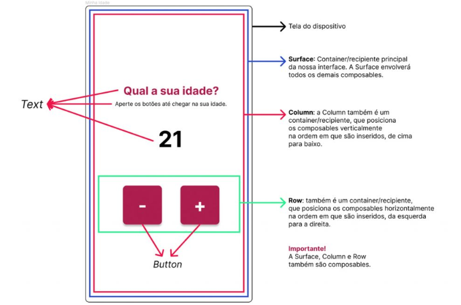

<h1>FASE 1 - APP WORLD</h1>
<h2>Capítulo 4A: Introdução ao Jetpack Compose.</h2>

<h2>1. INTRODUÇÃO AO JETPACK COMPOSE</h2>

- é o kit de ferramentas oficial do Google para desenvolvimento de aplicativos de forma nativa para dispositivos Android. 
- segundo o Google, o Jetpack Compose simplifica e acelera o desenvolvimento de Interface do Usuário (IU) no Android. 
- atualmente grandes empresas já aderiram a esta nova forma de construir aplicativos Android, dentre elas: Google Play, Airbnb, Dropbox, Twitter, Booking, Adidas, Shopee etc.

## 1.1 O que é o Jetpack Compose?

- é um framework para IU declarativa.
- foi apresentado pela primeira vez à comunidade de desenvolvedores Android no Google I/O 2019, um evento utilizado pelo Google para falar sobre os novos recursos, ferramentas, tecnologias e tendências do universo Google, que também engloba o universo Android.
- o Jetpack Compose é um kit de ferramentas (`toolkit`), que entrega todos os recursos necessários para construir aplicativos Android de forma mais rápida, mais eficiente e escrevendo menos código.

## 1.2 Composables

- ao construir uma interface para Android utilizando Jetpack Compose, "quebramos" a interface em pequenos “pedaços” (`Composables`), que depois são combinados e reutilizados para criar interfaces mais complexas.
- é uma função em Kotlin que define a IU de um componente específico da tela.
- é responsável por descrever como um elemento de tela dever ser renderizado e se comportar. 
- um composable pode ser construído através de outros composables.
- quando criamos um composable, declaramos os elementos visuais, como textos, botões, imagens e listas, além de definir a lógica de interação e a aparência do componente.
- uma das grandes ***vantagens*** dos composables é a possibilidade de reutilizar componentes: criamos composables mais genéricos que serão utilizados em diferentes partes da interface da aplicação.
- o Jetpack Compose possui uma vasta gama de composables previamente construídos, que podemos utilizar para criar a interface da aplicação. Praticamente todos os componentes de interface mais comuns em uma aplicação Android já estão disponíveis e prontas para serem utilizadas. 

## 1.3 State

- uma das maiores dificuldades no desenvolvimento Android tradicional era controlar o estado da IU.
- o ***estado representa os dados que podem ser modificados e que afetam a aparência ou o comportamento dos componentes da interface***. 
  - `na abordagem tradicional`: 
    - fazemos a manipulação direta dos componentes de tela.
    - ou seja, se um dado é alterado e este exige que um texto mude a cor, é necessário fazermos essa mudança de forma imperativa, e isso vai ocorrer com cada componente da IU. 
    - quanto mais componentes de IU tivermos, maior será a complexidade em manter a aparência atualizada e, consequentemente, maior será a possibilidade de existência de bugs.
  - `no Jetpack Compose`:
    - o estado é declarativo e reativo.
    - nós definimos o estado inicial dos componentes e qualquer mudança neste estado inicial resultará em uma atualização total da IU de forma automática.

> O conceito de state trouxe uma grande vantagem para o desenvolvedor Android, que agora foca seu trabalho no que é realmente importante, como a lógica da IU e não mais na manipulação direta dos componentes de tela!

## 1.4 O novo e o antigo

- antes do Jetpack Compose, as views (que eram os componentes de tela do aplicativo Android) eram construídas através de XML, era necessário um arquivo separado para "desenhar" a tela.
- para alterar o estado das views era preciso obter, em Kotlin ou Java, a referência de cada view que deveria ser alterada, o que gerava bastante código e aumentava a complexidade. 
- com o Jetpack Compose, tudo fica em um único arquivo, onde descreve, em Kotlin, o que a IU deve conter e o Compose faz o resto. 
- exemplo:

### a) implementação com XML:

~~~kotlin
<?xml version="1.0" encoding="utf-8"?>
  <androidx.constraintlayout.widget.ConstraintLayout 
  xmlns:android="http://schemas.android.com/apk/res/android"
    xmlns:app="http://schemas.android.com/apk/res-auto"
    xmlns:tools="http://schemas.android.com/tools"
    android:layout_width="match_parent"
    android:layout_height="match_parent"
    tools:context=".MainActivity">

    <com.google.android.material.textfield.TextInputLayout
      android:layout_width="0dp"
      android:layout_height="wrap_content"
      android:layout_marginStart="32dp"
      android:layout_marginTop="32dp"
      android:layout_marginEnd="32dp"
      android:hint="O que você está procurando?"
      app:layout_constraintEnd_toEndOf="parent"
      app:layout_constraintStart_toStartOf="parent"
      app:layout_constraintTop_toTopOf="parent">

    <com.google.android.material.textfield.TextInputEditText
      android:layout_width="match_parent"
      android:layout_height="wrap_content"
      android:drawableEnd="@drawable/baseline_search_24" />
    </com.google.android.material.textfield.TextInputLayout>
  </androidx.constraintlayout.widget.ConstraintLayout>
~~~

### b) implementação com JetPack Compose:

~~~kotlin
@Composable
  fun SearchField() {
    Column() {
      OutlinedTextField(
        value = "",
        onValueChange = {},
        placeholder = { Text("O que você está procurando?") },
        trailingIcon = {
          Icon(
            painter = painterResource(
                id = R.drawable.baseline_search_24
          ),
          contentDescription = ""
        )
      })
    }
  }
~~~

- o Jetpack Compose utiliza uma quantidade de código menor, enquanto com XML precisamos de uma quantidade maior. 

## 1.5 Criação de um projeto Android com Jetpack Compose

~~~kotlin
package br.com.fiap.minhaidade

import android.os.Bundle
import androidx.activity.ComponentActivity
import androidx.activity.compose.setContent
import androidx.compose.foundation.layout.Column
import androidx.compose.foundation.layout.Row
import androidx.compose.foundation.layout.fillMaxSize
import androidx.compose.material.Button
import androidx.compose.material.MaterialTheme
import androidx.compose.material.Surface
import androidx.compose.material.Text
import androidx.compose.runtime.Composable
import androidx.compose.ui.Modifier
import androidx.compose.ui.graphics.Color
import androidx.compose.ui.tooling.preview.Preview
import br.com.fiap.minhaidade.ui.theme.MinhaIdadeTheme

class MainActivity : ComponentActivity() {
    override fun onCreate(savedInstanceState: Bundle?) {
        super.onCreate(savedInstanceState)
        setContent {
            MinhaIdadeTheme {
                // A surface container using the 'background' color from the theme
                Surface(
                    modifier = Modifier.fillMaxSize(),
                    color = MaterialTheme.colors.background
                ) {
                    MeuComponente()
                }
            }
        }
    }
}

@Composable
fun MeuComponente() {
    Column() {
        Text(text = "Qual a sua idade?")
        Text(text = "Pressione os botões para informar a sua idade.")
        Row() {
            Button(onClick = { /*TODO*/ }) {
                Text(text = "-")
            }
            Button(onClick = { /*TODO*/ }) {
                Text(text = "+")
            }
        }
    }
}

@Preview(showBackground = true, showSystemUi = true)
@Composable
fun MeuComponentePreview() {
    MeuComponente()
}
~~~

<h2>2. CRIAÇÃO DE UM PROJETO COM JETPACK COMPOSE</h2>

- abrir o Android Studio e clicar no botão "New Project".
- na tela "New Project", selecionar o template "Empty Activity".
- preencher os dados do projeto e clicar no botão "Finish".

## 2.1 Estrutura de um projeto Jetpack Compose

- assim que o Android Studio finalizar a configuração do projeto, haverá um arquivo chamado `MainActivity.kt`, que será o ponto de partida para nossa aplicação.
  - é uma subclasse de "ComponentActivity".
  - é necessário para que a MainActivity utilize os métodos e propriedades do Jetpack Compose, como o "setContent", que permitirá a criação de um Composable que será a IU.
- o `método "setContent"` é chamado na função "onCreate" da Activity, que será utilizado para iniciar a aplicação.

~~~kotlin
override fun onCreate(savedInstanceState: Bundle?) {
        super.onCreate(savedInstanceState)
        setContent {
          MinhaIdadeTheme {
            // A surface container using the 'background' color from the theme
            Surface(
            modifier = Modifier.fillMaxSize(),
            color = MaterialTheme.colorScheme.background
            ) {
            Greeting("Android")
            }
        }
    }   
}
~~~

- o método "setContent" é uma função que recebe como parâmetro um composable; é responsável por definir o conteúdo da IU, que neste caso é um composable.
- o primeiro composable que é passado ao "setContent" é um composable responsável por definir o tema da nossa aplicação, ou seja, cores, fontes, dimensões etc. 
- o `composable "MinhaIdadeTheme"` recebe como parâmetro outros composables, que por padrão no Android Studio começa por "Surface".
- `Surface` é um container, ele é usado para envolver outros composables, como se fosse uma DIV do HTML; ele será o composable principal, que conterá todos os outros composables que definirão a IU. 
  - no exemplo, o composable Surface está recebendo dois parâmetros, um que determina que ele deverá ocupar toda a tela do dispositivo e outro que define que ele terá uma cor de fundo padrão. Além do tamanho e cor, é possível modificar outros parâmetros do Surface

~~~kotlin
Surface(
  modifier = Modifier.fillMaxSize(),
  color = MaterialTheme.colorScheme.background
)
~~~

- o composable Surface, por sua vez, recebe o `composable "Greeting"`, que é uma função e recebe um parâmetro do tipo String.

~~~kotlin
@Composable
fun Greeting(name: String) {
  // Código omitido
}
~~~

> Por padrão, nomes de funções de composição são escritos com a inicial maiúscula, o que é importante para diferenciar funções de composição das funções regulares.

## 2.2 Criação da primeira IU

- o primeiro aplicativo consistirá em uma tela onde o usuário irá informar a sua idade utilizando 2 botões, um para incrementar a idade e outro para decrementar.

 
<em>Estrutura da IU "Minha idade".</em> 

- para implementar a IU sugerida, abrir o arquivo "MainActivity.kt" do projeto e apagar algumas linhas, obtendo o código abaixo:

~~~kotlin
package br.com.fiap.minhaidade

    import android.os.Bundle
    import androidx.activity.ComponentActivity
    import androidx.activity.compose.setContent
    import androidx.compose.foundation.layout.fillMaxSize
    import androidx.compose.material3.MaterialTheme
    import androidx.compose.material3.Surface
    import androidx.compose.ui.Modifier
    import br.com.fiap.contador.ui.theme.ContadorTheme

        class MainActivity : ComponentActivity() {
            override fun onCreate(savedInstanceState: Bundle?) {
            super.onCreate(savedInstanceState)
            setContent {
                MinhaIdadeTheme {
                  Surface(
                    modifier = Modifier.fillMaxSize(),
                    color = MaterialTheme.colorScheme.background
                ) {

                }
            }
        }
    }
}
~~~

- escrever uma nova função de composição que incluirá todos os composables descritos.
- para isso, no final do arquivo "MainActivity", logo após a chave de fechamento da classe, acrescentar o código:

~~~kotlin
@Composable
    fun CounterScreen() {
      Column() {
        Text(text = "Qual a sua idade?")
        Text(text = "Aperte os botões para informar a sua idade.")
        Text(text = "21")
        Row() {
          Button(onClick = {}) {
            Text(text = "-")
          }
          Button(onClick = {}) {
            Text(text = "+")
          }
        }
      }
    }
~~~ 

- a função "CounterScreen" foi anotada com @Composable, o que é necessário para identificar a função como sendo uma função responsável por definir a aparência e o comportamento de um componente visual. Funções composable são os blocos de construção da IU.
- na função "CounterScreen", inserimos uma Column que organizará o layout verticalmente. Dentro da Column há três Texts e seus textos, além de uma Row, que está posicionando 2 Buttons horizontalmente. 

~~~kotlin
package br.com.fiap.minhaidade

    import android.os.Bundle
    import androidx.activity.ComponentActivity
    import androidx.activity.compose.setContent
    import androidx.compose.foundation.layout.Column
    import androidx.compose.foundation.layout.Row
    import androidx.compose.foundation.layout.fillMaxSize
    import androidx.compose.material3.Button
    import androidx.compose.material3.MaterialTheme
    import androidx.compose.material3.Surface
    import androidx.compose.material3.Text
    import androidx.compose.runtime.Composable
    import androidx.compose.ui.Modifier
    import androidx.compose.ui.tooling.preview.Preview
    import br.com.fiap.contador.ui.theme.ContadorTheme

    class MainActivity : ComponentActivity() {
      override fun onCreate(savedInstanceState: Bundle?) {
        super.onCreate(savedInstanceState)
        setContent {
          MinhaIdadeTheme {
            Surface(
              modifier = Modifier.fillMaxSize(),
              color = MaterialTheme.colorScheme.background
            ) {
            
            }
          }
        }
      }
    }

    @Composable
    fun CounterScreen() {
      Column() {
        Text(text = "Qual a sua idade?")
        Text(text = "Aperte os botões para informar a sua idade.")
        Text(text = "21")
        Row() {
          Button(onClick = {}) {
            Text(text = "-")
          }
          Button(onClick = {}) {
            Text(text = "+")
          }
        }
      }
    }
~~~

- o aplicativo começa a ser executado pelo método "onCreate" da classe "MainActivity"; esse método faz uma chamada para o método "setContent", que define qual será o conteúdo da IU, que neste caso está sendo definido pela função de composição "CounterScreen".
  - logo, no corpo do método setContent deve ocorrer uma chamada para a função CounterScreen. 
  
~~~kotlin
class MainActivity : ComponentActivity() {
        override fun onCreate(savedInstanceState: Bundle?) {
          super.onCreate(savedInstanceState)
          setContent {
            MinhaIdadeTheme {
              Surface(
                modifier = Modifier.fillMaxSize(),
                color = MaterialTheme.colorScheme.background
              ) {
                CounterScreen()
              }
            }
          }
        }
      }
~~~

- para ver o resultado, executar o aplicativo em um emulador criado anteriormente. 
- na barra de ferramentas do Android Studio, selecionar o emulador desejado e clicar em no botão "Run app", ou manter pressionada a tecla "Shift" enquanto pressiona uma vez a tecla F10.

### Formatando e definindo o comportamento dos Componentes:

### a) começar com o texto "Qual a sua idade", incluindo os parâmetros no composable Text responsável por renderizar este texto:

~~~kotlin
Text(
        text = "Qual a sua idade?",
        fontSize = 24.sp,
        color = Color(0xFFAD1F4E),
        fontWeight = FontWeight.Bold
      )
~~~

- Text é o composable responsável por inserir texto na IU; é uma função qu pode receber diversos argumentos, como:
  - text – fornece o texto que será exibido.
  - fontSize – define o tamanho da fonte.
  - color – cor do texto.
  - fontWeight – define o estilo, como negrito e itálico.

### b) formatando os outros composables:

~~~kotlin
@Composable
    fun CounterScreen() {
        Column() {
            Text(
            text = "Qual a sua idade?",
            fontSize = 24.sp,
            color = Color(0xFFAD1F4E),
            fontWeight = FontWeight.Bold
            )
            Text(
            text = "Aperte os botões para informar a sua idade.",
            fontSize = 12.sp
            )
            Text(
            text = "21",
            fontSize = 48.sp,
            fontWeight = FontWeight.Bold
            )
            Row() {
            Button(
                onClick = {},
                modifier = Modifier.size(84.dp),
                shape = RoundedCornerShape(8.dp),
                colors = ButtonDefaults.buttonColors(Color(0xFFAD1F4E))
            ) {
                Text(text = "-", fontSize = 40.sp)
            }
            Button(
                onClick = {},
                modifier = Modifier.size(84.dp),
                shape = RoundedCornerShape(8.dp),
                colors = ButtonDefaults.buttonColors(Color(0xFFAD1F4E))
            ) {
                Text(text = "+", fontSize = 40.sp)
            }
        }
    }
}
~~~

- em relação aos botões, foram incluidos os parâmetros:
  - `modifier = Modifier.size(84.dp)`: o parâmetro "modifier" é usado para aplicar modificações aos composables, como espaçamento, cor, tamanho, etc. Neste caso, o parâmetro modifier está alterando o tamanho do Button. Como informamos apenas uma dimensão o tamanho está sendo aplicado tanto ao comprimento quanto à altura.
  - `shape = RoundedCornerShape(8.dp)`: o parâmetro "shape" modifica a forma do Button. "RoundedCornerShape" torna a forma com cantos arredondados, e definido o raio de curvatura para 8 dps. Outras formas: "RectangleShape", "CircleShape", etc.
  - `colors = ButtonDefaults.buttonColors(Color(0xFFAD1F4E))`: modificamos a cor de preenchimento do botão. 

### c) para ajustar o alinhamento, acrescentar os seguintes parâmetros à Column:

~~~kotlin
Column(
      horizontalAlignment = Alignment.CenterHorizontally,
      verticalArrangement = Arrangement.Center
    ) {
        // Código omitido
    }
~~~

- o `parâmetro "horizontalAlignment"` define o alinhamento horizontal no interior da Column; neste caso, "Alignment.CenterHorizontally", que alinha o conteúdo de forma centralizada na horizontal.
- o `parâmetro "verticalArrangement"` define a disposição vertical no interior da Column; "Arrangement.Center" posiciona o conteúdo no centro vertical da Column. 
- essas duas configurações colocaram o conteúdo exatamente no centro da IU!

### d) ajustando espaçamento entre texto e botões:

- utilizar o composable "Spacer" antes e depois do texto "21". 

~~~kotlin
Spacer(modifier = Modifier.height(32.dp))
Text(
    text = "21",
    fontSize = 48.sp,
    fontWeight = FontWeight.Bold
)
Spacer(modifier = Modifier.height(32.dp))
~~~ 

### e) ajustando espaçamento ente botões:

- entre os botões para incrementar ou decrementar a idade também há um espaço, utilizaremos o modificador "width" para que o espaçamento seja na horizontal. 

~~~kotlin
Row {
  Button(
    onClick = {},
    modifier = Modifier.size(84.dp),
    shape = RoundedCornerShape(8.dp),
    colors = ButtonDefaults.buttonColors(Color(0xFFAD1F4E))
  ) {
    Text(text = "-", fontSize = 40.sp)
  }
  Spacer(modifier = Modifier.width(32.dp))
  Button(
    onClick = {},
    modifier = Modifier.size(84.dp),
    shape = RoundedCornerShape(8.dp),
    colors = ButtonDefaults.buttonColors(Color(0xFFAD1F4E))
  ) {
    Text(text = "+", fontSize = 40.sp)
  }
}
~~~

## 2.3 Definindo o comportamento da nossa aplicação

- o objetivo da aplicação é permitir que o usuário indique a idade pressionando os botões "+" e "-", que irão incrementar ou decrementar o número exibido na caixa de texto. 
- será necessário implementarmos os métodos "onClick" dos botões.
- na primeira linha da função de composição "CounterScreen", criar a variável "idade":

~~~kotlin
@Composable
  fun CounterScreen() {
    var idade = 0
    Column(
      horizontalAlignment = Alignment.CenterHorizontally,
      verticalArrangement = Arrangement.Center
    )
    ...
  }
~~~

- alterar o valor do parâmetro "text" do composable "Text" que exibe a idade do usuário de "32" para "$idade":

~~~kotlin
@Composable
    fun CounterScreen() {

      var idade = 0

    Column(
      horizontalAlignment = Alignment.CenterHorizontally,
      verticalArrangement = Arrangement.Center
  ) {
    Text(
      text = "Qual a sua idade?",
      fontSize = 24.sp,
      color = Color(0xFFAD1F4E),
      fontWeight = FontWeight.Bold
    )
    Text(
      text = "Aperte os botões para informar a sua idade.",
      fontSize = 12.sp
    )
    Spacer(modifier = Modifier.height(32.dp))
    Text(
      text = "$idade",
      fontSize = 48.sp,
      fontWeight = FontWeight.Bold
    )
    Spacer(modifier = Modifier.height(32.dp))
    Row {
      Button(
        onClick = {},
        modifier = Modifier.size(84.dp),
        shape = RoundedCornerShape(8.dp),
        colors = ButtonDefaults.buttonColors(Color(0xFFAD1F4E))
      ) {
        Text(text = "-", fontSize = 40.sp)
      }
      Spacer(modifier = Modifier.width(32.dp))
      Button(
        onClick = {},
        modifier = Modifier.size(84.dp),
        shape = RoundedCornerShape(8.dp),
        colors = ButtonDefaults.buttonColors(Color(0xFFAD1F4E))
      ) {
        Text(text = "+", fontSize = 40.sp)
      }
    }
  }
}
~~~

- alterar o método "onClick" dos botões para que executem a tarefa de incrementar ou decrementar 1 à idade. 

~~~kotlin
Row {
  Button(
    onClick = { idade-- },
    modifier = Modifier.size(84.dp),
    shape = RoundedCornerShape(8.dp),
    colors = ButtonDefaults.buttonColors(Color(0xFFAD1F4E))
  ) {
    Text(text = "-", fontSize = 40.sp)
  }
  Spacer(modifier = Modifier.width(32.dp))
  Button(
    onClick = { idade++ },
    modifier = Modifier.size(84.dp),
    shape = RoundedCornerShape(8.dp),
    colors = ButtonDefaults.buttonColors(Color(0xFFAD1F4E))
  ) {
    Text(text = "+", fontSize = 40.sp)
  }
}
~~~

- ao executar o aplicativo, nada ocorre: o valor da idade continua sendo "0".

## 2.4 Gerenciando o State da aplicação

- o `state` é um dos principais fundamentos do Jetpack Compose: é ele quem vai orientar os composables a atualizarem a sua aparência com base nos dados que eles exibem.
- em nosso aplicativo, o composable Text deve atualizar o seu valor, ou seja, a sua aparência, para refletir o seu estado atual, que é um valor diferente do que estava sendo exibido antes do clique.
  - quem mantém o estado do Text é a variável "idade", pois é ela que guarda o valor que deve ser apresentado ao usuário. 
  - sempre que "idade" mudar, o Text deve reagir a essa mudança e exibir o valor correto. 
  - logo, a variável ***"idade" é uma variável de estado***. 
- portanto, precisamos fazer um ajuste na declaração da variável "idade" para que o Jetpack Compose possa gerenciá-lo. 
- alterar a declaração da variável "idade":

~~~kotlin
var idade = remember {
  mutableStateOf(0)
}
~~~

- a `função remember` é utilizada para criarmos as variáveis de estado juntamente com a `função mutableSateOf`, que torna a variável mutável e determina o valor inicial. 
  - no caso da variável "idade", poderá ter seu valor alterado e é do tipo "Int", já que a inicializamos com "0".
  - para acessar o valor em uma variável de estado utilizamos a função "value" da variável.

~~~kotlin
Row {
  Button(
    onClick = { idade.value-- },
    modifier = Modifier.size(84.dp),
    shape = RoundedCornerShape(8.dp),
    colors = ButtonDefaults.buttonColors(Color(0xFFAD1F4E))
  ) {
    Text(text = "-", fontSize = 40.sp)
  }
  Spacer(modifier = Modifier.width(32.dp))
  Button(
    onClick = { idade.value++ },
    modifier = Modifier.size(84.dp),
    shape = RoundedCornerShape(8.dp),
    colors = ButtonDefaults.buttonColors(Color(0xFFAD1F4E))
  ) {
    Text(text = "+", fontSize = 40.sp)
  }
}
~~~

## 3. [DESAFIO](./projects/Minhaidade/app/src/main/java/br/com/fiap/minhaidade/MainActivity.kt)

- para praticar o que você aprendeu neste capítulo, te desafio a implementar algumas funcionalidades extras em nosso aplicativo:
  - 1. Adicione um texto abaixo dos botões que exiba uma mensagem informando se o usuário é maior ou menor de idade:
    - se a idade apresentada for maior ou igual a 18 exiba a mensagem "Você é MAIOR de idade!", 
    - caso contrário, exiba a mensagem "Você é MENOR de Idade!".
  - 2. Outro ajuste interessante, seria impedir que o valor da idade seja menor do que zero ou maior do que 130. Corrija os métodos "onClick" de modo a atender esse requisito.

--- 

[Voltar ao início!](https://github.com/DigouO/Smart_Cities_FIAP_2024)