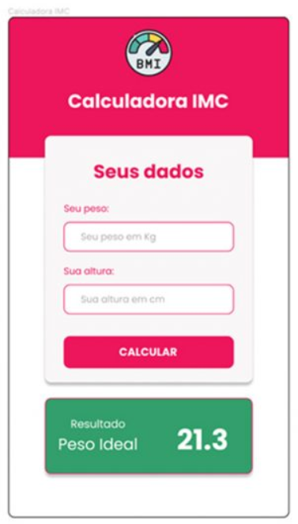
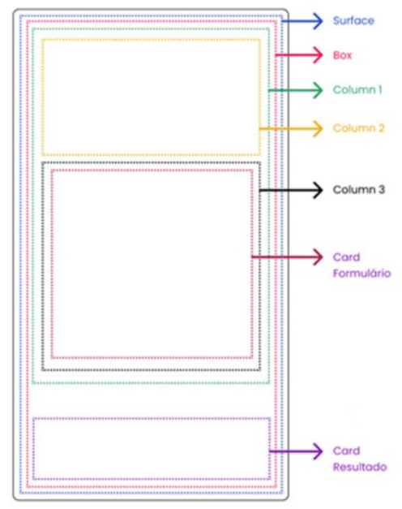

<h1>FASE 1 - APP WORLD</h1>
<h2>Capítulo 7A: Uso de Cards e Imagens.</h2>

<h2>1. USO DE CARDS E IMAGENS </h2>

## 1.1 Apresentação do projeto

- aplicação para cálculo de IMC.

 
<em>Layout da Aplicação.</em> 

  

 
<em>Estrutura do projeto.</em> 

- Surface: envolverá toda a Activity.
- Box: ocupará todo o tamanho da Activity; escolhida para facilitar o posicionamento do Card com o resultado na parte inferior.
- Column1: organizará verticalmente a Column2, que será o cabeçalho, e a Column3, que será ocupado pelo formulário.
- Column2: cabeçalho da Activity.
- Column3: Formulário.
- Card Formulário: componente Card, usado para estilizar o formulário.
- Card Resultado: resultado do cálculo de IMC.

> Criado projeto [IMC App](./projects/IMCApp/app/src/main/java/br/com/fiap/imcapp/MainActivity.kt) no Android Studio.

- estrutura inicial:

~~~kotlin
class MainActivity : ComponentActivity() {
  override fun onCreate(savedInstanceState: Bundle?) {
    super.onCreate(savedInstanceState)
    setContent {
      IMCAppTheme { 
        Surface(
          modifier = Modifier.fillMaxSize(),
          color = MaterialTheme.colorScheme.background
        ) {
          IMCScreen()
        }
      }
    }
  }
}

@Composable
fun IMCScreen() {
  Box(
    modifier = Modifier.fillMaxSize()
  ) {
    Column(
      modifier = Modifier
        .fillMaxWidth()
    ) {
      // ---- header ---------
      Column(
        horizontalAlignment = Alignment.CenterHorizontally,
        modifier = Modifier
          .fillMaxWidth()
          .height(160.dp)
      ) {

      }
      // --- formulário
      Column(
        modifier = Modifier
          .fillMaxWidth()
          .padding(horizontal = 32.dp)
      ) {

      }
    }
    // -- Card Resultado
  }
}
~~~

## 1.2 Inserindo imagens no aplicativo

- as imagens utilizadas nos aplicativos Android podem estar disponíveis no pacote da aplicação na forma de recursos, ou obtê-las através de um repositório na Internet.
- no projeto:
  - trabalhar com as imagens como recursos da aplicação, ou seja, armazenar as imagens que utilizaremos na pasta "drawable" do projeto. Esta pasta se encontra na pasta "res". 
  - o layout do projeto sugere [esta imagem](https://www.flaticon.com/free-icon/bmi_10476452?term=bmi&page=1&position=6&origin=search&related_id=10476452), encontrada no site [Flaticon](https://www.flaticon.com/).
- requisitos para o nome da imagem:
  - grafado somente com letras minúsculas.
  - sem caracteres especiais.
  - sem espaço em branco.
  - não iniciar com números ou caracteres especiais.
- a inclusão de imagens em um projeto Jetpack Compose no Android é feita com o `composable Image`.

~~~kotlin
// ---- header ---------
Column(
  horizontalAlignment = Alignment.CenterHorizontally,
  modifier = Modifier
    .fillMaxWidth()
    .height(160.dp)
) {
  Image(
    painter = painterResource(id = R.drawable.bmi_256),
    contentDescription = "logo"
  )
}
~~~

- na função de composição Image, é necessário fornecer dois parâmetros:
  - painter: especifica qual imagem será usada pelo Image, através do painterResource, que indica a imagem local que será usada.
  - contentDescription: utilizada para descrever a imagem. O uso deste parâmetro torna a aplicação mais acessível para pessoas que não podem ver a imagem.

- ajustar a posição e tamanho da imagem, para que não fique colada ao topo da Activity.

~~~kotlin
// ---- header ---------
Column(
  horizontalAlignment = Alignment.CenterHorizontally,
  modifier = Modifier
    .fillMaxWidth()
    .height(160.dp)
) {
  Image(
    painter = painterResource(id = R.drawable.bmi_256),
    contentDescription = "logo",
    modifier = Modifier
      .size(60.dp)
      .padding(top = 16.dp)
  )
}
~~~

## 1.3 Configurando o arquivo [colors.xml](./projects/IMCApp/app/src/main/res/values/colors.xml)

- no layout, será utilizada a cor vermelha (código hexadecimal ED145B). 
- cadastrar essa cor no arquivo "colors" do projeto (values > colors.xml).
  - recurso utilizado para definir e gerenciar todas as cores utilizadas no projeto. 
  - através dele podemos criar toda a identidade de cores do aplicativo, tornando fácil e rápido a troca das cores em caso de mudança.
  - no arquivo colors.xml definimos as cores utilizando o padrão XML, onde temos uma tag que identifica a cor e o valor desta tag que é o código hexadecimal da cor.

~~~xml
<?xml version="1.0" encoding="utf-8"?>
<resources>
    <color name="purple_200">#FFBB86FC</color>
    <color name="purple_500">#FF6200EE</color>
    <color name="purple_700">#FF3700B3</color>
    <color name="teal_200">#FF03DAC5</color>
    <color name="teal_700">#FF018786</color>
    <color name="black">#FF000000</color>
    <color name="white">#FFFFFFFF</color>
    <color name="vermelho_fiap">#FFED145B</color>
</resources>
~~~

- trocar a cor de background da Column que contém a imagem para "vermelho_fiap" e acrescentar o título do aplicativo.

~~~kotlin
// ---- header ---------
Column(
  horizontalAlignment = Alignment.CenterHorizontally,
  modifier = Modifier
    .fillMaxWidth()
    .height(160.dp)
    .background(colorResource(id = R.color.vermelho_fiap))
) {
  Image(
    painter = painterResource(id = R.drawable.bmi_256),
    contentDescription = "logo",
    modifier = Modifier
      .size(60.dp)
      .padding(top = 16.dp)
  )
  Text(
    text = "Calculadora IMC",
    fontSize = 24.sp,
    color = Color.White,
    fontWeight = FontWeight.Bold,
    modifier = Modifier.padding(top = 12.dp, bottom = 24.dp)
  )
}
~~~

## 1.4 Trabalhando com Cards

- o composable Card permite a criação de uma superfície elevada que conterá o conteúdo.
- frequentemente utilizamos o Card para agrupar conteúdo que estão relacionados e fornecer uma aparência mais organizada.
- criar um Card que organizará os componentes do formulário.

~~~kotlin
// --- formulário
Column(
  modifier = Modifier
    .fillMaxWidth()
    .padding(horizontal = 32.dp)
) {
  Card(
    modifier = Modifier
      .offset(y = (-30).dp)
      .fillMaxWidth()
      .height(300.dp),
    colors = CardDefaults
      .cardColors(containerColor = Color(0xfff9f6f6)),
    elevation = CardDefaults.cardElevation(4.dp)
  ) {

  }
}
~~~

- o Modifier do Card está utilizando as funções: 
  - offset(y = (-30).dp): desloca o card no eixo y. O valor negativo deve ser colocado entre parênteses, e movimenta o Card para cima, deixando-o sobreposto à Column do cabeçalho.
  - fillMaxWidth(): determina que o Card ocupe a largura total do componente pai (Column).
  - height(300.dp): altura do Card, 300.dp. Esse valor é temporário, usado apenas para visualizar o Card mesmo que ele ainda não tenha conteúdo.
- além do modificador, há os parâmetros:
  - colors: pode definir a cor do Card ou do seu conteúdo. 
  - elevation: este parâmetro insere uma sombra sob o Card, causando o efeito de elevação.

<h2>2. MUDANDO A APARÊNCIA DE UM CARD</h2>

- é possível alterar a forma do Card utilizando o parâmetro shape, além de colocar borda utilizando o parâmetro border.

~~~kotlin
// --- formulário
Column(
  modifier = Modifier
    .fillMaxWidth()
    .padding(horizontal = 32.dp)
) {
  Card(
    modifier = Modifier
      .offset(y = (-30).dp)
      //.fillMaxWidth()
      //.height(300.dp),
      .size(250.dp),
    colors = CardDefaults
      .cardColors(containerColor = Color(0xfff9f6f6)),
    elevation = CardDefaults.cardElevation(4.dp),
    shape = CircleShape,
    border = BorderStroke(width = 4.dp, color = Color.Black)
  ) {

  }
}
~~~

- no código acima:
  - comentados os modificadores fillMaxWidth() e height(300.dp), para definir um tamanho fixo de 250.dp (função modificadora size(25.dp)), necessário para o uso do shape.
  - adicionado o parâmetro shape com o valor "CircleShape", para que o Card ficasse circular.
  - inserida borda com parâmetro border, que recebe como valor a função BorderStroke, que precisa da largura e cor da borda, utilizando os parâmetros width e color.

## 2.1 Ajustando o Gradle do projeto

- o `Gradle` é uma ferramenta que automatiza o processo de construção ("build") do projeto.
- é responsável pela criação de toda a estrutura de pastas necessárias ao projeto, além do download e gerenciamento das dependências do projeto, facilitando a inclusão das bibliotecas e módulos externos que utilizamos para criar nossas aplicações.
- neste projeto estamos utilizando o Material Design 3, uma biblioteca de componentes e diretrizes lançadas pelo Google para o Jetpack Compose que torna a IU mais moderna e intuitiva ao usuário.
  - atualizar a versão do plugin de suporte ao Kotlin e do compilador de extensões do Compose.
  - localizar os arquivos build.gradle (Project:IMC_App) e build.gradle(Module :app).
  - abrir o arquivo build.gradle (Project: IMC_App), e alterar a versão do plugin do Kotlin para “1.8.0”.

~~~kotlin
plugins {
  id 'com.android.application' version '8.0.0' apply false
  id 'com.android.library' version '8.0.0' apply false
// id 'org.jetbrains.kotlin.android' version '1.7.20' apply false
  id 'org.jetbrains.kotlin.android' version '1.8.0' apply false
}
~~~

  - no arquivo build.gradle (Module :app), localizar o bloco ComposeOptions e o deixar como a listagem abaixo:

~~~kotlin
composeOptions {
  // kotlinCompilerExtensionVersion '1.3.2'
  kotlinCompilerExtensionVersion '1.4.0'
}
~~~

- após ajustes no Gradle, sincronizar as alterações para que sejam aplicadas corretamente no processo de compilação do projeto.

## 2.2 Inserindo o formulário no Card

- para construção do formulário da aplicação, utilizar composables como Text, OutlinedTextField e Button.

~~~kotlin
// --- formulário
Column(
  modifier = Modifier
    .fillMaxWidth()
    .padding(horizontal = 32.dp)
) {
  Card(
    modifier = Modifier
      .offset(y = (-30).dp)
      .fillMaxWidth(),
      //.height(300.dp),
    colors = CardDefaults
      .cardColors(containerColor = Color(0xfff9f6f6)),
    elevation = CardDefaults.cardElevation(4.dp)
  ) {
    Column(
      modifier = Modifier.padding(
        vertical = 16.dp,
        horizontal = 32.dp
      )
    ) {
      Text(
        text = "Seus dados",
        modifier = Modifier.fillMaxWidth(),
        fontSize = 24.sp,
        fontWeight = FontWeight.Bold,
        color = colorResource(id = R.color.vermelho_fiap),
        textAlign = TextAlign.Center
      )
      Spacer(modifier = Modifier.height(32.dp))
      Text(
        text = "Seu peso",
        modifier = Modifier.padding(bottom = 8.dp),
        fontSize = 12.sp,
        fontWeight = FontWeight.Normal,
        color = colorResource(id = R.color.vermelho_fiap)
      )
      OutlinedTextField(
        value = "",
        onValueChange = {},
        modifier = Modifier.fillMaxWidth(),
        placeholder = {
          Text(text = "Seu peso em Kg.")
        },
        colors = OutlinedTextFieldDefaults.colors(
          unfocusedBorderColor = colorResource(id = R.color.vermelho_fiap),
          focusedBorderColor = colorResource(id = R.color.vermelho_fiap)
        ),
        shape = RoundedCornerShape(16.dp),
        keyboardOptions = KeyboardOptions(keyboardType = KeyboardType.Number)
      )
      Spacer(modifier = Modifier.height(16.dp))
      Text(
        text = "Sua altura",
        modifier = Modifier.padding(bottom = 8.dp),
        fontSize = 12.sp,
        fontWeight = FontWeight.Normal,
        color = colorResource(id = R.color.vermelho_fiap)
      )
      OutlinedTextField(
        value = "",
        onValueChange = {},
        modifier = Modifier.fillMaxWidth(),
        placeholder = {
          Text(
            text = "Sua altura em cm."
          )
        },
        colors = OutlinedTextFieldDefaults.colors(
          unfocusedBorderColor = colorResource(id = R.color.vermelho_fiap),
          focusedBorderColor = colorResource(id = R.color.vermelho_fiap)
        ),
        shape = RoundedCornerShape(16.dp),
        keyboardOptions = KeyboardOptions(keyboardType = KeyboardType.Decimal)
      )
      Spacer(modifier = Modifier.height(16.dp))
      Button(
        onClick = {},
        modifier = Modifier
          .fillMaxWidth()
          .height(48.dp),
        shape = RoundedCornerShape(16.dp),
        colors = ButtonDefaults.buttonColors(containerColor = colorResource(id = R.color.vermelho_fiap))
      ) {
        Text(
          text = "CALCULAR",
          fontWeight = FontWeight.Bold,
          color = Color.White,
          fontSize = 14.sp
        )
      }
    }
  }
}
~~~

## 2.3 Inserindo o Card Resultado

~~~kotlin
// --- card resultado
Card(
  modifier = Modifier
    .fillMaxWidth()
    .height(200.dp)
    .padding(horizontal = 32.dp, vertical = 24.dp)
    .align(Alignment.BottomCenter),
  colors = CardDefaults.cardColors(containerColor = Color(0xff329F6B)),
  elevation = CardDefaults.cardElevation(4.dp),
  //border = BorderStroke(width = 1.dp, Color(0xffed145b))
) {
  Row(
    verticalAlignment = Alignment.CenterVertically,
    modifier = Modifier
      .padding(horizontal = 32.dp)
      .fillMaxSize()
  ) {
    Column() {
      Text(
        text = "Resultado",
        color = Color.White,
        fontSize = 14.sp
      )
      Text(
        text = "Peso Ideal.",
        fontWeight = FontWeight.Bold,
        color = Color.White,
        fontSize = 20.sp
      )
    }
    Text(
      text = "23.2",
      modifier = Modifier.fillMaxWidth(),
      fontWeight = FontWeight.Bold,
      color = Color.White,
      fontSize = 36.sp,
      textAlign = TextAlign.End
    )
  }
}
~~~

## 2.4 Gerenciando o estado da aplicação

- criar as variáveis responsáveis por manter o estado dos componentes da tela, sendo:
  - Peso: guardará o peso informado pelo usuário em quilos.
  - Altura: guardará a altura do usuário em centímetros.
  - Imc: armazenará o valor do IMC calculado para o usuário.
  - Statusimc: armazenará o status do IMC calculado para o usuário.

~~~kotlin
@Composable
fun IMCScreen() {

  var peso = remember {
    mutableStateOf("")
  }

  var altura = remember {
    mutableStateOf("")
  }

  var imc = remember {
    mutableStateOf(0.0)
  }

  var statusImc = remember {
    mutableStateOf("")
  }

  Box(
    //...)
}
~~~

- essas variáveis serão atribuídas ao parâmetro "value" dos seus composables.
- também é necessário implementar a função "onValueChange" dos componentes OutlinedTextField, para que as variáveis sejam atualizadas durante a digitação do usuário.

~~~kotlin
OutlinedTextField(
  value = peso.value,
  onValueChange = { peso.value = it },
  modifier = Modifier.fillMaxWidth(),
  placeholder = {
    Text(text = "Seu peso em Kg.")
  },
~~~

~~~kotlin
OutlinedTextField(
  value = altura.value,
  onValueChange = { altura.value = it },
  modifier = Modifier.fillMaxWidth(),
  placeholder = {
    Text(
      text = "Sua altura em cm."
    )
  },
~~~

## 2.5 Funções para calcular o IMC

IMC | Classificação
-----|---------------------
Abaixo de 18,5 | Abaixo do peso.
&gt; 18,5 e &lt; 25 | Peso ideal.
&gt;= 25 e &lt; 30 | Levemente acima do peso.
&gt;= 30 e &lt; 35 | Obesidade grau I.
&gt;= 35 e &lt; 40 | Obesidaede grau II.
&gt; 40 | Obesidade grau III.

- criar um [novo arquivo](./projects/IMCApp/app/src/main/java/br/com/fiap/imcapp/CalculoIMC.kt) na pasta "br.com.fiap.imcapp", com o nome CalculoIMC, em que teremos duas funções: calcularIMC() e determinarClassificacaoIMC. 
- passo a passo:
  - clicar com o botão direito do mouse na pasta br.com.fiap.imcapp, selecionar a opção New e Kotlin Class/File.
  - na caixa de diálogo "New Kotlin Class/File", marcar a opção File e digitar o nome no arquivo CalculoIMC e pressionar Enter.
  - escrever no arquivo CalculoIMC:

~~~kotlin
package br.com.fiap.imcapp

import kotlin.math.pow

fun calcularIMC(altura: Double, peso: Double) : Double {
  return peso / (altura / 100).pow(2.0)
}
~~~

- no código acima, criamos uma função utilizando a palavra reservada fun, de nome calcularIMC, a qual recebe dois argumentos: "peso" e "altura", ambos do tipo Double.
- essa função retornará o resultado da divisão do peso pelo quadrado da altura.
- chamar essa função quando o usuário clicar no botão:

~~~kotlin
Button(
  onClick = {
    imc.value = calcularIMC(
      altura = altura.value.toDouble(),
      peso = peso.value.toDouble()
      // Casting de String para Double
    )
  },
~~~

- atribuir essa variável imc ao parâmetro "value" do composable Text, para que o usuário veja o resultado. 

~~~kotlin
Text(
  text = imc.value.toString(),
  modifier = Modifier.fillMaxWidth(),
  fontWeight = FontWeight.Bold,
  color = Color.White,
  fontSize = 36.sp,
  textAlign = TextAlign.End
)
~~~

- ajustar a exibição para apenas 1 casa decimal:
  - utilizar a `função format` da classe String.
  - o método format recebe dois parâmetros: 
    - o primeiro define o formato da exibição (que no caso foi "%.1f", onde o símbolo de porcentagem indica qualquer valor numérico antes do ponto decimal. O 1f indica que o resultado será apresentado com uma casa decimal).

~~~kotlin
Text(
  text = String.format("%.1f", imc.value),
  modifier = Modifier.fillMaxWidth(),
  fontWeight = FontWeight.Bold,
  color = Color.White,
  fontSize = 36.sp,
  textAlign = TextAlign.End
)
~~~

- implementar a função que determina a classificação o IMC do usuário, devendo atender à tabela. 
- abrir o arquivo CalculoIMC e acrescentar a função determinarClassificacaoIMC():
  - a função determinarClassificacaoIMC() recebe o valor do IMC do usuário e retorna uma expressão String de acordo com as condicionais.

~~~kotlin
fun determinarClassificacaoIMC(imc: Double): String {
  return if(imc < 18.5) {
    "Abaixo do peso"
  } else if (imc >= 18.5 && imc < 25.0) {
    "Peso Ideal"
  } else if (imc >= 25.0 && imc < 30.0) {
    "Levemente acima do peso"
  } else if (imc >= 30.0 && imc < 35.0) {
    "Obesidade Grau I"
  } else if (imc >= 35.0 && imc < 40.0) {
    "Obesidade Grau II"
  } else {"Obesidade Grau III"}
}
~~~

- o retorno dessa função deve ser atribuído à variável de estado statusImc:

~~~kotlin
Button(
  onClick = {
    imc.value = calcularIMC(
      altura = altura.value.toDouble(),
      peso = peso.value.toDouble()
    )
    statusImc.value = determinarClassificacaoIMC(imc.value)
  },
  modifier = Modifier
    .fillMaxWidth()
    .height(48.dp),
  shape = RoundedCornerShape(16.dp),
  colors = ButtonDefaults.buttonColors(containerColor = colorResource(id = R.color.vermelho_fiap))
)
~~~

- em seguida, a variável statusImc deve ser atribuída ao parâmetro value do composable Text responsável por exibir a classificação de IMC do usuário.

~~~kotlin
Text(
  text = statusImc.value,
  fontWeight = FontWeight.Bold,
  color = Color.White,
  fontSize = 20.sp
)
~~~

--- 

[Voltar ao início!](https://github.com/DigouO/Smart_Cities_FIAP_2024)