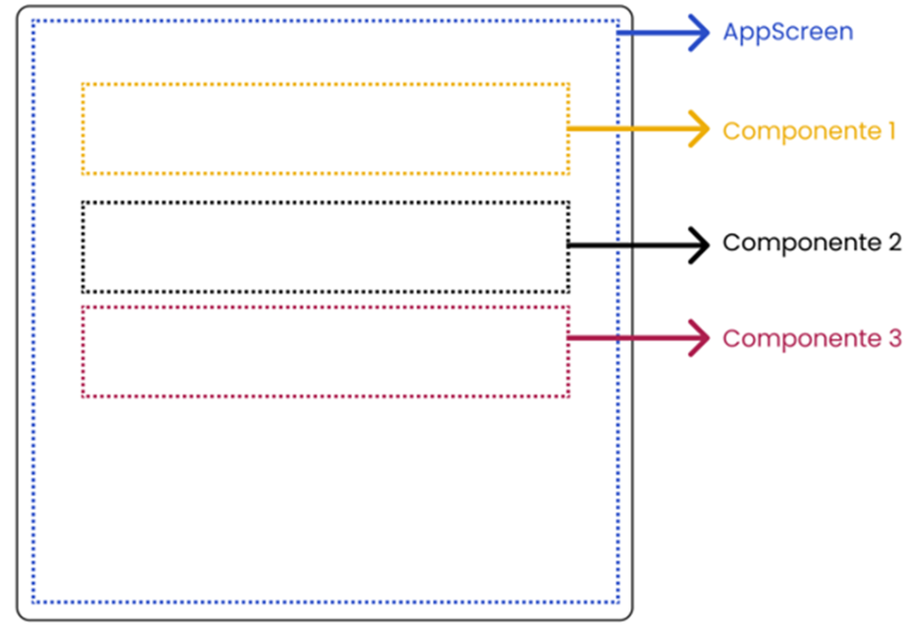
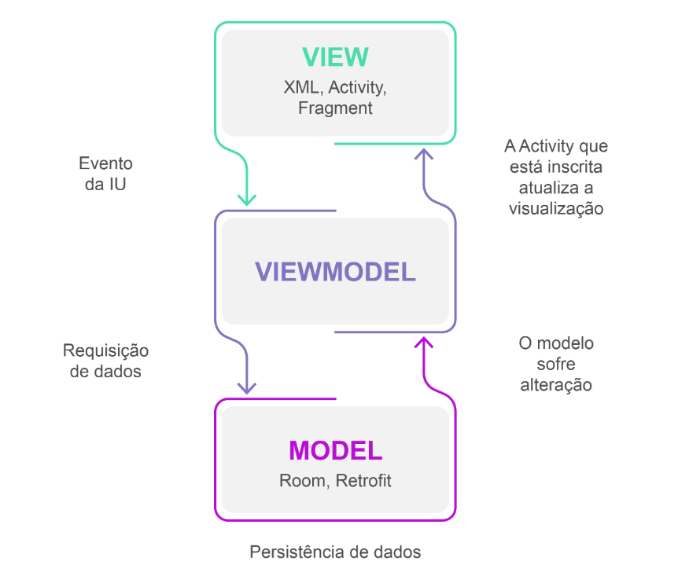

<h1>FASE 1 - APP WORLD</h1>
<h2>Capítulo 9A: Gestão de estado no Jetpack Compose.</h2>

<h2>1. GESTÃO DE ESTADO NO JETPACK COMPOSE</h2>

- a Interface do Usuário (IU) em uma aplicação Android é formada por diversos elementos. Para que possamos organizar o código, é necessário quebrar a interface em diversos componentes, que depois serão combinados para criar a tela como um todo, técnica que permite a reutilização de componentes.
- outro fator bastante importante quando trabalhamos com componentização é podermos manter o estado da aplicação em seus diversos componentes. Para isso, podemos utilizar o `State Hoisting`, que significa manter o estado em um componente de hierarquia mais alta, ou podemos utilizar uma arquitetura de projeto chamada `Model-View-ViewModel` (MVVM).

## 1.1 State Hoisting - Elevação de estado

- é um design pattern que orienta a implementação de componentes "stateless", ou seja, que não gerenciam o próprio estado.
- o estado deverá ser mantido no menor ancestral comum entre todos os componentes combináveis.
- no Jetpack Compose, cada composable é uma função independente que descreve a aparência e o comportamento de um componente; logo, podemos reutilizar este componente em diversas partes da aplicação, o que poderia causar duplicidade de estado.
- o ***State Hoisting garante que o estado será gerenciado de forma centralizada***, garantindo que compartilhem o mesmo estado atualizado.
- exemplo:

 
<em>Estrutura hierárquica da Aplicação.</em> 

  

- no exemplo acima:
  - o componente AppScreen é o de hierarquia mais alta.
  - os componentes filhos (Componente 1, Componente 2 e Componente 3) são os componentes de hierarquia mais baixa.
  - portanto, quem deve manter o estado da tela é o AppScreen: as variáveis de estado devem ser declaradas neste componente e os componentes filhos recebem o estado e comportamento do componente AppScreen!

### 1.1.1 Aplicativo para cálculo de juros simples
- para praticar o State Hoisting, criar uma aplicação para cálculo de juros simples. 
- começar criando uma única função com todos os componentes e estados. Depois, aplicaremos o conceito de elevação de estado e modularização da aplicação. 
- criar um projeto no Android Studio com o nome [Cálculo de Juros](./projects/CalculodeJuros/app/src/main/java/br/com/fiap/calculodejuros/). 
- substituir o código do arquivo MainActivity.kt que foi gerado automaticamente, pelo código:

~~~kotlin
package br.com.fiap.calculodejuros

import android.os.Bundle
import androidx.activity.ComponentActivity
import androidx.activity.compose.setContent
import androidx.compose.foundation.layout.Box
import androidx.compose.foundation.layout.Column
import androidx.compose.foundation.layout.Row
import androidx.compose.foundation.layout.Spacer
import androidx.compose.foundation.layout.fillMaxSize
import androidx.compose.foundation.layout.fillMaxWidth
import androidx.compose.foundation.layout.height
import androidx.compose.foundation.layout.padding
import androidx.compose.foundation.text.KeyboardOptions
import androidx.compose.material3.Button
import androidx.compose.material3.Card
import androidx.compose.material3.CardDefaults
import androidx.compose.material3.MaterialTheme
import androidx.compose.material3.OutlinedTextField
import androidx.compose.material3.Surface
import androidx.compose.material3.Text
import androidx.compose.runtime.Composable
import androidx.compose.runtime.getValue
import androidx.compose.runtime.mutableStateOf
import androidx.compose.runtime.remember
import androidx.compose.runtime.setValue
import androidx.compose.ui.Alignment
import androidx.compose.ui.Modifier
import androidx.compose.ui.graphics.Color
import androidx.compose.ui.text.font.FontWeight
import androidx.compose.ui.text.input.KeyboardType
import androidx.compose.ui.text.style.TextAlign
import androidx.compose.ui.unit.dp
import androidx.compose.ui.unit.sp
import br.com.fiap.calculodejuros.calculos.calcularJuros
import br.com.fiap.calculodejuros.calculos.calcularMontante
import br.com.fiap.calculodejuros.ui.theme.CalculoDeJurosTheme

class MainActivity : ComponentActivity() {
  override fun onCreate(savedInstanceState: Bundle?) {
    super.onCreate(savedInstanceState)
    setContent {
      CalculoDeJurosTheme {
        // A surface container using the 'background' color from the theme
        Surface(
          modifier = Modifier.fillMaxSize(),
          color = MaterialTheme.colorScheme.background
        ) {
          JurosScreen()
        }
      }
    }
  }
}

@Composable
fun JurosScreen() {

  var capital by remember { mutableStateOf("") }
  var taxa by remember { mutableStateOf("") }
  var tempo by remember { mutableStateOf("") }
  var juros by remember { mutableStateOf(0.0) }
  var montante by remember { mutableStateOf(0.0) }

  Box(
    modifier = Modifier.padding(16.dp),
    contentAlignment = Alignment.Center
  ) {
    Column() {
      Text(
        text = "Cálculo de Juros Simples",
        modifier = Modifier.fillMaxWidth(),
        fontSize = 20.sp,
        color = Color.Red,
        fontWeight = FontWeight.Bold,
        textAlign = TextAlign.Center
      )
      Spacer(modifier = Modifier.height(32.dp))
      // Formulário para entrada de dados
      Card(
        modifier = Modifier
          .fillMaxWidth()
      ) {
        Column(modifier = Modifier.padding(16.dp)) {
          Text(
              text = "Dados do Investimento",
              fontWeight = FontWeight.Bold
          )
          // Caixas de entrada da aplicação
          OutlinedTextField(
            value = capital,
            onValueChange = { capital = it },
            modifier = Modifier
                .fillMaxWidth()
                .padding(top = 16.dp),
            placeholder = {
              Text(text = "Quanto deseja investir?")
            },
            label = {
              Text(text = "Valor do investimento")
            },
            keyboardOptions = KeyboardOptions(
                keyboardType = KeyboardType.Decimal
            )
          )
          OutlinedTextField(
            value = taxa,
            onValueChange = { taxa = it },
            modifier = Modifier
                .fillMaxWidth()
                .padding(top = 16.dp),
            placeholder = {
              Text(text = "Qual a taxa de juros mensal?")
            },
            label = {
              Text(text = "Taxa de juros mensal")
            },
            keyboardOptions = KeyboardOptions(
                keyboardType = KeyboardType.Decimal
            )
          )
          OutlinedTextField(
            value = tempo,
            onValueChange = { tempo = it },
            modifier = Modifier
                .fillMaxWidth()
                .padding(top = 16.dp),
            placeholder = {
              Text(text = "Qual o tempo em meses?")
            },
            label = {
              Text(text = "Período em meses")
            },
            keyboardOptions = KeyboardOptions(
                keyboardType = KeyboardType.Decimal
            )
          )
          Button(
            onClick = {
              juros = calcularJuros(
                capital = capital.toDouble(),
                taxa = taxa.toDouble(),
                tempo = tempo.toDouble()
              )
              montante = calcularMontante(
                capital = capital.toDouble(),
                juros = juros
              )
            },
            modifier = Modifier
                .fillMaxWidth()
                .padding(top = 32.dp)
          ) {
            Text(text = "CALCULAR")
          }
        }
      }
      Spacer(modifier = Modifier.height(16.dp))
      // Resultado da aplicação
      Card(
        modifier = Modifier
          .fillMaxWidth(),
        colors = CardDefaults.cardColors(
            containerColor = Color(0xFF4CAF50)
        )
      ) {
        Column(
          modifier = Modifier
            //.fillMaxSize()
            .padding(16.dp)
        ) {
          Text(
            text = "Resultado",
            fontSize = 18.sp,
            fontWeight = FontWeight.Bold,
            color = Color.White
          )
          Spacer(modifier = Modifier.height(16.dp))
          Row(modifier = Modifier.fillMaxWidth()) {
            Text(
              text = "Juros",
              modifier = Modifier.padding(end = 8.dp),
              fontSize = 16.sp,
              fontWeight = FontWeight.Bold
            )
            Text(
              text = juros.toString(),
              modifier = Modifier.padding(end = 8.dp),
              fontSize = 16.sp,
              fontWeight = FontWeight.Bold,
              color = Color.White
            )
          }
          Spacer(modifier = Modifier.height(8.dp))
          Row(modifier = Modifier.fillMaxWidth()) {
            Text(
              text = "Montante",
              modifier = Modifier.padding(end = 8.dp),
              fontSize = 16.sp,
              fontWeight = FontWeight.Bold
            )
            Text(
              text = montante.toString(),
              modifier = Modifier.padding(end = 8.dp),
              fontSize = 16.sp,
              fontWeight = FontWeight.Bold,
              color = Color.White
            )
          }
        }
      }
    }
  }
}
~~~

- criar um pacote na aplicação com o nome "calculos", e criar neste pacote um arquivo com o nome "CalcularJuros".
- o arquivo CalcularJuros.kt será responsável por efetuar os cálculos de juros e montantes; implementar as funções necessárias:

~~~kotlin
package br.com.fiap.calculodejuros.calculos

fun calcularJuros(capital: Double, taxa: Double, tempo: Double): Double {
  return capital * taxa / 100 * tempo
}

fun calcularMontante(capital: Double, juros: Double): Double {
  return capital + juros
}
~~~

### 1.1.2 Modularizando a aplicação
- modularizar a aplicação evita que fique muito extensa e facilita manutenção.
- além disso, a modularização permite dividir a interface do usuário em componentes menores, como botões, listas, cartões etc: cada componente pode ser projetado de forma independente, com sua própria lógica e aparência.
- iniciar produzindo uma função responsável por criar caixas de entrada personalizadas.
  - criar um pacote no projeto chamado "components". 
  - criar um arquivo chamado CaixaDeEntrada.kt no pacote components e, neste arquivo, criar um OutlinedTextField.

~~~kotlin
package br.com.fiap.calculodejuros.components

import androidx.compose.foundation.layout.fillMaxWidth
import androidx.compose.foundation.layout.padding
import androidx.compose.foundation.text.KeyboardOptions
import androidx.compose.material3.OutlinedTextField
import androidx.compose.material3.Text
import androidx.compose.runtime.Composable
import androidx.compose.ui.Modifier
import androidx.compose.ui.text.input.KeyboardType
import androidx.compose.ui.unit.dp

@Composable
fun CaixaDeEntrada(
  value: String,
  placeholder: String,
  label: String,
  modifier: Modifier,
  keyboardType: KeyboardType
) {
  OutlinedTextField(
    value = value,
    onValueChange = {},
    modifier = modifier
      .fillMaxWidth()
      .padding(top = 16.dp),
    placeholder = {
      Text(text = placeholder)
    },
    label = {
      Text(text = label)
    },
    keyboardOptions = KeyboardOptions(keyboardType = keyboardType)
  )
}
~~~

- utilizar a função CaixaDeEntrada na aplicação, para torná-la mais limpa.
- abrir o arquivo MainActivity.kt, comentar o código da caixa de texto responsável pela digitação do capital e substituir pelo código:

~~~kotlin
// Caixas de entrada da Aplicação
CaixaDeEntrada(
  value = "",
  placeholder = "Quanto deseja investir",
  label = "Valor do investimento",
  modifier = Modifier,
  keyboardType = KeyboardType.Decimal
)
~~~

### 1.1.3 Elevando o estado
- agora o componente está sendo renderizado pela função CaixaDeEntrada, e ela será utilizada para renderizar todas as outras; e nesse momento entra a aplicação do State Hoisting. 
- o parâmetro value da função CaixaDeEntrada deverá receber a variável de estado que está sendo mantida na função JurosScreen, que é hierarquicamente superior, ou seja, é ela que mantém o estado da tela. A função CaixaDeEntrada é ***stateless***, já que não precisa manter o estado.
- quanto ao comportamento, precisamos passar uma função para a função de composição CaixaDeEntrada que será utilizada pelo parâmetro onValueChange do OutlinedTextField, o que permite que possamos passar comportamentos diferentes para cada caixa de entrada que criarmos. 
- refatorar a função CaixaDeEntrada para que implemente o estado e o comportamento para as caixas de entrada da aplicação. 

~~~kotlin
@Composable
fun CaixaDeEntrada(
  value: String,
  placeholder: String,
  label: String,
  modifier: Modifier,
  keyboardType: KeyboardType,
  atualizarValor: (String) -> Unit
) {
  OutlinedTextField(
    value = value,
    onValueChange = {
      atualizarValor(it)
    },
    modifier = modifier
      .fillMaxWidth()
      .padding(top = 16.dp),
    placeholder = {
      Text(text = placeholder)
    },
    label = {
      Text(text = label)
    },
    keyboardOptions = KeyboardOptions(keyboardType = keyboardType)
  )
}
~~~

- passar o parâmetro atualizarValor durante a chamada para a função CaixaDeEntrada.
- no arquivo MainActivity.kt, alterar o código da caixa de texto responsável pela entrada do capital:

~~~kotlin
// Caixas de entrada da Aplicação
CaixaDeEntrada(
  value = capital,
  placeholder = "Quanto deseja investir",
  label = "Valor do investimento",
  modifier = Modifier,
  keyboardType = KeyboardType.Decimal
){
  capital = it
}
~~~

- ao executar a aplicação no emulador, agora é possível digitar o valor do capital novamente; ao preencher os valores e clicar no botão calcular, a aplicação funcionará corretamente e calculará os juros e montante. 
- alterar as outras caixas de texto:

~~~kotlin
// Caixas de entrada da Aplicação
CaixaDeEntrada(
  value = capital,
  placeholder = "Quanto deseja investir",
  label = "Valor do investimento",
  modifier = Modifier,
  keyboardType = KeyboardType.Decimal
){
  capital = it
}
CaixaDeEntrada(
  value = taxa,
  placeholder = "Qual a taxa de juros mensal?",
  label = "Taxa de juros mensal",
  modifier = Modifier,
  keyboardType = KeyboardType.Decimal
){
  taxa = it
}
CaixaDeEntrada(
  value = tempo,
  placeholder = "Qual o período do investimento em meses?",
  label = "Período em meses",
  modifier = Modifier,
  keyboardType = KeyboardType.Decimal
){
  tempo = it
}
~~~

- neste exemplo foi realizada a modularização de um único componente, mas podemos modularizar componentes mais complexos. 
- vamos ***criar uma função de composição para o card que exibe o resultado do investimento***: 
  - criar um arquivo no pacote components com o nome "CardResultado"
  - o estado ficará na função hierarquicamente superior que é a JurosScreen.

~~~kotlin
package br.com.fiap.calculodejuros.components

import androidx.compose.foundation.layout.Column
import androidx.compose.foundation.layout.Row
import androidx.compose.foundation.layout.Spacer
import androidx.compose.foundation.layout.fillMaxWidth
import androidx.compose.foundation.layout.height
import androidx.compose.foundation.layout.padding
import androidx.compose.material3.Card
import androidx.compose.material3.CardDefaults
import androidx.compose.material3.Text
import androidx.compose.runtime.Composable
import androidx.compose.ui.Modifier
import androidx.compose.ui.graphics.Color
import androidx.compose.ui.text.font.FontWeight
import androidx.compose.ui.unit.dp
import androidx.compose.ui.unit.sp

@Composable
fun CardResultado(juros: Double, montante: Double) {
  Card(
    modifier = Modifier
      .fillMaxWidth(),
    colors = CardDefaults.cardColors(
      containerColor = Color(0xFF4CAF50)
    )
  ) {
    Column(
      modifier = Modifier
        //.fillMaxSize()
        .padding(16.dp)
    ) {
      Text(
        text = "Resultado",
        fontSize = 18.sp,
        fontWeight = FontWeight.Bold,
        color = Color.White
      )
      Spacer(modifier = Modifier.height(16.dp))
      Row(modifier = Modifier.fillMaxWidth()) {
        Text(
          text = "Juros",
          modifier = Modifier.padding(end = 8.dp),
          fontSize = 16.sp,
          fontWeight = FontWeight.Bold
        )
        Text(
          text = juros.toString(),
          modifier = Modifier.padding(end = 8.dp),
          fontSize = 16.sp,
          fontWeight = FontWeight.Bold,
          color = Color.White
        )
      }
      Spacer(modifier = Modifier.height(8.dp))
      Row(modifier = Modifier.fillMaxWidth()) {
        Text(
          text = "Montante",
          modifier = Modifier.padding(end = 8.dp),
          fontSize = 16.sp,
          fontWeight = FontWeight.Bold
        )
        Text(
          text = montante.toString(),
          modifier = Modifier.padding(end = 8.dp),
          fontSize = 16.sp,
          fontWeight = FontWeight.Bold,
          color = Color.White
        )
      }
    }
  }
}
~~~

- substituir o trecho de código responsável por renderizar o card de resultado da MainActivity.kt pela chamada da função de composição.

~~~kotlin
package br.com.fiap.calculodejuros

import android.os.Bundle
import androidx.activity.ComponentActivity
import androidx.activity.compose.setContent
import androidx.compose.foundation.layout.Box
import androidx.compose.foundation.layout.Column
import androidx.compose.foundation.layout.Row
import androidx.compose.foundation.layout.Spacer
import androidx.compose.foundation.layout.fillMaxSize
import androidx.compose.foundation.layout.fillMaxWidth
import androidx.compose.foundation.layout.height
import androidx.compose.foundation.layout.padding
import androidx.compose.foundation.text.KeyboardOptions
import androidx.compose.material3.Button
import androidx.compose.material3.Card
import androidx.compose.material3.CardDefaults
import androidx.compose.material3.MaterialTheme
import androidx.compose.material3.OutlinedTextField
import androidx.compose.material3.Surface
import androidx.compose.material3.Text
import androidx.compose.runtime.Composable
import androidx.compose.runtime.getValue
import androidx.compose.runtime.mutableStateOf
import androidx.compose.runtime.remember
import androidx.compose.runtime.setValue
import androidx.compose.ui.Alignment
import androidx.compose.ui.Modifier
import androidx.compose.ui.graphics.Color
import androidx.compose.ui.text.font.FontWeight
import androidx.compose.ui.text.input.KeyboardType
import androidx.compose.ui.text.style.TextAlign
import androidx.compose.ui.unit.dp
import androidx.compose.ui.unit.sp
import br.com.fiap.calculodejuros.calculos.calcularJuros
import br.com.fiap.calculodejuros.calculos.calcularMontante
import br.com.fiap.calculodejuros.components.CaixaDeEntrada
import br.com.fiap.calculodejuros.components.CardResultado
import br.com.fiap.calculodejuros.ui.theme.CalculoDeJurosTheme

class MainActivity : ComponentActivity() {
  override fun onCreate(savedInstanceState: Bundle?) {
    super.onCreate(savedInstanceState)
    setContent {
      CalculoDeJurosTheme {
        // A surface container using the 'background' color from the theme
        Surface(
          modifier = Modifier.fillMaxSize(),
          color = MaterialTheme.colorScheme.background
        ) {
          JurosScreen()
        }
      }
    }
  }
}

@Composable
fun JurosScreen() {

  var capital by remember { mutableStateOf("") }
  var taxa by remember { mutableStateOf("") }
  var tempo by remember { mutableStateOf("") }
  var juros by remember { mutableStateOf(0.0) }
  var montante by remember { mutableStateOf(0.0) }

  Box(
    modifier = Modifier.padding(16.dp),
    contentAlignment = Alignment.Center
  ) {
    Column {
      Text(
        text = "Cálculo de Juros Simples",
        modifier = Modifier.fillMaxWidth(),
        fontSize = 20.sp,
        color = Color.Red,
        fontWeight = FontWeight.Bold,
        textAlign = TextAlign.Center
      )
      Spacer(modifier = Modifier.height(32.dp))
      // Formulário para entrada de dados
      Card(
        modifier = Modifier
          .fillMaxWidth()
      ) {
        Column(modifier = Modifier.padding(16.dp)) {
          Text(
              text = "Dados do Investimento",
              fontWeight = FontWeight.Bold
          )
          // Caixas de entrada da Aplicação
          CaixaDeEntrada(
            value = capital,
            placeholder = "Quanto deseja investir",
            label = "Valor do investimento",
            modifier = Modifier,
            keyboardType = KeyboardType.Decimal
          ){
            capital = it
          }
          CaixaDeEntrada(
            value = taxa,
            placeholder = "Qual a taxa de juros mensal?",
            label = "Taxa de juros mensal",
            modifier = Modifier,
            keyboardType = KeyboardType.Decimal
          ){
            taxa = it
          }
          CaixaDeEntrada(
            value = tempo,
            placeholder = "Qual o período do investimento em meses?",
            label = "Período em meses",
            modifier = Modifier,
            keyboardType = KeyboardType.Decimal
          ){
            tempo = it
          }
          Button(
            onClick = {
              juros = calcularJuros(
                capital = capital.toDouble(),
                taxa = taxa.toDouble(),
                tempo = tempo.toDouble()
              )
              montante = calcularMontante(
                capital = capital.toDouble(),
                juros = juros
              )
            },
            modifier = Modifier
              .fillMaxWidth()
              .padding(top = 32.dp)
          ) {
            Text(text = "CALCULAR")
          }
        }
      }
      Spacer(modifier = Modifier.height(16.dp))
      // Resultado da aplicação
      CardResultado(juros = juros, montante = montante)
    }
  }
}
~~~

- neste exemplo, modularizamos a aplicação em pequenas partes.
- que tal criar uma função para componentizar o card com o formulário?

## 1.2 Model View ViewModel – MVVM

- já sabemos que é possível modularizar a aplicação de modo que cada componente seja uma pequena parte customizável que possuirá seu próprio estado e comportamento.
- agora vamos aplicar uma arquitetura que separe as responsabilidades do código para melhorar a manutenção e a escalabilidade da aplicação - precisamos começar a pensar nas arquiteturas e, no desenvolvimento Android, utilizaremos o padrão MVVM, Model-View-ViewMode.

### 1.2.1 O que é o padrão MVVM?
- é um padrão arquitetural utilizado no desenvolvimento de aplicações Android.
- o objetivo principal é separar as responsabilidades da aplicação em camadas.
- MVVM é organizado em três partes:
  - `Model`: 
    - aqui temos a representação da camada de dados do aplicativo. 
    - essa camada é responsável pelo acesso aos dados em um banco de dados ou requisições através da rede. 
    - é a camada responsável por fornecer os dados que serão exibidos pela IU.
  - `View`: 
    - camada é responsável por exibir os dados ao usuário, além de permitir que o usuário interaja com a aplicação.
    - é a IU da aplicação.
  - `ViewModel`: 
    - conecta a View e a Model.
    - fornece os dados que serão exibidos pela View, assim como processa as entradas de usuário que podem resultar em atualização dos dados na Model. 
    - também fornece suporte a dados observáveis através do LiveData, que atualiza os dados da View quando um dado é atualizado.

 
<em>Arquitetura MVVM.</em> 

 

### 1.2.2 Utilizando o padrão MVVM
- para demonstrar a aplicação do padrão MVVM em um projeto Android, refatorar nossa calculadora de juros simples, adotando uma abordagem modular e organizada.
- iniciaremos criando um pacote chamado "juros", que abrigará os arquivos responsáveis pela renderização da interface e pela classe ViewModel da tela.
  - ao dividir nossa implementação em camadas distintas, obteremos os benefícios:
    - ***separação de responsabilidades***: com o pacote "juros", teremos um local dedicado para lidar com a lógica de apresentação e a interação com o ViewModel será responsável por fornecer os dados necessários para a interface, enquanto a tela (View) será responsável por exibir esses dados e responder às ações do usuário.
    - ***manutenção facilitada***: com os arquivos organizados em pacotes distintos, será mais fácil localizar, modificar e adicionar novos recursos à calculadora de juros. Cada componente terá uma função bem definida, tornando o código mais legível e de fácil compreensão.T
    - ***testes aprimorados***: com a separação entre a ViewModel e a tela, poderemos testar a lógica de negócios de forma isolada, sem a necessidade de simular interações com a interface do usuário. Isso permitirá criar testes unitários eficientes e garantir a qualidade do código.

- recortar a função JurosScreen da classe MainActivity.kt e colar no arquivo JurosScreen.kt.

~~~kotlin
package br.com.fiap.calculodejuros.juros

import androidx.compose.foundation.layout.Box
import androidx.compose.foundation.layout.Column
import androidx.compose.foundation.layout.Spacer
import androidx.compose.foundation.layout.fillMaxWidth
import androidx.compose.foundation.layout.height
import androidx.compose.foundation.layout.padding
import androidx.compose.material3.Button
import androidx.compose.material3.Card
import androidx.compose.material3.Text
import androidx.compose.runtime.Composable
import androidx.compose.runtime.getValue
import androidx.compose.runtime.mutableStateOf
import androidx.compose.runtime.remember
import androidx.compose.runtime.setValue
import androidx.compose.ui.Alignment
import androidx.compose.ui.Modifier
import androidx.compose.ui.graphics.Color
import androidx.compose.ui.text.font.FontWeight
import androidx.compose.ui.text.input.KeyboardType
import androidx.compose.ui.text.style.TextAlign
import androidx.compose.ui.unit.dp
import androidx.compose.ui.unit.sp
import br.com.fiap.calculodejuros.calculos.calcularJuros
import br.com.fiap.calculodejuros.calculos.calcularMontante
import br.com.fiap.calculodejuros.components.CaixaDeEntrada
import br.com.fiap.calculodejuros.components.CardResultado

@Composable
fun JurosScreen() {

  var capital by remember { mutableStateOf("") }
  var taxa by remember { mutableStateOf("") }
  var tempo by remember { mutableStateOf("") }
  var juros by remember { mutableStateOf(0.0) }
  var montante by remember { mutableStateOf(0.0) }

  Box(
    modifier = Modifier.padding(16.dp),
    contentAlignment = Alignment.Center
  ) {
    Column {
      Text(
        text = "Cálculo de Juros Simples",
        modifier = Modifier.fillMaxWidth(),
        fontSize = 20.sp,
        color = Color.Red,
        fontWeight = FontWeight.Bold,
        textAlign = TextAlign.Center
      )
      Spacer(modifier = Modifier.height(32.dp))
      // Formulário para entrada de dados
      Card(
        modifier = Modifier
          .fillMaxWidth()
      ) {
        Column(modifier = Modifier.padding(16.dp)) {
          Text(
            text = "Dados do Investimento",
            fontWeight = FontWeight.Bold
          )
          // Caixas de entrada da Aplicação
          CaixaDeEntrada(
            value = capital,
            placeholder = "Quanto deseja investir",
            label = "Valor do investimento",
            modifier = Modifier,
            keyboardType = KeyboardType.Decimal
          ){
            capital = it
          }
          CaixaDeEntrada(
            value = taxa,
            placeholder = "Qual a taxa de juros mensal?",
            label = "Taxa de juros mensal",
            modifier = Modifier,
            keyboardType = KeyboardType.Decimal
          ){
            taxa = it
          }
          CaixaDeEntrada(
            value = tempo,
            placeholder = "Qual o período do investimento em meses?",
            label = "Período em meses",
            modifier = Modifier,
            keyboardType = KeyboardType.Decimal
          ){
            tempo = it
          }
          Button(
            onClick = {
              juros = calcularJuros(
                capital = capital.toDouble(),
                taxa = taxa.toDouble(),
                tempo = tempo.toDouble()
              )
              montante = calcularMontante(
                capital = capital.toDouble(),
                juros = juros
              )
            },
            modifier = Modifier
              .fillMaxWidth()
              .padding(top = 32.dp)
          ) {
            Text(text = "CALCULAR")
          }
        }
      }
      Spacer(modifier = Modifier.height(16.dp))
      // Resultado da aplicação
      CardResultado(juros = juros, montante = montante)
    }
  }
}
~~~

- na classe MainActivity.kt, importar a função JurosScreen.

~~~kotlin
package br.com.fiap.calculodejuros

import android.os.Bundle
import androidx.activity.ComponentActivity
import androidx.activity.compose.setContent
import androidx.compose.foundation.layout.fillMaxSize
import androidx.compose.material3.MaterialTheme
import androidx.compose.material3.Surface
import androidx.compose.ui.Modifier
import br.com.fiap.calculodejuros.juros.JurosScreen
import br.com.fiap.calculodejuros.ui.theme.CalculoDeJurosTheme

class MainActivity : ComponentActivity() {
  override fun onCreate(savedInstanceState: Bundle?) {
    super.onCreate(savedInstanceState)
    setContent {
      CalculoDeJurosTheme { 
        Surface(
          modifier = Modifier.fillMaxSize(),
          color = MaterialTheme.colorScheme.background
        ) {
          JurosScreen()
        }
      }
    }
  }
}
~~~

- o arquivo JurosScreen.kt representa a tela da aplicação, ou seja, uma "feature" que é responsável por renderizar a tela com o formulário da aplicação. 
  - se a aplicação tiver uma tela de login, por exemplo, criaríamos um pacote chamado login para armazenar a feature login, além da ViewModel para a tela de login. 
- o arquivo JurosScreenViewModel será a classe responsável por toda a lógica da tela JurosScreen, ou seja, esta classe é a detentora do estado e da lógica de negócios.
  - a classe JurosScreenViewModel deve estender a classe ViewModel.

~~~kotlin
package br.com.fiap.calculodejuros.juros

import androidx.lifecycle.ViewModel

class JurosScreenViewModel: ViewModel() {

}
~~~

- a utilização desta classe é possível por conta da dependência da biblioteca "lifecycle-runtime", que já está configurada no arquivo build.gradle em nível de módulo.

~~~kotlin
dependencies {
  implementation 'androidx.core:core-ktx:1.8.0'
  implementation platform('org.jetbrains.kotlin:kotlin-bom:1.8.0')
  implementation 'androidx.lifecycle:lifecycle-runtime-ktx:2.3.1'
  implementation 'androidx.activity:activity-compose:1.5.1'
  implementation platform('androidx.compose:compose-bom:2022.10.00')
  implementation 'androidx.compose.ui:ui'
  implementation 'androidx.compose.ui:ui-graphics'
  implementation 'androidx.compose.ui:ui-tooling-preview'
  implementation 'androidx.compose.material3:material3:1.1.1'
  testImplementation 'junit:junit:4.13.2'
  androidTestImplementation 'androidx.test.ext:junit:1.1.5'
  androidTestImplementation 'androidx.test.espresso:espresso-core:3.5.1'
  androidTestImplementation platform('androidx.compose:compose-bom:2022.10.00')
  androidTestImplementation 'androidx.compose.ui:ui-test-junit4'
  debugImplementation 'androidx.compose.ui:ui-tooling'
  debugImplementation 'androidx.compose.ui:ui-test-manifest'
}
~~~

### 1.2.3. Gerenciando o estado da aplicação com LiveData
- `LiveData` é uma classe que armazena dados observáveis, sendo assim, os atributos que estão observando um atributo do tipo LiveData serão notificados sempre que o valor de um LiveData for alterado.
- na classe JurosScreenViewModel, criaremos os atributos observáveis, e na função JurosScreen criaremos os atributos observadores e assim, vamos manter o estado na ViewModel, e não mais na tela.
- para utilizarmos o LiveData, adicionar uma dependência no arquivo build.gradle em nível de módulo.

~~~kotlin
dependencies {
  implementation 'androidx.core:core-ktx:1.8.0'
  implementation platform('org.jetbrains.kotlin:kotlin-bom:1.8.0')
  implementation 'androidx.lifecycle:lifecycle-runtime-ktx:2.3.1'
  implementation 'androidx.activity:activity-compose:1.5.1'
  implementation platform('androidx.compose:compose-bom:2022.10.00')
  implementation 'androidx.compose.ui:ui'
  implementation 'androidx.compose.ui:ui-graphics'
  implementation 'androidx.compose.ui:ui-tooling-preview'
  implementation 'androidx.compose.material3:material3:1.1.1'
  testImplementation 'junit:junit:4.13.2'
  androidTestImplementation 'androidx.test.ext:junit:1.1.5'
  androidTestImplementation 'androidx.test.espresso:espresso-core:3.5.1'
  androidTestImplementation platform('androidx.compose:compose-bom:2022.10.00')
  androidTestImplementation 'androidx.compose.ui:ui-test-junit4'
  debugImplementation 'androidx.compose.ui:ui-tooling'
  debugImplementation 'androidx.compose.ui:ui-test-manifest'

  // Dependência do LiveData
  implementation "androidx.compose.runtime:runtime-livedata:1.4.3"
}
~~~

- começar criando um observável e um observador para o atributo capital.
  - o observável deve ser criado na classe JurosScreenViewModel.

~~~kotlin
package br.com.fiap.calculodejuros.juros

import androidx.lifecycle.LiveData
import androidx.lifecycle.MutableLiveData
import androidx.lifecycle.ViewModel

class JurosScreenViewModel: ViewModel() {

  private val _capital = MutableLiveData<String>()
  val capital: LiveData<String> = _capital

}
~~~

- no código acima, criamos um atributo privado, que só pode ser acessado da "ViewModel" chamado "&lowbar;capital". 
  - este atributo é do tipo MutableLiveData, ou seja, seu valor é mutável. 
  - utilizado caractere underscore (&lowbar;) antes do nome do atributo, que é uma convenção adotada para indicar que este atributo é privado e que não deve ser acessado de outras classes. Essa convenção é chamada de `underscore prefix` ou `underscore notation`.
  - o atributo "capital" foi definido de forma pública, ou seja, é através dele que os observadores saberão que a variável teve seu valor alterado; ele recebe o valor do atributo "&lowbar;capital".
- a função JurosScreen é nossa função principal, ou seja, é responsável por manter o estado da tela, então, é necessário que ela receba um parâmetro com a sua ViewModel, que é a JurosScreenViewModel.
  - alterar a função JurosScreen.

~~~kotlin
@Composable
fun JurosScreen(jurosScreenViewModel: JurosScreenViewModel) {

  var capital by remember { mutableStateOf("") }
  var taxa by remember { mutableStateOf("") }
  // ...
}
~~~

- após este ajuste, começaremos a receber uma notificação de erro na classe MainActivity, responsável por chamar a função JurosScreen, o que ocorre devido ao fato da função JurosScreen pedir um parâmetro do tipo JurosScreenViewModel.
- abrir o arquivo MainActivity.kt e passar o parâmetro durante a chamada da função. 

~~~kotlin
class MainActivity : ComponentActivity() {
  override fun onCreate(savedInstanceState: Bundle?) {
    super.onCreate(savedInstanceState)
    setContent {
      CalculoDeJurosTheme { 
        Surface(
          modifier = Modifier.fillMaxSize(),
          color = MaterialTheme.colorScheme.background
        ) {
          JurosScreen(JurosScreenViewModel())
        }
      }
    }
  }
}
~~~

- alterar a declaração do atributo capital da função JurosScreen para que utilize o LiveData.

~~~kotlin
@Composable
fun JurosScreen(jurosScreenViewModel: JurosScreenViewModel) {

// var capital by remember { mutableStateOf("") }
  val capital by jurosScreenViewModel
    .capital
    .observeAsState(initial = "")
    //...
}
~~~

- no código apresentado, temos a declaração de uma variável capital, que é inicializada com o valor observado do estado capitalState da função JurosScreenViewModel, referenciada pelo parâmetro jurosScreenViewModel.
- a função observeAsState é utilizada para criar um estado observável a partir do valor do estado capitalState e atribuí-lo à variável capital.
  - essa função permite observar e acompanhar as mudanças de um estado ao longo do tempo.
  - cria um estado que pode ser utilizado dentro de um composable para atualizar a interface do usuário automaticamente sempre que o valor do estado observado sofrer alterações.
  - sempre que houver uma alteração no valor do estado capitalState em JurosScreenViewModel, o estado capital será atualizado e o composable que utiliza esse estado será recomposto, refletindo as alterações na interface do usuário. 
  - isso proporciona uma atualização automática da tela com base nas mudanças de estado, sem a necessidade de manipulação manual ou repetitiva.

- após esse ajuste,vamos obter mais uma mensagem de erro. 
  - a função CaixaDeEntrada possui uma função lambda como parâmetro que é usada para atualizar o atributo value do composable OutlinedTextField, o que ocorre porque não podemos mudar o valor do atributo capital diretamente. Quem deve fazer isso é a ViewModel.
  - criar uma função em JurosScreenViewModel que será responsável por atualizar o estado do atributo capitalState e consequentemente do atributo capital da função JurosScreen, que é o observador.
  - abrir o arquivo JurosScreenViewModel e acrescentar a função responsável por atualizar o valo de capitalState.

~~~kotlin
class JurosScreenViewModel: ViewModel() {

  private val _capital = MutableLiveData<String>()
  val capitalState: LiveData<String> = _capital

  fun onCapitalChanged(novoCapital: String){
    _capital.value = novoCapital
  }
  
}
~~~

- a função onCapitalChanged recebe o parâmetro novoCapital do tipo String, que será atribuído ao objeto MutableLiveData, referenciado pela variável _capital, que por sua vez irá atualizar o valor do atributo capitalState que está sendo observado pelo atributo capital da função JurosScreen. 
- alterar a chamada para a função CaixaDeEntrada responsável pela entrada do capital.

~~~kotlin
CaixaDeEntrada(
  value = capital,
  placeholder = "Quanto deseja investir",
  label = "Valor do investimento",
  modifier = Modifier,
  keyboardType = KeyboardType.Decimal
){
  jurosScreenViewModel.onCapitalChanged(it)
}
~~~

- modificar as variáveis taxa e tempo da função JurosScreen para que utilizem a ViewModel.
- código da JurosScreenViewModel:

~~~kotlin
class JurosScreenViewModel: ViewModel() {

  private val _capital = MutableLiveData<String>()
  val capitalState: LiveData<String> = _capital

  private val _taxa = MutableLiveData<String>()
  val taxaState: LiveData<String> = _taxa

  private val _tempo = MutableLiveData<String>()
  val tempoState: LiveData<String> = _tempo

  fun onCapitalChanged(novoCapital: String){
    _capital.value = novoCapital
  }

  fun onTaxaChanged(novaTaxa: String){
    _taxa.value = novaTaxa
  }

  fun onTempoChanged(novoTempo: String) {
    _tempo.value = novoTempo
  }
}
~~~

- ajustar os atributos de estado na função JurosScreen:

~~~kotlin
@Composable
fun JurosScreen(jurosScreenViewModel: JurosScreenViewModel) {

//  var capital by remember { mutableStateOf("") }
  val capital by jurosScreenViewModel
    .capitalState
    .observeAsState(initial = "")

//  var taxa by remember { mutableStateOf("") }
  val taxa by jurosScreenViewModel
    .taxaState
    .observeAsState(initial = "")

//  var tempo by remember { mutableStateOf("") }
  val tempo by jurosScreenViewModel
    .tempoState
    .observeAsState(initial = "")
//...
}
~~~

- não esquecer de ajustar a chamada para as funções CaixaDeEntrada que estão renderizando a entrada do usuário. 
- no arquivo JurosScreen:

~~~kotlin
CaixaDeEntrada(
  value = taxa,
  placeholder = "Qual a taxa de juros mensal?",
  label = "Taxa de juros mensal",
  modifier = Modifier,
  keyboardType = KeyboardType.Decimal
){
  jurosScreenViewModel.onTaxaChanged(it)
}
CaixaDeEntrada(
  value = tempo,
  placeholder = "Qual o período do investimento em meses?",
  label = "Período em meses",
  modifier = Modifier,
  keyboardType = KeyboardType.Decimal
){
  jurosScreenViewModel.onTempoChanged(it)
}
~~~

- refatorar o código do botão responsável por efetuar o cálculo dos juros e montante:

~~~kotlin
Button(
  onClick = {
    juros = calcularJuros(
      capital = capital.toDouble(),
      taxa = taxa.toDouble(),
      tempo = tempo.toDouble()
    )
    montante = calcularMontante(
      capital = capital.toDouble(),
      juros = juros
    )
  },
  modifier = Modifier
    .fillMaxWidth()
    .padding(top = 32.dp)
) {
  Text(text = "CALCULAR")
}
~~~

- a lógica de negócio para efetivação dos cálculos está sendo implementada na função JurosScreen, e, apesar de ser um código simples, devemos nos lembrar que a lógica de negócios também deve ser implementada na ViewModel.
- portanto, faremos os ajustes necessários começando pela ViewModel.
- abrir o arquivo JurosScreenViewModel e implementar as alterações:

~~~kotlin
class JurosScreenViewModel: ViewModel() {

  private val _capital = MutableLiveData<String>()
  val capitalState: LiveData<String> = _capital

  private val _taxa = MutableLiveData<String>()
  val taxaState: LiveData<String> = _taxa

  private val _tempo = MutableLiveData<String>()
  val tempoState: LiveData<String> = _tempo

  private val _juros = MutableLiveData<Double>()
  val jurosState: LiveData<Double> = _juros

  private val _montante = MutableLiveData<Double>()
  val montanteState: LiveData<Double> = _montante

  fun onCapitalChanged(novoCapital: String){
    _capital.value = novoCapital
  }

  fun onTaxaChanged(novaTaxa: String){
    _taxa.value = novaTaxa
  }

  fun onTempoChanged(novoTempo: String) {
    _tempo.value = novoTempo
  }

  fun calcularJurosInvestimento(){
    _juros.value = calcularJuros(
      capital = _capital.value!!.toDouble(),
      taxa = _taxa.value!!.toDouble(),
      tempo = _tempo.value!!.toDouble()
    )
  }

  fun calcularMontanteInvestimento(){
    _montante.value = calcularMontante(
      _capital.value!!.toDouble(),
      _juros.value!!.toDouble()
    )
  }
}
~~~

- com a ViewModel refatorada, ajustar a função JurosScreen.

~~~kotlin
//  var juros by remember { mutableStateOf(0.0) }
  val juros by jurosScreenViewModel
    .jurosState
    .observeAsState(initial = 0.0)

//  var montante by remember { mutableStateOf(0.0) }
  val montante by jurosScreenViewModel
    .montanteState
    .observeAsState(initial = 0.0)
~~~

- alterar o evento de clique do botão Calcular:

~~~kotlin
Button(
  onClick = {
    jurosScreenViewModel.calcularJurosInvestimento()
    jurosScreenViewModel.calcularMontanteInvestimento()
  },
  modifier = Modifier
    .fillMaxWidth()
    .padding(top = 32.dp)
) {
  Text(text = "CALCULAR")
}
~~~

<h2>2. CONCLUSÃO</h2>

- a utilização de padrões de projeto proporciona benefícios significativos em termos de manutenção e escalabilidade. 
- esses padrões orientam na criação de aplicações que podem aproveitar efetivamente a reutilização de código.
- Model-View-ViewModel (MVVM) promove o desacoplamento entre interface do usuário, estado e lógica de negócios. 
  - a camada ViewModel é responsável por gerenciar o estado e a lógica, 
  - enquanto a View representa a interface do usuário. 
  - camada Model é responsável por fornecer o acesso aos dados utilizados pelo aplicativo.
- benefícios do MVVM:
  - permite criação de interfaces de usuário mais modularizadas e testáveis, 
  - facilita manutenção e a evolução do código. 
  - desacoplamento entre a interface do usuário e a lógica de negócios também torna mais simples a adição de novos recursos e a personalização da interface.
  - incentiva a separação de responsabilidades, melhorando a legibilidade e a organização do código. 
  - promove uma arquitetura mais limpa e facilita a colaboração entre membros da equipe de desenvolvimento.

--- 

[Voltar ao início!](https://github.com/DigouO/Smart_Cities_FIAP_2024)