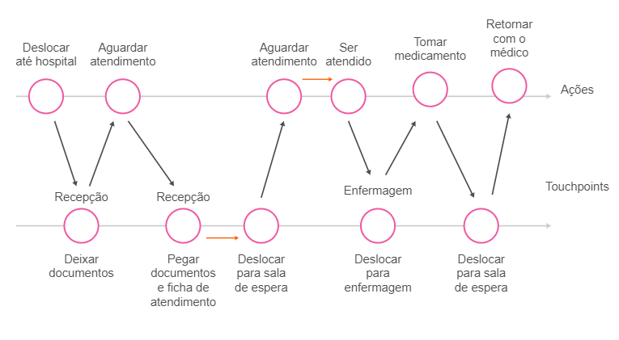
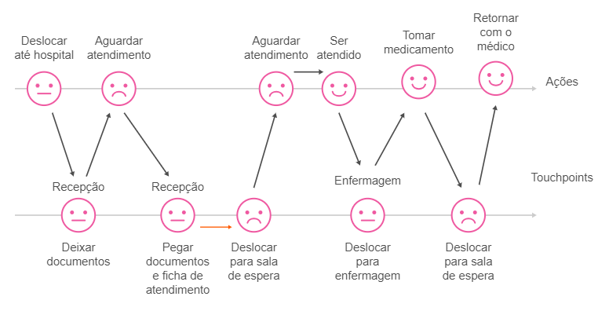

<h1>FASE 2 - DATABASE PROGRAMMING</h1>
<h2>Capítulo 12: Validating your startup!</h2>

<h2>1. VALIDANDO O PROBLEMA</h2>

## 1.1 Job to be done

- a abordagem utilizada é compreender o job do cliente, e partindo dessa compreensão, testar hipóteses de proposta de valor que satisfaçam as condições desse job.
- `job to be done` é o motivo pelo qual um cliente consome algum produto ou serviço: ele tem alguma tarefa que deseja realizar, e esse produto ou serviço traza solução que o ajuda a realizar essa tarefa, de uma forma melhor do que ele consegue sozinho ou com soluções de concorrentes. 
- é a visão de solução na ótica do cliente.
- durante as entrevistas de validação, é importante capturar essa ótica do cliente, do que é importante para ele. O problema que importa ser validado é o obstáculo para que o job do cliente seja cumprido. Entendendo o que ele quer fazer, é possível analisar o verdadeiro problema visto pela ótica dele.

### 1.1.1 As 3 dimensões dos Jobs to be done
- os jobs podem ser representados em 3 dimensões.
  - `Job Funcional`: o que a solução faz, e ajuda o cliente a resolver um problema pontual.
  - `Job Social`: como o cliente acredita ser visto pelas outras pessoas ao utilizar a solução.•
  - `Job Emocional`: como a solução faz o cliente se sentir.
- são 3 camadas de percepção de problemas que seu cliente tem em sua vida. Independente de qual seja seu produto ou serviço, se você conseguir atingir essas 3 dimensões, terá maior engajamento dele com sua proposta de valor.
- na pesquisa de validação para problemas, é importante entender os aspectos funcionais, sociais e emocionais do cliente em sua própria visão.

### 1.1.2 Exemplos de Job to be done 
- exemplo: empresa de bicicletas; para endereçar diferentes dimensões de job para um cliente, ou uma dimensão para cada tipo de cliente como segmentação, ***o que varia é como o cliente enxerga o uso da bicicleta***:
  - se o cliente comprou a bicicleta para ser seu meio de transporte, ela tem um job funcional.
  - se o cliente comprou a bicicleta da empresa para participar de atividades com seus amigos ciclistas por sentir solitário, ele tem um job social.
  - se o cliente comprou a bicicleta por ter o ciclismo como uma paixão que o deixa feliz, realizado e em paz consigo mesmo, ele tem um job emocional.
- para poder enxergar a solução pela ótica do cliente, precisamos primeiramente enxergar o problema pela ótica de quem realmente irá consumir essa solução.

## 1.2 Tamanho do mercado

- uma vez identificado o problema ou oportunidade de negócio, precisamos compreender e validar se esse problema é realmente relevante e grande o suficiente para termos escala: ***devemos investigar o tamanho do mercado***. 
- uma Startup que consegue atender um público nacional ou internacional,terá uma escala muito maior do que uma Startup que consiga atender um público regional.

## 1.3 TAM, SAM e SOM

- você pode ter uma ideia de que tipo de Startup quer ter, mas essas siglas podem ajudá-lo a saber se é possível chegar lá. 
- TAM > SAM > SOM.

### 1.3.1 TAM
- `Total Addressable Market` ou Mercado Endereçável Total. 
- associada à demanda total pelo seu produto, ou seja, tende a ser o número mais otimista, pois você considera que todo mundo no mercado vai querer usar o produto da sua Startup. 
- esse número tende a ser grande, pois desconsidera variáveis importantes como: capacidade do seu time de vendas, competidores, que certamente tirarão parte do seu mercado, entre outros números que, sim, importam.
- ***quer encontrar seu TAM?*** 
  - pense no tamanho total do seu mercado em um mundo feliz, onde não há competidores, e em que todas as condições são favoráveis, e o vento sempre sopra a seu favor. Esse número é ótimo para se animar, pois o mercado vai parecer fantástico para empreender!
  - imagine que você queira abrir uma nova empresa de alimentação saudável, um restaurante. Já imaginou quantas pessoas se alimentam fora de suas casas, todos os dias? Não precisamos ir muito longe. Da mesa do computador mesmo, ou no celular, basta fazer uma simples pesquisa para identificar quantas pessoas se alimentam fora de casa,por exemplo. São milhares derefeições, incluindo café da manhã, almoço e jantar. 
  - mas, voltando ao exemplo, precisamos lembrar que esse é o TAM, ou seja, o mercado endereçável total. Se levarmos em conta que não conseguiremos atingir todo esse mercado, que nosso restaurante não terá condições de servir tantas refeições de uma só vez, que nossos recursos humanos são limitados, a localização geográfica do restaurante e o nicho “alimentação saudável”, chegamos a uma série de limitantes. Esses limitantes compõem o SAM.

### 1.3.2 SAM
- `Serviceable Available Market`, ou seja, quase a realidade. 
- é o mercado que você realmente consegue servir. 
- se o TAM é o mundo feliz, o SAM é o mundo com competidores.
- é calculado considerando o mercado que você e os seus competidores podem servir, dado seu modelo de negócios e os aspectos geográficos.
- apesar de ser algo mais realista que o TAM, esse não é o número definitivo, pois certamente tem outros limitantes que interferem na sua capacidade de vendas. 

### 1.3.3 SOM
- `Serviceable Obtainable Market`.
- é o número mais realista da expectativa quanto ao potencial corrente em relação ao seu mercado ou serviço. 
- leva em consideração seus concorrentes, e como eles tomam parte do seu público e vendas, suas limitações de time, como a capacidade de servir os clientes no tempo correto e com a velocidade necessária, e o alcance que sua Startup terá, ou seja, se ela vai ou não chegar às pessoas corretas. 
- esse é o número que você deve (ou deveria) considerar ao fundamentar sua ideia de novo negócio.

## 1.4 Desk Research (Pesquisa de Mesa)

- a ideia aparentemente é simples: levantar os dados disponíveis publicamente a respeito do mercado em que se deseja atuar. 
- a diferença entre o Desk Research e uma simples busca é o objetivo, já que a técnica foca em ganhar maior conhecimento na área de atuação e,inevitavelmente, entender melhor TAM, SAM e SOM. 
- pelo fato de essa ser uma pesquisa de dados, já gerados previamente, e não por pesquisas conduzidas pela nossa própria conta e autoria, em primeira mão, essa também é uma técnica chamada de `pesquisa de dados secundários`
- deve focar em três objetivos principais:
  - `usuários`:
    - o primeiro passo é fazer uma pesquisa, que considere o cenário completo no Brasil, para decidir se o produto deverá ser ofertado somente aos clientes atuais da empresa ou a todos os potenciais clientes Brasil afora. Chegando nesse número, teremos o número de ***TAM***. 
    - em seguida, chegar ao número de pessoas que o modelo de negócios do seu produto contempla: filtrar os números pesquisados.
  - `ambiente`:
    - permite entender o contexto de uso. 
    - tem a ver com a forma como o usuário utiliza ou utilizará o produto, filtrando os dados e pensando nas limitações do modelo de negócios da empresa - teremos a primeira segmentação do TAM, o ***SAM***.
    - confrontar esses números com a realidade da empresa, considerando a capacidade de alcance dos seus posts publicitários nas redes sociais, número de pessoas na sua lista de mailing, capacidade do produto de atender às pessoas e do time de vendas de comercializar todos os pacotes. 
  - `objetivos`:
    - aqui, consideramos, além dos Usuários e do Ambiente, os objetivos, tanto do usuário, ao utilizar aquela experiência, quanto da empresa,em relação às expectativas do produto - chegamos ao ***SOM***.
    - mesmo depois de chegar ao SOM, o número pode ser ainda maior e,muitas vezes, inalcançável pelo nosso negócio. 
    - é sugerido fazer um recorte nesse público, que pode ser de 0,5%, 1%, ou até um pouco mais, pois assim a amostragem de mercado e futuras análises financeiras se tornam mais realistas e coerentes.

## 1.5 Validando com os clientes

- uma vez identificado o mercado em que atuaremos, realizando um estudo do seu tamanho, chegou a hora de ir para a rua e se aprofundar no problema, compreender as incertezas (hipóteses) e validá-las.
- `IMPORTANTE`: p processo de validação de hipóteses é um processo recorrentee cíclico, em que cada insight levantado pode gerar novas necessidades de novas rodadas de validações e, talvez, com diferentes grupos de hipóteses, e até mesmo diferentes clientes. Então, não se preocupe se por acaso seu projeto mudar drasticamente nesta fase, certamente passaremos pela decisão de pivotar ou perseverar.

### 1.5.1 Ecossistema de Influências
- um projeto de Startup sempre se inicia a partir da análise de um cliente, ou segmentos de clientes e as suas respectivas necessidades. 
- entretanto, conhecer apenas quem é o cliente não basta, pois uma visão míope a respeito do seu comportamento é mapeada, e então assumida como verdade. 
- exemplo:
  - uma Startup busca resolver um grande problema no sistema de saúde: a qualidade no atendimentodos pacientes. Então, ela mapeou a principal relação que existe neste processo: relação paciente e médico.
  - consideremos relações mapeadas = `ecossistema`, e elementos de negócios envolvidos como `nós` do ecossistema. Toda Startup se baseia na visão inicial de ecossistema dos seus fundadores, fazendo com que muitas vezes não olhemos além, e desenvolvemos todo racional de pesquisa e validação de hipóteses baseado nesse ecossistema com poucos nós.
  - a grande preocupação de estar se aprofundando em um ecossistema com poucos nós mapeados é não entender o que pode influenciar esse elo, além de estar sujeito à entrada de novos concorrentes que ofereçam as mesmas soluções para o mesmo elo.
  - assim, o trabalho inicial se dá na investigação e aprofundamento de outros nós existentes nesse ecossistema, e as relações entre eles. 
  - cada nó pode ter diferentes relações de influência com o seu cliente, e até mesmo com sua solução, influenciando diretamente nos resultados que a sua Startup pretende alcançar. 
  - logo, o primeiro esforço que devemos direcionar é o `mapeamento de todos e possíveis nós e elos nesse ecossistema`.
  - com base no exemplo do ecossistema da saúde, alguns `elos desse ecossistema e suas relações`:
    - ***Médico***: influencia o paciente na compra do remédio.
    - ***Paciente***: usuário do hospital (apenas usuário, porque não paga diretamente ao hospital), do plano de saúde (apenas usuário, pois quem realiza o pagamento do plano de saúde é a empresa em que o usuário trabalha) e é cliente da farmácia. 
    - ***Indústria farmacêutica***: fornecedora de medicamentos para as farmácias. 
    - ***Empresa***: cliente do plano de saúde (apenas cliente e não usuário, pois ela paga o plano de saúde, e quem utiliza esse serviço é o seu funcionário). 
    - ***Plano de saúde***: cliente do hospital, pois realiza o pagamento para o hospital dos serviços prestados para os pacientes.
    - `Essas relações podem ser interpretadas de diversas maneiras,quando olhadas sob diferentes perspectivas`.
  - agora, vamos relembrar o desafio da nossa Startup: aumentar a qualidade de atendimento médico nos prontos-socorros. Para isso, seria necessário que:
    - ***Hospital***: para cada atendimento ao paciente, deve ser realizado uma bateria completa de exames para identificar a possível causa da doença; envolver médicos especialistas de diferentes área para fazer um mapeamento e cruzamento do diagnóstico e, por fim,medicar o paciente corretamente.
    - ***Médico***: deve realizar um atendimento aprofundado, analisando diversos aspectos dos sintomas; envolver outros médicos especialistas e, mesmo assim, ser rápido o suficiente para não gerar gargalo no atendimento dos demais pacientes.
  - nesse exemplo, o resultado da mudança no processo seria um atendimento médico de maior qualidade, gerando valor para o nosso paciente. Além disso, geraríamos valor também para o hospital e para os médicos, uma vez que todos os procedimentos realizados seriam pagos pelo plano de saúde. Mas, e o plano de saúde? 
  - enquanto esse modelo de negócio gera valor para o paciente, hospital e médicos, gera um valor inversamente proporcional para o plano de saúde. E como gerar valor para todos os elos desse ecossistema? Jamais conseguiríamos chegar a essas conclusões analisando apenas os poucos elos mapeados.
  - a consequência seria: a Startup perceberia o erro depois de muito esforço, talvez até em um momento em que boa parte da solução já estivesse sendo desenvolvida e tudo tivesse que começar do zero.

- benefícios de um ecossistema bem mapeado:
  - visão das relações de negócio entre os nós.
  - mapeamento da potencialidade da proposta de solução da Startup.
  - ampliação do escopo da solução.
  - análise das possíveis ofertas, que seriam diferenciais frente aos seus concorrentes.

> o foco do mapeamento do ecossistema é entender quais elementos de negócio estão presentes neste mercado, quais as relações entre eles, e o principal: determinar quem realmente é nosso possível público-alvo (ou quem sofre do problema que queremos resolver) e como nossa proposta de solução precisa se comportar.

- é importante perceber que, em determinados ecossistemas, o usuário (quem usa a solução) e cliente (quem paga pela solução), podem não ser representados pelo mesmo perfil, como no exemplo apresentado.

### 1.5.2 Encontrando usuários extremos
- uma vez selecionado o futuro cliente com base na análise de ecossistema(que pode ser mais de um), precisamos ainda analisar o comportamento dele, a fim de buscar grupos de similaridades. 
- ***objetivo***: entender se existem grupos de clientes com comportamentos extremos, que podem oferecer uma perspectiva 360 graus sobre o cliente e o comportamento do processo a ser estudado.
- considerando que a solução contemple as necessidades dos extremos, certamente ela contemplará também o grande volume de clientes, que se encontra no centro da curva.
- exemplos de usuários extremos para a Netflix:
  - extremo 1:pessoas que assistem a seriados diariamente, diversos episódios seguidos e que aguardam ansiosamente por novas temporadas.
  - extremo 2: pessoas que assistem a seriados esporadicamente, com baixa frequência e baixa regularidade.

- cada extremo possui uma necessidade, uma experiência e uma jornada, sendo que uma vez compreendidas todas elas, é possível balizar a maior quantidade de necessidades possíveis, baseadas em seu comportamento. 
- ***uma vez identificados esses grupos, o desafio passa a ser recrutá-los***.
- a maneira mais simples e eficaz são as indicações em seu Network (conexões de trabalho, familiares ou amigos que se encaixem nesses grupos); faça contato e busque adeptos a colaborar com feedbacks. 
- caso não consiga encontrar tais grupos em seu Network, busque atalhos. 
- algumas `estratégias que podem ser utilizadas` são: 
  - busque e participe de grupos de discussão sobre o assunto no Facebook.
  - descubra influenciadores que discutam o tema no Linkedin.
  - busque canais no Youtube que abordem o tema, analisando a quantidade de seguidores e comentários dos vídeos.
  - participe de meetups e eventos do segmento.
  - busque perfis extremos ou pessoas que poderiam direcioná-lo no aplicativo BeerOrCoffee, aplicativo para fortalecer Network e promover conexões.
- caso os atalhos não sejam encontrados, tentar abordar clientes extremos, individualmente, buscando recrutar pelo menos uma quantidade de clientes que possam gerar insights relevantes.

### 1.5.3 Jornada do usuário
- é o processo de ponta a ponta, que o cliente ou usuário realiza em determinado processo. 
- para mapeá-la e estudá-la, segue representação gráfica de todas as atividades que seu cliente/usuário realiza, em determinado contexto, mapeando todos os relacionamentos com diferentes pessoas, produtos e serviços, respectivas percepções e expectativas sobre cada etapa.
- o objetivo é entender em detalhes as atividades do cliente, e o principal é descobrir suas dores e desconfortos no processo.
- primeiramente, precisamos compreender todas as atividades que ele executa e as suas relações (`touchpoints`), presentes no contexto "Ir ao hospital em busca de tratamento médico". 

 
<em>Jornada do usuário - paciente.</em>
 

## 1.6 Foque no problema

- agora, temos uma visão clara de todas as etapas deste processo e todos os touchpoints com que o cliente se relaciona.
- a próxima etapa é entender qual a percepção e o sentimento do usuário em cada uma das etapas. 
- neste ponto, não devemos pensar nas possíveis soluções (apesar de difícil e tentador), temos que focar nos problemas: onde estão, como eles acontecem e o que os provocam. 
- a figura abaixo ilustra as percepções do usuário em cada uma das etapas.

 
<em>Jornada do usuário "paciente" com suas respectivas percepções.</em>
 

- mapeadas todas as percepções do usuário, chegamos a mais um objetivo do processo: `identificar quais atividades geram desconforto e percepções negativas`, sendo que essas dores resolvidas podem gerar uma percepção de valor pelo nosso cliente. 
- apesar do grande esforço empregado no mapeamento concreto da jornada do usuário, tudo o que levantamos até agora baseou-se apenas em nosso conhecimento e em nossas vivências - são hipóteses.
- precisamos, a partir de todas as hipóteses levantadas, entender o que temos certeza, o que supomos e o que ainda não sabemos sobre esse processo.

### 1.6.1 Matriz CSD (Certeza, Suposição e Dúvidas)
- é uma ferramenta que nos ajuda a categorizar todas as hipóteses levantadas em três categorias: 
  - certeza (eu já sei), 
  - suposição (talvez seja útil) e 
  - dúvidas.
- ***objetivo***: identificar o que ainda não sabemos ou temos dúvida a respeito do nosso ecossistema, clientes (extremos ou não), jornada do usuário e as suas percepções - ou seja, evidenciar as hipóteses.
- à medida que o projeto for validado, a disposição dos itens nesta matriz será alterada aos poucos, sendo que quanto menor o número de itens em suposição ou dúvida, maior o nível de maturidade da Startup.
- logo, o objetivo é ***olhar para a jornada desenhada, os pontos de dor identificados, posicioná-los e classificá-los nas colunas***. 
- a ideia é classificar mais "suposições" e "dúvidas" do que "certezas". 

> só classifique "certezas" se você sofre das dores por também se enquadrar na jornada que está analisando - se você pode ser o cliente da sua própria solução. 

### 1.6.2 Hipóteses > Experimentos> Resultados
- apesar de parecer que já conhecemos os problemas do cliente, ainda sabemos muito pouco, são meros achismos/hipóteses, as quais precisam ser postas à prova em experimentos, a fim de testá-las sob o ponto de vista do cliente.
- apenas feedbacks dos clientes podem direcionar nesta jornada, e estes feedbacks acontecem lá fora, onde os clientes vivem e se relacionam, no seu dia a dia e no seu ambiente. 
- o processo de Hipóteses > Experimento > Resultados é cíclico; deve ser executado diversas vezes até que insights necessários sejam gerados. 
- primeiramente entender quais insights precisamos ter (hipóteses), qual a maneira mais rápida e simples de alcançá-los (experimento), e quais aprendizados serão obtidos no experimento (resultados).

### 1.6.3 Hipóteses
- nesta etapa, precisamos entender quais das hipóteses que levantamos são as mais relevantes e críticas para nosso cliente, porque caso sejam invalidadas, a ideia de proposta de solução também será.
- categorizar as suposições e dúvidas da Matriz CSD em dois critérios: ***hipóteses de ecossistema*** e ***hipóteses de jornada***. 
- lembrando que estamos olhando para as hipóteses com foco em problemas e não em soluções.
- sendo:
  - `Hipóteses de ecossistema`:
    - todos os elementos de negócios que mapeamos no ecossistema do cliente, assim como todas as relações entre eles. 
    - analisar o ecossistema e identificar todas as dúvidas e incertezas nesse model, e categoriza-los como "Hipóteses de ecossistema" na Matriz CSD.
  - `Hipóteses da jornada do usuário`: 
    - atividades da jornada do usuário e suas respectivas percepções. 
    - categorizar como "Hipóteses da jornada do usuário".

### 1.6.4 Delimitando o escopo de validação
- precisamos agora entender quais dessas hipóteses são as mais críticas e podem nos direcionar a compreender se nossa visão é válida ou não. 
- portando, precisamos delimitar o ***escopo de validação***. 
- delimitar inicialmente o escopo de validação das hipóteses mais críticas e, uma vez validadas, seguir para o próximo conjunto de hipóteses restantes, permanecendo em um processo cíclico de aprendizado,até que seja possível extrair os fatos a partir dessas hipóteses.
- portanto, realizar uma bateria de experimentos.

## 1.7 Experimentos

- são maneiras de testar as dúvidas existentes na suposição de problema.
- devem seguir o DNA do modelo Startup, sendo rápidos e enxutos, efetivos e assertivos independentemente de seu resultado ser certo ou errado. 
- procurar entender qual teste (mais simples) poderíamos realizar para conseguir aprendizado. 
- experimentos para validação do problema:
  - entrevistas pessoais.
  - entrevistas on-line (formulários de pesquisa ou ligações).

### 1.7.1 Planejando entrevistas
- antes de agendar entrevistas, considerar as validações como ações planejadas, seguidas de um plano com um objetivo final.
- considerar as seguintes etapas no planejamento de uma entrevista:
  - ***determinar o objetivo do experimento***: Quais são as hipóteses a serem validadas e qual o aprendizado buscaremos?
  - ***determinar tamanho da amostragem***: Delimitar o número de possíveis clientes (extremos ou não) que farão parte do experimento.
  - ***determinar critérios de aceitação***: Qual o critério de aceitação considerado para cada hipótese em validação no experimento? Se o critério de aceitação é 70% (70 pessoas de 100 responderem como certa a sua hipótese), ela passa a se tornar uma hipótese validada, um fato. Caso contrário, sua hipótese é invalidada (não representa algo real). Não existe regra para definir este critério, verifique quão crítica é a hipótese e atribua o critério que represente menor risco para o projeto (**mais crítica > critério alto, menos crítica, critério mais baixo**). 
  - ***fazer perguntas abertas***: perguntas fechadas são as que direcionam a resposta do entrevistado para SIM ou NÃO. Perguntas abertas fomentam respostas mas ricas que façam o entrevistado responder contando uma história.

### 1.7.2 Buscando os clientes e agendando reuniões
- um dos grandes desafios iniciais é contatar possíveis clientes para compor o tamanho determinado da amostragem. 
- iniciar sempre a partir do seu Network, por ser uma porta aberta e mais rápida para encontrá-los. 
- sempre buscar clientes visionários e públicos adeptos à transformação e inovação, pois serão mais receptivos. 
- é importante gerar contextualização e empatia para que, a partir do primeiro contato, seja possível estender para diversos outros. 
- indicações tendem a funcionar muito bem.
- introduzir uma história inicial de referência, explicando o motivo da ligação e que gostaria de ouvir o ponto de vista de uma pessoa especialista no assunto.
- pensar em outras maneiras de diminuir barreiras, de engrandecer e envolver o ouvinte no contexto, para que ele se sinta importante e parte do processo. 
- proponhauma reunião curta (quinze minutos), tomar um café para bater um papo sobre o assunto. Determine o dia e horário e sele o compromisso. 
- as rejeições são comuns, então não se preocupe e nem se frustre com isso. Caso os clientes não possam conversar, sugira ligar em outro horário, peça indicações de quem poderia ajudar e evite terminar o contato sem pelo menos apresentar alternativas de contato.

- evitar perguntas no formato:

Hipótese | Pergunta | Respostas
---------|----------|------------
O setor financeiro do hospital emite relatório de despesas para o convênio médico. | Você emite relatório de despesas para o convênio? | Sim/Não
A autorização pelo convênio médico é lenta. | A autorização pelo convênio médico é lenta? | Sim/Não
O paciente não gosta de esperar para ser atendido | Você não gosta de esperar para ser atendido? | Sim/Não

- focar em perguntas no formato:

Hipótese | Pergunta | Resposta
--------|-----------|-------------
O setor financeiro do hospital emite relatório de despesas para o convênio médico. | Como é o processo de emissão de relatório de despesas para o convênio médico? | Detalhes do processo.
A autorização pelo convênio médico é lenta. | Quais são as dificuldades na autorização de um atendimento pelo convênio médico? | Detalhes do processo.
O paciente não gosta de esperar para ser atendido. | Como você se sente ao esperar para ser atendido? | Detalhes da percepção do cliente.

- as perguntas devem ser desenhadas de maneira imparcial, nunca direcionando o entrevistado à resposta que deseja ouvir. 
- formular perguntas utilizando as estruturas: "Como funciona...", "Qual o problema...", "Quais as dificuldades...", "O que você sente quando...".
- fazer perguntas-chave como:
  - Como é a rotina do processo?
  - Quais as grandes dificuldades e maiores problemas que você enfrenta?
  - Como você resolve esse problema hoje?
  - Quanto custa esse problema para você?
  - Como você imagina qual seria a melhor maneira de resolvê-lo?
- essas perguntas também podem ser estruturadas em `formulários on-line` e divulgadas em meios digitais. Neste contexto, é interessante direcioná-las um pouco mais, não deixando tão abertas, pois não será possível extrair detalhes da experiência do usuário com a mesma profundidade. 
  - estruturar as perguntas para que elas não sejam tendenciosas.
  - formulários on-line contam com uma estrutura de relatórios que facilitam a análise de respostas e consolidação de insights.
  - exemplos das principais ferramentas:
    - Google forms.
    - Survey Monkey. 
    - Typeform.

### 1.7.4 Realizando entrevistas imparciais
- entrevistas não devem ser interrogatório, e sim um bate papo; quanto mais descontraído, melhor, porque gera mais empatia.
- antes de abordar sobre o objetivo da reunião, inicie a conversa com assuntos aleatórios, buscando algum tipo de conexão. Olhe para o cliente como uma pessoa, tente entender como se comporta, o que gosta, no que acredita, para tentar encontrar uma conexão e empatia. 
- não existem regras nem melhores práticas, e sim um objetivo: buscar uma conexão com a pessoa. 
- depois de quebrar o gelo, faça novamente a introdução do motivo da reunião,buscando envolver a pessoa, engrandecendo o projeto, a oportunidade e a experiência que ela compartilhará, e comece suas perguntas.
- nem todas as entrevistas acontecerão da mesma maneira, pois cada pessoa tem o seu comportamento.
- tente lembrar de que o foco é validar as hipóteses mais críticas,levantadas no ecossistema e na jornada; faça perguntas que direcionem para as dúvidas que queira esclarecer.
- se possível e com a permissão da pessoa, grave a conversa para ouvi-la depois e analisar os insights. Caso não seja possível, tente anotar todos os principais insights na entrevista.
- o objetivo nas entrevistas é aprender sobre os clientes e o mercado, ou seja, deixar o cliente falar. 
- além das dúvidas e do processo planejado da entrevista, pergunte por informações complementares, como: “Onde buscam informações do seu dia a dia?”, “Com quem se relacionam?”, “Quais evento participam?”, “Como se capacitam?”, “O que leem?”, “Quais estratégias adotam em relação aos concorrentes?”; ou seja, entenda o comportamento do cliente de maneira holística.
- por fim, sempre peça indicações; ampliar o Network, fazendo conexões relevantes que possam agregar mais expertise e maturidade para sua visão de negócio.

## 1.8 Resultados

### 1.8.1 Análise de resultados dos experimentos
- agora é hora de rever e consolidar respostas e insights, documentá-los e compará-los com a matriz de hipóteses.
- para cada hipótese é preciso extrair respostas categóricas: “sim” ou “não” (se foram validadas ou não), consolidá-las e compará-las com o critério de aceitação que definimos. 

Hipótese | Critério de aceitação | Respostas positivas | Validação
---------|-----------------------|------------------|-------------
O setor financeiro do hospital emite relatório de despesas para o convênio médico. | 70% | 80% | Validada
A autorização pelo convênio médico é lenta. | 80% | 60% | Invalidada
O paciente não gosta de esperar para ser atendido. | 85% | 95% | Validada

- depois de validado todo o conjunto inicial de hipóteses, analisar se as suposições e dúvidas da Matriz CSD tornaram-se certezas, e se essas certezas nos dão bases para continuar o processo. Quais foram as lições aprendidas e as lições ainda não aprendidas?
- não precisamos nos preocupar se nossas hipóteses foram invalidadas e se o que imaginávamos não é real. Na verdade, esse é o maior insight que devemos adquirir neste processo, pois permitirá sermos enxutos e errarmos rápido.

> "Nenhum plano de negócio sobrevive ao primeiro contato com clientes".

- se as hipóteses foram invalidadas e identificamos que o problema base da nossa solução não é real, precisamos `pivotar` (mudar radicalmente o rumo do negócio) - tanto o problema que levantamos para o cliente, assim como o próprio cliente. 
- seguindo todas as etapas ciclicamente, em um certo momento, teremos uma base sólida para tomar as decisões para o nosso negócio: pivotar, revalidar ou seguir para as próximas etapas no desenvolvimentoda solução de negócio. 

---

## FAST TEST

### 1. Sobre as dimensões do job to be done, qual opção corresponde a um job social?
> O cliente frequenta a academia para ter um corpo atlético e receber elogios na internet.

### 2. Sobre o conceito de tamanho de mercado (TAM, SAM, SOM), é correto afirmar que:
> TAM, SAM, SOM é útil para demonstrar aos investidores o potencial de crescimento e posicionamento de um negócio, mas também para te dar recortes diferenciados para inovar.

### Qual a importância de validar o problema sem pensar na solução?
> Evitar algum viés de construir o negócio de uma forma que agrada o empreendedor, mas não o cliente.

---

## QUIZ

### 1. A Linguagem PL/SQL é uma linguagem de programação de alto nível, que possui diversos recursos. Assinale as opções que correspondem a estes recursos:
> Declaração de constantes e variáveis, Pacotes, APIs, Procedimentos, Funções.

### 2. Quando ocorre uma exceção, é possível identificar o código ou a mensagem de erro associado por meio de funções específicas. Assinale a alternativa que identifica, respectivamente quais são estas funções:
> SQLCODE e SQLERRM.

### 3. Veja a seguinte PROCEDURE, criada para atualizar o valor do salário de um empregado:
~~~sql
CREATE OR REPLACE PROCEDURE reajuste
(v_cogido_emp IN emp.empno%type, v_porcentagem IN number)
IS
BEGIN
UPDATE emp
  SET sal = sal + (sal*(v_porcentagem / 100))
WHERE empno = v_codigo_emp;
  COMMIT;
END reajuste;
~~~
Considere o código que segue para testar a Procedure mencionada:
~~~sql
SELECT empno, sal
  FROM emp
  WHERE empno = 7839;

EXECUTE reajuste (7839, 10);
  FROM emp;
  WHERE empno = 7839;
~~~
Assinale a alternativa que representa uma conclusão correta sobre este teste da Procedure “reajuste”:
> O salário do funcionário 7839 sofre um reajuste de 10%.

### 4. No PL/SQL podemos criar procedures e funções para finalidades específicas. Assinale as opções exemplificam diferenças entre procedures e funções:
> Procedures podem retornar nenhum, um ou vários valores; Funções contém a cláusula RETURN no cabeçalho; Função retorna obrigatoriamente um valor para a rotina que a chamou; Uma procedure pode devolver um valor para a rotina que a chamou.

### 5. Analise a FUNCTION que segue:
~~~sql
CREATE OR REPLACE FUNCTION descobrir_salario
  (p_id IN emp.empno%TYPE)
RETURN NUMBER
IS
  v_salario emp.sal%TYPE := 0;
BEGIN
  SELECT sal INTO v_salario
    FROM emp
    WHERE empno = p_id;
    RETURN v_salario;
END descobrir_salario;
~~~
Veja o código utilizado para testar a função apresentada:
~~~sql
SELECT empno, DESCOBRIR_SALARIO(empno)
  FROM emp;
~~~
Assinale a alternativa que corresponde a uma conclusão correta sobre este teste realizado na função “descobrir_salario”:
> O teste exibe o código de cada funcionário e executa a função DESCOBRIR_SALARIO com o código de cada funcionário como entrada e retorna o salário de cada um deles.

### 6. Pacotes são áreas de armazenamento de (assinale as opções corretas):
> Procedures, Functions, Cursores, Constantes, Variáveis

### 7. Assinale a alternativa INCORRETA, sobre PACKAGES:
> Packages podem ter duas partes: uma especificação e um corpo. A especificação define as queries para os cursores e o código dos subprogramas, já o corpo define a interface do package.

### 8. Os gatilhos (TRIGGERS) podem ser utilizados para os seguintes propósitos (assinale todas as opções corretas):
> Prevenir transações inválidas, Registrar o histórico de alterações em uma tabela, Auditoria. 

### 9. Analise o trecho de código abaixo, referente à criação de um gatilho (TRIGGER):
~~~sql
SET SERVEROUTPUT ON

CREATE OR REPLACE TRIGGER mudancas_salariais
BEFORE UPDATE ON emp
FOR EACH ROW
DECLARE
  saldo number;
BEGIN
  saldo := :NEW.sal - :OLD.sal;
  DBMS_OUTPUT.PUT_LINE('Salario Anterior: ' || :OLD.sal);
  DBMS_OUTPUT.PUT_LINE('Salario Novo: ' || :NEW.sal);
  DBMS_OUTPUT.PUT_LINE('Diferença Salarial: ' || saldo);
~~~
Considere as sentenças que seguem, baseadas no código apresentado:
- I - A opção FOR EACH ROW, indica que será executado uma vez para cada linha que a operação modifica.
- II - Não é possível determinar a utilidade da variável “saldo”.
- III - O gatilho “MUDANCAS_SALARIAIS” é acionado antes da atualização dos dados da tabela EMP (BEFORE UPDATE ON EMP).
Podemos afirmar, em relação ao código e às sentenças apresentadas (assinale a alternativa correta):
> São corretas as sentenças I e III.

--- 

[Voltar ao início!](https://github.com/DigouO/Smart_Cities_FIAP_2024)