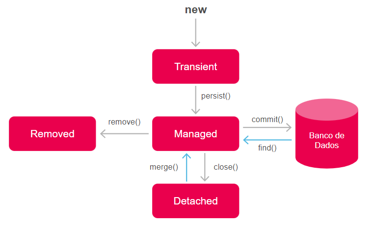

<h1>FASE 3 - FRAMEWORKS JAVA</h1>
<h2>Capítulo 02: Programando dentro do banco de dados.</h2>

<h2>1. A PERSISTÊNCIA DE DADOS</h2>

 
## 1.1 O que é JPA?

- ***persistência de dados***: não basta manipular os dados na aplicação, é necessário gravá-lo em um Sistema Gerenciador de Banco de Dados (SGBD), como MySQL, Oracle Database, SQL-Server etc. e manipulá-lo posteriormente.
- o recurso utilizado pelos desenvolvedores Java para essa tarefa é o uso de uma ***API*** (Application Programming Interface) chamada `JDBC (Java Database Conectivity)`: é uma API que entrega todos os recursos necessários para se conectar a um banco de dados através do Java, porém é bastante trabalhosa e verbosa, fazendo com que o desenvolvedor escreva muito código repetitivo e cansativo.
- outra grande dificuldade é a questão da incompatibilidade de tipos de dados entre Java e banco de dados: no Java os dados são manipulados como objetos e no banco de dados na forma de tabelas. 
- para persistir um objeto em uma tabela se faz necessário ***serializá-lo***: extrair os dados campo a campo do objeto e enviá-lo ao banco. 
- posteriormente, ao receber os dados do banco, é necessário atribuir cada campo a respectiva propriedade do objeto.
- a comunidade de desenvolvedores Java desenvolveu uma especificação para a `JEE (Jakarta Enterprise Edition)`, que descreve uma interface comum para mapeamento entre os objetos Java e as entidades em um banco de dados relacional chamado de `Java Persistence API (JPA)`. 
- a JPA não é uma biblioteca em si, mas um conjunto de especificações e boas práticas de como esse mapeamento e interações devem ocorrer.

### 1.1.1 Como a JPA funciona?
- provê um modelo de mapeamento objeto relacional: é possível mapearmos nossas classes Java para entidades no banco de dados.
- exemplo: classe “Game” – código (Long), titulo (String), dataLancamento (LocalDate), valor (Double), estúdio (String), finalizado (Boolean).
    - a classe “Game” será utilizada para a criação de objetos do tipo “Game” em uma aplicação Java, onde cada instância possuirá quatro atributos: codigo, titulo, dataLancamento, valor, estudio e finalizado.
- criação da classe “Game” e instanciação de 2 objetos do tipo “Game”:

~~~java
package br.com.fiap.games.model;

import java.time.LocalDate;

public class Game {

	private Long codigo;
	private String titulo;
	private LocalDate dataLancamento;
	private Double valor;
	private String estudio;
	private Boolean finalizado;

	public Long getCodigo() {
		return codigo;
	}

	public void setCodigo(Long codigo) {
		this.codigo = codigo;
	}

	public String getTitulo() {
		return titulo;
	}

	public void setTitulo(String titulo) {
		this.titulo = titulo;
	}

	public LocalDate getDataLancamento() {
		return dataLancamento;
	}

	public void setDataLancamento(LocalDate dataLancamento) {
		this.dataLancamento = dataLancamento;
	}

	public Double getValor() {
		return valor;
	}

	public void setValor(Double valor) {
		this.valor = valor;
	}

	public String getEstudio() {
		return estudio;
	}

	public void setEstudio(String estudio) {
		this.estudio = estudio;
	}

	public Boolean getFinalizado() {
		return finalizado;
	}

	public void setFinalizado(Boolean finalizado) {
		this.finalizado = finalizado;
	}

}
~~~

~~~java
package br.com.fiap.games;

import java.time.LocalDate;
import br.com.fiap.games.model.Game;

public class GamesApp {

	public static void main(String[] args) {
		Game game1 = new Game();
		game1.setCodigo(1L);
		game1.setTitulo("Batletoads");
		game1.setDataLancamento(LocalDate.of(1991, 6, 1));
		game1.setValor(100.99);
		game1.setEstudio("Tradewest");
		game1.setFinalizado(true);
		
		Game game2 = new Game();
		game2.setCodigo(2L);
		game2.setTitulo("Double Dragon");
		game2.setDataLancamento(LocalDate.of(1987, 6, 10));
		game2.setValor(48.99);
		game2.setEstudio("Technos Japan");
		game2.setFinalizado(false);
	}
}
~~~

- para representar esses objetos em um banco de dados, é necessário criar uma tabela onde as colunas representam cada propriedade do objeto. 
- todas as propriedades da classe estarão representadas na estrutura da entidade, mas cada qual com as suas particularidades quanto ao tipo de dados e padrões de nomenclatura.
- portanto, temos que ter em mente que cada linha da tabela é a instância de um game - ***a estrutura de uma classe e de uma entidade são diferentes***!
- com o padrão JPA faremos com que as classes Java sejam mapeadas para entidades no banco de dados sem nos preocuparmos com os tipos de dados e outros detalhes envolvidos na persistência dos dados no banco.

## 1.2 O que é Hibernate?

- a `JPA` é apenas uma ***especificação***: descreve uma interface comum para o mapeamento entre objetos Java para entidades em um banco de dados relacional.
- o `Hibernate` é a ***implementação da especificação JPA***: é através do Hibernate que podemos, de fato, mapear as classes Java com entidades no banco de dados e realizar as operações de persistência de dados de forma eficaz.
  - foi criado por Gavin King em 2001.
  - tornou-se a implementação de referência da JPA e a mais utilizada atualmente.
  - além do Hibernate, temos outras bibliotecas que também implementam a especificação JPA, como o EclipseLink e Apache OpenJPA.

## 1.3 O que é o Maven?

- é uma ferramenta de automação e gerenciamento de projetos (`Build Tool`). 
- usado para simplificar tarefas comuns, como compilação, testes, gerenciamento de dependências, empacotamento e implantação. 
- cria a estutura do projeto automaticamente, facilitando o trabalho do desenvolvedor.
- o componente central do Maven é o `arquivo “pom.xml”`, responsável por gerenciar as dependências do projeto, que em nosso caso será o Hibernate.

## 1.4 Ambiente de Desenvolvimento

- as IDEs mais utilizadas são o Eclipse e o Intellij. 

## 1.5 Criação de umprojeto Maven no Eclipse:

- implementar um pequeno projeto para que possamos entender melhor como isso tudo funciona. 
- o projeto consistirá em uma aplicação para gerenciar um catálogo de games.
- classe “Game” – id (Long), titulo (String), dataLancamento (LocalDate), valor (Double), produtora (String), finalizado (Boolean), categoria (Sting); + getters() e setters().
- criar um projeto no Eclipse seguindo os passos:

1. Com o Eclipse aberto, clique no menu “File, New, Project”. 
2. Na caixa de diálogo “New Project”, expanda a pasta “Maven” e selecione “Maven Project”.
3. Na caixa de diálogo “New Maven Project”, marque a opção “Create a simple Project (skip archetype selection)”.
4. Na próxima tela, preencha os dados do projeto > Finish.

### 1.5.1 Configuração do Maven
- configurar o Maven, de modo a disponibilizar o Hibernate para o projeto. 
- abrir o arquivo “pom.xml”
  - a primeira configuração que deve ser efetuada é a indicação da versão do Java que será utilizado pelo projeto. Neste caso,utilizaremos a versão 17, que é uma versão LTS (Long-Term Support).
  - adicionar o trecho de código:

~~~xml
<project xmlns="http://maven.apache.org/POM/4.0.0" 
xmlns:xsi="http://www.w3.org/2001/XMLSchema-instance" 
xsi:schemaLocation="http://maven.apache.org/POM/4.0.0 https://maven.apache.org/xsd/maven-4.0.0.xsd">
  <modelVersion>4.0.0</modelVersion>
  <groupId>br.com.fiap</groupId>
  <artifactId>games</artifactId>
  <version>0.0.1-SNAPSHOT</version>
  
  <!-- DEFININDO A VERSÃO DO JAVA QUE SERÁ UTILIZADO-->
  <build>
	  <plugins>
		  <plugin>
			  <groupId>org.apache.maven.plugins</groupId>
			  <artifactId>maven-compiler-plugin</artifactId>
			  <version>3.11.0</version>
			  <configuration>
				  <release>17</release>
			  </configuration>
		  </plugin>
	  </plugins>
  </build>
  
</project>
~~~

- ao salvar as alterações, observar o painel “Problems”, logo abaixo do editor de código. Se tudo estiver correto as informações exibidas devem ser "Project 'games' has no explicit encoding set".
  - não precisamos nos preocupar com esse “Warning”, ele indica que não há uma codificação de caracteres definido para o projeto. Se quiser remover esta mensagem e corrigir este aviso, clicar com o botão direito na mensagem e selecionar a opção “Quick Fix”.
- o projeto já está configurado para utilizar o Java 17; agora, configurar as dependências do Maven para utilização da JPA através da implementação do Hibernate:
  - acrescentar o bloco de dependências no arquivo “pom.xml”.

~~~xml
<project xmlns="http://maven.apache.org/POM/4.0.0"
	xmlns:xsi="http://www.w3.org/2001/XMLSchema-instance"
	xsi:schemaLocation="http://maven.apache.org/POM/4.0.0 https://maven.apache.org/xsd/maven-4.0.0.xsd">
	<modelVersion>4.0.0</modelVersion>
	<groupId>br.com.fiap</groupId>
	<artifactId>games</artifactId>
	<version>0.0.1-SNAPSHOT</version>

	<build>
		<plugins>
			<plugin>
				<groupId>org.apache.maven.plugins</groupId>
				<artifactId>maven-compiler-plugin</artifactId>
				<version>3.11.0</version>
				<configuration>
					<release>17</release>
				</configuration>
			</plugin>
		</plugins>
	</build>

	<dependencies>
		<dependency>
			<groupId>org.hibernate.orm</groupId>
			<artifactId>hibernate-core</artifactId>
			<version>6.3.0.Final</version>
		</dependency>
	</dependencies>

</project>
~~~

- o propósito do projeto será a manipulação de dados em um banco de dados real: utilizaremos o `Oracle Database`, então será necessário acrescentar a dependência do driver do Oracle no arquivo “pom.xml”. 

~~~xml
<project xmlns="http://maven.apache.org/POM/4.0.0"
	xmlns:xsi="http://www.w3.org/2001/XMLSchema-instance"
	xsi:schemaLocation="http://maven.apache.org/POM/4.0.0 https://maven.apache.org/xsd/maven-4.0.0.xsd">
	<modelVersion>4.0.0</modelVersion>
	<groupId>br.com.fiap</groupId>
	<artifactId>games</artifactId>
	<version>0.0.1-SNAPSHOT</version>

	<build>
		<plugins>
			<plugin>
				<groupId>org.apache.maven.plugins</groupId>
				<artifactId>maven-compiler-plugin</artifactId>
				<version>3.11.0</version>
				<configuration>
					<release>17</release>
				</configuration>
			</plugin>
		</plugins>
	</build>

	<dependencies>
		<dependency>
			<groupId>org.hibernate.orm</groupId>
			<artifactId>hibernate-core</artifactId>
			<version>6.3.0.Final</version>
		</dependency>

		<dependency>
			<groupId>com.oracle.database.jdbc</groupId>
			<artifactId>ojdbc10</artifactId>
			<version>19.21.0.0</version>
		</dependency>
	</dependencies>

</project>
~~~

- ao salvar o arquivo “pom.xml”, as dependências serão baixadas e disponibilizadas para uso no projeto.

### 1.5.2 Forçar atualização do Maven
- em alguns casos as dependências podem não serem baixadas corretamente, e devemos forçar a atualização do Maven.
- clicar com o botão direito do mouse no nome do projeto, em seguida, no menu de contexto apontar para “Maven” e clicar em “Update Project”.
- na tela “Update Maven Project”, clicar no botão “OK”.

> Para acessar o link do projeto com configuração do projeto Maven no Eclipse, [clicar aqui](https://github.com/FIAP/ON_TDS_JAVA_ADVANCED_ECLIPSE).

<h2>2. PERSISTÊNCIA DE DADOS COM A JPA</h2>

- após configuração do Maven, é necessário configurar as propriedades e informações relacionadas à persistência de dados em um ambiente JPA.
- essas configurações devem ser efetuadas no `arquivo persistence.xml`, cujo nome deve ser grafado exatamente como descrito (caso utilize letras maiúsculas, ou altere alguma letra, simplesmente não funcionará).
- esse arquivo será responsável pelas seguintes configurações:
  - ***Unidade de persistência***: responsável por fornecer os dados de acesso a um banco de dados específico, além de informações sobre o mapeamento objeto-relacional das classes Java para as entidades no banco de dados. Geralmente quando trabalhamos com vários bancos de dados teremos uma unidade de persistência para cada um deles no mesmo arquivo “persistence.xml”.
  - ***Mapeamento das entidades***: responsável por listar todas as classes Java que serão mapeadas para uma entidade no banco de dados. Chamamos essas classes de “classes de entidade”, que representam as entidades no banco de dados e que serão anotadas com anotações JPA.
  - ***Configuração do provedor JPA***: utilizado para indicar qual será o provedor JPA que será utilizado. Além do Hibernate temos outros provedores JPA, como o EclipseLink ou Apache OpenJPA.

## 2.1 Arquivo “persistence.xml”

- não é criado por padrão quando criamos um projeto Maven, então teremos que criá-lo. 
- esse arquivo deve ser criado na pasta de recursos do projeto, que está em “src/main/resources”.
- este arquivo deve ficar em uma `pasta chamada “META-INF”`, que deve ser grafada exatamente como descrito. 
  - para criar esta pasta, clique com o botão direito do mouse na pasta “resources”, no menu de contexto aponte para “New”, em seguida “Directory”.
  - em seguida, na janela “New Directory”, digite o nome da pasta e pressione “Enter” (META-INF).
- criar o arquivo “persistence.xml”, clicando com o botão direito do mouse na pasta “META-INF”. 

## 2.2 Preenchimento do arquivo “persistence.xml”

- inserir a tag raiz “persistence”, na qual todas as outras configurações serão inseridas.

~~~xml
<?xml version="1.0" encoding="UTF-8"?>

<persistence xmlns="http://xmlns.jcp.org/xml/ns/persistence"
             xmlns:xsi="http://www.w3.org/2001/XMLSchema-instance"
             xsi:schemaLocation="http://xmlns.jcp.org/xml/ns/persistence http://xmlns.jcp.org/xml/ns/persistence/persistence_2_2.xsd"
             version="2.2">

</persistence>
~~~

- criar a primeira unidade de persistência: essa configuração utiliza uma `tag chamada <persistence-unit>`, que possui dois parâmetros obrigatórios:
  - name: indica o nome da unidade de persistência;
  - transaction-type: responsável por indicar o tipo de transação.

~~~xml
<?xml version="1.0" encoding="UTF-8"?>

<persistence xmlns="http://xmlns.jcp.org/xml/ns/persistence"
             xmlns:xsi="http://www.w3.org/2001/XMLSchema-instance"
             xsi:schemaLocation="http://xmlns.jcp.org/xml/ns/persistence http://xmlns.jcp.org/xml/ns/persistence/persistence_2_2.xsd"
             version="2.2">
	<persistence-unit name="games" transaction-type="RESOURCE_LOCAL">
	
	</persistence-unit>

</persistence>
~~~

- no exemplo, “games” é o nome da unidade de persistência e “RESOURCE_LOCAL” indica que seremos responsáveis pelo objeto “EntityManager”, que é utilizado pela JPA para realizar as transações no banco de dados.
- outra opção para “transaction-type” é “JTA”, que significa “Java Transaction API”, que é usado quando há uma aplicação responsável por gerenciar o “EntityManager”.
- agora vamos `configurar a conexão com o banco de dados`.

~~~xml
<?xml version="1.0" encoding="UTF-8"?>

<persistence xmlns="http://xmlns.jcp.org/xml/ns/persistence"
	xmlns:xsi="http://www.w3.org/2001/XMLSchema-instance"
	xsi:schemaLocation="http://xmlns.jcp.org/xml/ns/persistence http://xmlns.jcp.org/xml/ns/persistence/persistence_2_2.xsd"
	version="2.2">
	<persistence-unit name="games" transaction-type="RESOURCE_LOCAL">

		<properties>
			<property name="javax.persistence.jdbc.driver" value="oracle.jdbc.driver.OracleDriver" />
			
			<property name="javax.persistence.jdbc.url" value="jdbc:oracle:thin:@oracle.fiap.com.br:1521:ORCL" />
			<property name="javax.persistence.jdbc.user" value="user" />
			<property name="javax.persistence.jdbc.password" value="password" />

		</properties>

	</persistence-unit>

</persistence>
~~~

- na tag “&lt;properties&gt;” configuramos as propriedades:
  - linha 11: indicamos qual será o driver utilizado para se conectar com o banco de dados. Neste exemplo estamos utilizando o Oracle Database, que foi registrado como uma dependência do projeto no arquivo “pom.xml” do Maven.
  - linha 14: nesta configuração indicamos a URL para o banco de dados que estamos utilizando.
  - Linha 16: nesta linha, fornecemos o nome do usuário do banco de dados. 
  - Linha 17: nesta linha, estamos fornecendo a senha do usuário do banco de dados. 

## 2.3 Mapeamento de entidades

- após configuração do arquivo “persistence.xml”, configurar as classes Java para que sejam mapeadas às entidades no banco de dados, ou seja,informaremos a JPA quais classes devem possuir uma tabela equivalente no banco de dados.

### 2.3.1 Criação da classe Game
- criar uma classe que contenha o método “main”, antes de criarmos a classe Game.
- criar a estrutura de pacotes necessários para organizar o projeto, começando pelo pacote raiz.

1. Clique com o botão direito do mouse na pasta Java, selecione “New” e em seguida “Package”.
2. Na tela “New Package” digite o nome do pacote (br.com.fiap).

- criar uma classe no pacote raiz, que será responsável por iniciar a aplicação.
- a classe que inicia a aplicação deve contero método “main”. Passos:

1. Clique com o botão direito do mouse no pacote raiz do projeto, aponte para “New” e em seguida “Java Class”.
2. Na janela “New Java Class”, digite o nome da classe, selecione a opção “Class” e pressione Enter.
3. Para criar o método “main”, estando dentro da classe “Main”, digite a palavra “main”. Ao surgir a dica para a criação do método “main” pressione “Enter”.

~~~java
package br.com.fiap;

public class Main {
	public static void main(String[] args) {
		
	}
}
~~~

- em seguida criaremos a classe Game no pacote “model”, dentro do pacote raiz.
- após criação da classe Game, criar seus atributos e métodos getters e setters correspondentes.

~~~java
package br.com.fiap.model;

import java.time.LocalDate;

public class Game {

	private Long id;
	private String titulo;
	private LocalDate dataLancamento;
	private Double valor;
	private String produtora;
	private Boolean finalizado;
	private String categoria;

	public Long getId() {
		return id;
	}

	public void setId(Long id) {
		this.id = id;
	}

	public String getTitulo() {
		return titulo;
	}

	public void setTitulo(String titulo) {
		this.titulo = titulo;
	}

	public LocalDate getDataLancamento() {
		return dataLancamento;
	}

	public void setDataLancamento(LocalDate dataLancamento) {
		this.dataLancamento = dataLancamento;
	}

	public Double getValor() {
		return valor;
	}

	public void setValor(Double valor) {
		this.valor = valor;
	}

	public String getProdutora() {
		return produtora;
	}

	public void setProdutora(String produtora) {
		this.produtora = produtora;
	}

	public Boolean getFinalizado() {
		return finalizado;
	}

	public void setFinalizado(Boolean finalizado) {
		this.finalizado = finalizado;
	}

	public String getCategoria() {
		return categoria;
	}

	public void setCategoria(String categoria) {
		this.categoria = categoria;
	}

}
~~~

### 2.3.2 Mapeamento da classe Game
- utilizaremos o recurso de anotações do Hibernate. 
- em Java, as `annotations` (anotações) são metadados que adicionamos ao código-fonte para adicionar informações ao código. A
- as anotações são processadas por ferramentas externas, como Hibernate,ou do próprio compilador Java para realizar ações específicas. Esse recurso torna o processo de programação mais ágil e eficiente.
- no processo de mapeamento temos que incluir algumas anotações a nossa classe Game, para informar ao Hibernate que esta classe deverá ter uma entidade associada no banco de dados. Além disso, utilizaremos anotações que poderão adaptar nossa classe a entidade correspondente no banco de dados.

~~~java
package br.com.fiap.model;

import jakarta.persistence.*;
import java.time.LocalDate;

@Entity
@Table(name = "tbl_games")
public class Game {
    @Id
    @GeneratedValue(
            strategy = GenerationType.SEQUENCE, 
            generator = "TBL_GAMES_SEQ")
    @SequenceGenerator(
            name = "TBL_GAMES_SEQ", 
            sequenceName = "TBL_GAMES_SEQ", 
            allocationSize = 1)
    private Long id;

    private String titulo;

    @Column(name = "data_lancamento")
    private LocalDate dataLancamento;

    private Double valor;
    private String produtora;
    private Boolean finalizado;
    private String categoria;

    public Long getId() {
        return id;
    }

// etc.
~~~

- no código da classe Game temos as anotações:
  - linha 3: importações das classes JPA.
  - linha 6: a anotação “@Entity” informa ao Hibernate que esta classe terá uma entidade correspondente no banco de dados.
  - linha 7: a anotação “@Table”, através do parâmetro “name”, determina ao Hibernate que o nome da tabela no banco de dados será “tbl_games”. Se essa anotação for omitida, o Hibernate utilizará o nome da classe como sendo o nome da tabela.
  - linha 9: a anotação “@Id” adiciona a informação de que o atributo “id” da classe será o atributo identificador ou chave-primária da tabela “tbl_games”.
  - linha 10: 
    - a anotação “@GeneratedValue” informa ao Hibernate como o valor do atributo “id” na tabela “tbl_games” será gerado. 
    - o parâmetro “strategy” define a estratégia que será utilizada. 
    - “GenerationType.SEQUENCE” é a estratégia utilizada para geração de valores automáticos, únicos e sequenciais em uma tabela. 
    - o parâmetro “generator” informa qual é o nome da sequência criada no Oracle para essa tabela. 
      - outras estratégias seriam, por exemplo, "GenerationType.AUTO”. 
    - se você estiver utilizando o banco de dados MySQL, será necessário utilizar “GenerationType.IDENTITY”, para utilizarmos o recurso de auto numeração do campo “id”.
  - linha 13: configuramos o gerenciador de sequências que será utilizado pelo Oracle. 
  - linha 21: anotação “@Column” é utilizada para alterar alguma característica do atributo na tabela no banco de dados. Em nosso caso, utilizamos o parâmetro “name” para informar ao Hibernate que o atributo “dataLancamento” da classe deverá se chamar “dt_lancamento” no banco de dados.

## 2.4 Gravando o primeiro game no banco de dados

- abrir o arquivo “Main.java”, classe responsável por iniciar a aplicação e acrescentar o código:

~~~java
package br.com.fiap;

import java.time.LocalDate;

import br.com.fiap.model.Game;

public class Main {

	public static void main(String[] args) {
		
		Game game1 = new Game();
		game1.setTitulo("Mega Man 1");
		game1.setCategoria("Plataforma");
		game1.setDataLancamento(LocalDate.of(1987, 12, 1));
		game1.setFinalizado(true);
		game1.setProdutora("Capcom");
		game1.setValor(128.0);
		
	}

}
~~~

- por enquanto estamos apenas criando um objeto do tipo Game, que está referenciado pela variável de instância “game1”. 
- outra coisa importante a salientar é que esse game é novo, portanto não temos o “id”, não sendo fornecido na criação desse objeto - o “id” foi configurado para ser gerado automaticamentepelo banco de dados. 
- como faremos para inserir este objeto no banco de dados?
  - com a utilização da JDBC seria necessário bastante código: criar a conexão com o banco, criar os statements, criar as instruções SQL para inclusão de um novo registro no banco etc. 
  - com JPA será muito mais simples!

- a primeira coisa que precisamos fazer é ***criar um objeto do tipo EntityManager***, responsável por gerenciar as entidades no Java - será responsável por fazer todas as operações de persistência no banco.
- não podemos criar um objeto EntityManager diretamente; para isso será necessária a utilização de uma ***Interface chamada `EntityManagerFactory`***, que é uma fábrica de instâncias “EntityManager”.

~~~java
package br.com.fiap;

import java.time.LocalDate;

import br.com.fiap.model.Game;
import jakarta.persistence.EntityManager;
import jakarta.persistence.EntityManagerFactory;
import jakarta.persistence.Persistence;

public class Main {

	public static void main(String[] args) {
		
		Game game1 = new Game();
		game1.setTitulo("Mega Man 1");
		game1.setCategoria("Plataforma");
		game1.setDataLancamento(LocalDate.of(1987, 12, 1));
		game1.setFinalizado(true);
		game1.setProdutora("Capcom");
		game1.setValor(128.0);
		
		EntityManagerFactory emf = Persistence.createEntityManagerFactory("games");
		EntityManager em = emf.createEntityManager();
		
	}

}
~~~

- inclusões:
  - linhas 6 a 8: imports necessários para criação da EntityManager.
  - linha 22: criação da instância de um objeto EntityManagerFactory para a unidade de persistência “games”, que foi configurada no arquivo “persistence.xml”.
  - linha 23: criação de um objeto EntityManager pela EntityManagerFactory.

- após a criação da EntityManager, podemos tentar gravar o game no banco de dados. Não é necessário criar a tabela, já que o Hibernate fará isso.
- em seguida vamos acrescentar a instrução para persistir o objeto Game no banco de dados:

~~~java
package br.com.fiap;

import java.time.LocalDate;

import br.com.fiap.model.Game;
import jakarta.persistence.EntityManager;
import jakarta.persistence.EntityManagerFactory;
import jakarta.persistence.Persistence;

public class Main {

	public static void main(String[] args) {
		
		Game game1 = new Game();
		game1.setTitulo("Mega Man 1");
		game1.setCategoria("Plataforma");
		game1.setDataLancamento(LocalDate.of(1987, 12, 1));
		game1.setFinalizado(true);
		game1.setProdutora("Capcom");
		game1.setValor(128.0);
		
		EntityManagerFactory emf = Persistence.createEntityManagerFactory("games");
		EntityManager em = emf.createEntityManager();
		
		em.persist(game1);
		
	}

}
~~~

- para melhorar o log do Hibernate, acrescentar mais uma propriedade no arquivo “persistence.xml”:

~~~xml
<?xml version="1.0" encoding="UTF-8"?>

<persistence xmlns="http://xmlns.jcp.org/xml/ns/persistence"
             xmlns:xsi="http://www.w3.org/2001/XMLSchema-instance"
             xsi:schemaLocation="http://xmlns.jcp.org/xml/ns/persistence http://xmlns.jcp.org/xml/ns/persistence/persistence_2_2.xsd"
             version="2.2">
	<persistence-unit name="games" transaction-type="RESOURCE_LOCAL">
		
		<properties>
			<property name="javax.persistence.jdbc.driver" value="com.mysql.cj.jdbc.Driver"/>
			<property name="javax.persistence.jdbc.url" value="jdbc:mysql://localhost:3306/db_games"/>
			<property name="javax.persistence.jdbc.user" value="fiap"/>
			<property name="javax.persistence.jdbc.password" value="1234"/>
			
			<property name="hibernate.show_sql" value="true"/>
			
		</properties>
		
	</persistence-unit>

</persistence>
~~~

- essa linha ativa uma funcionalidade do Hibernate que exibe no log as instruções SQL enviadas ao banco de dados. 
- ao rodar a aplicação, neste ponto ocorreu uma exceção/um erro, e segundo a mensagem, o que está faltando é a criação de uma sequência no banco de dados Oracle.
- ***criar a sequência***, que deve ter o mesmo nome que informamos no parâmetro “generator” da anotação “@GeneratedValue” da classe Game. Passo a passo:
  - 1. Abra a aplicação “OracleSQL Developer”, localize no painel de conexões o item “Sequências”.
  - 2. Clique com o botão direito do mouse no item “Sequências” e selecione “Nova Sequência...”.
	- 3. Na janela “Criar Sequência”, preencher os campos (nome: TBL_GAMES_SEQ, começar com: 1, incremento: 1).

- ao executar a aplicação, não há erro, e o log mostra que o Hibernate localiza a sequência criada, mas ao consultar o banco de dados não há nenhum game cadastrado, nem tabela criada.
- para resolver este problema temos ***duas soluções***: 
	- a primeira é criar a tabela manualmente no banco de dados 
	- e a segunda é deixar por conta do Hibernate este trabalho. 

- vamos deixar que o Hibernate faça o trabalho pesado: `acrescentar mais uma propriedade no arquivo “persistence.xml”`:

~~~xml
<?xml version="1.0" encoding="UTF-8"?>

<persistence xmlns="http://xmlns.jcp.org/xml/ns/persistence"
             xmlns:xsi="http://www.w3.org/2001/XMLSchema-instance"
             xsi:schemaLocation="http://xmlns.jcp.org/xml/ns/persistence http://xmlns.jcp.org/xml/ns/persistence/persistence_2_2.xsd"
             version="2.2">
	<persistence-unit name="games" transaction-type="RESOURCE_LOCAL">
		
		<properties>
			<property name="javax.persistence.jdbc.driver" value="com.mysql.cj.jdbc.Driver"/>
			<property name="javax.persistence.jdbc.url" value="jdbc:mysql://localhost:3306/db_games"/>
			<property name="javax.persistence.jdbc.user" value="fiap"/>
			<property name="javax.persistence.jdbc.password" value="1234"/>
			
			<property name="hibernate.show_sql" value="true"/>
			<property name="hibernate.hbm2ddl.auto" value="update"/>
			
		</properties>
		
	</persistence-unit>

</persistence>
~~~

- a `propriedade “hibernate.hbm2ddl.auto”` delega ao Hibernate a tarefa de criar as tabelas automaticamente de acordo com o mapeamento das classes Java.
- se uma classe está mapeada, mas não existe no banco uma entidade equivalente, o Hibernate se encarregará de criar a tabela para nós. 
- o valor “update” para essa propriedade garantirá que qualquer alteração na classe seja refletida na entidade.

> ***ATENÇÃO***: Habilitar a atualização do banco de forma automática é perigoso em um banco de dados de produção (banco que os usuários estão utilizando).

- ao executarmos a aplicação, veremos no log a execução da instrução SQL para a criação da tabela “tbl_games”. Mas, ao consultar a tabela no banco de dados, ela está vazia.
- isso ocorre porque precisamos iniciar uma transação para que a persistência ocorra com sucesso:

~~~java
package br.com.fiap;

import java.time.LocalDate;

import br.com.fiap.model.Game;
import jakarta.persistence.EntityManager;
import jakarta.persistence.EntityManagerFactory;
import jakarta.persistence.Persistence;

public class Main {

	public static void main(String[] args) {
		
		Game game1 = new Game();
		game1.setTitulo("Mega Man 1");
		game1.setCategoria("Plataforma");
		game1.setDataLancamento(LocalDate.of(1987, 12, 1));
		game1.setFinalizado(true);
		game1.setProdutora("Capcom");
		game1.setValor(128.0);
		
		EntityManagerFactory emf = Persistence.createEntityManagerFactory("games");
		EntityManager em = emf.createEntityManager();
		
		em.getTransaction().begin();
		em.persist(game1);
		em.getTransaction().commit();
		em.close();
		
	}

}
~~~

- as instruções inseridas possuem as seguintes atribuições:
	- linha 25: iniciar uma transação com o banco de dados - método “begin()”.
	- linha 26: executar o método de persistência; nesse caso, será a inclusão de um novo registro.
	- linha 27: efetivar a transação através do método “commit()” da transação.
	- linha 28: executar o método “close()” do objeto EntityManager para liberar recursos não mais necessários.

- ao executar a aplicação novamente, veremos a instrução SQL de inclusão de registro no banco de dados.
- ao consultar o banco de dados novamente, veremos que o registro do game foi inserido com sucesso.

> Código completo desta sessão [aqui](https://github.com/FIAP/ON_TDS_JAVA_ADVANCED/tree/persistence_config).

<h2>3. PADRÃO DAO – DATA ACCESS OBJECT</h2>

- até agora criamos nossa classe de domínio com as anotações necessárias para o mapeamento das entidades no banco, e realizamos os testes no método “main” da classe principal. 
- vamos, a partir desse momento, organizar a estrutura do nosso projeto de modo a torná-lo mais flexível para mudanças futuras.

## 3.1 O padrão DAO – Data Access Object

- quando falamos de classe, no paradigma orientado a objetos, estamos falando sobre a implementação da “receita” de um objeto, ou seja, a classe apenas define como o objeto é, através das propriedades ou atributos e o que o objeto faz, através dos seus métodos. 
- ao incluirmos os métodos de persistência desse objeto em um banco de dados, estamos nos referindo ao que fazer com o objeto, ou seja, a inclusão, atualização ou exclusão de um objeto do banco de dados não é um comportamento inerente ao objeto, mas algo que é feito com o objeto que já existe. 
- logo, quando pensamos nos métodos de persistência de um objeto, faz mais sentido criarmos uma classe que implemente esses comportamentos. 
	- se nossa aplicação possui uma classe que define o que é e o que faz um Game, precisamos de uma outra classe que sabe como persistir este objeto Game no banco. 
	- surgiu daí a ideia do padrão DAO!

> O padrão DAO foi pensado de forma a separar as regras de negócio das regras de acesso ao banco de dados. Deste modo, teremos as classes de domínio da aplicação e as classes de acesso aos dados (DAO): Class Game > ClassGameDAO > JDBC > BD.

- por questão de organização, quando desenvolvemos uma aplicação Java, criamos os pacotes (estrutura de pastas) para organizar as classes por tipo ou função. 
- é comum as classes de domínio ficarem em um pacote “model” ou “domain”, e as classes de persistência em outro pacote, geralmente chamada de “dao”.

### 3.1.1 Método DAO de inclusão (persist)
- organizar o nosso projeto para aplicarmos minimamente esse conceito.
- acrescentar ao projeto “games” um pacote chamado “dao” no pacote raiz “br.com.fiap”. 
- no pacote “dao”, que acabamos de criar, acrescentar uma classe chamada “GameDao”. 
- a classe “GameDao” será responsável por persistir um objeto Game no banco de dados, então será necessário que tenha acesso a um objeto “EntityManager”. 
	- ***sempre que formos persistir algum objeto no banco utilizaremos um “EntityManager”, então é interessante criarmos uma classe “auxiliar” que será responsável por entregar um objeto “EntityManager” sempre que precisarmos dele*** - `pacote “utils”` no pacote raiz do projeto. 
	- o nome “utils” é costumeiramente utilizado para incluirmos classes que são úteis ao projeto de uma forma geral, que fornecem algum recurso que as outras classes utilizarão.
- no pacote “utils”, acrescentar uma classe chamada “Conexao”, que será responsável por entregar um objeto “EntityManager”. 

~~~java
package br.com.fiap.utils;

import jakarta.persistence.EntityManager;
import jakarta.persistence.EntityManagerFactory;
import jakarta.persistence.Persistence;

public class Conexao {
	public static final EntityManagerFactory EMF = Persistence.createEntityManagerFactory("games");
	
	public static EntityManager getEntityManager() {
		return EMF.createEntityManager();
	}	
}
~~~

- acima, vemos o conteúdo da classe “Conexao”, que possui um atributo estático chamado “EMF” já inicializada do tipo “EntityManagerFactory”. 
- nessa classe construímos tambémum método estático chamado “getEntityManager()” que retorna um objeto “EntityManager”. 
- o atributo e o método são estáticos para que não seja necessário a instanciação do objeto “Conexao”. 
- com a classe “Conexao” concluída, codificar a classe “GameDao” para que possamos utilizá-la sempre que precisarmos persistir um “Game” no banco de dados. 

~~~java
package br.com.fiap.dao;

import br.com.fiap.model.Game;
import jakarta.persistence.EntityManager;

public class GameDao {
	private EntityManager em;
	// declarado atributo do tipo EntityManager

	public GameDao(EntityManager em) {
		this.em = em;
		// construtor da classe GameDao
	}
	
	public void salvar(Game game) {
		em.persist(game);
		// método salvar
	}
}
~~~

- alterar o código-fonte da classe “Main” de modo a utilizar a classe “GameDao” que foi criada:

~~~java
package br.com.fiap;

import java.time.LocalDate;

import br.com.fiap.dao.GameDao;
import br.com.fiap.model.Game;
import br.com.fiap.utils.Conexao;
import jakarta.persistence.EntityManager;

public class Main {

	public static void main(String[] args) {
		
		Game game1 = new Game();
		game1.setTitulo("Batletoads");
		game1.setCategoria("Luta");
		game1.setDataLancamento(LocalDate.of(1992, 8, 1));
		game1.setFinalizado(true);
		game1.setProdutora("Tradewest");
		game1.setValor(99.89);
		
		EntityManager em = Conexao.getEntityManager();
		/*
		* criado um EntityManager utilizando método 
		* getEntityManager() da classe Conexao
		*/

		GameDao gameDao = new GameDao(em);
		/* 
		* criado um objeto do tipo GameDao; 
		* no construtor da classe foi passado o EntityManager.
		*/

		em.getTransaction().begin();
		// iniciada uma transação de dados com o banco de dados.
		gameDao.salvar(game1);
		// chamada do método salvar() do GameDao
		em.getTransaction().commit();
		// commit/confirmação da transação
		em.close();
	}
}
~~~

- retorno ao executar a aplicação:

~~~
Hibernate: select TBL_GAMES_SEQ.nextval from dual
Hibernate: insert into tbl_games (categoria,data_lancamento,finalizado,produtora,titulo,valor,id) values (?,?,?,?,?,?,?)
~~~

- ao efetuar a consulta no banco de dados, podemos confirmar que o novo game foi inserido na tabela tbl_games.

### 3.1.2 Método DAO para atualização de registro

- para atualizar os dados de um registro existente no banco de dados será necessário utilizar o `método merge()` da EntityManager. 
- ele recebe como parâmetro o objeto que desejamos alterar na tabela.
- importante lembrar que o objeto já existe no banco, então temos o id que será utilizado para efetuar a atualização.
- acrescentar o método atualizar() na classe GameDao:

~~~java
package br.com.fiap.dao;

import br.com.fiap.model.Game;
import jakarta.persistence.EntityManager;

public class GameDao {
	
	private EntityManager em;
	
	public GameDao(EntityManager em) {
		this.em = em;
	}
	
	public void salvar(Game game) {
		em.persist(game);
	}
	
	public void atualizar(Game game) {
		em.merge(game);
	}
	
}
~~~

- implementar as alterações na classe Main:

~~~java
package br.com.fiap;

import java.time.LocalDate;

import br.com.fiap.dao.GameDao;
import br.com.fiap.model.Game;
import br.com.fiap.utils.Conexao;
import jakarta.persistence.EntityManager;

public class Main {

	public static void main(String[] args) {
		
		Game game1 = new Game();
		game1.setId(4L);
		game1.setTitulo("Batletoads");
		game1.setCategoria("Luta");
		//game1.setDataLancamento(LocalDate.of(1992, 8, 1));
		game1.setDataLancamento(LocalDate.of(1991, 6, 1));
		game1.setFinalizado(true);
		//game1.setProdutora("Tradewest");
		game1.setProdutora("Tradewest, Rare");
		game1.setValor(99.89);
		
		EntityManager em = Conexao.getEntityManager();
		GameDao gameDao = new GameDao(em);
		
		em.getTransaction().begin();
		//gameDao.salvar(game1);
		gameDao.atualizar(game1);
		em.getTransaction().commit();
		em.close();	
	}
}
~~~

- ao executar a aplicação, o log no console mostra que antes da atualização (update) foi executado uma instrução de busca (select), para localizar o objeto a partir do id. 

~~~
Hibernate: select g1_0.id,g1_0.categoria,g1_0.data_lancamento,g1_0.finalizado,g1_0.produtora,g1_0.titulo,g1_0.valor from tbl_games g1_0 where g1_0.id=?
Hibernate: update tbl_games set categoria=?,data_lancamento=?,finalizado=?,produtora=?,titulo=?,valor=? where id=?
~~~

### 3.1.3 Método DAO para exclusão de registro
- utilizar o `método remove()` da EntityManager. 
- incluir na classe GameDao o método remover():

~~~java
package br.com.fiap.dao;

import br.com.fiap.model.Game;
import jakarta.persistence.EntityManager;

public class GameDao {
	
	private EntityManager em;
	
	public GameDao(EntityManager em) {
		this.em = em;
	}
	
	public void salvar(Game game) {
		em.persist(game);
	}
	
	public void atualizar(Game game) {
		em.merge(game);
	}
	
	public void remover(Game game) {
		Game gameExcluir = em.find(Game.class, game.getId());
		em.remove(gameExcluir);
	}	
}
~~~

- alterar o código-fonte da classe Main para remover o game cujo id é 2:

~~~java
package br.com.fiap;

import java.time.LocalDate;

import br.com.fiap.dao.GameDao;
import br.com.fiap.model.Game;
import br.com.fiap.utils.Conexao;
import jakarta.persistence.EntityManager;

public class Main {

	public static void main(String[] args) {
		
		Game game1 = new Game();
		game1.setId(2L);
		game1.setTitulo("Batletoads");
		game1.setCategoria("Luta");
		//game1.setDataLancamento(LocalDate.of(1992, 8, 1));
		game1.setDataLancamento(LocalDate.of(1991, 6, 1));
		game1.setFinalizado(true);
		//game1.setProdutora("Tradewest, Rare");
		game1.setProdutora("Tradewest, Rare");
		game1.setValor(99.89);
		
		EntityManager em = Conexao.getEntityManager();
		GameDao gameDao = new GameDao(em);
		
		em.getTransaction().begin();
		//gameDao.salvar(game1);
		//gameDao.atualizar(game1);
		gameDao.remover(game1);
		em.getTransaction().commit();
		em.close();		
	}
}
~~~

- ao executar o programa, o log deverá mostrar que o comando enviado ao banco de dados foi o DELETE:

~~~
Hibernate: select g1_0.id,g1_0.categoria,g1_0.data_lancamento,g1_0.finalizado,g1_0.produtora,g1_0.titulo,g1_0.valor from tbl_games g1_0 where g1_0.id=?
Hibernate: delete from tbl_games where id=?
~~~

## 3.2 Efetuando consultas no banco de dados com a JPA

- executar o script a seguir, para ter 5 registros para manipular no banco de dados.

~~~sql
DELETE FROM tbl_games;
INSERT INTO tbl_games (id, categoria, data_lancamento, finalizado, produtora, titulo, valor)
	VALUES(1, 'PLATAFORMA', TO_DATE('1988-10-23', 'YYYY-MM-DD'), 1, 'NINTENDO', 'SUPER MARIO WORLD 3', 359.99);
INSERT INTO tbl_games (id, categoria, data_lancamento, finalizado, produtora, titulo, valor)
	VALUES(2, 'RPG', TO_DATE('1986-02-21', 'YYYY-MM-DD'), 1, 'NINTENDO', 'THE LEGEND OF ZELDA', 499.99);
INSERT INTO tbl_games (id, categoria, data_lancamento, finalizado, produtora, titulo, valor)
	VALUES(3, 'TIRO', TO_DATE('1988-12-24', 'YYYY-MM-DD'), 0, 'CAPCOM', 'MEGA MAN 2', 299.99);
INSERT INTO tbl_games (id, categoria, data_lancamento, finalizado, produtora, titulo, valor)
	VALUES(4, 'TIRO', TO_DATE('1986-01-01', 'YYYY-MM-DD'), 1, 'HUDSON SOFT', 'ADVENTURE ISLAND', 199.99);
INSERT INTO tbl_games (id, categoria, data_lancamento, finalizado, produtora, titulo, valor)
	VALUES(5, 'AVENTURA', TO_DATE('1987-08-28', 'YYYY-MM-DD'), 0, 'KONAMI', 'CASTLELVANIA II', 669.99);
~~~

### 3.2.1 Buscar registro pela chave-primária
- a é a forma mais simples. 
- já utilizamos este método no método remover() da classe GameDao - utilizamos o método find() para localizar o registro que queríamos excluir, e devolve a entidade com o estado Managed.
- implementar na classe GameDao um método responsável por buscar um game pelo id. 

~~~java
package br.com.fiap.dao;

import br.com.fiap.model.Game;
import jakarta.persistence.EntityManager;

public class GameDao {
	
	private EntityManager em;
	
	public GameDao(EntityManager em) {
		this.em = em;
	}
	
	public void salvar(Game game) {
		em.persist(game);
	}
	
	public void atualizar(Game game) {
		em.merge(game);
	}
	
	public void remover(Game game) {
		Game gameExcluir = em.find(Game.class, game.getId());
		em.remove(gameExcluir);
	}
	
	public Game buscarGamePeloId(Game game) {
		return em.find(Game.class, game.getId());
		// caso o id não exista, retornará um objeto Game nulo.
	}	
}
~~~

- sobrescrever o método toString() da classe Game para que possamos exibir os dados do game de uma forma personalizada:

~~~java
package br.com.fiap.model;

import jakarta.persistence.*;
import java.time.LocalDate;

@Entity
@Table(name = "tbl_games")

public class Game {
	
	@Id
	@GeneratedValue(
			strategy = GenerationType.SEQUENCE,
			generator = "TBL_GAMES_SEQ")
	@SequenceGenerator(
			name = "TBL_GAMES_SEQ",
			sequenceName = "TBL_GAMES_SEQ",
			allocationSize = 1)
	private Long id;
	
	private String titulo;
	
	@Column(name="data_lancamento")
	private LocalDate dataLancamento;
	
	private Double valor;
	private String produtora;
	private Boolean finalizado;
	private String categoria;

	public Long getId() {
		return id;
	}

	public void setId(Long id) {
		this.id = id;
	}

	public String getTitulo() {
		return titulo;
	}

	public void setTitulo(String titulo) {
		this.titulo = titulo;
	}

	public LocalDate getDataLancamento() {
		return dataLancamento;
	}

	public void setDataLancamento(LocalDate dataLancamento) {
		this.dataLancamento = dataLancamento;
	}

	public Double getValor() {
		return valor;
	}

	public void setValor(Double valor) {
		this.valor = valor;
	}

	public String getProdutora() {
		return produtora;
	}

	public void setProdutora(String produtora) {
		this.produtora = produtora;
	}

	public Boolean getFinalizado() {
		return finalizado;
	}

	public void setFinalizado(Boolean finalizado) {
		this.finalizado = finalizado;
	}

	public String getCategoria() {
		return categoria;
	}

	public void setCategoria(String categoria) {
		this.categoria = categoria;
	}
	
	@Override
	public String toString() {
		return "ID:" + this.id + ""
				+ "\nTITULO: " + this.titulo + ""
				+ "\nPRODUTORA: " + this.produtora + ""
				+ "\nCATEGORIA: " + this.categoria + ""
				+ "\nLANÇAMENTO: " + this.dataLancamento + ""
				+ "\nFINALIZADO: " + this.finalizado + ""
				+ "\nVALOR: " + this.valor;
	}
}
~~~

- implementar na classe Main a chamada para o método buscarGamePeloId.

~~~java
package br.com.fiap;

import java.time.LocalDate;
import br.com.fiap.dao.GameDao;
import br.com.fiap.model.Game;
import br.com.fiap.utils.Conexao;
import jakarta.persistence.EntityManager;

public class Main {

	public static void main(String[] args) {
		
		EntityManager em = Conexao.getEntityManager();
		
		//cadastrar(em);
		pesquisar(em);
		
		em.close();
		
	}
	
	public static void pesquisar(EntityManager em) {
		
		GameDao gameDao = new GameDao(em);
		Game game = new Game();
		game.setId(2L);
		Game gameEncontrado = gameDao.buscarGamePeloId(game);
		
		if (gameEncontrado != null) {
			System.out.println(gameEncontrado.toString());
		} else {
			System.out.println("Game não encontrado!");
		}
		
	}
	
	public static void cadastrar(EntityManager em) {
		Game game1 = new Game();
		game1.setTitulo("Ikari Warriors");
		game1.setCategoria("Arcade");
		game1.setDataLancamento(LocalDate.of(1986, 1, 1));
		game1.setFinalizado(true);
		game1.setProdutora("SNK");
		game1.setValor(256.88);
		
		GameDao gameDao = new GameDao(em);
		
		em.getTransaction().begin();
		gameDao.salvar(game1);
		game1.setTitulo("Ikari Warriors SNK");
		em.getTransaction().commit();
	}

}
~~~

- no código acimaforam feitas as alterações:
	- 1. Criado o método cadastrar().
	- 2. Criado o método pesquisar().
	- 3. No método main da classe Main, estamos instanciando uma EntityManager e, em seguida, chamando o método de cadastro ou de pesquisa. 
	
### 3.2.2 Utilizando a JPQL – Java Persistence Query Language
- permite a consulta de dados utilizando critérios mais sofisticados de busca. 
- bastante parecida com a linguagem SQL.
- para praticar como a JPQL funciona, introduziremos 3 novos métodos na classe GameDao:
	- método 1: utilizado para listar todos os games da tabela tbl_games, ordenando pelo título em ordem ascendente.
	- método 2: será utilizado para listar os games com base em seus títulos.
	- método 3: retornará do banco de dados todo os games situados em uma faixa de valores.

### a) método listarTodosOsGames():

~~~java
package br.com.fiap.dao;

import java.util.List;

import br.com.fiap.model.Game;
import jakarta.persistence.EntityManager;

public class GameDao {

	private EntityManager em;

	public GameDao(EntityManager em) {
		this.em = em;
	}

	public void salvar(Game game) {
		em.persist(game);
	}

	public void atualizar(Game game) {
		em.merge(game);
	}

	public void remover(Game game) {
		Game gameExcluir = em.find(Game.class, game.getId());
		em.remove(gameExcluir);
	}

	public Game buscarGamePeloId(Long id) {
		return em.find(Game.class, id);
	}

	public List<Game> listarTodosOsGames() {
		
		String jpqlQuery = "SELECT g FROM Game g ORDER BY g.titulo ASC";
		return em.createQuery(jpqlQuery, Game.class).getResultList();
	}
}
~~~

- a principal diferença reside no fato de que não utilizamos o nome da tabela no banco de dados, mas sim do nome da classe Game, que está mapeada para a entidade tbl_games no banco de dados.
- implementar um novo método na classe Main para testar a busca de todos os games:

~~~java
package br.com.fiap;

import java.time.LocalDate;
import java.util.List;

import br.com.fiap.dao.GameDao;
import br.com.fiap.model.Game;
import br.com.fiap.utils.Conexao;
import jakarta.persistence.EntityManager;

public class Main {

	public static void main(String[] args) {
		
		EntityManager em = Conexao.getEntityManager();
		
		//cadastrar(em);
		//pesquisar(em);
		listarTodosOsGames(em);
		
		em.close();
		
	}
	
	public static void listarTodosOsGames(EntityManager em) {
		GameDao gameDao = new GameDao(em);
		List<Game> games = gameDao.listarTodosOsGames();
		
		for (Game game : games) {
			System.out.println(game);
			System.out.println("------------------------");
		}
	}
	
	public static void pesquisar(EntityManager em) {
		// CÓDIGO OMITIDO...
	}
	
	public static void cadastrar(EntityManager em) {
		// CÓDIGO OMITIDO...
	}

}
~~~

- nesse exemplo, o Hibernate executou uma instrução SELECT no banco de dados, e o resultado foi apresentado em ordem ascendente pelo título dos games.

### b) método buscarGamePeloNome():

~~~java
package br.com.fiap.dao;

import java.util.List;

import br.com.fiap.model.Game;
import jakarta.persistence.EntityManager;

public class GameDao {

	private EntityManager em;

	// TRECHO DE CÓDIGO OMITIDO...

	public List<Game> listarTodosOsGames() {

		String jpqlQuery = "SELECT g FROM Game g ORDER BY g.titulo ASC";
		return em.createQuery(jpqlQuery, Game.class).getResultList();

	}

	public List<Game> buscarGamePeloNome(String titulo) {

		String jpqlQuery = "SELECT g FROM Game g WHERE g.titulo = :titulo ";
		return em.createQuery(jpqlQuery, Game.class)
				.setParameter("titulo", titulo)
				.getResultList();
	}
}
~~~

- testando o método no arquivo Main:

~~~java
package br.com.fiap;

import java.time.LocalDate;
import java.util.List;

import br.com.fiap.dao.GameDao;
import br.com.fiap.model.Game;
import br.com.fiap.utils.Conexao;
import jakarta.persistence.EntityManager;

public class Main {

	public static void main(String[] args) {
		
		EntityManager em = Conexao.getEntityManager();
		
		//cadastrar(em);
		//pesquisar(em);
		//listarTodosOsGames(em);
		buscarGamePeloNome(em);
		
		em.close();
		
	}
	
	public static void buscarGamePeloNome(EntityManager em) {
		GameDao gameDao = new GameDao(em);
		List<Game> games = gameDao.buscarGamePeloNome("mega man 2".toUpperCase());
		
		for (Game game : games) {
			System.out.println(game);
			System.out.println("------------------------");
		}
	}
	
	public static void listarTodosOsGames(EntityManager em) {
		GameDao gameDao = new GameDao(em);
		List<Game> games = gameDao.listarTodosOsGames();
		
		for (Game game : games) {
			System.out.println(game);
			System.out.println("------------------------");
		}
	}
	
	public static void pesquisar(EntityManager em) {
		// CÓDIGO OMITIDO...
	}
	
	public static void cadastrar(EntityManager em) {
		// CÓDIGO OMITIDO...
	}
}
~~~

### c) método buscarGamesPorFaixaDeValores():

~~~java
package br.com.fiap.dao;

import java.util.List;

import br.com.fiap.model.Game;
import jakarta.persistence.EntityManager;

public class GameDao {

	private EntityManager em;

	public GameDao(EntityManager em) {
		this.em = em;
	}

	public void salvar(Game game) {
		em.persist(game);
	}

	public void atualizar(Game game) {
		em.merge(game);
	}

	public void remover(Game game) {
		Game gameExcluir = em.find(Game.class, game.getId());
		em.remove(gameExcluir);
	}

	public Game buscarGamePeloId(Long id) {
		return em.find(Game.class, id);
	}

	public List<Game> listarTodosOsGames() {

		String jpqlQuery = "SELECT g FROM Game g ORDER BY g.titulo ASC";
		return em.createQuery(jpqlQuery, Game.class).getResultList();

	}

	public List<Game> buscarGamePeloNome(String titulo) {

		String jpqlQuery = "SELECT g FROM Game g WHERE g.titulo = :titulo ";
		return em.createQuery(jpqlQuery, Game.class)
				.setParameter("titulo", titulo)
				.getResultList();

	}
	
	public List<Game> buscarGamesPorFaixaDeValores(Double valorIncial, Double ValorFinal) {

		String jpqlQuery = "SELECT g FROM Game g WHERE g.valor BETWEEN :valorInicial AND :valorFinal ORDER BY g.titulo ASC ";
		return em.createQuery(jpqlQuery, Game.class)
				.setParameter("valorInicial", valorIncial)
				.setParameter("valorFinal", ValorFinal)
				.getResultList();
	}
}
~~~

- implementando o teste na classe Main:

~~~java
package br.com.fiap;

import java.time.LocalDate;
import java.util.List;

import br.com.fiap.dao.GameDao;
import br.com.fiap.model.Game;
import br.com.fiap.utils.Conexao;
import jakarta.persistence.EntityManager;

public class Main {

	public static void main(String[] args) {
		
		EntityManager em = Conexao.getEntityManager();
		
		//cadastrar(em);
		//pesquisar(em);
		//listarTodosOsGames(em);
		//buscarGamePeloNome(em);
		buscarGamesPorFaixaDeValores(em);
		
		em.close();
		
	}
	
	public static void buscarGamesPorFaixaDeValores(EntityManager em) {
		GameDao gameDao = new GameDao(em);
		List<Game> games = gameDao.buscarGamesPorFaixaDeValres(150.0, 300.0);
		
		for (Game game : games) {
			System.out.println(game);
			System.out.println("------------------------");
		}
	}
	
	public static void buscarGamePeloNome(EntityManager em) {
		// TRECHO DE CÓDIGO OMITIDO...	}
	
	public static void listarTodosOsGames(EntityManager em) {
		// TRECHO DE CÓDIGO OMITIDO...	}
	
	public static void pesquisar(EntityManager em) {
		// TRECHO DE CÓDIGO OMITIDO...	}
	
	public static void cadastrar(EntityManager em) {
		// TRECHO DE CÓDIGO OMITIDO...
	}
}
~~~

> [Códigos da aula aqui.](https://github.com/FIAP/ON_TDS_JAVA_ADVANCED/tree/dao)

<h2>4. CICLO DE VIDA DA JPA</h2>

- são um conjunto de estados pelos quais uma entidade passa durante sua existência. 
- tem a ver com o nível de controle que a JPA tem sobre os objetos na aplicação.
- estão divididos em 4 estados:
	- `Transient` (Transitório):
		- quando um objeto se encontra em estado “transient” ele não está sendo gerenciado pela EntityManager, e qualquer alteração neste objeto não será sincronizado com o banco de dados.
		- consideramos o estado “transient" quando o objeto é criado através da palavra-chave “new”, mas ainda não foi persistido no banco de dados.
		- `Managed` (Gerenciado):
			- o estado do objeto passa para o estado “managed” quando ele é persistido pela primeira vez, utilizando o método “persist()” da EntityManager. 
			- neste estado o objeto está sendo “monitorado” e qualquer alteração feita será sincronizada com o banco de dados ao utilizarmos os métodos “commit()” ou “flush()”.
		-`Detached` (Desanexado):
			- um objeto torna-se “detached” quando o EntityManager que o estava gerenciando é fechado, ou a entidade foi desanexada de forma explícita utilizando o método “detach()”.
			- neste estado as mudanças no objeto não serão atualizadas no banco de dados.
		- `Removed` (Removido):
			- o objeto torna-se “removed” quando é excluído do banco de dados. 
			- a entidade pode ser utilizada no código, mas está marcada para remoção na próxima sincronização.

## 4.1 Experimentando o ciclo de vida da JPA

- testar algumas possibilidades em relação ao ciclo de vida da JPA. 

### a) Exemplo 1: "Objeto em estado Transient":

~~~java
package br.com.fiap;

import java.time.LocalDate;

import br.com.fiap.games.dao.GameDao;
import br.com.fiap.games.model.Game;
import br.com.fiap.games.utils.Conexao;
import jakarta.persistence.EntityManager;

public class Main {

	public static void main(String[] args) {
		
		Game game1 = new Game();
		game1.setTitulo("Street Fighter II");
		game1.setCategoria("Luta");
		game1.setDataLancamento(LocalDate.of(1991, 6, 1));
		game1.setFinalizado(true);
		game1.setProdutora("Capcom");
		game1.setValor(99.89);
		
		EntityManager em = Conexao.getEntityManager();
		GameDao gameDao = new GameDao(em);
		
		em.getTransaction().begin();
       //gameDao.salvar(game1);
		em.getTransaction().commit();
		em.close();	
	}
}
~~~

- na linha 14, realizamos a instanciação do objeto utilizando a palavra-chave "new", o que coloca o objeto em um estado Transient. 
- em nenhum momento, o método persist é invocado. 
- portanto, mesmo ao chamar o commit na linha 27, nada ocorre, pois não existe nenhuma entidade em estado Managed e o registro do novo jogo não é adicionado ao banco de dados.
- ao remover o comentário da linha 26, para que ocorra a chamada para o método persist que está na classe GameDao, o objeto será colocado em estado Managed. 
- ao chamar o método commit da EntityManager, todos os objetos que estiverem em estado Managed serão sincronizados e o novo jogo será adicionado ao banco.
- enquanto o método close não for chamado, os objetos que foram persistidos manterão o estado Managed e qualquer alteração executada nesses objetos serão sincronizados com o banco. 

- efetuando mais um teste:

~~~java
package br.com.fiap.games;

import java.time.LocalDate;

import br.com.fiap.games.dao.GameDao;
import br.com.fiap.games.model.Game;
import br.com.fiap.games.utils.Conexao;
import jakarta.persistence.EntityManager;

public class Main {

	public static void main(String[] args) {
		
		Game game1 = new Game();
		game1.setTitulo("Ikari Warriors");
		game1.setCategoria("Arcade");
		game1.setDataLancamento(LocalDate.of(1986, 1, 1));
		game1.setFinalizado(true);
		game1.setProdutora("SNK");
		game1.setValor(256.88);
		
		EntityManager em = Conexao.getEntityManager();
		GameDao gameDao = new GameDao(em);
		
		em.getTransaction().begin();
		gameDao.salvar(game1);
      game1.setTitulo("Ikari Warriors SNK");
		em.getTransaction().commit();
		
		em.close();
		
	}
}
~~~

- ao executarmos o programa, o novo game será colocado em estado Managed logo após a chamada para persist: a partir desse momento já possui um id, mas ainda não foi sincronizado com o banco. 
- após a chamada do commit, as alterações serão sincronizadas no banco. 
- ao analisar o log no console, notamos que houve a execução de duas instruções SQL no banco: uma de INSERT e outra de UPDATE, porque antes da sincronização houve uma alteração no objeto e essa alteração foi refletida no banco de dados.
- importante destacar que ***um objeto só pode ser efetivamente sincronizado com o banco de dados quando está em estado Managed***.
- no caso da alteração ou exclusão de um objeto, é necessário colocá-lo em estado Managed.
- a figura abaixo mostra quais são os estado possíveis que uma entidade pode assumir e quais são os métodos utilizados para gerenciar esses estados:

 
<em>Ciclo de vida de uma entidade.</em>
 

<h2>5. RELACIONAMENTO ENTRE ENTIDADES</h2>

- um banco de dados relacional é composto por várias entidades que se relacionam através de chaves-primárias e chaves estrangeiras.
- a JPA, através do Hibernate, permite que façamos o mapeamento entre classes e entidades levando em conta essa situação.

## 5.1 Tipos de relacionamento

- os principais tipos de relacionamento implementados na JPA são:
	- `Many-to-One`: 
		- MUITOS objetos de uma classe se relacionam com apenas UM objeto de outra classe.
		- utilizamos a anotação **@ManyToOne** para representar esse relacionamento.
	- `One-to-One`: 
		- ocorre quando apenas UM objeto de uma classe se relaciona com apenas UM objeto de outra classe.
		- anotação **@OneToOne** representa esse relacionamento na JPA.
	- `One-to-Many`: 
		- ocorre quando UM objeto de uma classe está associado com MUITOS objetos de outra classe. 
		- anotação **@OneToMany** na JPA.
	- `Many-to-Many`: 
		- quando MUITOS objetos de uma classe estão associados a MUITOS objetos de outra classe. 
		- anotação **@ManyToMany**.

- o relacionamento entre entidades pode ocorrer de duas formas:
	- `Unidirecional`: 
		- quando a associação entre duas entidades só pode ser navegada em uma única direção.
		- se a entidade A está relacionada com a entidade B de forma unidirecional, será possível acessar os dados da entidade B a partir da entidade A, mas da entidade B não é possível acessar os dados da entidade A, já que o fluxo ocorre em uma única direção que é de A para B.
	- `Bidirecional`: 
		- a associação entre duas entidades pode ser navegada em duas direções.
		- ou seja, se a entidade A está relacionada com a entidade B de forma bidirecional, então será possível acessar os dados da entidade B a partir da entidade A, e será possível acessar os dados da entidade A partindo da entidade B, pois o fluxo ocorre nas duas direções.

## 5.2 Implementação de relacionamento entre entidades - Unidirecional

- durante a utilização da aplicação de gestão de games, foi notado que não há uma padronização nos nomes das categorias dos games, o que está causando inconsistência no banco, então precisamos corrigir. 
- a solução que pode resolver esse problema é a criação de uma tabela no banco de dados que contenha as categorias cadastradas: ao cadastrar um novo game, podemos utilizar a categoria previamente inserida no sistema. Caso a categoria não exista, basta cadastrá-la e ela estará disponível para uso no futuro.
- criar uma classe Categoria no pacotr model com dois atributos: identificador e nome da categoria. 
- refatorar a classe “Game” para implementar a melhoria proposta.

### a) classe Categoria:

~~~java
package br.com.fiap.model;

import jakarta.persistence.*;

@Entity
@Table(name = "tbl_categorias")
public class Categoria {

    @Id
    @GeneratedValue(
            strategy = GenerationType.SEQUENCE,
            generator = "TBL_CATEGORIAS_SEQ"
    )
    @SequenceGenerator(
            name = "TBL_CATEGORIAS_SEQ",
            sequenceName = "TBL_CATEGORIAS_SEQ",
            allocationSize = 1
    )
    private Long id;

    @Column(name = "nome_categoria")
    private String nomeCategoria;

    public Long getId() {
        return id;
    }

    public void setId(Long id) {
        this.id = id;
    }

    public String getNomeCategoria() {
        return nomeCategoria;
    }

    public void setNomeCategoria(String nomeCategoria) {
        this.nomeCategoria = nomeCategoria;
    }
}
~~~

### b) classe CategoriaDao:
- será responsável por conter os métodos de persistência para os objetos Categorias.

~~~java
package br.com.fiap.dao;

import br.com.fiap.model.Categoria;
import jakarta.persistence.EntityManager;

public class CategoriaDao {
	
	private EntityManager em;

	public CategoriaDao(EntityManager em) {
		this.em = em;
	}
	
	public void salvar(Categoria categoria) {
		em.persist(categoria);
	}
}
~~~

- no exemplo, ficou definido que um game deve ter apenas uma categoria.
- ou seja, MUITOS games se relacionam com apenas UMA categoria: MANY Games TO ONE Categoria.
- portanto, adicionar o relacionamento entre as classes Game e Categoria utilizando a JPA. 

### c) na Classe Game, teremos:

~~~java
package br.com.fiap.model;

import jakarta.persistence.*;
import java.time.LocalDate;

@Entity
@Table(name = "tbl_games")
public class Game {
    @Id
    @GeneratedValue(
            strategy = GenerationType.SEQUENCE,
            generator = "TBL_GAMES_SEQ")
    @SequenceGenerator(
            name = "TBL_GAMES_SEQ",
            sequenceName = "TBL_GAMES_SEQ",
            allocationSize = 1)
    private Long id;

    private String titulo;

    @Column(name = "data_lancamento")
    private LocalDate dataLancamento;

    private Double valor;
    private String produtora;
    private Boolean finalizado;

    @ManyToOne
    private Categoria categoria;

    public Long getId() {
        return id;
    }

    public void setId(Long id) {
        this.id = id;
    }

    public String getTitulo() {
        return titulo;
    }

    public void setTitulo(String titulo) {
        this.titulo = titulo;
    }

    public LocalDate getDataLancamento() {
        return dataLancamento;
    }

    public void setDataLancamento(LocalDate dataLancamento) {
        this.dataLancamento = dataLancamento;
    }

    public Double getValor() {
        return valor;
    }

    public void setValor(Double valor) {
        this.valor = valor;
    }

    public String getProdutora() {
        return produtora;
    }

    public void setProdutora(String produtora) {
        this.produtora = produtora;
    }

    public Boolean getFinalizado() {
        return finalizado;
    }

    public void setFinalizado(Boolean finalizado) {
        this.finalizado = finalizado;
    }

    public Categoria getCategoria() {
        return categoria;
    }

    public void setCategoria(Categoria categoria) {
        this.categoria = categoria;
    }

    @Override
    public String toString() {
        return "ID:" + this.id + ""
                + "\nTITULO: " + this.titulo + ""
                + "\nPRODUTORA: " + this.produtora + ""
                + "\nCATEGORIA: " + this.categoria.getNomeCategoria() + ""
                + "\nLANÇAMENTO: " + this.dataLancamento + ""
                + "\nFINALIZADO: " + this.finalizado + ""
                + "\nVALOR: " + this.valor;
    }

}
~~~

### IMPORTANTE:

- para testar se tudo está funcionando, ***lembrar que o arquivo persistence.xml possui ainstrução "&lt;propertyname="hibernate.hbm2ddl.auto"value="update"/&gt;"***, que configura a JPA para atualizar o banco de dados quando houver qualquer alteração nas classes que estão anotadas com a anotação @Entity!!!
- para que os testes não tenham influência de outras configurações, ***apagar todas as tabelas do banco de dados***. 
	- executar no banco de dados o `comando drop table tbl_games`. 
	- em seguida, executar o `comando show tables` para certificar-se que o banco de dados esteja vazio.

- agora que o ambiente está preparado, ***implementar as modificações na classe Main***. 

### a) método cadastrar():
- substituir na classe Main o método cadastrar() pela nova implementação:

~~~java
public static void cadastrar(EntityManager em) {
    // Criamos uma categoria
    Categoria luta = new Categoria();
    luta.setNomeCategoria("LUTA");

    // Criamos uma instância de CategoriaDao
    CategoriaDao categoriaDao = new CategoriaDao(em);

    // Iniciamos uma transação de dados no banco
    em.getTransaction().begin();

    // Chamamos o método salvar de CategoriaDao
    // para persistir uma categoria no banco
    categoriaDao.salvar(luta);

    // Criamos um game da categoria luta
    Game game1 = new Game();
    game1.setTitulo("Mortal Kombat");
    game1.setCategoria(luta);
    game1.setDataLancamento(LocalDate.of(1992, 8, 1));
    game1.setFinalizado(true);
    game1.setProdutora("ACCLAIM");
    game1.setValor(256.88);

    // Criação de uma instância de GameDao
    GameDao gameDao = new GameDao(em);

    // Chamamos o método salvar de GameDao
    // para persistir um game no banco
    gameDao.salvar(game1);

    // Efetuamos o commit para sincronizar
    // no banco de dados todas as alterações
    em.getTransaction().commit();

    // Fechamos a EntityManager
    em.close();
}
~~~

### b) cadastrar():
- no método main da classe Main devemos chamar apenas pelo método cadastrar(). 

~~~java
public static void main(String[] args) {
    
    EntityManager em = Conexao.getEntityManager();

    cadastrar(em);
    //pesquisar(em);
    //listarTodosOsGames(em);
    //buscarGamePeloNome(em);
    //buscarGamesPorFaixaDeValores(em);

    em.close();

}
~~~

- ao executar a aplicação, no final do log de saída da aplicação, foram executadas 5 instruções SQL no banco, sendo:
	- criação da tabela “tbl_categoria” de acordo com as anotações JPA na classe “Categoria”.
	- criação da tabela “tbl_games”, de acordo com as anotações JPA na classe “Game”.
	- criação da sequência “TBL_CATEGORIAS_SEQ”, caso ainda não exista.
	- alteração na tabela “tbl_games” para adição de uma chave-estrangeira que faz referência a tabela “tbl_categoria”, por conta da anotação “@ManyToOne” no atributo “categoria” da classe “Game”.
	- inclusão do objeto “categoria” na tabela “tbl_categoria”.
	- inclusão do objeto “game” na tabela “tbl_games”.

> executar no BD os comandos: "select * from tbl_categorias;" e "select * from tbl_games;".

### c) listarTodosOsGames():
- com os dados inseridos no banco de dados, executar o método de listagem de todos os games. 
- comente no método “main” da classe “Main” a chamada para a função “cadastrar()” e remova o comentário da função “listarTodosOsGames()”. 

~~~java
public class Main {

	public static void main(String[] args) {
	    
	    EntityManager em = Conexao.getEntityManager();

	    //cadastrar(em);
	    //pesquisar(em);
	    listarTodosOsGames(em);
	    //buscarGamePeloNome(em);
	    //buscarGamesPorFaixaDeValores(em);

	    em.close();

	}
	
	public static void cadastrar(EntityManager em) {
	    // Criamos uma categoria
	    Categoria luta = new Categoria();
	    luta.setNomeCategoria("LUTA");

	    // Criamos uma instância de CategoriaDao
	    CategoriaDao categoriaDao = new CategoriaDao(em);

	    // Iniciamos uma transação de dados no banco
	    em.getTransaction().begin();

	    // Chamamos o método salvar de CategoriaDao
	    // para persistir uma categoria no banco
	    categoriaDao.salvar(luta);

	    // Criamos um game da categoria luta
	    Game game1 = new Game();
	    game1.setTitulo("Mortal Kombat");
	    game1.setCategoria(luta);
	    game1.setDataLancamento(LocalDate.of(1992, 8, 1));
	    game1.setFinalizado(true);
	    game1.setProdutora("ACCLAIM");
	    game1.setValor(256.88);

	    // Criação de uma instância de GameDao
	    GameDao gameDao = new GameDao(em);

	    // Chamamos o método salvar de GameDao
	    // para persistir um game no banco
	    gameDao.salvar(game1);

	    // Efetuamos o commit para sincronizar
	    // no banco de dados todas as alterações
	    em.getTransaction().commit();

	    // Fechamos a EntityManager
	    em.close();
	}
	
	public static void listarTodosOsGames(EntityManager em) {
	GameDao gameDao = new GameDao(em);
	List<Game> games = gameDao.listarTodosOsGames();
	
	for (Game game : games) {
		System.out.println(game);
		System.out.println("------------------------");
	}
}

}
~~~

- foram executadas duas instruções SQL: a primeira é executada na tabela “tbl_games” e a segunda na tabela “tbl_categoria”.

- inserir mais um game de luta no banco:

~~~java
public static void cadastrar(EntityManager em) {
		
	// Criamos uma categoria
	Categoria luta = new Categoria();
	//luta.setNomeCategoria("LUTA");
	luta.setId(1L);
	
	// Criamos uma instância de CategoriaDao
	//CategoriaDao categoriaDao = new CategoriaDao(em);
	
	// Iniciamos uma transação de dados no banco
	em.getTransaction().begin();
	
	// Chamamos o método salvar de CategoriaDao
	// para persistir uma categoria no banco
	//categoriaDao.salvar(luta);
	
	// Criamos um jogo da categoria luta
	Game game1 = new Game();
	game1.setTitulo("Street Fighter II");
	game1.setCategoria(luta);
	game1.setDataLancamento(LocalDate.of(1992, 2, 1));
	game1.setFinalizado(true);
	game1.setProdutora("Capcom");
	game1.setValor(399.99);
	
	// Criação de uma instância de GameDao
	GameDao gameDao = new GameDao(em);
	
	// Chamamos o método salvar de GameDao
	// para persistir um jogo no banco
	gameDao.salvar(game1);
	
	// Efetuamos o commit para sincronizar
	// no banco de dados todas as alterações
	em.getTransaction().commit();
	
	// Fechamos a EntityManager
	em.close();
}
~~~

- antes de executar o código, remover o comentário da chamada para a função “cadastrar()” no método “main” da classe “Main” e comentar a chamada para a função “listarTodosOsGames”.
- ao analisarmos o log de saída no console, veremos a instrução “INSERT” do SQL sendo executado.

- para concluir os testes de utilização de mapeamento entre entidades de forma unidirecional, ***efetuar agora uma consulta de game através do id***. 
- no método main da classe Main, remover o comentário da chamada do método pesquisar() e comentar a chamada para o método cadastrar().
- ao executar a aplicação, será possível notar que a instrução SELECT enviada ao banco de dados está fazendo uso da cláusula LEFT JOIN, ou seja, de forma automática o Hibernate está efetuando uma consulta de JOIN entre as duas entidades.

## 5.3 Implementação de relacionamento entre entidades - Bidirecional

- associação BIDIRECIONAL: a partir da entidade Categoria será possível listar os games da associação.
- antes de prosseguir, apagar as tabelas do banco de dados, para termos uma estrutura limpa e que não haja nada que possa interferir na estrutura das tabelas.
- a regra de negócio mudou um pouco:
	- o tipo de relacionamento de Game com Categoria continuará sendo ManyToOne, pois muitos jogos podem pertencer a uma mesma categoria. 
	- porém, a associação da classe Categoria com Game será do tipo OneToMany: uma categoria pode ter muitos games, o que será necessário para que tenhamos a possibilidade de listar todos os games que pertençam a determinada categoria.

- nova implementação da classe Game:

~~~java
package br.com.fiap.model;

import jakarta.persistence.*;
import java.time.LocalDate;

@Entity
@Table(name = "tbl_games")
public class Game {
    @Id
    @GeneratedValue(
            strategy = GenerationType.SEQUENCE,
            generator = "TBL_GAMES_SEQ")
    @SequenceGenerator(
            name = "TBL_GAMES_SEQ",
            sequenceName = "TBL_GAMES_SEQ",
            allocationSize = 1)
    private Long id;

    private String titulo;

    @Column(name = "data_lancamento")
    private LocalDate dataLancamento;

    private Double valor;
    private String produtora;
    private Boolean finalizado;

    @ManyToOne
    @JoinColumn(name = "categoria_id")
    private Categoria categoria;

    public Long getId() {
        return id;
    }

    public void setId(Long id) {
        this.id = id;
    }

    // TRECHO DE CÓDIGO OMITIDO...
}
~~~

- implementar a associação da entidade Categoria para a entidade Game:

~~~java
package br.com.fiap.model;

import jakarta.persistence.*;

import java.util.List;

@Entity
@Table(name = "tbl_categorias")
public class Categoria {

    @Id
    @GeneratedValue(
            strategy = GenerationType.SEQUENCE,
            generator = "TBL_CATEGORIAS_SEQ"
    )
    @SequenceGenerator(
            name = "TBL_CATEGORIAS_SEQ",
            sequenceName = "TBL_CATEGORIAS_SEQ",
            allocationSize = 1
    )
    private Long id;

    @Column(name = "nome_categoria")
    private String nomeCategoria;

    @OneToMany(mappedBy = "categoria")
    private List<Game> games;

    public Long getId() {
        return id;
    }

    public void setId(Long id) {
        this.id = id;
    }

    public String getNomeCategoria() {
        return nomeCategoria;
    }

    public void setNomeCategoria(String nomeCategoria) {
        this.nomeCategoria = nomeCategoria;
    }

    public List<Game> getGames() {
        return games;
    }

    public void setGames(List<Game> games) {
        this.games = games;
    }
}
~~~

- implementar o método buscarCategoriaPeloId() na classe CategoriaDao:

~~~java
package br.com.fiap.dao;

import br.com.fiap.model.Categoria;
import jakarta.persistence.EntityManager;

import java.util.List;

public class CategoriaDao {

    private EntityManager em;

    public CategoriaDao(EntityManager em) {
        this.em = em;
    }

    public void salvar(Categoria categoria) {
        em.persist(categoria);
    }

    public Categoria buscarCategoriaPeloId(Categoria categoria){
        return em.find(Categoria.class, categoria.getId());
    }

}
~~~

- para visualizar o retorno de forma mais organizada, sobrescrever na classe Categoria o método toString():

~~~java
package br.com.fiap.model;

import jakarta.persistence.*;

import java.util.List;

@Entity
@Table(name = "tbl_categorias")
public class Categoria {

    @Id
    @GeneratedValue(
            strategy = GenerationType.SEQUENCE,
            generator = "TBL_CATEGORIAS_SEQ"
    )
    @SequenceGenerator(
            name = "TBL_CATEGORIAS_SEQ",
            sequenceName = "TBL_CATEGORIAS_SEQ",
            allocationSize = 1
    )
    private Long id;

    @Column(name = "nome_categoria")
    private String nomeCategoria;

    @OneToMany(mappedBy = "categoria")
    private List<Game> games;

    public Long getId() {
        return id;
    }

    public void setId(Long id) {
        this.id = id;
    }

    public String getNomeCategoria() {
        return nomeCategoria;
    }

    public void setNomeCategoria(String nomeCategoria) {
        this.nomeCategoria = nomeCategoria;
    }

    public List<Game> getGames() {
        return games;
    }

    public void setGames(List<Game> games) {
        this.games = games;
    }

    @Override
    public String toString() {
        return "Categoria{" +
                "id=" + id +
                ", nomeCategoria='" + nomeCategoria + ''' +
                ", games=" + games +
                '}';
    }
}
~~~

- na classe Main:

~~~java
package br.com.fiap;

import br.com.fiap.dao.CategoriaDao;
import br.com.fiap.dao.GameDao;
import br.com.fiap.model.Categoria;
import br.com.fiap.model.Game;
import br.com.fiap.utils.Conexao;
import jakarta.persistence.EntityManager;

import java.time.LocalDate;
import java.util.List;

public class Main {

    public static void main(String[] args) {

        EntityManager em = Conexao.getEntityManager();

        //cadastrar(em);
        //pesquisar(em);
        //listarTodosOsGames(em);
        //buscarGamePeloNome(em);
        //buscarGamesPorFaixaDeValores(em);
        buscarCategoriaPeloId(em);

        em.close();

    }

    public static void buscarCategoriaPeloId(EntityManager em) {
        CategoriaDao gameDao = new CategoriaDao(em);
        Categoria categoria = new Categoria();
        categoria.setId(1L);
        Categoria categoriaEncontrada = gameDao.buscarCategoriaPeloId(categoria);
        System.out.println(categoriaEncontrada.toString());
    }

    // TRECHO DE CÓDIGO OMITIDO...
~~~

---

## FAST TEST

### 1. Como é chamada a interface comum para mapeamento objeto-relacional entre objetos Java e entidades no banco de dados?
> JPA - Java Persistence API.

### 2. Qual é o framework de mapeamento objeto-relacional mais popular no ecossistema Java?
> Hibernate.

### 3. Qual é a principal finalidade do padrão DAO?
> Separar as regras de negócio das regras de acesso a dados.

### 4. Em um ambiente JPA, as configurações do mapeamento objeto-entidade são efetuadas em qual arquivo?
> persistence.xml.

--- 

[Voltar ao início!](https://github.com/DigouO/Smart_Cities_FIAP_2024)