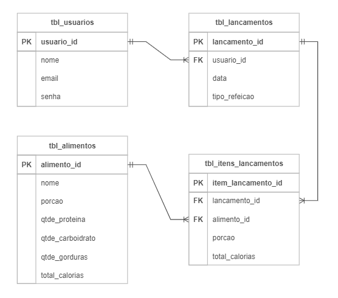

<div align="center">
<a href="https://github.com/monicaquintal" target="_blank"></a>
<h1>FASE 3 - FRAMEWORKS JAVA</h1>
<h2>Capítulo 03: O REST com Spring Boot<./h2>
</div>

<div align="center">
<h2>1. O REST COM SPRING BOOT</h2> 
</div>

- `webservice` (serviço web):
  - utiliza um conjunto de protocolos e padrões que permitem a comunicação entre diversos sistemas distribuídos através de uma rede local ou Internet, de modo que um sistema possa realizar uma chamada para outro sistema.
  - nessa arquitetura é possível que diversos sistemas se comuniquem trocando dados entre si, além de compartilhar funcionalidades relacionadas às regras de negócios e persistência de dados, não importando em quais linguagens foram desenvolvidos, pois a comunicação ocorre através da transferência de textos que utilizam padrões bem definidos.
- para construção de um Webservice utilizamos a `arquitetura cliente-servidor`, onde o servidor é responsável por toda lógica que envolve a persistência de dados e regras de negócio. Por outro lado, o cliente é responsável por enviar ou recuperar os dados que são gerados pelo servidor e exibi-los da forma como seja necessário.
- o protocolo utilizado para a transferência de dados entre o cliente e o servidor se dá através do `protocolo HTTP/HTTPS`, que é bastante simples e disponível para qualquer dispositivo conectado a uma rede.

## 1.1 Application Program Interface - API

- para que a comunicação possa ocorrer entre o cliente e o servidor é necessário a ***implementação das APIs***, que definem os métodos e formatos da comunicação que utilizamos para permitir a interação entre as aplicações cliente e as aplicações servidoras. 
- é como se fosse uma ponte ou uma interface utilizada para conectar diferentes aplicações sem que os detalhes internos das implementações sejam expostos. 
- exemplo: quando efetuamosuma compra com cartão de crédito/débito, a aplicação da loja envia os dados do cartão do cliente utilizando uma API disponibilizada pela empresa de pagamento.
- são responsáveis por disponibilizar as operações no servidor através dos `endpoints` (portas de entrada e saída para acessar os diferentes recursos disponibilizados pelo webservice). 
  - exemplo: uma API pode disponibilizar um endpoint responsável por efetuar o cadastro de um novo cliente e outro endpoint responsável por recuperar a lista de clientes da loja.
  - endpoints são acessados através de uma URL.
- através do uso das APIs garantimos a reutilização de código, comunicação entre aplicações de terceiros, autenticação e autorização, definição do formato dos dados que serão trocados entre cliente e servidor e muito mais.

## 1.2 Arquitetura REST (Representational State Transfer ou Transferência de Estado Representacional)

- é um estilo de desenvolvimento de software.
- proposto em 2000 por Roy Fielding em sua tese de doutorado.
- neste modelo arquitetural, ***busca-se o desenvolvimento de aplicações utilizando padrões que facilitem a comunicação entre sistemas utilizando-se, fundamentalmente, dos protocolos já existentes na web, especialmente o protocolo HTTP que aproveita os verbos ou métodos HTTP para identificar o tipo de operação que se deseja realizar***.
- utiliza o modelo cliente-servidor, para que as responsabilidades entre interface do usuário e regras de negócio fiquem bem definidas.
- nesta arquitetura, o cliente realiza uma chamada para um recurso no servidor através de uma URL que contém o protocolo HTTP, o verbo que identifica a operação a ser realizada e o recurso que deve ser acessado. O servidor processa a requisição e devolve uma resposta com o volume de dados, geralmente em `formato JSON`. O cliente define qual será a melhor estratégia para exibir os dados na interface gráfica.

### 1.2.1 Modelo de Maturidade de Richardson
- para que uma API seja considerada REST, é necessário que atenda algumas regras (que nem sempre são seguidas).
- em 2008, Leonard Richardson notou que havia uma falta de padronização na forma como os desenvolvedores implementavam o REST e propôs um modelo de maturidade que categoriza as APIs REST em quatro (4) níveis:
  - `Nível 0`: conhecido como ***o Pântano de XML*** (Extensible Markup Language). Neste nível, o desenvolvedor não utiliza os verbos HTTP corretamente, assim como tornar apenas um endpoint responsável por várias funcionalidades, como inserir e consultar alunos. Geralmente utiliza XML para representar os objetos.
  - `Nível 1`: conhecido como ***Recursos***, onde busca-se a utilização de um endpoint para cada funcionalidade, mas ainda não se aplicam os verbos HTTP corretamente. Geralmente são utilizados apenas os verbos GET e POST.
  - `Nível 2`: chamado de ***Verbos HTTP***, pois considera o uso eficiente dos endpoints (nível 1) e dos verbos HTTP (nível 2). Neste nível também se considera o retorno correto dos status codes de cada endpoint.
  - `Nível 3`: conhecido como ***Controle de Hipermídia***, além de aplicar o nível 1 e 2, haverá algo novo, que fornece aos clientes os links para a navegação entre os recursos da API. Por exemplo, em uma consulta com paginação, o resultado atual poderá conter o link para as páginas anterior e seguinte, além de dados como quantidade de páginas, recursos etc.
  
> Se chegarmos à implementação do nível 3 de maturidade de Richardson, teremos uma API RESTful, ou seja, que implementa todas as regras e boas práticas na construção de uma API!

### 1.2.2 Protocolo HTTP (Hypertext Transfer Protocol)
- é um dos principais pilares da arquitetura REST.
- é através deste protocolo que o REST implementa todos os princípios de comunicação entre sistemas distribuídos.
- define a maneira como as mensagens são trocadas entre cliente e servidor na web: permite acessarmos todos os recursos disponibilizados pelos servidores por meio dos navegadores web, que são os clientes.
- através do protocolo HTTP podemos transferir documentos hipermídia como páginas HTML, imagens, vídeos, dentre outros. Esses documentos são chamados de `recursos`.
- ***servidores HTTP mais conhecidos***: Apache, TomCat, Nginx, Microsoft IIS (Internet Information Services), etc. 
- ***clientes mais conhecidos***: Google Chrome, Firefox, Safari, etc.

### 1.2.3 Verbos HTTP (ou métodos HTTP)
- utilizados para identificar o tipo de ação que desejamos efetuar no servidor, que pode ser a recuperação, o envio ou até mesmo a remoção de um recurso do servidor. 
- verbos HTTP mais utilizados:
  - `GET`: solicita um recurso ao servidor, que pode ser um arquivo HTML, uma imagem, um vídeo, dentre outros.
  - `POST`: responsável por enviar dados ao servidor.
  - `PUT`: utilizado para atualizar um recurso existente no servidor.
  - `DELETE`: solicita a exclusão de um recurso no servidor.

## 1.3 Cabeçalhos HTTP (ou headers)

- utilizados para fornecer informações adicionais sobre as requisições ou respostas HTTP.
- incluem informações sobre o tipo de conteúdo que está sendo transferido, a URL que foi utilizada na requisição, o endereço IP do servidor, o tamanho da resposta em bytes, dentre outras informações. 
- exemplos de headers que podem ser encontrados na resposta ou requisição HTTP:
  - `Accept`: anuncia quais os tipos de conteúdo o cliente é capaz de entender.
  - `Content-Type`: utilizado para indicar ao cliente o tipo de recurso que foi devolvido na resposta HTTP.
  - `Location`: indica a URL para a qual a página deve ser redirecionada. Quando trabalhamos com REST este header indica a URL para o recurso que foi criado no servidor.
  - `Authorization`: usado para informar as credenciais de acesso quando acessamos recursos que exigem autorização para acesso.

> Lista completa de headers disponíveis [aqui](https://developer.mozilla.org/pt-BR/docs/Web/HTTP/Headers/Accept).

## 1.4 Códigos de Status HTTP

- quando realizamos uma requisição a um servidor HTTP recebemos, além dos dados propriamente ditos, um código que informa o resultado de uma solicitação (se foi bem-sucedida ou não). 
- o “status code” fornece informações sobre como a conexão se comportou desde o cliente até o servidor. 
- ***códigos mais comuns***:
  - `200 (OK)`: indica que a requisição foi atendida com sucesso.
  - `201 (CREATED)`: o objeto ou recurso enviado ao servidor foi criado com sucesso.
  - `204 (NO CONTENT)`: não há conteúdo para enviar para esta solicitação.
  - `400 (BAD REQUEST)`: ocorreu um erro na requisição.
  - `404 (NOT FOUND)`: o recurso solicitadonão foi encontrado no servidor.
  - `500 (INTERNAL SERVER ERROR)`: indica que ocorreu um erro no servidor.

> Lista completa de códigos de status HTTP [aqui](https://developer.mozilla.org/pt-BR/docs/Web/HTTP/Status).

### 1.4.1 Recursos na web
- o recurso é o alvo de uma requisição HTTP, que pode ser um documento HTML, uma foto, um áudio ou qualquer outra coisa. 
- cada recurso é identificado por um `URI (Uniform Resource Identifier)`, identificador uniforme de recurso.
- para localizarmos um recurso na web utilizamos a `URL (Uniform Resource Locator)`, um tipo de URI.
  - URLs também são conhecidas como endereços de web. 
  - exemplos: 
    - https://fiap.com.br
    - https://fiap.com.br/alunos
    - https://fiap.com.br:8080/api/alunos?rm=111
- ao avaliarmos uma URL, notamos que possui diferentes partes que diz como o recurso deve ser acessado.
  - exemplo: https://www.fiap.com.br:8080/api/alunos?nome=ana$turma=dev3
    - `https://`: Protocolo.
    - `www.fiap.com.br`: nome do domínio.
    - `:8080`: porta.
    - `/api/alunos`: caminho para o recurso.
    - `?nome=ana$turma=dev3`: parâmetros.

### 1.4.2 Semântica da URL REST
- para entender a estrutura dos endereços utilizados em uma aplicação que utiliza o padrão REST, usaremos como exemplo uma aplicação para gestão de alunos que possui 4 endpoints: cadastrar, consultar, excluir e atualizar. 
- a chamada para cada um dos endpoints sugeridos deverão seguir a seguinte estrutura: Método, protocolo, caminho para o recurso.

<div align="center">

Endpoint | Método HTTP | Protocolo | URL para o recurso
---------|-------------|-----------|---------------------
Cadastrar | POST | HTTP/HTTPS | www.fiap.com.br:8080/api/alunos
Consultar | GET | HTTP/HTTPS | www.fiap.com.br:8080/api/alunos
Excluir | DELETE | HTTP/HTTPS | www.fiap.com.br:8080/api/alunos/100
Atualizar | UPDATE | HTTP/HTTPS | www.fiap.com.br:8080/api/alunos

</div>

- na tabela acima, temos as chamadas:
  - método “Cadastrar” utiliza o método HTTP POST, já que queremos enviar os dados do aluno para ser cadastrado no banco de dados da aplicação.
  - método “Consultar” utiliza o método HTTP GET, já que queremos “pegar” a lista de alunos cadastrados no banco de dados da aplicação.
  - método “Excluir” utiliza o método HTTP DELETE, pois queremos excluir um aluno no banco de dados. No exemplo acima, informamos o valor 100,que é o código do aluno que deverá ser removido do banco de dados.
  - método “Atualizar” utiliza o método HTTP UPDATE, pois queremos atualizar o registro de um aluno no banco de dados da aplicação.

> Como o servidor sabe qual é o endpoint que queremos utilizar? Ele será escolhido de acordo com o método HTTP utilizado na chamada do recurso. 

## 1.5 Padrão JSON (JavaScript Object Notation)

- é um padrão de formatação empregado para representar dados em uma estrutura de texto. 
- atualmente é o padrão mais utilizado para o envio e recebimento de dados em webservices, pois proporciona uma alternativa eficaz para a troca de informações entre sistemas e plataformas distintas.
- com o JSON é possível representar objetos na forma de texto seguindo uma sintaxe de chave-valor bastante simples. 
- exemplo: representar um objeto “aluno” que contenha rm, nome, telefone, email, data de nascimento, aluno ativo e média geral.

~~~json
{
  "rm": "1100",
  "nome": "Maria da Silva",
  "telefone": "(11)95555-5555",
  "email": "maria@email.com",
  "dataNascimento": "1999-05-28",
  "alunoAtivo": true,
  "mediaGeral": 8.5
}
~~~

- como é possível observar, o JSON existe na forma de uma String, onde o conteúdo é delineado por chaves “{}” e cada par campo-valor é notado entre aspas duplas e separado por dois pontos. 
- é um formato flexível e compatível entre as diversas linguagens de programação e plataformas.
- para representar uma lista de alunos utilizamos a representação na forma de matriz - exemplo:

~~~json
[
    {
      "rm": "1100",
      "nome": "Maria da Silva",
      "telefone": "(11)95555-5555",
      "email": "maria@email.com",
      "dataNascimento": "1999-05-28",
      "alunoAtivo": true,
      "mediaGeral": 8.5
    },
    {
      "rm": "2200",
      "nome": "Paulo Roberto",
      "telefone": "(11)95555-1111",
      "email": "paulo.roberto@email.com",
      "dataNascimento": "1987-09-12",
      "alunoAtivo": false,
      "mediaGeral": 6.7
    },
    {
      "rm": "3300",
      "nome": "Ana Gomes",
      "telefone": "(11)95555-2222",
      "email": "ana.gomes@email.com",
      "dataNascimento": "2004-11-03",
      "alunoAtivo": true,
      "mediaGeral": 10.0
    }
  ]
~~~

## 1.6 Framework Spring Boot

### 1.6.1 Spring Framework:
- lançado em 2003 por Rod Johnson.
- fornece uma série de ferramentas que simplificam o desenvolvimento,promovem a aplicação de boas práticas e facilitam a modularização e escalabilidade das aplicações.
- características:
  - 1. `Injeção de dependência ou IoC (Inversion of Control)`: onde um objeto recebe a instância de outra classe que ele depende para realizar alguma tarefa específica, facilitando a reutilização de código, testes unitários e manutenção.
  - 2. `Modularização`: o ecossistema Spring é composto por vários módulos que podem ser usados de acordo com as necessidades de desenvolvimento. Os módulos mais utilizados são:
    - a. ***Spring Data***: responsável pela persistência de dados através do uso da especificação JPA.
    - b. ***Spring Web***: responsável pelo gerenciamento de requisições web.
    - c. ***Spring Security***: responsável pela autenticação e autorização.
    - d. ***Spring MVC***: oferece a arquitetura para o desenvolvimento de aplicações web baseados no padrão Model-View-Controller.
    - e. ***Spring Cloud***: fornece um conjunto de ferramentas e bibliotecas para o desenvolvimento de aplicações utilizando a arquitetura de microsserviços.

### 1.6.2 Spring Boot:
- desenvolver aplicações utilizando esse ecossistema pode ser um tanto complexo, por conta da variedade de recursos e configurações necessárias para o funcionamento da estrutura. 
- assim, foi criado dentro da família Spring Framework o projeto Spring Boot.
- tem como objetivo facilitar e agilizar o desenvolvimento de aplicações Java baseados na webe de microsserviços por meio do desenvolvimento opinativo, onde já são fornecidas as configurações e padrões de projeto predefinidos e seguindo as boas práticas.
- portanto, Spring Boot é uma ferramenta que reduz o trabalho com configuração, fornecendo configurações automáticas que permitem ao desenvolvedor iniciar o projeto rapidamente e seguindo as melhores práticas.

<div align="center">
<h2>2. PROJETO EXEMPLO</h2>
</div>

- desenvolvimento de uma aplicação para pessoas que desejam controlar o consumo de calorias diárias.
- especificações:

### a) Descrição:
- desenvolver a aplicação Backend de um sistema de acompanhamento e controle de consumo diário de calorias. 
- a aplicação deverá ser multiusuária.
- cada usuário poderá registrar os alimentos consumidos ao longo do dia em suas principais refeições: café da manhã, almoço, lanche da tarde e jantar.
- cada usuário poderá realizar os seguintes registros diários:
  - 1. Lançamento de Alimentos:
    - a) O usuário deve ser capaz de adicionar alimentos consumidos durante o dia, especificando a refeição correspondente (café da manhã, almoço, lanche da tarde, jantar).
    - b) Se o alimento não estiver cadastrado no sistema, o usuário deve ter a opção de cadastrá-lo, informando as quantidades de carboidratos, gorduras totais e proteínas por 100 gramas.
  - 2. Histórico de Pesagem:
    - a) O sistema deve permitir que o usuário registre sua pesagem, incluindo o peso, a data da pesagem e o Índice de Massa Corporal (IMC) calculado com base nesses dados.
    - b) O histórico de pesagem será mantido para que o usuário possa acompanhar seu progresso ao longo do tempo

### b) Requisitos Técnicos:
  - 1. A aplicação deverá ser desenvolvida utilizando o framework Spring Boot.
  - 2. Para armazenar informações, como alimentos, registros diários de consumo e histórico de pesagem, será utilizado banco de dados Oracle Database.
  - 3. Desenvolva APIs para permitir o cadastro de alimentos, lançamentos diários e registros de pesagem.
  - 4. Forneça endpoints para recuperar dados históricos, permitindo que os usuários visualizem seus registros anteriores.

### c) Diagrama lógico do banco de dados:

<div align="center">
<br>
<em>Diagrama lógico do banco de dados.</em><br>
</div>

## 2.1 Criação de um projeto com Spring Boot

- para facilitar a criação de um projeto Spring Boot, a equipe do Projeto Spring criou uma ferramenta chamada `Spring Initializr`, que fornece uma interface web bastante simples para criação de projetos Spring Boot de maneira rápida e atendendo as boas práticas. 
- os projetos criados no Spring Initializr podem ser importados para as principais IDEs Java, como Eclipse ou IntelliJ.

> Para começar a criação do projeto, abrir o [Spring Initializr](https://start.spring.io/).

- detalhes importantes: 
  - ***Ferramenta de build***: usaremos o Maven, que será responsável por gerenciar as dependências do projeto e outros detalhes sobre a construção do projeto.
  - ***Versão do Spring Boot***: durante a produção do material, a versão estável do Spring Boot é a 3.2.1. As versões que apresentam a palavra “SNAPSHOT” ainda estão em desenvolvimento.
  - ***Group***: usado para identificar exclusivamente o projeto, portanto, deve-se utilizar o domínio reverso da organização, que no nosso caso é a FIAP. Usaremos o grupo ***br.com.fiap***.
  - ***Artifact***: definir o nome do projeto, que será "calorias".
  - ***Packaging***: define como o projeto será empacotado para deploy. A opção “jar” gera um arquivo compactado com todas as classes do projeto. A opção “war”, é utilizada para o deployda aplicação em um container web. As aplicações com Spring Boot, possuem o container web Tomcat embarcado, então a escolha aqui será “jar”.
  - ***Versão do Java***: dependendo da versão, recursos do Java podem ou não estar disponíveis. É uma boa prática utilizar uma versão LTS(Long Term Support). No momento de construção desse material a [versão 21](https://download.oracle.com/java/21/latest/jdk-21_windows-x64_bin.exe) é a mais atual. Certifique-se de que o Java Development Kit (JDK)esteja instalado no seu PC.

- antes de finalizar, é necessário adicionar as dependências do projeto. 
- estamos criando uma aplicação Backend web com arquitetura REST e que disponibilizará endpoints que serão acessados pelos clientes da API, então precisaremos da biblioteca Spring Web, que possui todos os recursos necessários para implementação de aplicações RESTful com arquitetura MVC através do Spring MVC, além de fornecer ocontainer Tomcat que será responsável por efetuar as requisições e respostar HTTP da aplicação.

- Passos para `adicionar as dependências do projeto`:
  - 1. Clique no botão “ADD DEPENDENCIES...”, no lado superior direito da tela.
  - 2. Digite a palavra “web” no campo de busca no menu suspenso que será aberto. Segure a tecla CTRL enquanto clica na opção “Spring Web”.
  - 3. Digite no campo de busca de dependências a palavra “dev” e clique na opção “Spring Boot DevTools”.
    - o Spring Boot DevTools implementa algumas funcionalidades úteis ao desenvolvedor, como o “LiveReload”, que efetua a reinicialização da aplicação sempre que alguma alteração efetuada no código for gravada.
  - 4. Clique fora do menu suspenso, e retornará à tela principal do Spring Initializr.

- gerar o arquivo do projeto, que consiste em um arquivo compactado com todas as configurações do projeto: clicar no botão “GENERATE” na parte inferior da tela.

<div align="center">
<h2>3. IMPORTANDO O PROJETO PARA A IDE</h2>
</div>

- para abrir o projeto gerado no Spring Initializr, executar os passos:
  - 1. Descompacte o arquivo calorias.zip. 
  - 2. Com o projeto descompactado, abra o IntelliJ e clique no botão “Open”.
  - 3. Na janela "Open File ou Project", navegar até o local onde o projeto foi descompactado, selecionar a pasta do projeto e clicar no botão OK.
  - 4. Se surgir uma caixa de diálogo perguntando se devemos confiar no projeto que está sendo aberto, clicar no botão "Trust Project".
  - 5. Aguarde um momento até que o projeto seja aberto e configurado.

## 3.1 Arquivo pom.xml

- o arquivo “pom.xml” desempenha um papel fundamental quando utilizamos o Maven como Build Tool.
- é ***responsável pela configuração e construção do projeto***. 

	- principais funções do arquivo pom.xml:

- a) `Definição do projeto`: responsável pela definição das informações básicas do projeto, como “GroupId”, “ArtifactId”, que é o nome do projeto e a versão. 

```xml
<groupId>br.com.fiap</groupId>
<artifactId>calorias</artifactId>
<version>0.0.1-SNAPSHOT</version>
<name>calorias</name>
<description>Projeto exemplo para o curso de Spring Boot -FIAP</description>
```

- b) `Dependências`: no arquivo pom.xml definimos as dependências do projeto, ou seja, informamos quais bibliotecas o projeto deverá utilizar para implementar as suas funcionalidades. De acordo com as configurações definidas no bloco &lt;dependencies&gt; que o Maven efetuará os downloads necessários.

```xml
<dependencies>
    <dependency>
       <groupId>org.springframework.boot</groupId>
       <artifactId>spring-boot-starter-web</artifactId>
    </dependency>
    <dependency>
       <groupId>org.springframework.boot</groupId>
       <artifactId>spring-boot-devtools</artifactId>
       <scope>runtime</scope>
       <optional>true</optional>
    </dependency>
    <dependency>
       <groupId>org.springframework.boot</groupId>
       <artifactId>spring-boot-starter-test</artifactId>
       <scope>test</scope>
    </dependency>
</dependencies>
```

- c) `Gerenciamento de versões`:  tanto do Java quanto do próprio Spring Boot.

~~~xml
<parent>
    <groupId>org.springframework.boot</groupId>
    <artifactId>spring-boot-starter-parent</artifactId>
    <version>3.2.1</version>
    <relativePath/> <!-- lookup parent from repository -->
</parent>
<properties>
    <java.version>21</java.version>
</properties>
~~~

## 3.2 SpringApplication.run()

- assim como uma aplicação Java convencional, a aplicação Spring Boot será executada a partir de uma classe que possua o método main.
- porém, a main terá com uma configuração especial: `anotação @SpringBootApplication`:
	- responsável por disparar as configurações automáticas do Spring Boot, incluindo a varredura de componentes e configuração do Spring MVC.
	- também informa que essa é a classe principal e que deve ser usada como ponto de entrada para iniciar a aplicação.
- o `método main()` é responsável pela chamada ao `método estático run()` da classe SpringApplication; suas principais responsabilidades são:
	- a) Iniciar o contexto da aplicação Spring, ativando as configurações do Spring Boot automaticamente.
	- b) Iniciar o servidor web Tomcat que está embarcado no projeto, não sendo necessário instalação e configuração de um servidor de aplicações externo (nesse caso, o Tomcat é incorporado como um contêiner servlet embutido).
	- c) Executar tarefas de inicialização da aplicação verificando as propriedades configuradas no arquivo application.properties.
	- d) Tratar os argumentos fornecidos no momento de inicialização da aplicação que foram fornecidas ao parâmetro args.
- o estado inicial do arquivo CaloriasApplication deverá se parecer com:

~~~java
package br.com.fiap.calorias;

import org.springframework.boot.SpringApplication;
import org.springframework.boot.autoconfigure.SpringBootApplication;

@SpringBootApplication
public class CaloriasApplication {
	public static void main(String[] args) {
	SpringApplication.run(CaloriasApplication.class, args)
	}
}
~~~

## 3.3 Executando uma aplicação Spring Boot

- executar a aplicação clicando no botão Run.
- se tudo estiver configurado corretamente, deverá aparecer o log de execução do aplicativo (indicando que o container web do Tomcat foi inicializado na porta 8080).

## 3.4 Acessando a aplicação pela primeira vez

- o log de execução da aplicação mostra que o serviço foi iniciado na porta 8080, e que o protocolo disponível é o HTTP. 
- para acessar o serviço, abrir um navegador web qualquer e digitar o endereço: `http://localhost:8080`.
- Apesar de recebermos uma mensagem de erro, temos a confirmação de que a aplicação está no ar e recebendo requisições.
- a mensagem apenas informa que o recurso não foi encontrado, evidenciado pelo "status code 404".
- para parar a execução da aplicação, clicar no botão “Stop”, ao lado direito do botão “Run”.

> O link do projeto implementado até aqui pode ser obtido no GitHub através [deste link](https://github.com/FIAP/ON_TDS_JAVA_ADVANCED_SPRING_BOOT/tree/config).

### 3.4.1 Criando o primeiro Controller

- a aplicação está no ar, mas não há nada para ser acessado.
- portanto, vamos criar o primeiro endpoint no Spring Boot;
- mas antes algumas explicações importantes:

### 3.4.2 O que é um Controller na arquitetura REST?

- quando fizemos o primeiro teste na aplicação, recebemos como resposta o Status Code HTTP 404, informando que o recurso não foi encontrado.
- portanto, será necessário criar um recurso na aplicação responsável por receber as requisições HTTP e que saiba como tratá-las: estamos falando dos `endpoints`!
- endpoints são funcionalidades ou métodos implementados em classes que desempenham o papel de "Controllers" (controladores) em uma aplicação Spring Boot. 
- os controladores são responsáveis por gerenciar o fluxo de requisições HTTP, atuando como intermediários entre as solicitações dos clientes e a lógica de negócios da aplicação (assim como os Servlets faziam).
- quando uma requisição HTTP é feita, o controlador recebe essa requisição e a encaminha para o método específico que deverá processá-la. 
	- a escolha do método é feita com base na URL fornecida pelo cliente durante a requisição. 
	- exemplo: considere uma classe ClienteController, que implementa funções para cadastrar, consultar e excluir um cliente em uma aplicação executando no endereço http://localhost na porta 8080.
		- para acessar o endpoint de consulta, utilizar a URL http://localhost:8080/api/clientes , em que:
			- http: é o protocolo de comunicação HTTP.
			- localhost: nome do servidor onde a aplicação está em execução (poderia ser o endereço IP do servidor).
			- 8080: porta do container web que está hospedando a aplicação.
			- api: caminho (path) onde o recurso está localizado.
			- clientes: endpoint específico que desejamos executar.
		- portanto, ao acessar a URL completa "http://localhost:8080/api/clientes", a solicitação é direcionada ao método correspondente no "ClienteController", permitindo a execução da funcionalidade de consulta de clientes na aplicação. 
		- essa estrutura facilita a organização e a exposição controlada de funcionalidades da aplicação por meio de uma API HTTP.

### 3.4.3 Criação do primeiro endpoint

- para criarmos nosso primeiro endpoint, é necessário criarmos uma classe com o papel de Controller , e para manter nosso projeto organizado vamos criar um package que manterá todas as classes Controller da aplicação.
	- src> main> java > br.com.fiap.calorias > controller.
- criar a classe HelloWorldController no pacote controller que acabamos de criar. 
- escrever o método que será o endpoint responsável por devolver aos clientes a mensagem "Hello World Spring Boot":

~~~java
package br.com.fiap.calorias.controller;

public class HelloWorldController {

    public String getHelloWorld(){
        return "Hello World Spring Boot";
    }

}
~~~

## 3.5 Mapeando o Controller

- a classe HelloWorldController, da forma como está agora não é reconhecida pelo Spring Boot como sendo um controlador.
- será necessário efetuarmos algumas configurações para que tenhamos o primeiro controlador da nossa aplicação.
- as configurações serão efetuadas através de anotações com as responsabilidades:
	- indicar que a classe é um controlador. 
	- associar a classe a uma URL.
	- indicar os métodos que serão utilizados como endpoints do controlador e respectivas URLs de acesso.
- com as devidas anotações, a classe HelloWorldController deverá se parecer com:

~~~java
package br.com.fiap.calorias.controller;

import org.springframework.web.bind.annotation.GetMapping;
import org.springframework.web.bind.annotation.RequestMapping;
import org.springframework.web.bind.annotation.RestController;

@RestController
@RequestMapping("/api")
public class HelloWorldController {

    @GetMapping
    public String getHelloWorld(){
        return "Hello World! Spring Boot";
    }

}
~~~

- sendo: 
	- Linha 7: anotação @RestController marca a classe como sendo um controlador.
	- Linha 8: informamos qual será a URL para alcançarmos o controlador. Neste caso, lembre-se que a URL base para acessar a aplicação é http://localhost:8080. Então, ao utilizarmos a anotação @RequestMapping(“/api”), estamos adicionando à URL base a parte do endereço que resta para acessarmos o controlador HelloWorldController.
	- Linha 11: a anotação @GetMapping está mapeando o acesso ao método
getHelloWorld() a partir de uma requisição do tipo HTTP/GET.
- ao finalizar as configurações, reinicializar a aplicação para que as mudanças sejam efetuadas. Se tudo estiver correto, utilize um navegador web qualquer para acessar o endpoint.
- ao informar o endereço da aplicação ao navegador, ele executa uma requisição ao servidor no endereço informado. Como estamos utilizando um navegador web, o tipo da requisição HTTP será do tipo GET , então, ao acessarmos o controlador este direcionará a solicitação ao método anotado com @GetMapping. 
- mas e se tivermos outros métodos? Como o Spring Boot sabe para qual método ele deve direcionar a solicitação?
	- ***acrescentar à anotação @RequestMapping a parte da URL que será utilizada para acessar o endpoint específico***. 	
  - exemplo: na API temos apenas um endpoint que retorna a mensagem em inglês, mas e se quisermos uma API que retorne a mensagem em português?
    - acrescentar o método responsável por criar a mensagem em português e informar para a anotação @GetMapping a parte da URL específica para o método.

~~~java
package br.com.fiap.calorias.controller;

import org.springframework.web.bind.annotation.GetMapping;
import org.springframework.web.bind.annotation.RequestMapping;
import org.springframework.web.bind.annotation.RestController;

@RestController
@RequestMapping("/api")
public class HelloWorldController {

    @GetMapping("/hello")
    public String getHelloWorld(){
        return "Hello World! Spring Boot";
    }

    @GetMapping("/ola")
    public String getOlaMundo(){
        return "Olá mundo! Spring Boot";
    }

}
~~~ 

- nessa versão há as alterações:
	- Linha 11: informamos que para acessar o endpoint responsável por exibir a mensagem em inglês deve-se acrescentar o nome do recurso desejado, assim a URL deverá ser: http://localhost:8080/api/hello.
	- Linhas 16 a 19: implementamos o método getOlaMundo(), responsável por retornar a mensagem em português. Para acessar este novo endpoint, devemos utilizar a URL http://localhost:8080/api/ola.

- **é importante ressaltar que o elemento crucial é o nome do mapeamento especificado na anotação @GetMapping, e não o nome do método dentro da classe controller**.
- reinicializar a aplicação para que as mudanças sejam efetuadas e fazer os testes para ambos os endpoints. 

> [Link do repositório do projeto implementado](https://github.com/FIAP/ON_TDS_JAVA_ADVANCED_SPRING_BOOT/tree/primeiro_controller).

<div align="center">
<h2>4. CRIAÇÃO DO PROJETO CALORIAS</h2>
</div>

- foco agora é efetuar o CRUD (CREATE, READ, UPDATE e DELETE ) de objetos do tipo “Usuário” no banco de dados.

## 4.1 Spring Data JPA

- ao pensar em persistência de dados em uma aplicação Java, pensamos na JDBC (Java Database Connectivity), conjunto de classes e interfaces que permitem o envio de instruções SQL para o banco de dados via Java. 
- o problema de utilizar a JDBC é que precisamos escrever todas as instruções SQL necessárias para efetuar o CRUD, além de todo o código Java necessário para que tudo funcione, tornando o trabalho 
repetitivo e verboso.
- para resolver esse problema e tornar o desenvolvimento com persistência de dados mais produtivo, foi criada a especificação JPA (Java Persistence API), é um **padrão ORM** ( Object-relational Mapping), 
que **define um conjunto de especificações para o mapeamento de objetos Java para tabelas em bancos de dados relacionais**.
- o Spring Data JPA torna mais fácil a implementação da especificação JPA através da **construção de repositório baseado em interfaces que abstraem grande parte do código necessário para a persistência de dados**: a implementação das camadas de acesso a dados tem um esforço de digitação de código muito menor.
- *alguns dos recursos fornecidos pelo Spring Data JPA*:
	- **Repositórios baseados em interfaces**:
		- fornece uma interface chamada JpaRepository, que disponibiliza a maioria dos métodos necessários para a manipulação e consulta de dados, o que elimina a necessidade da construção de instruções SQL de forma manual.
		- esses métodos são implementados automaticamente para todas as classes de entidade JPA.
	- **Métodos de consulta variados**:
		- vários métodos de consulta já estão disponíveis de forma automática.
		- porém, podemos criar consultas mais complexas através da criação de métodos na interface do repositório seguindo uma convenção de nomes bem simples.
		- também é possível criar consultas através da JPQL (Java Persistence Query Language).
	- **Suporte à paginação e ordenação**:
		- a massa de dados resultante de uma consulta a API pode ser devolvida ao cliente de forma paginada e ordenada. 
		- é muito importante para quando o volume de dados é muito grande.
	- **Auditoria**:
		- o Spring Data JPA fornece suporte a auditoria de entidades de modo a rastrear automaticamente quem e quando uma entidade foi criada ou modificada.
	- **Configuração**:
		-  é possível implementar as configurações de forma moderna através de anotações ou de forma legada utilizando XML.
		
## 4.2 Adicionando as dependências do Spring Data JPA

- devemos adicionar as dependências do framework no arquivo pom.xml. 
- abrir  o site [Spring Initializr](https://start.spring.io/), e adicionar as dependências:
	- `Validation`: 
		- é uma API de validação que permite a definição de regras de validação diretamente nas classes de modelo por meio de anotações.
		- é importante para garantir que as entidades que estão sendo persistidas no banco de dados estão sendo enviadas com os dados corretos.
	- `Oracle Driver`: é um driver JDBC que provê acesso ao banco de dados Oracle.
	- `Spring Data JPA`: tem a função de persistir dados em armazenamento SQL com JPA usando Spring Data e Hibernate.
	- `Flyway Migration`: 
		- ferramenta de migração de banco de dados que permite o gerenciamento das migrações de banco de dados de forma automatizada. 
		- permite manter o histórico de alterações no banco de dados. 
		- é a ferramenta de migração de banco de dados mais utilizada atualmente.
		- `Lombok`:
			-  é uma biblioteca Java que ajuda a ***reduzir código boilerplate*** (boilerplate se refere a partes repetitivas e de baixo valor em um código-fonte).
			- através dele, não será necessário escrevermos os métodos Getter, Setter, construtores, dentre outros. 
			- os métodos serão criados através de anotações fornecidas para as classes de modelo.

> Adicionar dependências: Validation, Oracle Driver, Spring Data JPA, Flyway Migration, Lombok.

- neste momento, não vamos gerar outro projeto. Esse procedimento foi apenas para obtermos o código XML das dependências que vamos acrescentar ao arquivo pom.xml do projeto Calorias. 
- portanto, clicar no botão EXPLORE, localizado na parte inferior da tela para vermos o código XML das dependências. 
- não precisamos de todas as configurações indicadas, selecionar apenas as dependências que adicionamos no passo anterior, e copiar para o arquivo pom.xml do nosso projeto. 

~~~xml
<?xml version="1.0" encoding="UTF-8"?>
<project xmlns="http://maven.apache.org/POM/4.0.0" xmlns:xsi="http://www.w3.org/2001/XMLSchema-instance"
    xsi:schemaLocation="http://maven.apache.org/POM/4.0.0 https://maven.apache.org/xsd/maven-4.0.0.xsd">
    <modelVersion>4.0.0</modelVersion>
    <parent>
       <groupId>org.springframework.boot</groupId>
       <artifactId>spring-boot-starter-parent</artifactId>
       <version>3.2.1</version>
       <relativePath/> <!-- lookup parent from repository -->
    </parent>
    <groupId>br.com.fiap</groupId>
    <artifactId>calorias</artifactId>
    <version>0.0.1-SNAPSHOT</version>
    <name>calorias</name>
    <description>Projeto exemplo para o curso de Spring Boot - FIAP</description>
    <properties>
       <java.version>21</java.version>
    </properties>
    <dependencies>
       <dependency>
          <groupId>org.springframework.boot</groupId>
          <artifactId>spring-boot-starter-web</artifactId>
       </dependency>

       <dependency>
          <groupId>org.springframework.boot</groupId>
          <artifactId>spring-boot-devtools</artifactId>
          <scope>runtime</scope>
          <optional>true</optional>
       </dependency>
       <dependency>
          <groupId>org.springframework.boot</groupId>
          <artifactId>spring-boot-starter-test</artifactId>
          <scope>test</scope>
       </dependency>

       <dependency>
          <groupId>org.springframework.boot</groupId>
          <artifactId>spring-boot-starter-data-jpa</artifactId>
       </dependency>
       <dependency>
          <groupId>org.springframework.boot</groupId>
          <artifactId>spring-boot-starter-validation</artifactId>
       </dependency>
       <dependency>
          <groupId>org.flywaydb</groupId>
          <artifactId>flyway-core</artifactId>
       </dependency>
       <dependency>
          <groupId>org.flywaydb</groupId>
          <artifactId>flyway-database-oracle</artifactId>
       </dependency>
       <dependency>
          <groupId>com.oracle.database.jdbc</groupId>
          <artifactId>ojdbc11</artifactId>
          <scope>runtime</scope>
       </dependency>
       <dependency>
          <groupId>org.projectlombok</groupId>
          <artifactId>lombok</artifactId>
          <optional>true</optional>
       </dependency>

    </dependencies>

    <build>
       <plugins>
          <plugin>
             <groupId>org.springframework.boot</groupId>
             <artifactId>spring-boot-maven-plugin</artifactId>
          </plugin>
       </plugins>
    </build>

</project>
~~~

- após inclusão das dependências, carregar as mudanças do Maven: clique no botão com a letra M à direita da tela, e em seguida no botão "Reload All Maven Projects".

## 4.3 Estrutura de diretórios

- em uma aplicação Spring Boot, é importante organizar os componentes do projeto de acordo com a sua função.
- começar criando a estrutura de diretórios e/ou pacotes necessários para organizar o projeto Calorias, como na figura abaixo:

<div align="center">
<br>
<em>Estrutura de diretórios do projeto Calorias.</em><br>
</div>

- a estrutura acima possui os componentes:
	- `Controller`: armazena as classes responsáveis por implementar os endpoints da aplicação.
	- `Model`: armazena as classes de modelo ou entidades JPA, como Usuário e Alimento.
	- `Repository`: neste pacote serão armazenados os repositórios Spring Data JPA. Cada entidade poderá ter um repositório associado, como “UsuarioRespository” ou “AlimentoRepository”.
	- `Service`: aqui é onde armazenaremos as classes de serviço, ou seja, aquelas que encapsulam a lógica de negócios que interagem com os repositórios. Teremos por exemplo a classe “UsuarioService” ou “AlimentoService”.
	- `Dto` (Data Transfer Object): neste pacote armazenamos as classes que criarão a representação dos dados que serão enviados aos clientes (nem sempre
queremos enviar todos os atributos de uma classe, então, a arquitetura DTO permite criar as classes com apenas os dados que desejamos trafegar entre a API e o cliente). Exemplo: classes UsuarioDTO ou AlimentoDTO.

## 4.4 Criando a primeira entidade JPA - Model

- começar a criação do projeto pela entidade “Usuario”.
- o primeiro componente que devemos criar é o modelo: criar no pacote model uma classe Java com o nome Usuario.
- após a criação da classe, adicionar seus atributos:

~~~java
package br.com.fiap.calorias.model;

public class Usuario {
    
    private Long usuarioId;
    private String nome;
    private String email;
    private String senha;

}
~~~

- para que o Spring Boot saiba que a classe Usuario será uma entidade no banco de dados, é necessário a inclusão das devidas anotações. 
- também é importante que a classe possua os métodos de acesso (getters e setters), para que o Spring Boot possa acessar os atributos que se encontram privados.

~~~java
package br.com.fiap.calorias.model;

import jakarta.persistence.*;
import lombok.*;

@Entity
@Table(name = "tbl_usuarios")
@Getter
@Setter
@NoArgsConstructor
@AllArgsConstructor
@EqualsAndHashCode
public class Usuario {

    @Id
    @GeneratedValue(
            strategy = GenerationType.SEQUENCE,
            generator = "SEQ_USUARIOS"
    )
    @SequenceGenerator(
            name = "SEQ_USUARIOS",
            sequenceName = "SEQ_USUARIOS",
            allocationSize = 50
    )
    @Column(name = "usuario_id")
    private Long usuarioId;

    private String nome;
    private String email;
    private String senha;

}
~~~

- as anotações adicionadas na classe “Usuario” possuem as seguintes funcionalidades:
	- ***Linha 6***: a anotação @Entity que faz parte da Java Persistence API (JPA), está mapeando a classe “Usuario” para uma entidade no banco de dados.
	- ***Linha 7***: a anotação @Table da JPA foi inserida para indicarmos o nome da tabela no banco de dados, a qual se chamará tbl_usuarios.
	- ***Linha 8***: a anotação @Getter, que faz parte da biblioteca Lombok, é responsável por criar os métodos get da classe Usuario.
	- ***Linha 9***: a anotação @Setter é responsável por criar os métodos set da classe Usuario.
	- ***Linha 10***: a anotação @NoArgsConstructor, do Lombok, é responsável pela criação do construtor default da classe Usuario.
	- ***Linha 11***: a anotação @AllArgsConstructor, do Lombok, é responsável pela criação de um construtor com todos os atributos da classe Usuario.
	- ***Linha 12***: a anotação @EqualsAndHashCode, também do Lombok, é responsável pela criação dos métodos equals e hashcode da classe Usuario.
	- ***Linha 15***: com a anotação @Id, da JPA, indica que o atributo usuarioId será utilizado como chave primária da tabela no banco de dados.
	- ***Linhas 16 a 19***: na anotação @GeneratedValue, da JPA, configuramos como o valor do atributo usuarioId será gerado. Nesse exemplo, no parâmetro strategy, estamos indicando que será utilizado uma sequência, já que estamos utilizando o Oracle Database. Já com o parâmetro generator, indicamos qual é o nome da sequência existente no banco de dados.
	- ***Linhas 20 a 24***: com a anotação @SequenceGenerator, da JPA, estamos configurando a forma como a sequência se comportará. O parâmetro name indica o identificador da sequência que será utilizado em nosso código, enquanto o parâmetro sequenceName corresponde ao nome real da sequência no banco de dados. O parâmetro ***allocationSize*** é utilizado para fazer um cache de sequências, que está definido para 50. Esse parâmetro é importante para otimizar o desempenho e minimizar a necessidade de acessos constantes à sequência durante a persistência de dados.
	- ***Linha 25***: através da anotação @Column, da JPA, estamos personalizando o nome do campo na tabela no banco de dados através do parâmetro “name”. Se essa informação for omitida o nome do campo será igual ao utilizado para o atributo na classe.

> `ATENÇÃO`: No IntelliJ é necessário ativar o Processamento de anotações, de
modo que o Lombok funcione corretamente. Se você vir a mensagem de solicitação do Lombok, clicar no botão "Enable Annotation Processing".

## 4.5 Criando o primeiro repositório – Repository

- anteriormente, utilizamos o padrão DAO (Data Access Object) para acessar os dados no banco de dados. No entanto, o Spring Boot e o Spring Data JPA utilizam uma abordagem diferente, adotando um padrão chamado **Repository**.
- um Repository no Spring Boot é uma interface que estende a interface JpaRepository do Spring Data JPA, que fornece todas as operações comuns para persistência de dados em um banco de dados - CRUD (CREATE, READ, UPDATE e DELETE), as quais serão executadas sem que o desenvolvedor precise escrever instruções SQL manualmente. 
- além disso, é possível criar consultas customizadas através de convenções de nomenclatura baseadas no nome do método em conjunto com os nomes dos atributos da classe modelo. 

- no pacote repository do projeto Calorias, criar uma interface com o nome UsuarioRepository, seguindo os passos:
  - 1. Clique com o botão direito no pacote repository, aponte para New e em seguida clique em Java Class.
  - 2. Na caixa de diálogo New Java Class, digite UsuarioRepository no campo name, selecione a opção Interface e pressione Enter.
  - 3. Estender a interface JpaRepository; deste modo, a classe herdará todos os métodos CRUD existentes na interface JpaRepository do Spring Data JPA.

~~~java
package br.com.fiap.calorias.repository;

import br.com.fiap.calorias.model.Usuario;
import org.springframework.data.jpa.repository.JpaRepository;

public interface UsuarioRepository extends JpaRepository<Usuario, Long> {

}
~~~

- a interface JpaRepository é um ***genérico***: ela sabe trabalhar com diferentes tipos dados, então poderemos utilizar essa interface para persistir diferentes tipos de objetos. 
- no exemplo persistiremos objetos do tipo Usuario: a interface UsuarioRepository estende a interface JpaRepository, que foi parametrizada com a classe de entidade Usuario e o tipo de chave primária “Long”. 
  - a tipagem do parâmetro da chave primária deve ser o mesmo tipo que definimos para o atributo anotado com @Id na classe de entidade.
- ***função de cada parâmetro fornecido nos colchetes angulares da interface JpaRepository***:
  - `public interface UsuarioRepository`: estamos criando uma interface pública chamada UsuarioRepository.
  - `extends`: indica a herança.
  - `JpaRepository`: interface que está sendo herdada.
  - `<Uasuario, `: tipo de objeto que será manipulado.
  - `Long>`: mesmo tipo do atributo anotado com @Id na classe modelo.

> Nesse momento, toda implementação do CRUD já está feita. Agora, vamos aprender como consumir esses métodos.

## 4.6 Criando o primeiro serviço – Service

- implementar a classe de serviço, responsável por consumir os métodos expostos pela interface JpaRepository.
- criar uma classe Java no pacote service” com o nome `UsuarioService`.
- implementar as operações do CRUD:

~~~java
package br.com.fiap.calorias.service;

import br.com.fiap.calorias.model.Usuario;
import br.com.fiap.calorias.repository.UsuarioRepository;
import org.springframework.beans.factory.annotation.Autowired;
import org.springframework.stereotype.Service;

import java.util.List;
import java.util.Optional;

@Service
public class UsuarioService {

    @Autowired
    private UsuarioRepository usuarioRepository;

    public Usuario salvarUsuario(Usuario usuario){
        return usuarioRepository.save(usuario);
    }

    public Usuario buscarPorId(Long id){
        Optional<Usuario> usuarioOptional =
            usuarioRepository.findById(id);
    
        if (usuarioOptional.isPresent()){
            return usuarioOptional.get();
        } else {
            throw new RuntimeException("Usuário não existe!");
        }
    }

    public List<Usuario> listarTodos(){
        return usuarioRepository.findAll();
    }

    public void excluir(Long id){
        Optional<Usuario> usuarioOptional = 
            usuarioRepository.findById(id);

        if (usuarioOptional.isPresent()){
            usuarioRepository.delete(usuarioOptional.get());
        } else {
            throw new RuntimeException("Usuário não encontrado!");
        }
    }

    public Usuario atualizar(Usuario usuario){
        Optional<Usuario> usuarioOptional = 
            usuarioRepository.findById(usuario.getUsuarioId());
        
        if (usuarioOptional.isPresent()){
            return usuarioRepository.save(usuario);
        } else {
            throw new RuntimeException("Usuário não encontrado!");
        }
    }

}
~~~

- ***implementações***:
  - `Linha 11`: 
    - a anotação **@Service** na assinatura da classe faz com que ela se torne um componente gerenciado pelo Spring. 
    - classes anotadas com @Service são identificadas automaticamente pelo Spring e podem ser injetadas como dependência em outras classes.
    - essa anotação também garante a semântica da arquitetura utilizada, indicando que ela é um serviço, ou seja, será consumida por outros objetos.
  - `Linhas 14 e 15`: 
    - criação de uma propriedade da classe chamada de usuarioRepository, do tipo UsuarioRepository. 
    - essa propriedade será utilizada pelo service para obter acesso a camada de dados da aplicação. 
    - a **anotação @Autowired** indica que este atributo será injetado de forma automática em nosso service, sem a necessidade de implementarmos todos os passos de instanciação de um objeto, já que o Spring fará isso automaticamente.
  - `Linhas 17 a 19`: 
    - aqui estamos implementando o **método salvar()**, responsável por gravar um usuário novo no banco de dados através do **método save()** do repositório.
    - o método save() retorna à aplicação com o objeto que foi gravado, incluindo o identificador único que foi criado na tabela.
    - este método retorna um objeto Usuario para o método que o chamou.
  - `Linhas 21 a 30`: 
    - o **método buscarPorId()** foi construído para buscar um usuário a partir do seu identificador (usuarioId). 
    - o **método findById()** do repositório retorna um objeto do tipo "Optional&lt;Usuario&lt;", que é uma classe que encapsula um valor opcional, ou seja, o valor pode estar presente ou não. Isso facilita o tratamento de possíveis valores nulos. 
    - na linha 25, efetuamos um teste lógico para verificar se o usuário está presente no objeto referenciado pela variável usuarioOptional: se o resultado for true, recuperamos o objeto usuário através do método get(); se for false, lançamos uma exceção com a mensagem "Usuário não encontrado". 
    - este método retorna um objeto Usuario para o método que o chamou ou uma exceção.
  - `Linhas 32 a 34`: 
    - criação do método responsável por retornar uma lista com todos os usuários cadastrados.
    - o retorno deste método é do tipo List&lt;Usuario&gt;. 
  - `Linhas 36 a 45`: 
    - implementando o método para excluir um registro de usuário do banco de dados. 
    - o método recebe um argumento do tipo Long, que é o identificador único do usuário na tabela. 
    - devido a possibilidade de o identificador informado não existir,inicializamos um objeto do tipo Optional&lt;Usuario&gt; na linha 30,referenciado pela variável usuarioOptional - esse objeto será utilizado para armazenar o usuário encontrado na tabela, se existir.
    - na linha 40, realizamos um teste lógico através do método isPresent() para verificar se o usuário está presente no objeto referenciado pelavariável usuarioOptional: se (true), utilizamos o método delete() para efetuar a exclusão; se for (false), lançamos uma exceção que fornecerá a mensagem “Usuário não encontrado!”.
    - `Linhas 47 a 58`: 
      - o método atualizar() é responsável por atualizar os dados de um usuário no banco de dados. 
      - a operação de atualização ou update, é realizada por meio do **método save()**, que tem a capacidade de decidir se a operação a ser executadas será de inclusão ou de atualização. 
      
> Com isso, implementamos um CRUD completo sem necessidade de escrever instruções SQL manualmente.

## 4.7 Criando o controlador – Controller

- a função do controlador (Controller) é gerenciar as requisições HTTP, sendo a porta de entrada para a nossa API. 
- para possibilitar que uma aplicação cliente possa enviar ou consultar dados de usuários, será necessário a criação dos endpoints específicos para cada uma das operações que a nossa API disponibilizará. 
- portanto, vamos proceder com a criação da ***classe UsuarioController*** no pacote controller.
- em seguida, configurar o controlador de usuários com os métodos para criação, consultas, exclusão e atualização de usuários no banco de dados.

~~~java
package br.com.fiap.calorias.controller;

import br.com.fiap.calorias.model.Usuario;
import br.com.fiap.calorias.service.UsuarioService;
import org.springframework.beans.factory.annotation.Autowired;
import org.springframework.http.HttpStatus;
import org.springframework.web.bind.annotation.*;

import java.util.List;

@RestController
@RequestMapping("/api")
public class UsuarioController {

    @Autowired
    private UsuarioService usuarioService;

    @PostMapping("/usuarios")
    @ResponseStatus(HttpStatus.CREATED)
    public Usuario salvar(@RequestBody Usuario usuario){
        return usuarioService.salvarUsuario(usuario);
    }

    @GetMapping("/usuarios")
    @ResponseStatus(HttpStatus.OK)
    public List<Usuario> litarTodos(){
        return usuarioService.listarTodos();
    }
    
    @GetMapping("/usuarios/{usuarioId}")
    public Usuario buscarPorId(@PathVariable Long usuarioId){
        return usuarioService.buscarPorId(usuarioId);
    }

    @DeleteMapping("/usuarios/{usuarioId}")
    @ResponseStatus(HttpStatus.NO_CONTENT)
        public void excluir(@PathVariable Long usuarioId){
        usuarioService.excluir(usuarioId);
    }

    @PutMapping("/usuarios")
    @ResponseStatus(HttpStatus.OK)
        public Usuario atualizar(@RequestBody Usuario usuario){
        return usuarioService.atualizar(usuario);
    }

}
~~~

- implementações:
  - `Linhas 11 e 12`: 
    - a **anotação @RestController** indica ao Spring que a classe UsuarioController é uma classe controladora.
    - a **anotação @RequestMapping** indica que as requisições deverão utilizar a URL "/api" como base para a URL completa deste recurso.
  - `Linhas 15 e 16`: 
    - estamos injetando o serviço UsuarioService no controlador através da **anotação @Autowired**.
  - `Linha 18`: 
    - aqui começamos a implementação do método que será responsável por enviar um objeto usuário para a API. 
    - como estamos utilizando REST, as requisições HTTP para esse endpoint devem ser do tipo POST, por isso a **anotação PostMapping**. 
    - além disso, estamos acrescentando o parâmetro "/usuarios",que é a parte da URL que deverá ser fornecida para que a requisição chegue até este endpoint.
  - `Linha 19`: 
    - de acordo com o REST, quando um cliente faz uma requisição para uma API, o servidor deve responder com o status code que identifique o que ocorreu. 
    - a **anotação @ResponseStatus** é responsável por inserir no header da resposta HTTP o status code correto. 
    - nesse exemplo, estamos fornecendo o ***enumerador HttpStatus.CREATED*** como argumento da anotação @ResponseStatus, que retornará ao cliente o código "201 – CREATED", que indica que a requisição foi processada com sucesso e um usuário foi criado no banco de dados.
  - `Linha 20`: 
    - a partir deste ponto estamos implementando o **método salvar()**,que atuará como endpoint responsável por processar requisições para cadastrar usuários no banco de dados. 
    - ao chamar o método salvar(), é necessário fornecer um objeto Usuario por meio dos parâmetros do método. 
    - para que o Spring saiba que deve extrair o objeto do corpo da requisição HTTP, utilizamos a **anotação @RequestBody** à esquerda da declaração do parâmetro.
      - @RequestBody: anotação que infica ao Spring que o objeto em formato JSON deve ser extraído do corpo da requisição HTTP.
      - Usuario usuario: objeto JSON extraído do corpo da requisição será convertido em um objeto do tipo Usuário.
  - `Linha 21`: 
    - nesta implementação, o objeto Usuario obtido pelo service no banco de dados, será inserido no corpo na resposta HTTP, em formato JSON,juntamente com o status code “201” e devolvido ao cliente da requisição.
  - `Linhas 24 a 29`: 
    - implementando o endpoint responsável por atender as requisições para a listagem de todos os usuários do banco de dados. 
    - de acordo com o padrão REST, as consultas devem ser feitas através de requisições HTTP do tipo GET, pois são requisições interessadas em apenas pegar dados na API. A
    - a **anotação @GetMapping** informa ao Spring que este endpoint deve processar requisições do tipo GET. 
    - estamos fornecendo o ***enum HttpStatus.OK*** para a anotação @ResponseStatus, pois neste caso o status code que indica que a requisição foi processada com sucesso é "200 – OK".
  - `Linha 30`: 
    - este método está sendo implementado para permitir a busca de um usuário específico a partir do seu identificador único no banco de dados. 
    - **anotação @GetMapping** está informando ao Spring que este endpoint processa requisições HTTP do tipo GET. 
    - além disso, no argumento da anotação, estamos passando o valor "/usuarios/{usuarioId}", que indica que na URL da requisição, no lugar de "{usuarioId}", deverá ser passado o código do usuário no banco de dados. 
  - `Linha 31`: 
    - declarando o método buscarPorId(), que recebe como parâmetro um valor do tipo Long.
    - **anotação @PathVariabale** para indicar ao Spring que o valor desse argumento deverá ser extraído da variável de caminho "{usuarioId}" da URL de requisição.
  - `Linha 35`: 
    - **anotação @DeleteMapping** indica que o método será acessado através de uma requisição HTTP do tipo DELETE. 
    - recebe como parâmetro um valor inteiro que representa o identificador do usuário no banco de dados. 
    - o método de exclusão também receberá o identificador na URL da requisição. 
  - `Linha 36`:
    - por definição do REST, os métodos de exclusão devem retornar o statuscode "204 – NO CONTENT", pois o objeto foi excluído e não há o que retornar no corpo da resposta ao cliente.
  - `Linha 38`: evoca o método excluir() do service.
  - `Linha 41`: 
    - **anotação @PutMapping** indica que o método será utilizado para atualizar um registro no banco: será evocado através de uma requisição HTTP do tipo PUT.
  - `Linha 42`: 
    - definimos o status code que será enviado na resposta da requisição ao cliente. 
    - por enquanto, utilizaremos o status code "200 – OK", indicando ao cliente que a atualização do registro ocorreu com sucesso.
  - `Linha 43`: 
    - criamos o método atualizar() do controlador. 
    - receberá o objeto usuário no corpo da requisição, indicado através da **anotação @RequestBody**.
  - `Linha 44`: retorna o objeto atualizado ao cliente. 

> Com isso, finalizamos a implementação do controlador responsável pelos endpoints referentes aos usuários da API. Posteriormente novas implementações serão feitas.

## 4.8 Configuração do banco de dados

- criar a estrutura no banco de dados, como a tabela tbl_usuarios e a sequência SEQ_USUARIOS. 
- podem ser implementados diretamente no banco de dados de forma manual, mas é mais interessante fazer isso de forma automática. 
- além disso, é importante manter o histórico de alterações que são efetuadas no banco, de modo que possamos ter o controle da evolução do banco durante o ciclo de vida da aplicação.
- utilizaremos uma ferramenta bastante utilizada no ecossistema Java que é o `Flyway`, uma ferramenta de controle de versão e de migração de banco de dados.

### 4.8.1 Configuração do Flyway
- esta ferramenta funciona basicamente através da execução de `scripts SQL` diretamente no banco de dados. 
- para começar, criar o script de criação da ***tabela tbl_usuarios***, assim como a ***sequência SQ_USUARIOS***. 
- começar criando, dentro do diretório resources, um diretório onde os arquivos de scripts SQL serão armazenados.
  - 1. Clicar com o botão direito no diretório resources, aponte para New e clique em Directory.
  - 2. Na caixa de diálogo New Directory, informe o nome "db/migration".
  - 3. Pressione Enter para confirmar a criação dos diretórios.
  - 4. Para criar o arquivo com o script da estrutura inicial do banco de dados do projeto Calorias: clique com o botão direito do mouse no diretório db.migration, aponte para New e clique em File.
  - 5. Na caixa de diálogo New File, digite o nome "V1__create-table-tbl_usuarios-seq-usuarios.sql".
    - o nome do arquivo de scripts do Flyway possui um padrão de nomenclatura obrigatório, sendo: V1 (versão da migração), seguido de dois underscores, e depois o nome do arquivo com extensão .sql.
    - após execução do script, o Flyway não executará mais este script. Para efetuar alguma alteração no banco é necessário criar outro arquivo com o prefixo "V2". 
  - 6. escreva o script SQL responsável por criar a tabela e a sequência.

~~~sql
CREATE SEQUENCE SEQ_USUARIOS
  START WITH 1
  INCREMENT BY 1
  NOCACHE
  NOCYCLE;

CREATE TABLE TBL_USUARIOS (
    USUARIO_ID INTEGER DEFAULT SEQ_USUARIOS.NEXTVAL NOT NULL,
    NOME VARCHAR2(100) NOT NULL,
    EMAIL VARCHAR(100) NOT NULL,
    SENHA VARCHAR(20) NOT NULL
);
~~~

## 4.9 Configurando o application.properties

- as configurações do banco de dados serão efetuadas no arquivo application.properties, na pasta resources.
- as configurações iniciais do banco de dados exigem a configuração da URL do banco, usuário e senha.

~~~
# CONFIGURAÇÃO BÁSICA DO SPRING
spring.datasource.url=jdbc:oracle:thin:@oracle.fiap.com.br:1521:ORCL
spring.datasource.username=RM0000
spring.datasource.password=senha

# CONFIGURAÇÃO PARA O ORACLE DATABASE
# CRIAR A TABELA DE CONTROLE DE MIGRAÇÃO NO BANCO DE DADOS
spring.flyway.baselineOnMigrate=true

# MOSTRAR AS INSTRUÇÕES SQL EXECUTADAS NO BANCO DE DADOS
spring.jpa.show-sql=true

# QUEBRAR A EXIBIÇÃO DA INSTRUÇÃO SQL EM VÁRIAS LINHAS
spring.jpa.properties.hibernate.format_sql=true
~~~

- observações:
  - ***Linha 8***: informa ao Spring que o arquivo de configuração do Flyway deverá ser criado no banco de dados. Esta tabela é importante para controlar as versões dos scripts SQL que são executados no banco.Para desativar esta funcionalidade troque o valor para “false”.
  - ***Linha 11***: configura a exibição das instruções SQL que são executadas no banco de dados. É uma configuração importante durante o desenvolvimento da aplicação por questões de debug. Para desativar, trocar o valor para false.
  - ***Linha 14***: forma como as instruções SQLsão exibidas no log. Para desativar esta funcionalidade basta trocar o valor para false.

> Após a configuração do banco de dados no arquivo application.properties, executar a aplicação para testar.

- verificar se a tabela TBL_USUARIOS e a sequência SEQ_USUARIOS foram criados corretamente no banco de dados.
- logo acima da tabela TBL_USUARIOS há uma tabela chamada `flyway_schema_history`, criada pelo Flyway e responsável por armazenar os dados de migração. Essa tabela não pode ser excluída, pois o Flyway não saberá como lidar com as migrações.

> [Link do projeto implementado até aqui.](https://github.com/FIAP/ON_TDS_JAVA_ADVANCED_SPRING_BOOT/tree/main)

## 4.10 Testando o controlador de usuários

- chegou o momento mais aguardado: efetuar as requisições para a nossa API. 
- para isso, vamos precisar de uma aplicação cliente HTTP que possa efetuar requisições com os diferentes verbos HTTP (GET, POST, DELETE e UPDATE).
- as ferramentas mais utilizadas são o “Postman” e o “Insomnia”. Para esta tarefa utilizaremos o **Insomnia**. 

### 4.10.1 Instalação do Insomnia
- para fazer o download do Insomnia, utilizar [este link](https://insomnia.rest/download). 
- após efetuar o download, executar o instalador efetuando um duplo clique no arquivo executável que você acabou de baixar. 
- clique no botão Continue. Quando for solicitado se você deseja que seus projetos sejam sincronizados com a nuvem, mantenha a opção Keep storing in local Vault e em seguida clique no botão Continue.
- na tela "Welcome to Insomnia”", escolher a forma como deseja se autenticar. Clique em uma das opções e forneça os dados necessários.
- ao concluir a forma de autenticação, será redirecionado a tela do Insomnia.

<div align="center">
<h2> 5. CADASTRANDO UM USUÁRIO VIA API</h2>
</div>

- para cadastrar um usuário no banco de dados da aplicação, enviaremos os dados do usuário em formato JSON inserido no corpo (Body) de uma requisição HTTP do tipo POST. 
- com o o Insomnia aberto, siga os passos:
  - 1. Clique no botão Create New Project, situado na parte superior esquerda da tela.
  - 2. Digite o nome do projeto, selecione a opção Local Vault e clique no botão Create.
  - 3. Selecione o projeto que acabou de ser criado, no painel à esquerda, e em seguida clique em New Collection, no painel à direita.
  - 4. Na janela "Create New Request Collection", informe o nome da coleção e clique no botão Continue.
  - 5. Você será redirecionado para a coleção que acabou de ser criada.Clique no botão New Request e em seguida clique na opção HTTP Request.
  - 6. Você será direcionado a um novo painel, onde será possível indicar a URL do recurso (endpoint) que desejamos acessar e o método HTTP que desejamos executar.
  - 7. alterar o verbo HTTP para `POST` e a URL para `http://localhost:8080/api/usuarios`.
  - 8. clique na opção Body, abaixo da linha de endereço da requisição e em seguida clique em JSON.
  - 9. Insira os dados do usuário no espaço disponível logo abaixo da opção JSON.

~~~json
{
  "nome": "ANA MARIA GOMES",
  "email": "ana@email.com.br",
  "senha": "123456"
}
~~~

  - 10. Pressione o botão “Send”, à direita da linha de endereço. Se tudo estiver correto, no painel mais à direita você deverá visualizar os dados do usuário que foi inserido no banco de dados, com o identificador único, além do código de status code “201 – CREATED”.
  - 11. Abrir o Oracle SQL Developer para confirmar se o registro do usuário foi inserido na tabela TBL_USUARIOS.

- adicione mais 3 usuários trocando o corpo da requisição pelos novos dados (adicionar um de cada vez).

~~~json
{
  "nome":"PEDRO DE OLIVEIRA",
  "email":"pedro.oliveira@email.com.br",
  "senha":"abc123"
}

{
  "nome":"LUCIANA ALMEIDA",
  "email":"lu@email.com.br",
  "senha":"abc456"
} 

{
  "nome":"LUIZ PEREIRA DA SILVA",
  "email":"luiz.silva@email.com.br",
  "senha":"xpto55"
}
~~~

## 5.1 Efetuando consultas via API

- após efetivarmos o cadastro de usuários no banco de dados, é necessário a consulta. 
- em nossa API, implementamos os endpoints responsáveis por listar todos os usuários cadastrados e consultar um usuário pelo identificador.
- testar as requisições de cada um desses endpoints.

### 5.1.1 Listando todos os usuários
- utilizar o endpoint `http://localhost:8080/api/usuarios` através de uma requisição HTTP do tipo `GET`.
- siga os passos abaixo:
  - 1. Abra o Insomnia, crie uma requisição do tipo GET e a URL do recurso.
  - 2. Pressione o botão Send. O resultado esperado deverá ser um array em formato JSON com os 4 usuários cadastrados.

> `DICA`: é possível nomear cada uma das requisições HTTP efetuadas pelo Insomnia, tornando a lista mais organizada e mais fácil localizar a requisição que queremos executar. 

- para alterar o nome de uma requisição siga os passos:
  - 1. Clique no botão em forma de seta para baixo ao lado direito do nome da requisição que vamos alterar o nome, em seguida clique na opção Rename.
  - 2. Na caixa de diálogo Rename Request, escreva o nome da requisição e clique em Rename.

### 5.2 Buscando um usuário pelo Identificador

- criamos um endpoint responsável por consultar um usuário no banco de dados pelo seu identificador único.
- a URL para acessar esse recurso é `http://localhost:8080/api/usuarios/1`, onde o /1 no final da URL, é o identificador do registro de um usuário no banco de dados.
- criar uma requisição HTTP do tipo GET no Insomnia com o nome "Buscar usuário pelo ID".

### 5.2.1 Personalizando Exceções na resposta HTTP
- o que acontece se você buscar por um identificador que não existe? 
- ao tentarmos buscar um usuário de código 200, receberemos uma resposta com erro. Isso está correto, já que essa foi a implementação do endpoint de consulta de usuário por ID. 
- nesse exemplo, o status code da resposta HTTP é `500`, indicando que ocorreu um erro no servidor, mas na verdade o erro partiu do cliente, já que fizemos uma requisição inválida. 
- o correto seria termos recebido um status codeda família `400`, que indica erro de requisição do lado do cliente. 
- na requisição acima buscamos por um usuário cujo ID é 200, mas esse ID não existe no banco de dados, então, o correto seria termos recebido o status code "404 – Not Found". Deste modo a resposta passa a fazer sentido para o cliente, ou seja, o status code indica que o recurso solicitado no servidor não existe. 
- ***altere o código do método (endpoint) buscarPorId() da classe UsuarioController***:

~~~java
. . . TRECHO DE CÓDIGO OMITIDO
    
@GetMapping("/usuarios/{usuarioId}")
public ResponseEntity<Usuario> buscarPorId(@PathVariable Long usuarioId){
    try {
        return ResponseEntity.ok(usuarioService.listarPorId(usuarioId));
    } catch (Exception e){
        return ResponseEntity.notFound().build();
    }
}

. . . TRECHO DE CÓDIGO OMITIDO
~~~

- alterações:
  - `Linha 4`: 
    - modificamos o retorno do método para `ResponseEntity<>`, que pertence ao Spring, e representa toda a requisição HTTP, ou seja, cabeçalhos, corpoe status. 
    - utilizamos essa classe para personalizar as respostas HTTP ao cliente, já que temos acesso a todas as informações da requisição. 
    - essa classe é uma generic, que pode lidar com qualquer tipo de objeto. 
    - em nosso exemplo indicamos que ela é do tipo “Usuario”, através dos colchetes angulares.
  - `Linha 6`:
    - modificamos o retornodo método, para que fique de acordo com o retorno especificado pela sua assinatura. 
    - no exemplo, estamos utilizando um bloco “try/catch” para capturar a exceção caso seja lançada pelo service. Se não houver o lançamento da exceção pelo service, retornaremos uma resposta do tipo “200 – OK”, através do método “ok()” do “ResponseEntity”. 
    - o método “ok()” recebe como parâmetro o objeto “Usuario” que está sendo retornado pelo service e será incluído no corpo da resposta ao cliente.
  - `Linha 8`: 
    - caso o service lance a exceção, o bloco “catch” do tratamento de exceção será executado, retornando uma resposta do tipo “404 – Not Found”.
    - o método “notFound()” não adiciona nada ao corpo da resposta.

- reinicie a aplicação para que as alterações sejam aplicadas.
- ao tentarmos executar uma busca por um ID que não existe, receberemos uma resposta mais semântica para o cliente HTTP. 

## 5.3 Excluindo um usuário do banco de dados via API

- criar mais uma requisição HTTP do tipo DELETE no Insomnia. 
- método `DELETE`, url `http://localhost:8080/api/usuarios/5`.
- a requisição HTTP retorna o status code "204 – NO CONTENT", indicando que o objeto foi excluído.
- abrir o OracleSQL Developer para confirmar se o registro foi excluído do banco de dados.

## 5.4 Atualizando um registro de usuário no banco de dados

- consiste na alteração do valor de um ou mais campos na tabela, exceto o campo identificador.
- criar uma requisição HTTP do tipo `PUT` no Insomnia, URL `http://localhost:8080/api/usuarios`. 
- no corpo da requisição, enviar um objeto JSON com todos os campos que desejamos alterar, inclusive o identificador do registro, que será utilizado para identificar o registro no banco.

~~~json
{
	"usuarioId": "3",
	"nome": "MONICA",
	"email": "monica@email.com",
	"senha": "oioi"
}
~~~

---

## FAST TEST

### 1. De acordo com o modelo de maturidade de Richardson, quais regras devemos seguir para alcanças o nível 2 de maturidade?
> Utilização de endpoints para cada funcionalidade, uso dos verbos HTTP para cada tipo de requisição e considera o retorno correto de status code para cada requisição.

### 2. O que é um Webservice?
> É um serviço web que utiliza um conjunto de protocolos e padrões para a comunicação entre sistemas distribuídos.

### 3. De acordo com a arquitetura REST, quando fazemos uma requisição HTTP enviando um objeto para ser persistido no banco de dados, devemos utilizar qual verbo HTTP?
> POST.

--- 

[Voltar ao início!](https://github.com/DigouO/Smart_Cities_FIAP_2024)