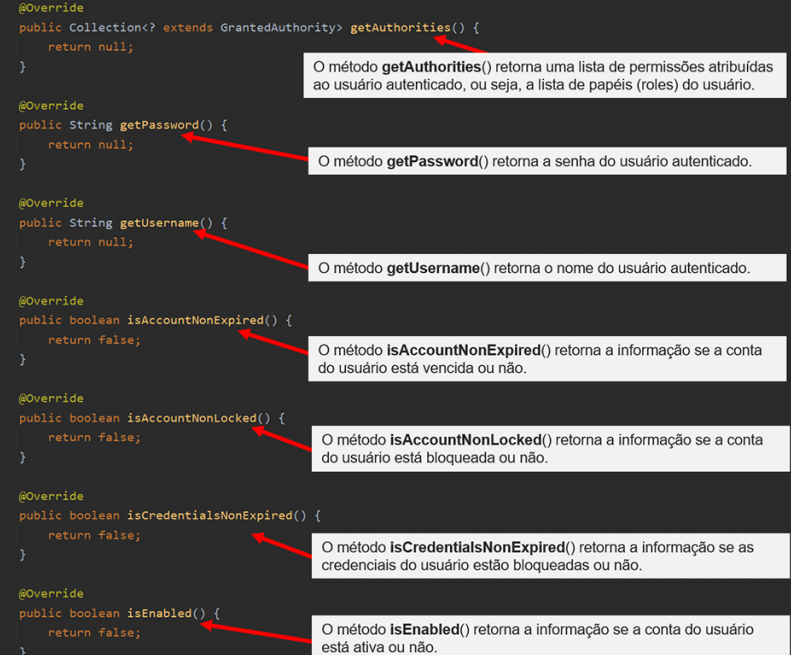
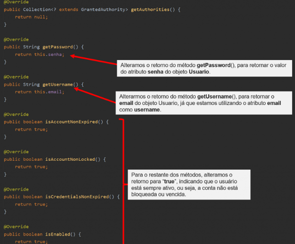

<h1>FASE 3 - FRAMEWORKS JAVA</h1>
<h2>Capítulo 05: O Spring Security.</h2>

<h2>1. O SPRING SECURITY</h2>

## 1.1 Por que implementar segurança em uma aplicação?

- através dessa camada é possível identificar os usuários que estão utilizando a aplicação, além de limitar o que cada usuário pode ou não fazer e/ou ver no sistema.
- implementação da segurança é importante para garantirmos que os dados sensíveis estão protegidos contra acesso não autorizado, garantindo a privacidade e a segurança dos usuários.
- uma aplicação que implementa recursos de segurança de acesso, demonstra comprometimento com a proteção dos dados que são manipulados e ajuda a manter a confiança e a credibilidade com os usuários e clientes.
- para implementarmos a camada de segurança utilizaremos o `Spring Security`, uma biblioteca de controle de acesso altamente customizável para aplicações Spring Boot.

## 1.2 O que é o Spring Security?

- framework de autenticação poderoso e altamente customizável. 
- é o framework padrão para implementação de segurança em aplicações Spring Boot. 
- dentre os recursos que implementa, destacam-se: Autenticação e Autorização, além de outras funcionalidades.

## 1.3 O que é Autorização e Autenticação?

- pilares de segurança mais importantes em um sistema de segurança.
- garantem a identificação do usuário e limita as ações do usuário dentro do sistema.

- `autenticação`: 
  - processo de verificar a identidade de um usuário. 
  - essa identificação é feita, geralmente, por meio da utilização de credenciais como nome do usuário e senha.
  - podemos autenticar o usuário por meio de provedores de autenticação baseada em formulário, autenticação baseada em token (JWT–JSON Web Tokens), dentre outras formas.

- `autorização`:
  - é o processo de determinar se um usuário autenticado tem permissão de acessar um recurso específico no sistema. 
  - é possível configurar diversas regras de autorização com base nos papéis do usuário (***roles***). 
  - exemplo: um usuário com o papel “admin” tem acesso total a aplicação, enquanto um usuário com papel “vendedor” tem acesso somente aos recursos relacionados as vendas.

> Autenticação e autorização são utilizados em conjunto, oferecendo uma solução mais completa de segurança em aplicações Spring, protegendo a aplicação de acessos não autorizados e garantindo que apenas os usuários autenticados e autorizados tenham acesso aos recursos protegidos.

- em nossa aplicação utilizaremos a autenticação baseada em `token JWT` com regras baseadas em papéis (roles) do usuário.

## 1.4 Adicionando o Spring Security ao projeto

- acesse o site [SpringInitializr](https://start.spring.io/).
- marque a opção Maven, e clique no botão "ADD DEPENDENCIES...".
- digite no campo de busca de dependências a palavra “security” > Spring Security.
- com a dependência adicionada à lista, clique no botão “EXPLORE”.
- na próxima tela, copie as dependências do Spring Boot e adicione ao arquivo pom.xml do projeto.

~~~xml
<?xml version="1.0" encoding="UTF-8"?>
<project xmlns="http://maven.apache.org/POM/4.0.0" xmlns:xsi="http://www.w3.org/2001/XMLSchema-instance"
    xsi:schemaLocation="http://maven.apache.org/POM/4.0.0 https://maven.apache.org/xsd/maven-4.0.0.xsd">
    <modelVersion>4.0.0</modelVersion>
    <parent>
       <groupId>org.springframework.boot</groupId>
       <artifactId>spring-boot-starter-parent</artifactId>
       <version>3.2.1</version>
       <relativePath/> <!-- lookup parent from repository -->
    </parent>
    <groupId>br.com.fiap</groupId>
    <artifactId>calorias</artifactId>
    <version>0.0.1-SNAPSHOT</version>
    <name>calorias</name>
    <description>Projeto exemplo para o curso de Spring Boot - FIAP</description>
    <properties>
       <java.version>21</java.version>
    </properties>
    <dependencies>
       <dependency>
          <groupId>org.springframework.boot</groupId>
          <artifactId>spring-boot-starter-web</artifactId>
       </dependency>

       <dependency>
          <groupId>org.springframework.boot</groupId>
          <artifactId>spring-boot-devtools</artifactId>
          <scope>runtime</scope>
          <optional>true</optional>
       </dependency>
       <dependency>
          <groupId>org.springframework.boot</groupId>
          <artifactId>spring-boot-starter-test</artifactId>
          <scope>test</scope>
       </dependency>

       <dependency>
          <groupId>org.springframework.boot</groupId>
          <artifactId>spring-boot-starter-data-jpa</artifactId>
       </dependency>
       <dependency>
          <groupId>org.springframework.boot</groupId>
          <artifactId>spring-boot-starter-validation</artifactId>
       </dependency>
       <dependency>
          <groupId>org.flywaydb</groupId>
          <artifactId>flyway-core</artifactId>
       </dependency>
       <dependency>
          <groupId>org.flywaydb</groupId>
          <artifactId>flyway-database-oracle</artifactId>
       </dependency>
       <dependency>
          <groupId>com.oracle.database.jdbc</groupId>
          <artifactId>ojdbc11</artifactId>
          <scope>runtime</scope>
       </dependency>
       <dependency>
          <groupId>org.projectlombok</groupId>
          <artifactId>lombok</artifactId>
          <optional>true</optional>
       </dependency>
       <dependency>
          <groupId>org.springframework.boot</groupId>
          <artifactId>spring-boot-starter-security</artifactId>
       </dependency>
       <dependency>
          <groupId>org.springframework.security</groupId>
          <artifactId>spring-security-test</artifactId>
          <scope>test</scope>
       </dependency>

    </dependencies>

    <build>
       <plugins>
          <plugin>
             <groupId>org.springframework.boot</groupId>
             <artifactId>spring-boot-maven-plugin</artifactId>
          </plugin>
       </plugins>
    </build>

</project>
~~~

- após a adição das dependências, será necessário efetuar o reload das dependências para garantir que o Maven tenha instalado tudo corretamente. 
  - ao lado direito da tela do IntelliJ localize o botão “Maven”.
  - clique no botão "Reload All Maven Projects".

> Se a aplicação estiver executando, reiniciá-la para que as configurações do Spring Security sejam aplicadas corretamente.

- após inicialização da aplicação, tentar realizar uma requisição para o endpoint que lista os alimentos do banco de dados. 
- recebemos como resposta o código de status HTTP ***401 – Unauthorized***, ou seja, não estamos autorizados a realizar qualquer tipo de requisição. 
- por padrão, o Spring Security bloqueia o acesso a todos osendpoints, para que o desenvolvedor configure os acessos de acordo com as regras de autenticação e autorização.
  - quando iniciamos a aplicação, o Spring Security exibiu uma senha que podemos utilizar para acessar a API. 
  - essa senha é gerada de forma aleatória.
  - cada vez que a aplicação é inicializada é gerada uma senha diferente. 
  - a senha pode ser visualizada no log do IntelliJ.
- de posse dessa senha é possível liberar o acesso aos endpoints através da autenticação efetuada via credenciais de acesso (através de um nome e uma senha). 
  - a senha já temos, exibida no log do IntelliJ. 
  - o usuário deverá ser “user”. 
- ***configurar o Insomnia para que possa efetuar as requisições através desta credencial***:
  - 1. Abra uma requisição de consulta qualquer. 
  - 2. Clique na aba “Auth” e em seguida clique na opção “Basic Auth”.
  - 3. Preencha os campos "USERNAME" e "PASSWORD".
  - 4. Clique no botão “Send”. Se tudo estiver correto, você deverá ter acesso novamente ao endpoint.

> Ao concluir essa etapa, o Spring Security está configurado no projeto, mas não vamos utilizar a autenticação com credenciais. Vamos implementar o uso de JWT (JSON Web Token), método mais utilizado pelas aplicações modernas.

<h2>2. IMPLEMENTANDO AUTENTICAÇÃO JWT</h2>

- uma das formas de autenticação mais utilizadas para aplicações Backend que expõe APIs REST é através da utilização de Token. 
- o mais comum é conhecido com JWT (JSON Web Token) e o Spring Security também é capaz de gerenciar este tipo de autenticação.

## 2.1 Diferença entre autenticação Stateful e Stateless

- há duas formas de efetuarmos a autenticação em um servidor de aplicações: `Stateful` e `Stateless`.
- a diferença está relacionada à forma como a informação de autenticação é gerenciada pelo servidor.

### 2.1.1 Autenticação Stateful
- em uma autenticação Stateful, o servidor mantém o estado da sessão do usuário após a autenticação. 
- isso é feito armazenando informações sobre a sessão do usuário no servidor.
- quando ocorre uma autenticação bem-sucedida, o servidor atribui à sessão do usuário um identificador de sessão único, que é utilizado para identificar as interações do usuário com o servidor.
- esse identificador é armazenado em memória ou em um banco de dados, o que pode trazer problemas de performance quando o servidor mantém a sessão de milhares ou milhões de usuário conectados simultaneamente, já que para cada usuário logado na aplicação haverá uma variável de sessão armazenada no servidor com os dados do clientee haverá, também, um cookie armazenado no cliente com o identificador da sessão no servidor.

### 2.1.2 Autenticação Stateless
- quando utilizamos a autenticação Stateless, o servidor não mantém o estado da sessão.
- ou seja, não existe a necessidade de armazenarmos os dados da sessão dos usuários autenticados no servidor, garantindo escalabilidade e menor sobrecarga de memória.
- quando o usuário é autenticado ele recebe um “token” (um “hash”), que será utilizado em toda a comunicação entre o servidor e o cliente. 
- significa que cada solicitação é tratada de forma independente, sem considerar solicitações anteriores. 
- a autenticação ocorre em todas as solicitações através do envio do token por parte do cliente ao servidor.
- geralmente utilizamos tokens JWT (JSON Web Tokens), onde o token de acesso armazena todas as informações necessárias para verificar a identidade do usuário.
- o processo de autenticação ocorre seguindo os seguintes passos:
  - 1. o usuário faz uma requisição para um endpoint de autenticação fornecendo dados de acesso, como usuário e senha.
  - 2. se os dados de acesso estiverem corretos, o servidor gera um token com os dados de autenticação do usuário e o envia para o cliente.
  - 3. para cada requisição ao servidor, o cliente deverá enviar o token, que será utilizado pelo servidor para identificar o usuário e validar as suas permissões.
  - 4. o usuário recebe acesso ao recurso protegido se o token for validado pelo servidor.

### 2.1.3 Anatomia do token JWT
- é um padrão aberto definido pela RFC 7519, que determina um formato compacto e autocontido para a transferência de dados de forma segura entre cliente e servidor. 
- o formato utilizado para conter as informações é o JSON.

>***O padrão JWT consiste em três partes***:

- `Header`: 
  - no cabeçalho encontraremos as informações sobre o tipo do token e o algoritmo de criptografia usado para assinar o token. 
  - campos: 
    - ***alg***: indica o algoritmo de criptografia que será utilizado para encriptar o token. No exemplo abaixo, estamos utilizando o algoritmo “HS256”.
    - ***typ***: informa qual é o tipo do token. No exemplo, “JWT”.
  - exemplo:

~~~json
{
  "alg": "HS256",
  "typ": "JWT"
}
~~~

- `Payload` (Corpo):
  - responsável por guardar as informações que são transportadas pelo token, como a identidade do usuário, o papel (role) ou qualquer outra informação necessária. 
  - campos:
    - ***sub***: subject, usado para identificar o assunto do token. Geralmente é utilizado para armazenar um identificador exclusivo para o usuário para o qual foi emitido.
    - ***name***: pode ser utilizado para incluir o nome do usuário.
    - ***iat***: IssuedAt ("emitido em"). Utilizado para informar o momento de criação do token. 
  - é possível inserir outros campos ao payload do token JWT, dependendo do que o desenvolvedor precisa armazenar no token.
  - exemplo:

~~~json
{
  "sub": "1234567890",
  "name": "Jane Doe",
  "iat": 1516239022
}
~~~

- `Signature` (Assinatura):
  - utilizado para verificar se o token é válido e que não tenha sido alterado durante a transferência. 
  - a assinatura é calculada com base no cabeçalho, corpo e uma chave secreta informada durante a criação do token. 
  - o algoritmo utilizado para a criação da assinatura é definido no cabeçalho. 
  - exemplo:

~~~
HMACSHA256(
  base64UrlEncode(header) + "." +
  base64UrlEncode(payload),
  ypur-256-bit-secret
) secret base64 encoded
~~~

> Mais detalher sobre token JWT [aqui](https://jwt.io/).

## 2.2 Configuração da autenticação JWT

- antes de configurarmos nos endpoints da aplicação Calorias, fazer alguns ajustes no banco de dados, na tabela TBL_USUARIOS. 
- essa tabela deverá conter um novo campo que armazenará o papel (role) do usuário.

### 2.2.1 Ajuste na tabela TBL_USUARIOS
- ***adicionar o campo ROLE tabela TBL_USUARIOS***. 
- esse campo é necessário para armazenar o papel do usuário, que será utilizado para determinar quais autorizações o usuário terá dentro do sistema.

> Importante! Antes de criarmos a migration, pare a execução da aplicação, senão rodará a migration antes de concluirmos os scripts, podendo causar problemas no banco de dados.

- para criar a migration, crie um `arquivo V3__modify-table-tbl_alimentos-add-field-role.sql` na pasta resources.db.migration.

~~~sql
ALTER TABLE TBL_USUARIOS
ADD ROLE VARCHAR2(50) DEFAULT 'USER'
ADD CONSTRAINT email_unico UNIQUE (EMAIL);
~~~

### 2.2.2 Ajustando a classe Usuário
- acrescentar o atributo role a essa classe. 
- como a lista de papéis (roles) será limitada, é interessante criarmos uma `classe enum`. 
- crie no pacote model do projeto, uma enum `UsuarioRole`.

~~~java
package br.com.fiap.calorias.model;

public enum UsuarioRole {
  ADMIN("admin"),
  USER("user");
  /* cada item do enum tem um valor associado 
   * (chamado estratégia "enum com campo de instância").
   */

  private String role; 
  // para armazenar o valor associado a cada enum
  
  UsuarioRole(String role){
      this.role = role;
  }
  // construtor invocado sempre que um novo enum for criado
  
  public String getRole(){
      return this.role;
  }
  // getter para recuperar o valor associado a cada enum.
}
~~~

- com o enum criado, adicionar o atributo "role" na `classe Usuario`:

~~~java
package br.com.fiap.calorias.model;

import jakarta.persistence.*;
import lombok.*;

@Entity
@Table(name = "tbl_usuarios")
@Getter
@Setter
@NoArgsConstructor
@AllArgsConstructor
@EqualsAndHashCode
public class Usuario {

    @Id
    @GeneratedValue(
            strategy = GenerationType.SEQUENCE,
            generator = "SEQ_USUARIOS"
    )
    @SequenceGenerator(
            name = "SEQ_USUARIOS",
            sequenceName = "SEQ_USUARIOS",
            allocationSize = 1
    )
    @Column(name = "usuario_id")
    private Long usuarioId;

    private String nome;
    private String email;
    private String senha;

    @Enumerated(EnumType.STRING)
    private UsuarioRole role;

}
~~~

- na classe Usuario, adicionamos o atributo role do tipo "UsuarioRole", anotado com `@Enumerated(EnumType.STRING)`, para que ao gravar a role no banco de dados o Spring envie o nome da enum e não o seu índice numérico.
- agora precisamos ***informar ao Spring Security qual é a classe que representa os usuários que serão autenticados na aplicação***. 
- a `classe Usuario` deve implementar a `interface UserDetails do Spring Security`. 

~~~java
public class Usuario implements UserDetails {

    @Id
    @GeneratedValue(
. . . TRECHO DE CÓDIGO OMITIDO
  )
}
~~~

- a interface UserDetails possui métodos que devem ser implementados pela classe Usuario:
  - clicar na lampadinha ao lado esquerdo da assinatura da classe e na opção "Implement Methods".
  - na caixa de diálogo seguinte, selecione todos os métodos da lista e clique no botão OK.
  - serão criados vários métodos responsáveis por retornar informações sobre o usuário autenticado:

 
<em>Métodos implementados da interface UserDetails.</em> 

- cada um desses métodos pode estar associado a atributos na classe Usuario e a campos equivalentes na tabela TBL_USUARIOS, mas isso não é obrigatório. 
- por conta disso, consideraremos que a conta do usuário está sempre ativa e válida. 
- para isso, vamos alterar o retorno dos métodos implementados na classe Usuario para true, e ajustar o retorno dos métodos responsáveis por retornar a senha e o nome do usuário, obtendo:

 
<em>Ajustes dos métodos implementados da interface UserDetails.</em> 

### 2.2.3 Ajustando as roles do usuário
- na classe Usuario temos o método getAuthorities(), que retorna uma listacom os papéis (roles) do usuário, ou seja, **um usuário pode ter mais do que um papel** (um usuário com o papel de “ADMIN” também terá o papel de “USER”). 
- isso acontece de forma hierárquica, ou seja, um usuário que tenha um papel mais elevado terá, também, os papéis que estão abaixo dele na hierarquia.
- ajustar o método getAuthorities() da classe Usuario de modo que retorne os papéis do usuário de forma correta. 

~~~java
. . . TRECHO DE CÓDIGO OMITIDO
@Override
public Collection<? extends GrantedAuthority> getAuthorities() {
    if (this.role == UsuarioRole.ADMIN) {
        return List.of(
                new SimpleGrantedAuthority("ROLE_ADMIN"),
                new SimpleGrantedAuthority("ROLE_USER")
        );
    } else {
        return List.of(new SimpleGrantedAuthority("ROLE_USER"));
    }
}
. . . TRECHO DE CÓDIGO OMITIDO
~~~

## 2.3 Configurando a autenticação

- com a classe Usuario implementada, precisamos criar na classe UsuarioRepository um método que implementará a busca de usuários pelo atributo email, atributo do usuário que estamos utilizando para identificar o usuário no banco de dados.
- outro ponto importante é que o retorno deste método deverá ser do tipo UserDetails, que representa um usuário autenticado no sistema.
- abra o `arquivo UsuarioRepository` e implemente o **método findByEmail()**:

~~~java
package br.com.fiap.calorias.repository;

import br.com.fiap.calorias.model.Usuario;
import org.springframework.data.jpa.repository.JpaRepository;
import org.springframework.security.core.userdetails.UserDetails;

public interface UsuarioRepository extends JpaRepository<Usuario, Long> {

    UserDetails findByEmail(String email);

}
~~~

> Se você criou os métodos findByEmail na classe de serviço e de controlador, comente-os para resolver as mensagens de erro.

### 2.3.1 Criando o serviço de autenticação
- criar o serviço de autenticação, que será invocado sempre que um usuário precisar ser autenticado.
- para isso, crie uma classe no pacote service com o nome `AuthorizationService`.
  - deve implementar a interface UserDetailsService.
  - a interface UserDetailsService possui um método chamado loadUserByUsername(), que deve ser implementado.

~~~java
package br.com.fiap.calorias.service;

import org.springframework.security.core.userdetails.UserDetails;
import org.springframework.security.core.userdetails.UserDetailsService;
import org.springframework.security.core.userdetails.UsernameNotFoundException;
import org.springframework.stereotype.Service;

@Service
public class AuthorizationService implements UserDetailsService {

    @Override
    public UserDetails loadUserByUsername(String username) throws UsernameNotFoundException {
        return null;
    }
}
~~~

- o método loadUserByUsername será utilizado para que o Spring Security faça a consulta do usuário que está tentando se autenticar.
- o responsável por efetuar a consulta no banco de dados é a interface `UsuarioRepository`, então precisamos injetar a dependência desta interface na classe `AuthorizationService` e, em seguida utilizar o método findByEmail() que criamos no repositório. 

~~~java
package br.com.fiap.calorias.service;

import br.com.fiap.calorias.repository.UsuarioRepository;
import org.springframework.beans.factory.annotation.Autowired;
import org.springframework.security.core.userdetails.UserDetails;
import org.springframework.security.core.userdetails.UserDetailsService;
import org.springframework.security.core.userdetails.UsernameNotFoundException;
import org.springframework.stereotype.Service;

@Service
public class AuthorizationService implements UserDetailsService {
    
    @Autowired
    UsuarioRepository usuarioRepository;

    @Override
    public UserDetails loadUserByUsername(String username) throws UsernameNotFoundException {
        return usuarioRepository.findByEmail(username);
    }
}
~~~

- o método loadUserByUsername permitirá ao Spring Security consultar os usuários cadastrados no banco de dados, e obter um objeto do tipo UserDetails cujo e-mail foi fornecido para o método.

### 2.3.2 Configurando a autenticação Stateless
- a configuração padrão no Spring Security é Stateful (ao fornecermos usuário e senha, o servidor armazenará a sessão do usuário). 
- queremos que a autenticação seja Stateless, através da troca de token JWT entre o cliente e o servidor. 
- então, precisamos desabilitar a autenticação Stateful. 
  - criar um pacote em nosso projeto chamado `config.security`, e criar uma classe com o nome `SecurityConfig`.
  - ***anotação @Configuration*** (classe de configuração da aplicação). 
  - também deverá ser anotada com ***@EnableWebSecurity*** (habilita a configuração de segurança web, e indicará ao Spring Boot que ele deve interceptar as requisições HTTP e processá-las de acordo com as configurações de segurança definidas).

~~~java
package br.com.fiap.calorias.config.security;

import org.springframework.context.annotation.Configuration;
import org.springframework.security.config.annotation.web.configuration.EnableWebSecurity;

@Configuration
@EnableWebSecurity
public class SecurityConfig {
    
}
~~~

### 2.3.3 Filtrando as requisições com SecurityFilterChain
- para que a segurança da aplicação seja efetivada, é necessário criarmos uma cadeia de filtros de segurança que serão aplicados a cada requisição HTTP. 
- na classe SecurityConfig, criar um método chamado filtrarCadeiaDeSeguranca() que retorna um objeto do tipo SecurityFilterChain.

~~~java
package br.com.fiap.calorias.config.security;

import org.springframework.context.annotation.Configuration;
import org.springframework.security.config.annotation.web.builders.HttpSecurity;
import org.springframework.security.config.annotation.web.configuration.EnableWebSecurity;
import org.springframework.security.web.SecurityFilterChain;

@Configuration
@EnableWebSecurity
public class SecurityConfig {

    @Bean
    public SecurityFilterChain filtrarCadeiaDeSeguranca(
            HttpSecurity httpSecurity
    ) {

    }

}
~~~

- o método filtrarCadeiaDeSegurança() retorna um objeto do tipo SecurityFilterChain, responsável por configurar a segurança da aplicação no Spring Security, permitindo definir e encadear os filtros de segurança necessários para proteger as requisições HTTP.
- o método recebe como argumento um objeto do tipo HttpSecurity, responsável por configurar as regras de segurança para as requisições HTTP que chegam à aplicação. 
- com a classe HttpSecurity, podemos definir diversas configurações de segurança, como:
  - ***Autorização***: define quem pode ou não acessaras URLs da aplicação.
  - ***Autenticação***: define o mecanismo de autenticação utilizado pela aplicação, que pode ser baseada em formulários, via HTTP, via token, dentre outros.
  - ***Proteção contra-ataques***: habilitar proteção contra os ataques comuns como CSRF (Cross-Site Request Forgery) e XSS (Cross-Site Scripting).
  - ***Configuração de logout***: determina como o logout da aplicação deve ocorrer, invalidando a sessão do usuário ou redirecionando para uma página de logout específico.

- nesse caso, definir que não é necessário proteção de ataques CSRF, que a autenticação será Stateless, ou seja, através de token.

~~~java
import org.springframework.security.config.http.SessionCreationPolicy;
import org.springframework.security.web.SecurityFilterChain;

@Configuration
@EnableWebSecurity
public class SecurityConfig {

    @Bean
    public SecurityFilterChain filtrarCadeiaDeSeguranca(
            HttpSecurity httpSecurity
    ) throws Exception {
        return httpSecurity
                .csrf(csrf -> csrf.disable())
                .sessionManagement(session -> session.sessionCreationPolicy(SessionCreationPolicy.STATELESS))
                .build();
    }

}
~~~

- implementações:
  - `Linha 14 a 16`: lançamento de exceção para que qualquer erro que ocorra neste método seja tratado pelo método que o está chamando.
  - `Linha 17`: construindo o retorno do método, que será um objeto do tipo SecurityFilterChain com a corrente de segurança:
  - `Linha 18`: desabilitamos a proteção contra-ataques do tipo CSRF.
  - `Linha 19`: habilitamos a autenticação Stateless.
  - `Linha 21`: finalizamos a criação do objeto com o método build().

- com as configurações de filtro definidas, nossa aplicação deverá aceitar requisições HTTP sem autenticação, já que não definimos os filtros de autorização no objeto SecurityFilterChain.
- reiniciar a aplicação para que todas as alterações sejam aplicadas.
- efetuar um teste, para verificar se a aplicação está aceitando requisições HTTP sem a necessidade de autenticação. 
- abra o Insomnia e faça uma requisição para qualquer endpoint. 

## 2.4 Autorizando requisições HTTP

- com as configurações do filtro de segurança configurado corretamente, configurar a segurança nas requisições HTTP. 
- essa filtragem se dá a partir do `match`: o filtro libera ou não o acesso a uma requisição dependendo da combinação da URL do recurso e o papel (role) do usuário autenticado.

### 2.4.1 Restringindo requisições por papel (role)
- vamos restringir as requisições HTTP do tipo POST para o endpoint "/alimentos".

~~~java
. . TRECHO DE CÓDIGO OMITIDO
@Configuration
@EnableWebSecurity
public class SecurityConfig {

    @Bean
    public SecurityFilterChain filtrarCadeiaDeSeguranca(
            HttpSecurity httpSecurity
    ) throws Exception {
        return httpSecurity
                .csrf(csrf -> csrf.disable())
                .sessionManagement(session -> session.sessionCreationPolicy(SessionCreationPolicy.STATELESS))
                .authorizeHttpRequests(authorize -> authorize
                        .requestMatchers(HttpMethod.POST, "/alimentos")
                        .hasRole("ADMIN")
                        .anyRequest().authenticated()
                )
                .build();
    }

}
~~~

- implementações:
  - o método authorizeHttpRequests é utilizado para iniciar a configuração de autorização das requisições HTTP.
  - a função lambda "authorize -> authorize" define as regras de autorização para as requisições HTTP. O parâmetro "authorize" representa o objeto responsável por configurar a autorização.
  - o método requestMatchers especifica quais requisições devem ser autorizadas. No exemplo, estamos configurando a autorização para requisições HTTP do tipo “POST” para a URL “/alimentos”.
  - o método hasRole indica que somente usuários com a role “ADMIN” terão permissão para fazer requisições HTTP do tipo “POST” para a URL “/alimentos”.
  - o método anyRequest().authenticated() indica que para qualquer outra requisição é necessário que o usuário esteja autenticado, não importando a role do usuário.

> Com as novas regras de segurança implementadas, efetue uma requisição para qualquer endpoint. A resposta deverá retornar com o código de status “403 –Forbidden” - o usuário está proibido de efetuar qualquer tipo de requisição a API.

## 2.5 Criação do endpoint de autenticação

- nesta sessão iremos criar o endpoint responsável por autenticar o usuário na aplicação. 

### 2.5.1 Criando a classe AuthController
- será o endpoint utilizado pelos usuários para enviar os dados de autenticação, que são e-mail e senha.
- crie uma classe no pacote controller com o nome `AuthController`.
  - adicione as anotações *@RestController* (informa que é uma classe tipo Controller) e *@RequestMapping* (informa que a classe deverá atender requisições enviadas para /auth).
  - criar o método responsável por tratar as requisições de login: adicione o método login() na classe AuthController.

~~~java
package br.com.fiap.calorias.controller;

import br.com.fiap.calorias.dto.UsuarioCadastroDTO;
import jakarta.validation.Valid;
import org.springframework.beans.factory.annotation.Autowired;
import org.springframework.http.ResponseEntity;
import org.springframework.security.authentication.AuthenticationManager;
import org.springframework.security.authentication.UsernamePasswordAuthenticationToken;
import org.springframework.security.core.Authentication;
import org.springframework.web.bind.annotation.PostMapping;
import org.springframework.web.bind.annotation.RequestBody;
import org.springframework.web.bind.annotation.RequestMapping;
import org.springframework.web.bind.annotation.RestController;

@RestController
@RequestMapping("/auth")
public class AuthController {

    @Autowired
    private AuthenticationManager authenticationManager;

    @PostMapping("/login")
    public ResponseEntity login(
            @RequestBody
            @Valid
            UsuarioCadastroDTO usuarioDto
    ){
        UsernamePasswordAuthenticationToken usernamePassword =
                new UsernamePasswordAuthenticationToken(
                        usuarioDto.email(),
                        usuarioDto.senha());

        Authentication auth = authenticationManager.authenticate(usernamePassword);

        return ResponseEntity.ok().build();
    }

}
~~~

### 2.5.2 O que implementamos no método login()?
- `Linhas 24 a 28`: 
  - método responsável por lidar com a requisição de login. 
  - recebe um objeto UsuarioCadastroDTO contendo as informações nome,e-mail e senha do usuário.
  - anotação @RequestBody indica que o objeto usuarioDto será obtido no corpo da requisição HTTP.
  - anotação @Valid indica que o objeto usuarioDto deverá ser validado de acordo com as regras definidas na classe UsuarioCadastroDTO.
- `Linhas 29 a 32`: 
  - criando um objeto do tipo UsernamePasswordAuthenticationToken, usado para representar a tentativa de autenticação do usuário utilizando um par de nome de usuário e senha. 
  - neste exemplo, o e-mail do usuário está sendo usado como nome de usuário e ambos são obtidos do objeto usuarioDto.
- `Linha 34`: 
  - criando um objeto tipo AuthenticationManager, responsável por autenticar as credenciais do usuário. 
  - o método authenticated é invocado, passando o objeto UsernamePasswordAuthenticationToken criado anteriormente.
  - se as credenciais forem válidas, esse método criará um objeto do tipo Authentication, que representa a autenticação bem-sucedida do usuário.
- `Linha 36`: 
  - retornamos uma resposta HTTP com status “200 – OK”, indicando que o login foi realizado com sucesso.

- agora, é necessário indicar ao Spring quem é a AuthenticationManager que estamos utilizando para autenticar as credenciais do usuário, e deve ser feito na classe de configurações. 
- abra a classe SecurityConfig e adicione o método authenticationManager.

~~~java
package br.com.fiap.calorias.config.security;

import org.springframework.context.annotation.Bean;
import org.springframework.context.annotation.Configuration;
import org.springframework.http.HttpMethod;
import org.springframework.security.authentication.AuthenticationManager;
import org.springframework.security.config.annotation.authentication.configuration.AuthenticationConfiguration;
import org.springframework.security.config.annotation.web.builders.HttpSecurity;
import org.springframework.security.config.annotation.web.configuration.EnableWebSecurity;
import org.springframework.security.config.http.SessionCreationPolicy;
import org.springframework.security.web.SecurityFilterChain;

@Configuration
@EnableWebSecurity
public class SecurityConfig {

    @Bean
    public SecurityFilterChain filtrarCadeiaDeSeguranca(
            HttpSecurity httpSecurity
    ) throws Exception {
        return httpSecurity
                .csrf(csrf -> csrf.disable())
                .sessionManagement(session -> session.sessionCreationPolicy(SessionCreationPolicy.STATELESS))
                .authorizeHttpRequests(authorize -> authorize
                        .requestMatchers(HttpMethod.POST, "/alimentos")
                        .hasRole("ADMIN")
                        .anyRequest().authenticated()
                )
                .build();
    }

    @Bean
    public AuthenticationManager authenticationManager(
            AuthenticationConfiguration authenticationConfiguration
    ) throws Exception {
        return authenticationConfiguration.getAuthenticationManager();
    }

}
~~~

### 2.5.3 Criptografando a senha do usuário
- é importante que a senha do usuário seja armazenada no banco de dados de forma criptografada; não é uma boa prática guardar a senha em clear text (texto limpo). 
- então, adicionar à nossa classe de configuração um método que retorna um objeto responsável por criptografar as senhas do usuário.
- adicione o método passwordEncoder() na classe SecurityConfig, o qual cria uma instância de um objeto do tipo PasswordEncoder, responsável por codificar senhas utilizando o algoritmo “hash bcrypt”, considerado um dos mais fortes atualmente.

~~~java
. . . TRECHO DE CÓDIGO OMITIDO
@Bean
public PasswordEncoder passwordEncoder(){}
~~~

### 2.5.4 Criando o endpoint de registro do usuário
- criar um endpoint que será utilizado para cadastrar um usuário no sistema. 
- abra a classe AuthController e crie o método registrar().

~~~java
. . . TRECHO DE CÓDIGO OMITIDO
@PostMapping("/register")
@ResponseStatus(HttpStatus.CREATED)
public ResponseEntity registrar(@RequestBody @Valid UsuarioCadastroDTO usuarioCadastroDTO){

    UsuarioExibicaoDTO usuarioSalvo = null;
    usuarioSalvo = usuarioService.salvarUsuario(usuarioCadastroDTO);

    return ResponseEntity.ok(usuarioSalvo);

}
~~~

- efetuar alguns pequenos ajustes no método salvarUsuarioB da classe UsuarioService.

~~~java
. . . TRECHO DE CÓDIGO OMITIDO
public UsuarioExibicaoDTO salvarUsuario(UsuarioCadastroDTO usuarioDTO){

    String senhaCriptografada = new
        BCryptPasswordEncoder().encode(usuarioDTO.senha());

    Usuario usuario = new Usuario();
    BeanUtils.copyProperties(usuarioDTO, usuario);
    usuario.setSenha(senhaCriptografada);

    Usuario usuarioSalvo = usuarioRepository.save(usuario);

    return new UsuarioExibicaoDTO(usuarioSalvo);

}
. . . TRECHO DE CÓDIGO OMITIDO
~~~

- implementações:
  - `Linhas 4 e 5`: instanciamos um objeto do tipo BCryptPasswordEncoder para criptografar a senha do usuário.
  - `Linha 9`: substituímos a senha atual pela senha criptografada, que será gravada no banco de dados.

- com a implementação acima, a senha do usuário será criptografada, mas quando criamos a tabela TBL_USUARIOS, definimos o tamanho do campo senha para aceitar no máximo 20 caracteres. 
- precisamos aumentar esse tamanho já que a senha criptografada utiliza pelo menos 60 caracteres. 
- para corrigir o tamanho do campo senha na tabela, criar mais uma migration - "V4__modify-table-tbl_alimentos-modify-field-senha.sql".

~~~sql
ALTER TABLE TBL_USUARIOS
MODIFY SENHA VARCHAR2(100);
-- altera o tamanho do campo “senha” para 100 caracteres.
~~~

### 2.5.5 Liberando os endpoints de registro e login
- para que o usuário possa efetuar login, é necessário que a URL para o endpoint de login esteja liberado para acesso sem autenticação.
- também é necessário liberarmos, pelo menos momentaneamente, o endpoint para registro de usuários, para que possamos efetuar os cadastros. 
- abra o arquivo SecurityConfig e acrescente as regras de autorização:

~~~java
. . . TRECHO DE CÓDIGO OMITIDO
@Bean
public SecurityFilterChain filtrarCadeiaDeSeguranca(
        HttpSecurity httpSecurity
) throws Exception {
    return httpSecurity
            .csrf(csrf -> csrf.disable())
            .sessionManagement(session ->
                    session.sessionCreationPolicy(SessionCreationPolicy.STATELESS))
            .authorizeHttpRequests(authorize -> authorize
                    .requestMatchers(HttpMethod.POST, "/auth/login").permitAll()
                    .requestMatchers(HttpMethod.POST, "/auth/register").permitAll()
                    .requestMatchers(HttpMethod.POST, "/alimentos").hasRole("ADMIN")
                    .anyRequest().authenticated()
            )
            .build();
}
. . . TRECHO DE CÓDIGO OMITIDO
~~~

- regras:
  - `Linhas 11 e 12`: as requisições HTTP do tipo POST, endereçadas a /auth/login e /auth/register serão liberadas para todos os usuários sem necessidade de autenticação.

- para testar se os endpoints estão funcionando corretamente, abra o Insomnia e crie uma requisição do tipo POST para a URL /auth/register.
  - url http://localhost:8080/auth/register.

- caso tentemos cadastrar 2x o mesmo usuario, obteremos erro, porque o campo senha foi configurado para ser único, ou seja, não podemos ter dois e-mails iguais no banco de dados (a classe de exceção que gerou o erro foi a DataIntegrityViolationException).
- abrir a classe ApplicationExceptionHandler e adicionar o método que interceptará esse erro:

~~~java
. . . TRECHO DE CÓDIGO OMITIDO
@ResponseStatus(HttpStatus.CONFLICT)
@ExceptionHandler(DataIntegrityViolationException.class)
public Map<String, String> handleIntegrityViolation(){

    Map<String, String> errorMap = new HashMap<>();

    errorMap.put("erro", "Usuário já cadastrado!");

    return errorMap;

}
. . . TRECHO DE CÓDIGO OMITIDO
~~~

- o método handleIntegrityViolation() foi anotado com @ResponseStatus(HttpStatus.CONFLICT), que retornará ao consumidor da API o código de status “409 - Conflict”, indicando que houve um conflito na requisição, ou seja, já existe um objeto cadastrado com o e-mail fornecido. 
- a anotação @ExceptionHandler recebe como parâmetro um objeto do tipo DataIntegrityViolationException.
- por fim, criamos um objeto do tipo “Map” com chave e valor do tipo String, que será retornado ao consumidor da API. 
- a chave será a palavra “erro” e o valor será a mensagem “Usuário já cadastrado!”.

> Estamos enviando mais dados do que o necessário. Para efetuar o login, precisamos enviar apenas o e-mail e a senha. 

- construir uma nova classe DTO que contenha apenas esses dois atributos. 
- crie no pacote “dto” uma classe do tipo record com o nome “LoginDTO”.
  - adicionar os campos “email” e “senha”, que são as únicas informações necessárias para enviarmos ao endpoint de login.

~~~java
package br.com.fiap.calorias.dto;

import jakarta.validation.constraints.Email;
import jakarta.validation.constraints.NotBlank;
import jakarta.validation.constraints.Size;

public record LoginDTO(
        @NotBlank(message = "O e-mail do usuário é obrigatório!")
        @Email(message = "O e-mail do usuário não é válido!")
        String email,

        @NotBlank(message = "A senha é obrigatório")
        @Size(min = 6, max = 20, message = "A senha deve conter entre 6 e 20 caracteres!")
        String senha
) {
    
}
~~~

- com a classe LoginDTO concluída, refatorar a classe AuthController para utilizar a classe LoginDTO.

~~~java
. . . TREHCO DE CÓDIGO OMITIDO
@PostMapping("/login")
public ResponseEntity login(
        @RequestBody
        @Valid
        LoginDTO usuarioDto
){
    UsernamePasswordAuthenticationToken usernamePassword =
            new UsernamePasswordAuthenticationToken(
                    usuarioDto.email(),
                    usuarioDto.senha());

    Authentication auth = AthenticationManager.authenticate(usernamePassword);

    return ResponseEntity.ok().build();
}
. . . TRECHO DE CÓDIGO OMITIDO
~~~

## 2.6 Geração do token JWT

- será fornecido ao consumidor da API, e deverá ser fornecido para todas as requisições HTTP enviadas ao servidor. 
- implementar essa funcionalidade!

### 2.6.1Importando as dependências do JWT
- será necessário adicionarmos a biblioteca responsável por essa tarefa.
- incluir essa dependência no arquivo pom.xml. 
- passos:
  - 1. Abra o [site oficial do projeto JWT](https://jwt.io).
  - 2. Acesse o link "Libraries".
  - 3. Filtre a exibição das linguagens para “Java”.
  - 4. No resultado da filtragem, clique no link “View Repo”, do primeiro card.
  - 5. No repositório do projeto no GitHub, role a página para baixo até localizar o item “Installation” e copie a dependência do Maven.
 
~~~xml
<dependency>
  <groupId>com.auth0</groupId>
  <artifactId>java-jwt</artifactId>
  <version>4.4.0</version>
</dependency>
~~~

  - 6. Cole a dependência do JWT no arquivo pom.xml, seção dependencies.
  - 7. Clique no botão “Reload All Maven Projects” para carregar a nova dependência.
  - 8. Para conferir se a biblioteca JWT foi instalada com sucesso, expanda a pasta “Dependencies” e verifique se a biblioteca do JWT se encontra na lista.

### 2.6.2 Criação do serviço de geração do token JWT
- criar uma classe que será responsável por gerar o token. 
- crie a classe TokenService no pacote security.

~~~java
package br.com.fiap.calorias.config.security;

import br.com.fiap.calorias.model.Usuario;
import com.auth0.jwt.JWT;
import com.auth0.jwt.algorithms.Algorithm;
import com.auth0.jwt.exceptions.JWTCreationException;
import org.springframework.beans.factory.annotation.Value;
import org.springframework.stereotype.Service;

import java.time.Instant;
import java.time.LocalDateTime;
import java.time.ZoneOffset;

@Service
public class TokenService {

    @Value("minha.chave.secreta")
    private String palavraSecreta;

    public String gerarToken(Usuario usuario){

        try {
            Algorithm algorithm = Algorithm.HMAC256(palavraSecreta);

            String token = JWT.create()
                    .withIssuer("calorias")
                    .withSubject(usuario.getEmail())
                    .withExpiresAt(gerarDataDeExpiracao())
                    .sign(algorithm);

            return token;
        } catch (JWTCreationException e){
            throw new RuntimeException("Não foi possível gerar o token!");
        }

    }

    private Instant gerarDataDeExpiracao(){
        return LocalDateTime
                .now()
                .plusHours(2)
                .toInstant(ZoneOffset.of("-03:00"));
    }

}
~~~

- implementação: 
  - `Linha 14`: anotação @Service indica que é uma classe de serviço e que deverá ser gerenciado por ele.
  - `Linhas 17 e 18`: 
    - atributo de classe chamada “palavraSecreta”, cujo valor será utilizado para criptografar o token JWT. 
    - o valor desse atributo será obtido em uma variável de sistema, que está associada ao termo indicado na anotação “@Value”. 
    - essa variável será disponibilizadano arquivo application.properties, mas poderá estar armazenada no ambiente de execução de uma aplicação na nuvem, como uma máquina virtual, um contêiner ou uma função servless. 
    - essas variáveis são utilizadas para personalizar ou modificar o comportamento de uma aplicação sem a necessidade de modificar o código-fonte.
  - `Linha 20`: 
    - criamos a assinatura do método com o nome “gerarToken”.
    - recebe como argumento um objeto do tipo “Usuario”. 
    - os dados do objeto “Usuario” poderão ser inseridos no token, caso necessário.
  - `Linha 23`: 
    - criamos um objeto do tipo “Algorithm”, que determina qual será o algoritmo de autenticação utilizado.
    - no exemplo, estamos utilizando o algoritmo “HMAC-SHA256”, que é utilizado para verificar a integridade e autenticidade de uma mensagem transmitida. 
    - o “HMAC-SHA256” é considerado bastante seguro. 
    - neste momento, informamos também a palavra secreta que será usada para criptografar o token.
  - `Linhas 25 a 29`: 
    - método “create()”, da classe “JWT” para gerar o token. 
    - métodos encadeados (Builder Pattern), para preencher os atributos do token:
      - ***withIssuer***: neste método informamos o emissor do token, podendo ser o nome da aplicação ou da entidade que está emitindo o token.
      - ***withSubject***: utilizamos este método para informar o assunto do token. Geralmente utilizamos este atributo para identificar o usuário para o qual o token foi emitido.
      - ***withExpiresAt***: quando emitimos um token, é importante limitar tempo em que pode ser usado; aqui informamos este tempo. No exemplo criamos um função chamada “gerarDataDeExpiracao()”, que retorna um objeto do tipo “Instant”, que representa um instante no tempo com data e hora definidos, que será fornecido ao método “withExpiresAt()”.
      - ***sign***: este método será o responsável por criptografar o token utilizando o algoritmo criado anteriormente.
  - `Linha 31`: retornamos o token gerado para a função que invocou a criação do token.

- a geração do token pode causar uma exceção do tipo JWTCreationException, por isso as instruções responsáveis por gerar o token estão dentro de um bloco try/catch, que interceptará o erro gerando uma “RuntimeException” com a mensagem de erro personalizada.
- criar o método responsável por validar o token quando ele for enviado pelo usuário durante uma requisição à API: adicione o método “validarToken()” na classe “TokenService”.

~~~java
. . . TRECHO DE CÓDIGO OMITIDO
public String validarToken(String token){

    try {
        Algorithm algorithm = Algorithm.HMAC256(palavraSecreta);

        return JWT.require(algorithm)
                .withIssuer("calorias")
                .build()
                .verify(token)
                .getSubject();
        
    }catch (JWTVerificationException e){
        return "";
    }
}

. . . TRECHO DE CÓDIGO OMITIDO
~~~

- `Linhas 7 a 11`: as instruções neste trecho de código retornamo “payload” do token caso ele esteja válido; caso contrário, será lançada uma exceção do tipo “JWTVerificationException”. 
  - métodos encadeados da classe “JWT”:
    - ***require***: utilizado para realizar a verificação do token.
    - ***withIssuer***: neste método fornecemos o nome do emissor do token.
    - ***build***: esta linha constrói um objeto de verificação JWT.
    - ***verify***: verifica o token fornecido pelo usuário através do objeto de verificação criado pelo método build(). Se o token for válido o “payload” do token será retornado, caso contrário, será gerado uma exceção do tipo “JWTVerificationException”.
    - ***getSubject***: utilizado para retornar o assunto do token. O assunto geralmente é o identificador do usuário.

### 2.6.3 Filtrando a validação do token
- quando enviamos uma requisição HTTP para um endpoint, o Spring Security realiza uma verificação para determinar se esse endpoint está disponível publicamente ou se requer a autenticação do usuário para identificar suas permissões. 
- essa verificação é feita por meio de uma corrente de filtros, que são aplicados em uma ordem específica para autorizar ou negar o acesso a um recurso específico.
- ao utilizarmos autenticação Stateless, é necessário validarmos o token do usuário antes de efetuarmos o filtro de autenticação e/ou autorizações. 
- para isso, incluir mais um filtro na classe “SecurityConfig”. 

~~~java
. . . TRECHO DE CÓDIGO OMITIDO
@Bean
public SecurityFilterChain filtrarCadeiaDeSeguranca(
        HttpSecurity httpSecurity
) throws Exception {
    return httpSecurity
            .csrf(csrf -> csrf.disable())
            .sessionManagement(session ->
                    session.sessionCreationPolicy(SessionCreationPolicy.STATELESS))
            .authorizeHttpRequests(authorize -> authorize
                    .requestMatchers(HttpMethod.POST, "/auth/login").permitAll()
                    .requestMatchers(HttpMethod.POST, "/auth/register").permitAll()
                    .requestMatchers(HttpMethod.POST, "/alimentos").hasRole("ADMIN")
                    .anyRequest().authenticated()
            )
            .addFilterBefore(
                    verificarToken, 
                    UsernamePasswordAuthenticationFilter.class
            )
            .build();
}
. . . TRECHO DE CÓDIGO OMITIDO
~~~

- o filtro personalizado “verificarToken” ainda não existe, então, iremos criá-lo agora: crie uma classe com o nome “VerificarToken” no pacote “security”.

~~~java
package br.com.fiap.calorias.config.security;

import jakarta.servlet.FilterChain;
import jakarta.servlet.ServletException;
import jakarta.servlet.http.HttpServletRequest;
import jakarta.servlet.http.HttpServletResponse;
import org.springframework.stereotype.Component;
import org.springframework.web.filter.OncePerRequestFilter;

import java.io.IOException;

@Component
public class VerificarToken extends OncePerRequestFilter {

    @Override
    protected void doFilterInternal(
            HttpServletRequest request, 
            HttpServletResponse response, 
            FilterChain filterChain) throws ServletException, IOException {
        
    }
}
~~~

- implementar o método “doFilterInternal()” de modo a extrair o token da requisição:

~~~java
package br.com.fiap.calorias.config.security;

import br.com.fiap.calorias.repository.UsuarioRepository;
import jakarta.servlet.FilterChain;
import jakarta.servlet.ServletException;
import jakarta.servlet.http.HttpServletRequest;
import jakarta.servlet.http.HttpServletResponse;
import org.springframework.beans.factory.annotation.Autowired;
import org.springframework.security.authentication.UsernamePasswordAuthenticationToken;
import org.springframework.security.core.context.SecurityContextHolder;
import org.springframework.security.core.userdetails.UserDetails;
import org.springframework.stereotype.Component;
import org.springframework.web.filter.OncePerRequestFilter;

import java.io.IOException;

@Component
public class VerificarToken extends OncePerRequestFilter {

    @Autowired
    private TokenService tokenService;

    @Autowired
    private UsuarioRepository usuarioRepository;

    @Override
    protected void doFilterInternal(
            HttpServletRequest request,
            HttpServletResponse response,
            FilterChain filterChain) throws ServletException, IOException {

        String authorizationHeader = request.getHeader("Authorization");
        String token = "";

        if (authorizationHeader == null){
            token = null;
        } else {
            token = authorizationHeader.replace("Bearer", "").trim();
            String login = tokenService.validarToken(token);
            UserDetails usuario = usuarioRepository.findByEmail(login);

            UsernamePasswordAuthenticationToken authentication =
                    new UsernamePasswordAuthenticationToken(
                            usuario,
                            null,
                            usuario.getAuthorities()
                    );
            SecurityContextHolder.getContext().setAuthentication(authentication);
        }
        
        filterChain.doFilter(request, response);
        
    }
}
~~~

- com a classe “VerificarToken” concluída, fazer ajustes na classe “SecurityConfig”. 

~~~java
package br.com.fiap.calorias.config.security;

import org.springframework.beans.factory.annotation.Autowired;
import org.springframework.context.annotation.Bean;
import org.springframework.context.annotation.Configuration;
import org.springframework.http.HttpMethod;
import org.springframework.security.authentication.AuthenticationManager;
import org.springframework.security.config.annotation.authentication.configuration.AuthenticationConfiguration;
import org.springframework.security.config.annotation.web.builders.HttpSecurity;
import org.springframework.security.config.annotation.web.configuration.EnableWebSecurity;
import org.springframework.security.config.http.SessionCreationPolicy;
import org.springframework.security.crypto.bcrypt.BCryptPasswordEncoder;
import org.springframework.security.crypto.password.PasswordEncoder;
import org.springframework.security.web.SecurityFilterChain;
import org.springframework.security.web.authentication.UsernamePasswordAuthenticationFilter;

@Configuration
@EnableWebSecurity
public class SecurityConfig {

    @Autowired
    private VerificarToken verificarToken;

    @Bean
    public SecurityFilterChain filtrarCadeiaDeSeguranca(
            HttpSecurity httpSecurity
    ) throws Exception {
        return httpSecurity
                .csrf(csrf -> csrf.disable())
                .sessionManagement(session ->
                        session.sessionCreationPolicy(SessionCreationPolicy.STATELESS))
                .authorizeHttpRequests(authorize -> authorize
                        .requestMatchers(HttpMethod.POST, "/auth/login").permitAll()
                        .requestMatchers(HttpMethod.POST, "/auth/register").permitAll()
                        .requestMatchers(HttpMethod.POST, "/alimentos").hasRole("ADMIN")
                        .anyRequest().authenticated()
                )
                .addFilterBefore(
                        verificarToken,
                        UsernamePasswordAuthenticationFilter.class
                )
                .build();
    }

    @Bean
    public AuthenticationManager authenticationManager(
            AuthenticationConfiguration authenticationConfiguration
    ) throws Exception {
        return authenticationConfiguration.getAuthenticationManager();
    }

    @Bean
    public PasswordEncoder passwordEncoder(){
        return new BCryptPasswordEncoder();
    }

}
~~~

- abra a classe “AuthController” e implemente os ajustes:

~~~java
package br.com.fiap.calorias.controller;

import br.com.fiap.calorias.config.security.TokenService;
import br.com.fiap.calorias.dto.LoginDTO;
import br.com.fiap.calorias.dto.UsuarioCadastroDTO;
import br.com.fiap.calorias.dto.UsuarioExibicaoDTO;
import br.com.fiap.calorias.model.Usuario;
import br.com.fiap.calorias.service.UsuarioService;
import jakarta.validation.Valid;
import org.springframework.beans.factory.annotation.Autowired;
import org.springframework.http.HttpStatus;
import org.springframework.http.ResponseEntity;
import org.springframework.security.authentication.AuthenticationManager;
import org.springframework.security.authentication.UsernamePasswordAuthenticationToken;
import org.springframework.security.core.Authentication;
import org.springframework.web.bind.annotation.*;

@RestController
@RequestMapping("/auth")
public class AuthController {

    @Autowired
    private AuthenticationManager authenticationManager;

    @Autowired
    private UsuarioService usuarioService;

    @Autowired
    private TokenService tokenService;

    @PostMapping("/login")
    public ResponseEntity login(
            @RequestBody
            @Valid
            LoginDTO usuarioDto
    ){
        UsernamePasswordAuthenticationToken usernamePassword =
                new UsernamePasswordAuthenticationToken(
                        usuarioDto.email(),
                        usuarioDto.senha());

        Authentication auth = authenticationManager.authenticate(usernamePassword);

        String token = tokenService.gerarToken((Usuario) auth.getPrincipal());

        return ResponseEntity.ok(token);
    }

    @PostMapping("/register")
    @ResponseStatus(HttpStatus.CREATED)
    public UsuarioExibicaoDTO registrar(
        @RequestBody @Valid UsuarioCadastroDTO usuarioCadastroDTO){

        UsuarioExibicaoDTO usuarioSalvo = null;
        usuarioSalvo = usuarioService.salvarUsuario(usuarioCadastroDTO);

        return usuarioSalvo;

    }

}
~~~

- criar uma classe DTO para representar o token para o consumidor da API. 
- crie no pacote “dto” uma classe do tipo “Record”, com o nome “TokenDTO”.

~~~java
package br.com.fiap.calorias.dto;

public record TokenDTO(String token) {
}
~~~

- abra a classe “AuthController” e altere o retorno do método login:

~~~java
. . . TRECHO DE CÓDIGO OMITIDO
@PostMapping("/login")
public ResponseEntity login(
        @RequestBody
        @Valid
        LoginDTO usuarioDto
){
    UsernamePasswordAuthenticationToken usernamePassword =
            new UsernamePasswordAuthenticationToken(
                    usuarioDto.email(),
                    usuarioDto.senha());

    Authentication auth = 
        authenticationManager.authenticate(usernamePassword);

    String token = tokenService.gerarToken((Usuario) auth.getPrincipal());

    return ResponseEntity.ok(new TokenDTO(token));
}
. . . TRECHO DE CÓDIGO OMITIDO
~~~

### 2.6.4 Ajustando as permissões para os endpoints
- ajustar as permissões impostas aos endpoints de acordo com o tipo de requisição HTTP, URL e role do usuário para que somente usuários autenticados e com os papeis corretos possam acessá-los. 
- abra o arquivo “SecurityConfig” e acrescente as permissões:

~~~java
. . . TRECHO DE CÓDIGO OMITIDO
@Bean
public SecurityFilterChain filtrarCadeiaDeSeguranca(
        HttpSecurity httpSecurity
) throws Exception {
    return httpSecurity
            .csrf(csrf -> csrf.disable())
            .sessionManagement(session ->
                    session.sessionCreationPolicy(SessionCreationPolicy.STATELESS))
            .authorizeHttpRequests(authorize -> authorize
                    .requestMatchers(HttpMethod.POST, "/auth/login").permitAll()
                    .requestMatchers(HttpMethod.POST, "/auth/register").permitAll()
                    .requestMatchers(HttpMethod.POST, "/api/alimentos").hasRole("ADMIN")
                    .requestMatchers(HttpMethod.DELETE, "/api/alimentos/*").hasRole("ADMIN")
                    .requestMatchers(HttpMethod.PUT, "/api/alimentos").hasRole("ADMIN")
                    .requestMatchers(HttpMethod.GET, "/api/alimentos").hasAnyRole("ADMIN", "USER")
                    .anyRequest().authenticated()
            )
            .addFilterBefore(
                    verificarToken,
                    UsernamePasswordAuthenticationFilter.class
            )
            .build();
}
. . . TRECHO DE CÓDIGO OMITIDO
~~~

> [Projeto completo desenvolvido até aqui](https://github.com/FIAP/ON_TDS_JAVA_ADVANCED_SPRING_BOOT/tree/security).

---

## FAST TEST

### 1. Queremos autorizar acesso de gravação ao endpoint "/api/produtos" para todos os usuários com papel de admin e manager. Qual das alternativas seguintes efetuam essa configuração?
> .requestMatchers(HttpMethod.POST, "/api/produtos").hasAnyRole("ADMIN", "MANAGER")

### 2. Qual é o framework de segurança mais utilizado em projetos que utilizam o Spring Framework?
> Spring Security.

### 3. Como se chama o método de autenticação onde os dados de sessão do usuário não ficam armazenados no servidor?
> Stateless.

--- 

[Voltar ao início!](https://github.com/DigouO/Smart_Cities_FIAP_2024)