

<h1>FASE 3 - FRAMEWORKS JAVA</h1>
<h2>Capítulo 10: Startup - Exploring the Canvas.</h2>

<h2>1. STARTUP: EXPLORING THE CANVAS</h2>

## 1.1 Visão geral sobre o Business Model Generation

- precisamos estudar maneiras de viabilizar as ideias para torná-las realidade: precisamos desenhar um modelo de negócios que coordene diferentes elementos (como custos, clientes, fornecedores, canais de comunicação e outros), assim como entender a relação entre cada item e também os impactos gerados para cada estratégia planejada. 
- `Business Model Generation`: 
  - nos ajuda a entender os elementos que compõem nossa empresa e também a buscar inovação, exercitando a criação e implementação de maneira prática, lógica e visual por meio do `Business Model Canvas`.
  - seus conceitos são utilizados por grandes empresas, como: IBM, Ericsson, Deloitte, entre outras, além de ganhar muita força e espaço no ecossistema das Startups.

## 1.2 Modelos de negócios ou plano de negócios?

- `Plano de Negócio`:
  - é uma "receita de bolo", que serve como base para o desenvolvimento e crescimento do negócio.
  - se encaixam muito bem para negócios estabelecidos ou tradicionais, que buscam, por meio de históricos preexistentes, organizar o negócio de maneira que se sustente.
  - porém estamos criando uma Startup, logo buscamos resolver um problema e elaborar soluções inovadoras, repetíveis e escaláveis em um ambiente de muitas incertezas, ou seja, ***não temos a receita do bolo, nós que precisamos criá-la***!

- `Modelo de Negócio`:
  - para gerar inovação, não podemos apenas repetir estruturas de negócios existentes e produzir um plano para implementá-las. 
  - não sabemos como nosso negócio será estruturado e, por isso, precisamos formular modelos, rascunhos de negócio e testá-los para identificar se são aceitos e válidos no mercado. 
  - o ***Business Model Canvas*** surge nesse contexto como framework para ajudar a modelar possíveis estruturas de negócio e direcionar na criação de uma solução escalável de uma Startup de sucesso.

## 1.3 Percebendo valor

- precisamos, antes mesmo de falar sobre o desenho do modelo de negócio, compreender se realmente estamos gerando valor o suficiente para engajar usuários a utilizarem a nossa solução. 
- esse valor não é monetário; estamos falando da percepção do cliente sobre o nosso produto, ou seja, que ganhos a solução está gerando e justifica o seu uso? 
- para isso, é recomendado utilizar um framework que ajude a pensar em diferentes variáveis, entender o comportamento do cliente e se o que estamos dispostos a desenvolver como solução realmente supre as dores, dificuldades e desafios do dia a dia. 

### 1.3.1 Canvas da proposta de valor
- framework `Canvas Proposta de Valor`, ***complemento do Business Model Canvas***.
- ajuda a mapear o público-alvo, bem como as dores e alívios, que nos ajudarão a entender qual solução entregar ao cliente e/ou usuário do nosso produto e/ou serviço, assim comoa compreenderos diferenciais para a construção que se destaca no mercado. 

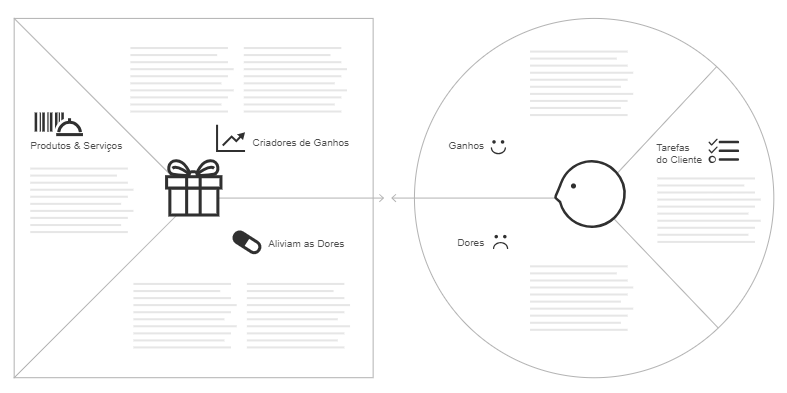 
<em>Canvas da Proposta de Valor.</em> 

- entendendo o significado de "gerar valor" - exemplos de estratégias:
  - `Mercado de menor preço`: definir o preço de venda do produto e/ou serviço, apenas apurando os custos e inserindo uma margem de lucro. Essa margem de lucro tem como limitador os preços praticados por diferentes concorrentes no mercado no qual iremos atuar. Se tivermos um número grande de concorrentes, teremos maior esforço para nos diferenciarmos e, caso o concorrente tenha menores custos, obteremos maiores margens de lucros e/ou menor preço de mercado, favorecendo a diferenciação por preço.
  - `Diferenciação`: ainda é preciso conhecer os custos e aplicar margens de lucros, porém considera a ***Percepção de valor***, que se refere a quanto o cliente percebe e valoriza atributos de valor inseridos no produto e/ou serviço, e quanto está disposto a pagar mais por isso. Nesse caso, impactará diretamente no preço final, em que a decisão de compra por parte do cliente não estará somente relacionada ao preço de mercado e, sim, aos atributos exclusivos de valor (ou diferenciais), que somente nós iremos oferecer ao cliente.
    - exemplos de ***atributos de valor***: credibilidade da marca, confiança, qualidade e eficiência da solução, atendimento, produto ou serviço inovador, funcionalidades exclusivas (em caso de software), design e usabilidade. 

- `ferramenta Canvas Proposta de Valor`:
  - elaborado a partir de milhares de feedbacks que os autores tiveram com o uso do Business Model Canvas. 
  - trata-se de uma ferramenta que traz muitos ensinamentos e sabedorias de negócios, e que nos ajuda a pensar em uma proposta de valor mais consistente e contribui na criação de uma experiência de consumo mais inspiradora, pois aumenta as chances de conquistarmos clientes satisfeitos, leais e influenciadores. 
  - permite escrever diretamente em cada campo, ou usar post-it para incluir as anotações. 
  - por também ser visual e interativo, é prático em discussões em grupo. 
  - entendendo a lógica da ferramenta:

## 1.4 Identificando o cliente

- o primeiro ponto é saber qual/quais são nossos clientes e usuários. 
  - exemplo: em uma solução para o mercado da saúde, clientes e usuários são os médicos, os pacientes, os hospitais etc. 
- `personas`: observando os clientes e usuários, qual seria uma persona que representa esse grupo? Quais são as características em comum? 
  - dependendo do modelo de negócio que iremos desenvolver, teremos mais de uma persona como cliente ou usuário.
  - preencher o Canvas Proposta de Valor para diferentes clientes é relevante para entendermos como cada um percebe valor na nossa solução.

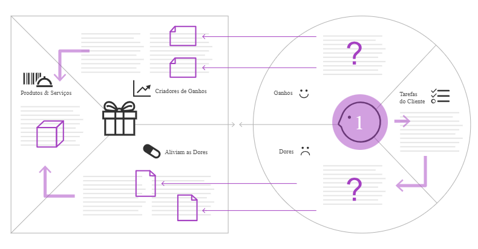 
<em>Lógica Canvas Proposta de Valor.</em> 

> Na figura acima, a região indicada com o número 1 é representada por uma figura, que indica o cliente ou usuário da nossa solução.

### 1.4.1 Quais são as tarefas do cliente?
- em seguida, começamos a trabalhar na parte direita do Canvas,denominada `Tarefas do Cliente`. 
  - nos colocar no lugar do cliente ou usuário que desejamos atender,para compreender e descrever as tarefas realizadas em determinado contexto. 
  - se possível, é interessante consultarmos alguém do mercado em que pretendemos atuar para nos direcionar no levantamento. 
  - é ainda mais interessante a realização de entrevistas com clientes e usuários, e o mapeamento dos detalhes de todas essas atividades.
- `objetivo`: mapear e entender o cliente, num primeiro momento, para evitarmos o risco de criar uma solução cujos benefícios o cliente não perceba, e que não tenha nenhuma relação com as atividades realizadas. 
- precisamos nos lembrar de que essas atividades não estão relacionadas com a solução que entregaremos ,e sim com as atividades que realizaremos. 
- estamos em uma etapa em que precisamos conhecer o dia a dia do potencial cliente ou usuário.

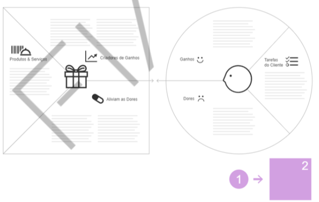 
<em>Atividades do cliente no Canvas Proposta de Valor.</em> 

- ***exemplo na área da saúde***:
  - **Tarefas do paciente**: encontrar médico especialista, marcar consulta, ir à consulta, armazenar resultados de exames, controlar medicamentos etc.
  - **Tarefas do médico**: captar pacientes, organizar agenda, controlar agenda, atender o paciente, emitir pedidos de exames, prescrever medicamentos etc.
  - há dois Stakeholders: o médico e o paciente. 
- uma ferramenta de Design Thinking interessante é o `Mapeamento da Jornada do Usuário`, em que é possível mapear visualmente todas as atividades do usuário, todos os pontos de acesso e interação dentro do processo, e quais as suas ações.

### 1.4.2 Quais são as dores do cliente?

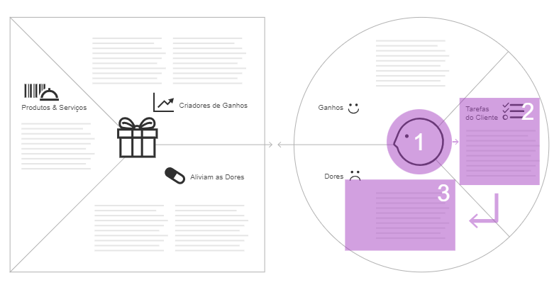 
<em>Dores do cliente no Canvas Proposta de Valor.</em> 

- após mapeamento do processo do cliente e as suas respectivas atividades, é necessário analisar e incluir as dificuldades enfrentadas pelo cliente ao tentar realizar as tarefas que foram identificadas.
- são problemas e desafios que não estão necessariamente relacionados ao produto ou serviço que desejamos entregar.
- é recomendada prática de técnicas de Design Thinking como: ***mapa de empatia*** e ***pesquisa etnográfica***, pois colocam o cliente no centro da análise, buscando compreender o comportamento e as percepções dele.

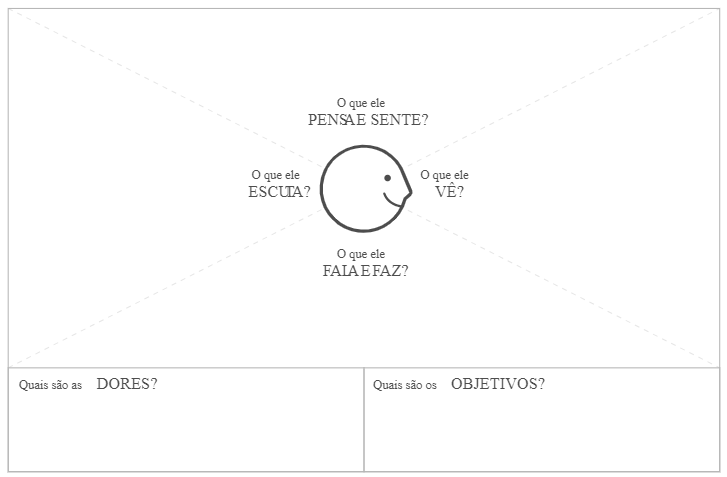 
<em>Mapa de empatia.</em> 

- compreendendo essas percepções, podemos atualizar a Jornada do Usuário,indicando qual atividade possui percepções positivas e negativas, facilitando a identificação das “dores” do cliente ou usuário.
- essas informações serão colocadas na seção denominada pelos autores do Canvas de “Dores do Cliente”. 
- no exemplo, temos:
  - “Dores” do paciente: dificuldade em encontrar um médico especialista mais próximo, consultar disponibilidade do médico, perder resultados de exames ou receituário médico etc.
  - “Dores” do médico: não comparecimento do paciente em consultas agendadas, emissão de receituário, prontuário dos pacientes, pagamento de consultas etc.

> Lembrando que é sempre interessante associar uma dor a uma atividade do cliente, pois na teoria não haveria a possibilidade de o cliente ter uma “dor” e ela não estar associada a nenhuma atividade.

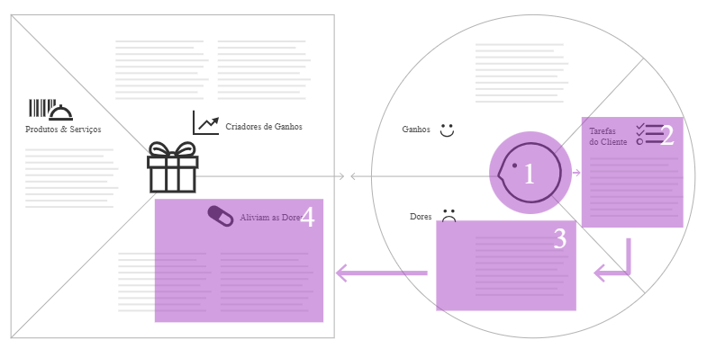 
<em>Aliviadores de Dores do Canvas Proposta de Valor.</em> 

### 1.4.3 O que alivia as dores do cliente?
- para cada “dor”, é preciso incluir um ou mais aliviadores (ou analgésicos). 
  - no caso da “dor” do paciente em encontrar um médico mais próximo, o confortador seria “permitir descobrir a localidade dos médicos”, por exemplo.
  - para a “dor” do médico, de não comparecimento do paciente em dia e horário marcados, poderiam ser “avisos de confirmação de consulta pelo paciente”.
- nesse ponto, teremos informações suficientes para realizar diversas avaliações e validações, pois as supostas tarefas, dores e alívios de dores poderão ser validadas por meio de entrevistas e pesquisas com o mercado-alvo.

### 1.4.4 Quais produtos e serviços podemos oferecer?

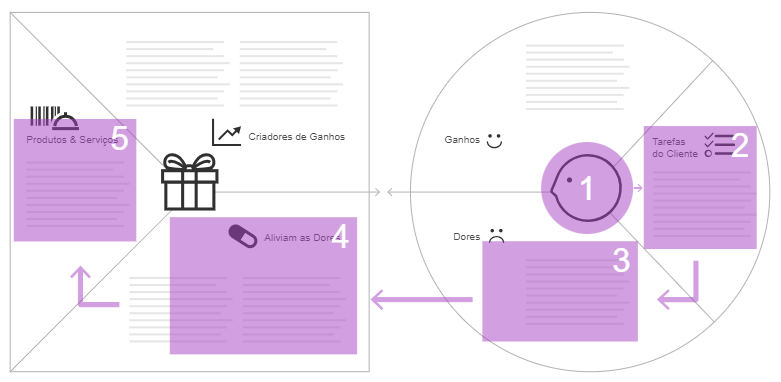 
<em>Produtos e Serviços do Canvas Proposta de Valor.</em> 

- os alívios de dores mapeados passam a se transformar em recursos os quais farão parte da solução que deseja entregar ao mercado. 
- para o exemplo anterior, sob o ponto de vista do paciente, o produto e/ou serviço poderia ser um aplicativo com funcionalidade de geolocalização para os médicos. Por outro lado, para os médicos, o produto e ou serviço poderia ser um sistema que solicita a confirmação de agendamentos de consulta por SMS ou e-mail.

### 1.4.5 Como superar as expectativas do cliente?

 
<em>Ganhos e geradores de ganhos no Canvas Proposta de Valor.</em> 

- deve-se vislumbrar quais ganhos adicionais poderiam ser oferecidos para superar a expectativa do cliente. 
- para cada ganho adicional, é preciso definir no quadro correspondente um ou mais geradores de ganhos, nas áreas:
  - “Ganhos”: equivalente ao “o que” superaria as expectativas do cliente, e 
  - “Geradores de Ganhos”: equivalente ao “como” superar essas expectativas, localizados na parte superior do Canvas Proposta de Valor.
- considerando o exemplo anterior:
  - Ganhos: além da localização do médico mais próximo, será garantido também um tempo máximo de espera de 48 horas para agendamento de uma consulta.
  - Geradores de ganho: bonificar médicos por atendimentos rápidos e de qualidade de acordo com a avaliação do paciente.
- se conseguirmos amenizar as dores do cliente com eficiência, provavelmente teremos um cliente satisfeito.
- se conseguirmos resolver dores adicionais superando a expectativa do cliente, é provável conseguirmos um cliente fiel. 
- se o cliente perceber os ganhos adicionais, serão grandes as chances de ele se tornar um influenciador da Startup, indicando os produtos e serviços para seus conhecidos. 

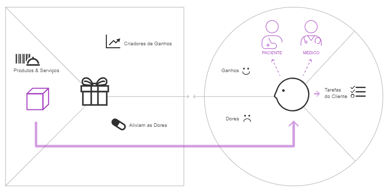 
<em>Produtos e serviços gerando valor para o cliente.</em> 

- a figura acima ilustra como será gerado valor ao cliente ou usuário, pois ao incorporar funcionalidades e atributos de valor ao produto ou serviço projetados, eles irão impactar positivamente o público mapeado no projeto.

## 1.5 Business Model Canvas

- modelo apresentado por Alexander Osterwalder e Yves Pigneur no livro Business Model Generation – Inovação em Modelos de Negócios.
- sugere uma estruturação do modelo de negócios em nove elementos principais.

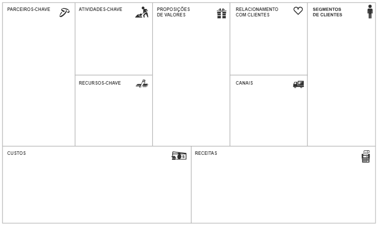 
<em>Canvas do Modelo do Negócio.</em> 

### a) ***iniciar pela parte central `“Preposições de Valor”` ou “Proposta de Valor”***. 
- nos tópicos anteriores, tratamos sobre esse tema e precisamos fazer a relação entre o Canvas Proposta de Valor e o Business Model Canvas. 
- conforme ilustração abaixo, podemos relacionar as áreas do Canvas Proposta de Valor com as duas áreas do Business Model Canvas:

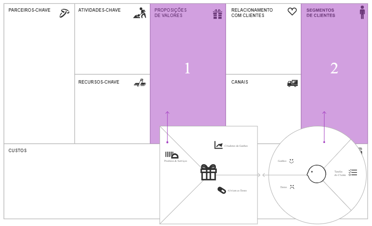 
<em>Adaptação do Canvas do Modelo do Negócio ao Business Model Canva.</em> 

- o lado esquerdo do Canvas Proposta de Valor irá gerar insights para definirmos a proposta de valor no modelo de negócios. 
- o lado direito do Canvas Proposta de Valor o ajudará a definir a segmentação dos clientes. 

> Antes de avançarmos no estudo das demais áreas do Business Model Canvas, há algumas perguntas que devemos procurar responder:

- 1) Proposições de valores ou proposta de valor:
  - que valor (benefício) a Startup entregará aos clientes?
  - qual problema do cliente será resolvido?
  - que tipo de pacote de produtos/serviços estará oferecendo para cada segmento dos clientes?
  - quais necessidades dos clientes serão satisfeitas?
  - como ajudamos nosso cliente?
- 2) Segmentos de clientes:
  - para quem a Startup criará valor?
  - quem são nossos clientes e/ou usuários mais importantes?
  - qual o tamanho desse mercado?
  - esse mercado existe ou estamos criando um novo mercado?

> Como preenchemos as duas primeiras seções do Business Model Canvas, vamos agora compreender a lógica dessa ferramenta. 

### b) ***Segmentos de Clientes***:

- iniciaremos pelo lado direito do Business Model Canvas.
- a figura abaixo demonstra que vamos gerar valor para um público específico e, caso o cliente perceba esse valor e esteja disposto a pagar, iremos gerar receitas para a Startup.

### c) ***seção Receitas***:

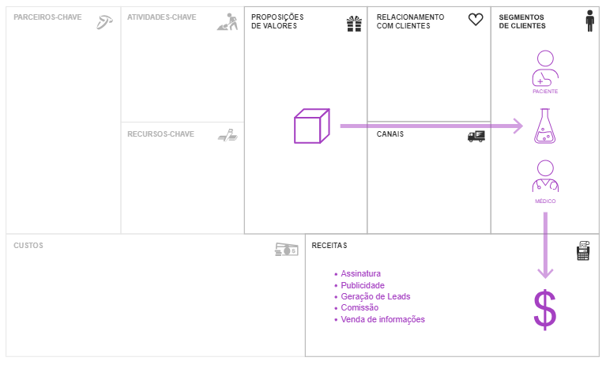 
<em>Lado direito do Canvas do Modelo do Negócio.</em> 

- pensar em como iremos monetizar a Startup, quais serão as fontes de receitas do projeto. 
- descrever as fontes definidas para esse modelo de negócio.
- algumas ***perguntas que poderão ajudar*** - Fontes de receitas:
  - o que os clientes estão realmente prontos para comprar?
  - como o segmento em que deseja atuar costuma contratar e pagar pelos produtos ou serviços?
  - como iremos gerar receitas a curto, médio e longo prazo?
  - a forma que pensamos em gerar receitas é de fácil entendimento para o cliente?
  - com quanto cada fonte de receita contribuirá para as receitas totais?

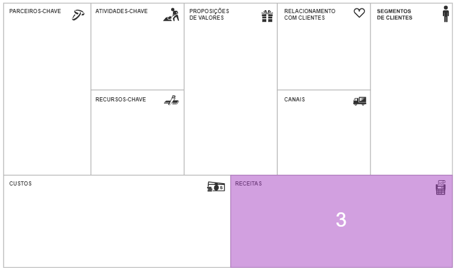 
<em>Quadrante de Receitas do Business Model Canvas.</em> 

### d) ***Relacionamento com os clientes***:

 
<em>Quadrante Relacionamento do Business Model Canvas.</em> 

- nesta seção precisamos definir como será a comunicação. 
- é uma via de mão dupla: precisamos selecionar formas de comunicação que permitam isso. 
- perguntas que ajudarão nessa etapa - Relacionamento com clientes:
  - que tipo de relacionamento cada segmento dos clientes espera da Startup?
  - como estão integradas ao restante do modelo de negócio?
  - qual o custo desses relacionamentos?
  - como interagimos com o cliente?
  - como o perfil do cliente está acostumado a ser atendido?

### e) ***Seção Canais***:

- descrever quais canais de comunicação utilizaremos.

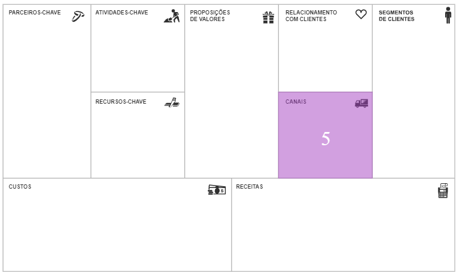 
<em>Quadrante Canais do Business Model Canvas.</em> 

- perguntas que poderão nos ajudar a definir - Canais:
  - quais canais serão utilizados para nos relacionarmos com cada segmento de clientes?
  - como os canais podem ser integrados?
  - quais são os mais eficientes?
  - como estão integrados com a rotina dos clientes?
  - como o cliente encontra você?

> Agora vamos compreender a lógica estabelecida do lado esquerdo do Business Model Canvas:
- se vamos criar um produto ou serviço para algum segmento de mercado, precisamos estruturar nossa Startup para construir isso: se resume em definir quais tarefas ou processos serão realizados para que o produto ou serviço seja desenvolvido e entregue aos nossos clientes ou usuários. 
- parte dessas tarefas poderá ser realizada pela equipe da nossa Startup(atividades-chave), e parte por parceiros de negócios (parceiros-chave).

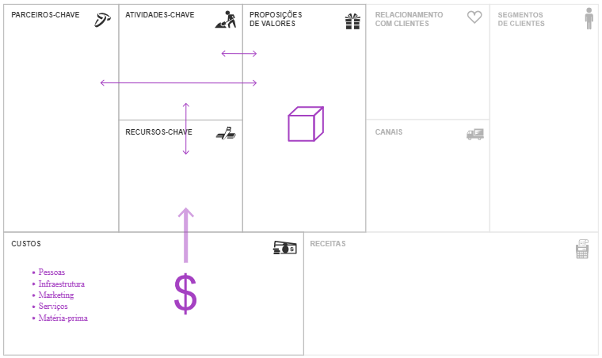 
<em>Lado esquerdo do Canvas do Modelo do Negócio.</em> 

### f) ***Seções Parceiros-chave e Atividades-chave***:

- nesse momento, devemos compreender todas as tarefas e processos que precisam ser realizados e definir o que será o “core” da nossa Startup.
- inspirar-se em modelos como: Apple, Uber ou Airbnb.
  - no caso da Apple, são parceiros que realizam tarefas como montar equipamentos, apps, processadores etc, enquanto preocupam-se com a imagem da marca, design, marketing etc.
  - Uber e Airbnb nãol precisam se preocupar com manutenção dos carros ou imóveis, pagamento de taxas, roubos ou sinistros; cabe aos proprietários desses bens, que estão ocupando o papel de Parceiros de negócio.

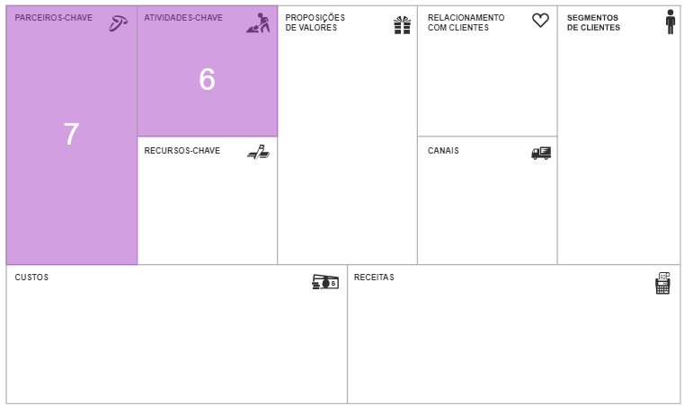 
<em>Quadrante Parceiros-Chave e Atividades-Chave do Canvas do Modelo do Negócio.</em> 

- perguntas que irão ajudar.:
  - ***Atividades-chave***:
    - quais atividades-chave serão realizadas para a concretização da proposta de valor?
    - quais outras atividades-chave para a execução dos canais de distribuição, para o relacionamento com clientes e para a geração de receitas?
    - o que devemos canalizar de energias para gerar escala?
  - ***Parceiros-chave***:
    - quem são os parceiros-chave?
    - quem são os fornecedores-chave?
    - quais recursos-chave serão adquiridos dos parceiros?
    - quais atividades-chave serão executadas pelos parceiros?
    - quem fará as tarefas que tiram a escala do nosso negócio?
    - quais tarefas tiram a escala do nosso negócio?

### g) ***Seção Recursos-chave***:

- se definimos quais serão as atividades “core” e o que será realizado por nossos parceiros de negócios, é possível definir também de quais recursos precisaremos. 
- exemplo: se entendermos que o desenvolvimento e a manutenção de um aplicativo serão a nossa atividade “core”, logo é possível inferir a necessidade das pessoas, licenças de software, entre outros recursos,para executarmos essa tarefa.

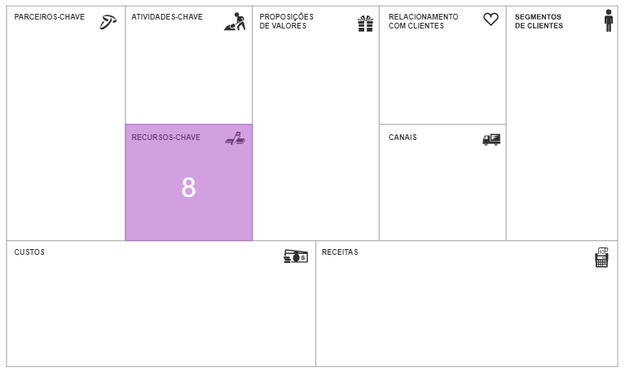 
<em>Quadrante Recursos-Chave do Business Model Canvas.</em> 

- perguntas que irão ajudar nessa definição.
  - Recursos-chave:
    - quais recursos-chave serão necessários para a concretização da proposta de valor?
    - quais outros recursos-chave serão demandados pelos canais de distribuição para relacionamento com clientes e para a geração de receitas?
    - quais recursos precisaremos ter para criar, sustentar e entregar o produto e ou serviço?

### h) ***Seção Custos***:

- último campo a ser preenchido do Business Model Canvas. 
- analisaremos os recursos que precisamos ter para construir e entregar ao mercado os produtos e/ou serviços da nossa Startup.
- há custos fixos e custos variáveis, ou seja, alguns custos ocorrem quando geramos receita/venda. Por exemplo, os impostos ou taxas de entrega.
- ficar atento aos custos fixos de nossa Startup, ou seja, todo o recurso financeiro que sai da Startup sem ter sido gerado diretamente por uma receita/venda. 

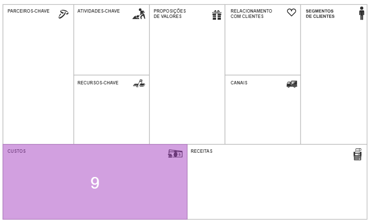 
<em>Quadrante de Custos do Business Model Canvas.</em> 

- perguntas que podem ajudar a definir a estrutura dos custos do modelo de negócio:
  - Estrutura de custos:
    - quais são os custos mais relevantes no modelo de negócio planejado?
    - quais recursos-chave são os mais caros?
    - quais atividades-chave são as mais onerosas?

## 1.6 Dicas para aproveitar melhor o Business Model Canvas

- 1. ***Rascunhe o negócio***: não exige conhecimentos aprofundados dos negócios.

- 2. ***Valide rapidamente***: 
    - o Business Model Canvas exige respostas integradas: o que é escrito em uma parte deve fazer sentido com as demais. Isso nos obriga a visualizar o negócio de forma sistêmica e integrada. 
    - por ser mais visual, permite que outras pessoas (especialistas, mentores e investidores) comentem e forneçam feedbacks.

- 3. ***Fuja dos extremismos e das polêmicas***: considerar o Business Model Canvas como mais uma opção de ferramenta, que pode ser utilizada e combinada com diversas outras ferramentas de mercado.

- 4. ***Combine com os russos***: 
    - entre as críticas ao Business Model Canvas está o fato da pouca ênfase que o modelo dá para a concorrência ou mesmo as incertezas típicas de um novo negócio. 
    - considerar que todas as empresas têm concorrentes, se não diretos,por meio de produtos e serviços substitutos. 
    - o Canvas Ampliado do Modelo de Negócio pode nos ajudar a refletir e a planejar o que fazer com os aspectos externos e as oportunidades de otimizações do negócio.

- 5. ***Geração Startup***: a elaboração do Canvas é rápida, então o modelo se torna muito mais útil do que escrever um longo plano de negócio tradicional. 

- 6. ***Usuários e clientes***: 
    - usuário apenas utiliza a solução, enquanto os clientes pagam por ela. 
    - dependendo do contexto e segmento, um usuário e cliente podem ser representados pelo mesmo perfil, em outros, não.
    - o Google, por exemplo, tem usuários (todos que usam seus serviços gratuitamente), e clientes (anunciantes, por exemplo, que pagam para anunciar).

- 7. ***Muito material na Internet***.

## 1.7 Validando os Canvas

- `hipóteses`: tudo aquilo que definimos sobre o nosso projeto, porém sob o nosso ponto de vista (empreendedor), ou seja, o mercado ainda não foi consultado para saber se são realmente fatos reais (pontos de vista do mercado).
- agora precisamos validar tudo o que foi construído até o momento:

> Precisamos transformar um modelo de negócios, baseado em hipóteses (ponto de vista do empreendedor), em um modelo de negócios, baseado em fatos (ponto de vista do mercado).

- tudo que foi definido e que não se pode afirmar é um fato que necessita de validação; para isso, é preciso sair a campo para interagir com potenciais clientes, usuários, influenciadores, especialistas e parceiros.
- devemos `definir as principais questões que deveriam ser respondidas`. exemplos:
  - O problema mapeado é válido? Existe realmente?
  - A solução proposta realmente resolve o problema identificado?
  - Há demanda real para a proposta de valor como foi definida?
  - O potencial cliente quer realmente comprar o produto ou serviço?
  - O negócio tem grande potencial para ser lucrativo?
- `outras questões` ajudam a responder às questões principais, como: 
  - Os canais propostos são verdadeiramente os melhores para levar a proposta de valor ao cliente?
  - As estratégias de relacionamento com os clientes são as mais eficientes (mais resultado com menos investimento)?
  - Os processos-chave são hverdadeiramente aqueles que trarão vantagem competitiva para a Startup? Será que não poderiam ser terceirizados com parceiros-chave?
  - Nesse momento, os recursos-chave são verdadeiramente imprescindíveis para contribuir com a eficácia dos processos-chave? Será que não poderiam ser terceirizados com parceiros-chave?
  - Os parceiros-chave são parceiros mesmo? Ou são só fornecedores que estão mais interessados na comercialização dos nossos produtos e serviços?
- o processo de validação ainda deve responder a `outras questões, que poderiam atrapalhar o sucesso da Startup`, como:
  - Quem são os concorrentes atuais? Em outras palavras, como os potenciais clientes resolvem o problema (que a Startup irá resolver),atualmente? 
  - O que ou quem (além dos concorrentes atuais), podem atrapalhar o sucesso do negócio? Quais são essas forças de mercado?
  - O que está acontecendo, e o que irá acontecer com as necessidades (problemas), do cliente que a Startup pretende atender (resolver)? Ou, quais são as tendências desse mercado consumidor?

---

## FAST TEST

### 1. Qual é a diferença entre plano de negócio e modelo de negócio?
> O plano de negócio é utilizado por empresas mais tradicionais, que atuam em ambientes menos incertos. Já o modelo de negócio é utilizado por empresas inovadoras, como startups, que trabalham em um ambiente de muitas incertezas.

### 2. Qual é o principal objetivo do Canvas Proposta de Valor?
> O Canvas Proposta de Valor tem como objetivo entender quais são as dores que as personas possuem, além de determinar qual solução nosso produto/serviço vai propor, mostrando quais são os alívios para as dores, bem como os ganhos.

### 3. Qual é o principal objetivo do Business Model Canvas?
> Fazer um raio-X da empresa, por meio do qual é possível analisar os diversos elementos que a compõem e facilitar o entendimento destes por todas as pessoas envolvidas no projeto.

### 4. O que devemos preencher nas proposições de valores no Business Model Canvas?
> Devemos preencher quais são os benefícios que nossa solução entregará aos clientes.

### 5. O que devemos colocar nas atividades-chave?
> Devemos determinar as atividades principais da empresa, para que seja possível escalar e prover as propostas de valor do cliente.

--- 

[Voltar ao início!](https://github.com/DigouO/Smart_Cities_FIAP_2024)