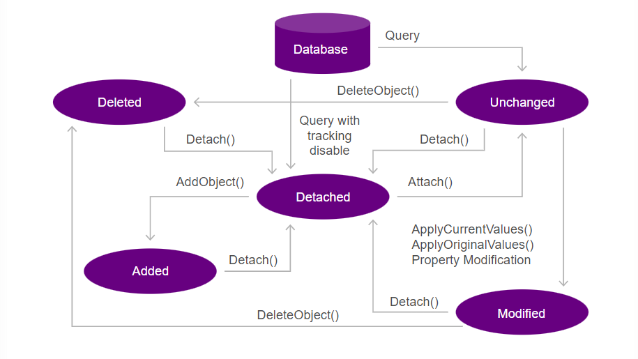

<h1>FASE 4 - FRAMEWORKS .NET</h1>
<h2>Capítulo 05: Persistência de Dados.</h2>

<h2>1. PERSISTÊNCIA DE DADOS</h2>

## 1.1 O que é Entity Framework (EF)?

- ferramenta essencial no ecossistema .NET.
- desempenha um papel fundamental como um mapeador objeto-relacional (ORM) que permite aos desenvolvedores interagirem com bancos de dados usando uma abordagem orientada a objetos. 
- serve como uma ponte entre o código .NET e as bases de dados relacionais, eliminando a necessidade de escrever código SQL extenso e complexo para manipular os dados.
- através do EF, desenvolvedores podem definir classes .NET que mapeiam para as tabelas de um banco de dados. 
- operações CRUD (Criar, Ler, Atualizar, Deletar) são executadas sobre essas classes utilizando `LINQ (Language Integrated Query)`, que é integrado naturalmente na linguagem C#.
- uma das ***principais vantagens do EF é sua flexibilidade***, que permite escolher a melhor estratégia de acordo com as necessidades do projeto:
  - `abordagem Code-First`: possibilita aos desenvolvedores definir os modelos de dados diretamente no código C#; o esquema do banco de dados é gerado a partir dos modelos definidos no código.
  - `abordagem Model-First`: permite projetar o modelo de dados utilizando um designer visual, geralmente integrado ao Visual Studio. Após a definição do modelo, o EF gera o código C# correspondente aos modelos e o esquema do banco de dados a partir desse modelo. 
  - `abordagem Database-First`: ideal para casos em que o esquema do banco de dados já está estabelecido. Com essa abordagem, os modelos de dados são gerados a partir do esquema existente do banco de dados, permitindo aos desenvolvedores trabalharem com bancos de dados pré-existentes.
- a ferramenta também é equipada com um sistema de migrações sofisticado, e assegura que as bases de dados possam evoluir sem interrupções significativas ou perda de dados.
- o EF é altamente extensível, permitindo personalizar o comportamento padrão para atender a necessidades específicas, seja através da escrita de interceptadores de comandos SQL, customização de estratégias de carregamento de dados, ou otimização de desempenho. 

## 1.2 Breve histórico e versões (EF 6 e EF Core)

- ***EF 6***:
  - introduzido como parte do .NET Framework.
  - conhecido por sua estabilidade e recursos completos voltados para aplicações que não requerem a flexibilidade do .NET Core. 
  - não está sendo ativamente desenvolvido, mas continua recebendo suporte.
  - ideal para sistemas que já o utilizam e não precisam de atualizações significativas.
- ***EF Core***:
  - projetado como uma versão mais leve e modular.
  - compatível com o .NET Core.
  - adequado para ambientes multiplataforma e aplicações modernas que exigem alta performance e escalabilidade. 
  - tem sido aprimorado continuamente, com adições de novas funcionalidades e melhorias de desempenho que não estão presentes no EF 6.E

## 1.3 Vantagens de usar o Entity Framework 

- permite um desenvolvimento ágil com sua abordagem de mapeamento objeto-relacional (ORM), transformando operações de banco de dados complexas em simples manipulações de objetos em C#.
- suporta várias estratégias de modelagem de dados, como Code-First. As migrações automatizadas simplificam a evolução do esquema do banco de dados ao longo do tempo, mantendo a base de dados sincronizada com o modelo de dados sem esforço manual.
- a eficiência também é uma vantagem destacada, especialmente com o EF Core, que traz melhorias contínuas de desempenho.

<h2>2. CONFIGURAÇÃO E SETUP</h2>

- para configurar a conexão com o banco de dados e utilizar o Entity Framework Core, instalar os pacotes necessários via `NuGet`, processo que assegura que todas as dependências requeridas estejam presentes e atualizadas para o correto funcionamento do nosso projeto.

## 2.1 Pacotes Necessários 

- Microsoft.EntityFrameworkCore.
- Microsoft.EntityFrameworkCore.Tools.
- Microsoft.EntityFrameworkCore.Design.
- Oracle.EntityFrameworkCore.

## 2.1.1. Instalando os pacotes

- `etapas`:
  - abra o Visual Studio e carregue seu projeto.
  - no menu principal, clique em Tools ou Clique com botão direito no nome do projeto na janela Solution Explorer.
  - no submenu que se abre, selecione NuGet Package Manager.
  - clique em Manage NuGet Packages for Solution.
- este caminho levará à janela do gerenciador de pacotes NuGet, onde é possível procurar, selecionar e instalar os pacotes necessários para o projeto, incluindo os relacionados ao Entity Framework Core.
- `para encontrar e instalar os pacotes necessários no NuGet Package Manager`: 
  - após abrir a janela do Manage NuGet Packages for Solution, clique na aba Browse.
  - use a barra de pesquisa para procurar o nome de cada pacote conforme listagem acima. Digite o nome do pacote e pressione Enter.
  - selecionar o pacote desejado da lista para ver mais detalhes e opções de instalação.
- `passos`:
  - selecione o pacote na listagem.
  - selecione o projeto que deseja instalar o pacote.
  - clique no botão “Install” ou “Instalar”.
- depois da instalação dos pacotes, é importante validar se tudo foi realizado corretamente: acessar o Solution Explorer e navegar até a pasta Dependencies\Packages, para vrerificar se os pacotes selecionados anteriormente estão listados no projeto. 

## 2.2 Conexão com diferentes tipos de Banco de Dados

- o EF oferece suporte a uma ampla variedade de sistemas de banco de dados através do uso de bibliotecas específicas, conhecidas como `provedores de banco de dados`. 
- os provedores funcionam como plug-ins para que o EF Core conecte-se a sistemas relacionais tradicionais como SQL Server e PostgreSQL ou bancos de dados não relacionais.
- podemos instalar vários packages para conectar com vários tipos de banco de dados.

Pacote do NuGet | Mecanismos de banco de dados com suporte
----------------|-----------------------------
Microsoft.EntityFrameworkCore.SqlServer | SQL do Azure e SQL Server 2012 em diante
Microsoft.EntityFrameworkCore.Sqlite | SQLite 3.7 em diante
Microsoft.EntityFrameworkCore.InMemory | Banco de dados em memória do EF Core
Microsoft.EntityFrameworkCore.Cosmos | API de SQL do Azure Cosmos DB
Npgsql.EntityFrameworkCore.PostgreSQL | PostgreSQL
Pomelo.EntityFrameworkCore.MySql | MySQL, MariaDB
MySql.EntityFrameworkCore | MySQL
Oracle.EntityFrameworkCore | Oracle Database 11.2 em diante
MongoDB.EntityFrameworkCore | MongoDB
Devart.Data.MySql.EFCore | MySQL 5 em diante
Devart.Data.Oracle.EFCore | Oracle Database 9.2.0.4 em diante
Devart.Data.PostgreSql.EFCore | PostgreSQL 8.0 em diante
Devart.Data.SQLite.EFCore | SQLite 3 em diante
Devart.Data.DB2.EFCore | DB2
Devart.Data.Bigcommerce.EFCore | BigCommerce
Devart.Data.Dynamics.EFCore | Microsoft Dynamics 365
Devart.Data.FreshBooks.EFCore | FreshBooks
Devart.Data.Magento.EFCore | Magento
Devart.Data.MailChimp.EFCore | MailChimp
Devart.Data.QuickBooks.EFCore | QuickBooks
Devart.Data.Salesforce.EFCore | Salesforce
Devart.Data.ExactTarget.EFCore | Salesforce MC (ExactTarget)
Devart.Data.Sugar.EFCore | SugarCRM
Devart.Data.Zoho.EFCore | Zoho CRM
MASES.EntityFrameworkCore.KNet | Apache Kafka
Interbase | InterBase
FirebirdSql.EntityFrameworkCore.Firebird | Firebird 3.0 em diante
IBM.EntityFrameworkCore | Db2, Informix
IBM.EntityFrameworkCore-lnx | Db2, Informix
IBM.EntityFrameworkCore-osx | Db2, Informix
EntityFrameworkCore.Jet | Arquivos do Microsoft Access
Google.Cloud.EntityFrameworkCore.Spanner | Google Cloud Spanner
Teradata.EntityFrameworkCore | Banco de dados Teradata 16.10 em diante
FileContextCore | Armazena dados em arquivos
FileBaseContext | Armazenar tabelas em arquivos
EntityFrameworkCore.SqlServerCompact35 | SQL Server Compact 3.5
EntityFrameworkCore.SqlServerCompact40 | SQL Server Compact 4.0
EntityFrameworkCore.OpenEdge | Progress OpenEdge

<h2>3. ARQUITETURA DO ENTITY FRAMEWORK</h2>

- os principais componentes do EF incluem:
  - provedor de dados, que se comunica com o banco de dados subjacente; 
  - modelo conceitual, que representa a estrutura lógica dos dados em termos de entidades e seus relacionamentos;
  - provedor LINQ, que permite consultar e manipular os dados usando a linguagem de consulta integrada à linguagem (LINQ). 

## 3.2 DbContext

- é uma classe central no EF e EF Core. 
- canal entre o código C# da aplicação e o banco de dados. 
- é parte do namespace Microsoft.EntityFrameworkCore.
- serve para configurar o modelo de dados, realizar consultas, e salvar alterações no banco de dados.
- o DbContext encapsula uma sessão com o banco de dados, oferecendo uma API simplificada para executar operações CRUD (Criar, Ler, Atualizar, Deletar) nas entidades mapeadas.
- `principais características e funcionalidades do DbContext`:
  - ***configuração de Modelo***: 
    - define como as classes de entidade são mapeadas para as tabelas do banco de dados, incluindo chaves primárias, relações, índices, e convenções de nomenclatura. 
    - essa configuração pode ser feita por meio de **DataAnnotations** diretamente nas classes de entidade ou através do **Fluent API** no próprio DbContext.
  - ***rastreamento de Mudanças***: 
    - DbContext rastreia as alterações feitas nas instâncias das entidades desde a última vez que foram carregadas ou desde a última chamada de SaveChanges().
    - permite que o EF Core envie comandos SQL eficientes para o banco de dados, atualizando apenas as partes que realmente mudaram.
  - ***execução de Consultas***: 
    - permite a execução de consultas LINQ para selecionar, filtrar, ordenar e agrupar dados de maneira eficiente. 
    - as consultas são traduzidas pelo EF Core em comandos SQL otimizados para o banco de dados em uso.
  - ***gerenciamento de Transações***: 
    - DbContext usa transações para garantir a consistência dos dados. 
    - pode gerenciar transações automaticamente ou permitir que você as controle manualmente para operações mais complexas.
  - ***caching de Primeiro Nível***: 
    - o EF Core armazena instâncias de entidades em cache no contexto, o que pode melhorar o desempenho ao reutilizar entidades já carregadas em operações subsequentes dentro do mesmo contexto.
  - ***migrações de Banco de Dados***:
    - o DbContext trabalha com o sistema de migrações do EF Core para aplicar mudanças incrementais no esquema do banco de dados, facilitando o controle de versão e a evolução do modelo de dados.

> Para ficar mais organizado, criaremos o namespace (pasta) no projeto com o nome de `Data\Contexts`, e dentro dessa pasta criaremos uma classe DatabaseContext que herda de System.Data.Entity.DbContext e incluiremos as definições das tabelas e relacionamentos, conforme necessário.

### 3.2.1 O construtor do DbContext
- é essencial ter um construtor específico para configurar a interação da aplicação com o banco de dados. 
- esse construtor é utilizado para passar configurações específicas para o DbContext por meio de uma instância de DbContextOptions. 
- assim é possível configurar detalhes importantes, como a string de conexão do banco de dados, o provedor de banco de dados (Oracle, SQL Server, PostgreSQL, SQLite etc.), comportamentos de logging e etc.
- permite à aplicação personalizar a conexão e o comportamento do DbContext com o banco de dados em tempo de execução. 
- normalmente, essas opções são configuradas no início da aplicação, por exemplo, no método ConfigureServices em uma aplicação ASP.NET Core. 

~~~csharp
using Microsoft.EntityFrameworkCore;
namespace Fiap.Web.Alunos.Data.Contexts
{
    public class DatabaseContext : DbContext
    {
        public DatabaseContext(DbContextOptions options) : base(options)
        {
        }
        protected DatabaseContext()
        {
        }
    }
}
~~~

### 3.2.2 E as configurações?
- com o ASP.NET Core, foi introduzida uma nova abordagem para lidar com configurações por meio de arquivos JSON, como `appsettings.json` e `appsettings.<Environment>.json`, onde &lt;Environment&gt; representa o ambiente específico em que a aplicação está sendo executada, como Development, Staging ou Production.
  - arquivo `appsettings.json`:
    - é o arquivo de configuração padrão utilizado por uma aplicação .NET Core. 
    - as configurações são armazenadas na forma de pares chave-valor e são carregadas automaticamente pelo framework no início da aplicação.
    - esse arquivo é destinado a definir configurações comuns a todos ambientes de execução da aplicação, como strings de conexão de banco de dados, configurações de log e outras preferências.
  - arquivo `appsettings<environment>.json`:
    - permite configurações específicas de cada ambiente, como Development, Staging ou Production.
    - o ASP.NET Core suporta arquivos de configuração nomeados como: appsettings.&lt;Environment>&gt;.json, appsettings.Development.json e appsettings.Production.json. 
    - esses arquivos substituem as configurações definidas em appsettings.json para o ambiente específico, possibilitando a personalização de configurações, como strings de conexão ou níveis de log, para diferentes ambientes sem a necessidade de alterar o código.
- uma das melhores formas de passar o ambiente para uma aplicação .NET Core é através de `variáveis de ambiente`. 
  - o ASP.NET Core fornece suporte nativo para a configuração do ambiente de execução por meio da variável de ambiente `ASPNETCORE_ENVIRONMENT`.

- ***para configurar a aplicação para usar o appsettings***, definir a variável de ambiente ASPNETCORE_ENVIRONMENT.
  - **Windows**: abra o prompt de comando e defina a variável de ambiente usando o comando (optando pelos ambientes Development ou Production):

~~~
set ASPNETCORE_ENVIRONMENT=Development
~~~

  - **Linux/macOS**: no aplicativo de terminal, usar o comando:

~~~
export ASPNETCORE_ENVIRONMENT=Development
~~~

> IMPORTANTE: Ao executar o projeto via Docker, a utilização da variável de configuração para o ambiente de produção depende de um serviço SSL (https) real. Essa dependência gera uma complexa configuração e exige um grande esforço da equipe de DevOps. Para simplificar o processo, optaremos por utilizar apenas o ambiente de desenvolvimento.

## 3.3 String de Conexão

- configuração essencial para estabelecer a conexão com o banco de dados, seja qual for. 
- cada banco de dados possui sua própria string de conexão, que contém informações como servidor de banco de dados, nome do banco de dados, credenciais de autenticação e outras configurações relevantes.
- no caso do `Oracle`, configurar uma string de conexão que seja compatível com este banco de dados.
  - o site [Connection Strings.com](https://www.connectionstrings.com/) oferece uma vasta lista de strings de conexão para uma variedade de bancos de dados e diferentes métodos de conexão.
- utilizar o código abaixo como base para modificar o arquivo appsettings.development.json e appsettings.json do projeto.

~~~json
{
  "Logging": {
    "LogLevel": {
      "Default": "Information",
      "Microsoft.AspNetCore": "Warning"
    }
  },
  "ConnectionStrings": {
    "DatabaseConnection": "Data Source=(DESCRIPTION = (ADDRESS_LIST = (ADDRESS = (PROTOCOL = TCP)(HOST = oracle.fiap.com.br)(PORT = 1521)))(CONNECT_DATA = (SID = orcl)));Persist Security Info=True;User ID=;Password=;Pooling=True;Connection Timeout=60;"
  },
  "AllowedHosts": "*"
}
~~~

> IMPORTANTE: Para utilizar o banco de dados Oracle da FIAP, certifique-se de alterar as propriedades User ID e Password, para outros bancos de dados Oracle lembre-se também de alterar as propriedades HOST, PORT e SID.

## 3.4 Inicializando o DbContext

- para configurar qual banco de dados será utilizado durante a inicialização do projeto, acessar a classe inicializadora do projeto (`Program.cs`).
- informar ao serviço geral da aplicação que temos um contexto de banco de dados e que esse contexto utilizará nossa string de conexão para obter os dados necessários para se conectar ao banco Oracle.

~~~csharp
#region IMPORTAÇÃO REFERENTE AO BANCO DE DADOS
using Fiap.Web.Alunos.Data.Contexts;
using Microsoft.EntityFrameworkCore;
#endregion
var builder = WebApplication.CreateBuilder(args);
#region INICIALIZANDO O BANCO DE DADOS
var connectionString = builder.Configuration.GetConnectionString("DatabaseConnection");
builder.Services.AddDbContext<DatabaseContext>(
    opt => opt.UseOracle(connectionString).EnableSensitiveDataLogging(true)
);
#endregion
// Add services to the container.
builder.Services.AddControllersWithViews(); 
... código suprimido …
~~~

> IMPORTANTE: o método `GetConnectionString` recebe como parâmetro o mesmo nome da chave que definimos no arquivo `appsettings`, contendo a string de conexão com o banco de dados.

> [Link da solução implementada até o momento para download no GitHub](https://github.com/FIAP/ON_TDS_DOTNET_EF/tree/08-ef-setup).

<h2>4. MODELAGEM DE DADOS</h2>

- optaremos pela estratégia Code-First para os próximos passos.
- essa escolha simplifica o processo de desenvolvimento e oferece uma compreensão clara das alterações necessárias no projeto para adotar a estratégia Database-First, caso seja necessário.

## 4.1 Code First

- é uma abordagem dentro do Entity Framework que ***prioriza a criação de classes de domínio C# para modelar o banco de dados de uma aplicação***.
- ao contrário do Database First, que começa com um banco de dados já existente, o ***Code First permite aos desenvolvedores definir a estrutura do banco de dados por meio de código***, o que é útil durante o desenvolvimento inicial ou quando se prefere a flexibilidade de definir o banco de dados como parte do processo de desenvolvimento de software.
- com o Code First, você modela suas entidades no código usando `classes POCO (Plain Old CLR Objects)`:
	-  são ***classes simples sem dependências de frameworks específicos***. 
	- essas classes representam as tabelas do banco de dados e suas relações. 
- a partir destas classes, o Entity Framework gera o esquema do banco de dados que inclui tabelas, chaves primárias, índices, chaves estrangeiras e relações. 
- além disso, o Code First oferece a capacidade de utilizar migrações para evoluir o banco de dados de maneira control ada e versionada à medida que o modelo de domínio da aplicação se desenvolve.
- Code First é compatível com um desenvolvimento ágil e iterativo, permitindo ajustes rápidos no modelo à medida que novos requisitos surgem ou mudanças são necessárias.

## 4.2 Database-First

- é uma estratégia de desenvolvimento no Entity Framework onde se inicia pelo design do banco de dados. 
- nesse método, primeiro cria-se o esquema do banco de dados diretamente numa ferramenta de design de banco de dados ou via SQL e, uma vez que o banco de dados está definido, você utiliza o Entity Framework para gerar as classes de entidade que mapeiam as tabelas do banco de dados no código da aplicação.
- é vantajosa quando se trabalha com um banco de dados já existente ou quando a modelagem dos dados é mais complexa e requer cuidados especiais na sua elaboração, que é mais bem gerenciada por DBAs ou por meio de ferramentas de design visual de banco de dados. 
- o Database-First se adapta bem a ambientes onde a estrutura do banco de dados é a principal liderança no desenvolvimento da aplicação.
- através de ferramentas como o Entity Framework Designer, os desenvolvedores podem criar um modelo visual (EDMX) que reflete o esquema do banco de dados e, com base nesse modelo, o Entity Framework gera o código necessário para acessar os dados. 
- a principal vantagem é que alterações no design do banco de dados podem ser facilmente importadas para atualizar o modelo da aplicação. 
- porém, pode também introduzir desafios quando as alterações são frequentes, exigindo um ciclo contínuo de sincronização entre o banco de dados e o código.

## 4.3 Model-First

- é uma maneira de desenvolvimento que equilibra entre o "Code First" e o "Database-First". 
- nesta estratégia, o desenvolvimento começa com a criação de um modelo conceitual visual usando a ferramenta de design do Entity Framework, que é parte do Visual Studio. 
	- o modelo é essencialmente um diagrama que define as entidades e os relacionamentos entre elas.
- o processo do Model-First é ideal para quem prefere uma representação visual e abstrata das estruturas de dados e relacionamentos antes de qualquer código ou banco de dados ser gerado. 
- é útil quando a estrutura do projeto é complexa e se beneficia de uma fase de planejamento e modelagem cuidadosa para melhor entender e comunicar as necessidades do sistema.
- após desenhar o modelo, o Entity Framework pode automaticamente gerar o SQL necessário para criar o banco de dados que atende a esse modelo, assim como as classes de entidade que são usadas para interagir com esse banco de dados. 
- um dos benefícios do modelo é que fornece uma visão clara e documentada da estrutura do banco de dados, o que é uma vantagem tanto para novos projetos quanto para equipes que necessitam compartilhar e discutir a arquitetura do sistema. 
- a sincronização entre o modelo e o banco de dados é gerenciada pelo próprio Entity Framework, que pode atualizar o banco de dados sempre que o modelo conceitual for alterado, mantendo a base de dados alinhada com o modelo de entidades.

## 4.4 Técnicas para configuração de modelos

- duas técnicas que o EF disponibiliza para os desenvolvedores configurarem modelos de entidades e relacionamentos: `Anotações de Dados` e `Fluent API`.

## 4.5 Anotações de Dados 

- proporcionam uma maneira direta e rápida de configurar o esquema do banco de dados diretamente no código das classes de modelo. 
- são atributos que podem ser aplicados às propriedades das classes, permitindo definir diversos aspectos do esquema. 
- exemplos: 
  - ao adicionar a `anotação [Key]` a uma propriedade, é especificada a chave primária da entidade. 
  - a `anotação [Required]` indica que um campo não pode ser nulo.
  - `[StringLength(50)]` estabelece um limite de tamanho para uma determinada propriedade de string.
- além disso, anotações podem ser usadas para definir relações entre tabelas, como chaves estrangeiras, e para impor restrições de validação. - exemplo:

~~~csharp
using System.ComponentModel.DataAnnotations;
using System.ComponentModel.DataAnnotations.Schema;
using Microsoft.EntityFrameworkCore;
namespace Fiap.Web.Alunos.Models
{
    [Table("Pedidos")]
    [Index(nameof(NomeProduto), IsUnique = true)]
    public class PedidoModel
    {
        [Key]
        public int PedidoId { get; set; }
        [Required]
        public string NomeProduto { get; set; }
        [Required]
        public decimal Preco { get; set; }
        [ForeignKey(nameof(Cliente))]
        public int ClienteId { get; set; }
        public ClienteModel Cliente { get; set; } // Navigation Property
    }
}
~~~

- neste exemplo, as anotações `[Key]` e `[Required]` são usadas para definir a chave primária e impor a obrigatoriedade de certas propriedades na classe PedidoModel. 
- a anotação `[ForeignKey]` estabelece a relação entre a tabela de pedidos e a tabela de clientes por meio da propriedade ClienteId. 
- as anotações `[Table("Pedidos")]` e `[Index(nameof(NomeProduto), IsUnique = true)]` são adicionadas para especificar o nome da tabela no banco de dados e criar um índice único na coluna NomeProduto, respectivamente. 
- as anotações do `System.ComponentModel.DataAnnotations` são principalmente usadas para validar e exibir dados em uma aplicação, e nem todas elas afetam diretamente o esquema do banco de dados. 
  - exemplo: anotações como `[Required]`, `[StringLength]` e `[RegularExpression]` são usadas para validar dados em modelos de banco de dados.
- porém há algumas anotações do `System.ComponentModel.DataAnnotations.Schema` que são especificamente projetadas para influenciar o mapeamento de objetos para o banco de dados. 
  - exemplo: `[Table]`, `[Column]`, `[ForeignKey]` e `[NotMapped]` são usadas para definir o nome da tabela, nome da coluna, chaves estrangeiras e propriedades não mapeadas no banco de dados.
- ***listas de algumas das anotações mais comuns que podem ser usadas na camada model do Entity Framework Core***.

### a) DataAnnotations:
- `[Key]`: Define a propriedade como chave primária.
- `[Required]`: Indica que a propriedade é obrigatória.
- `[StringLength(int)]`: Define o comprimento máximo da string.
- `[Range(min, max)]`: Especifica um intervalo de valores válidos para a propriedade numérica.
- `[RegularExpression(pattern)]`: Especifica uma expressão regular para validar o valor da propriedade.
- `[Display(Name)]`: Define o rótulo a ser exibido para a propriedade em interfaces de usuário.
- `[DataType(DataType)]`: Especifica o tipo de dado a ser exibido em interfaces de usuário.
- `[EmailAddress]`: Valida se o valor da propriedade é um endereço de e-mail válido.
- `[Phone]`: Valida se o valor da propriedade é um número de telefone válido.
- `[CreditCard]`: Valida se o valor da propriedade é um número de cartão de crédito válido.

### b) DataAnnotations.Schema:
- `[Table(name)]`: Especifica o nome da tabela no banco de dados.
- `[Column(name, Type)]`: Especifica o nome e o tipo da coluna no banco de dados.
- `[ForeignKey(name)]`: Especifica o nome da chave estrangeira em uma propriedade de navegação.
- `[NotMapped]`: Indica que a propriedade não é mapeada para uma coluna no banco de dados.
- `[DatabaseGenerated(DatabaseGeneratedOption)]`: Especifica como o valor da propriedade é gerado no banco de dados, como Identity ou Computed.
- `[InverseProperty(property)]`: Especifica a propriedade de navegação inversa em um relacionamento bidirecional.

> Ao usar anotações do `DataAnnotations`, é importante entender a distinção entre as anotações que afetam a validação de dados e aquelas que influenciam a estrutura do banco de dados.

## 4.6 Fluent API

- oferece uma abordagem mais poderosa e flexível para configurar modelos no Entity Framework. 
- em vez de usar atributos, como nas anotações de dados, a Fluent API utiliza chamadas de método encadeadas para configurar aspectos específicos dos modelos de entidade e seus relacionamentos. 
- essa configuração é geralmente realizada dentro do método OnModelCreating da classe de contexto do banco de dados.
- com a Fluent API, os desenvolvedores têm um controle detalhado sobre o mapeamento do banco de dados, incluindo definições de tabelas, colunas, chaves, índices, relações e heranças. 
- se destaca em situações em que as configurações são complexas ou quando se deseja evitar a poluição das `classes POCO` (ou Plain Old CLR Object).
  - classe comum em C# que não herda de nenhuma classe base específica e não implementa nenhuma interface especial.
  - é uma classe simples que contém propriedades para armazenar dados, mas não possui lógica de negócios complexa. 
  - no contexto do Entity Framework, as classes POCO são usadas para representar entidades do banco de dados, facilitando o mapeamento entre o modelo de dados relacional e as classes de modelo de aplicativo.
- os códigos abaixo exemplificam o uso da Fluent API. 
  - a classe PedidoModel é a mesma utilizada anteriormente, porém as anotações foram removidas. 
  - a classe ApplicationDbContext é um contexto genérico que contém o método OnModelCreating com todo o conjunto de instruções da Fluent API. 

~~~csharp
namespace Fiap.Web.Alunos.Models
{
    public class PedidoModel
    {
        public int PedidoId { get; set; }
        public string NomeProduto { get; set; }
        public decimal Preco { get; set; }
        public int ClienteId { get; set; }
        public ClienteModel Cliente { get; set; }
    }
}
~~~

~~~csharp
using System.ComponentModel.DataAnnotations;
using System.ComponentModel.DataAnnotations.Schema;
using Microsoft.EntityFrameworkCore;
namespace Fiap.Web.Data.Contexts
{
    public class ApplicationDbContext : DbContext
    {
        public DbSet<PedidoModel> Pedidos { get; set; }
        public DbSet<ClienteModel> Clientes { get; set; }
        // Adicione outros DbSet conforme necessário para outras entidades
        public ApplicationDbContext(DbContextOptions<ApplicationDbContext> options) : base(options)
        {
        }
        protected override void OnModelCreating(ModelBuilder modelBuilder)
        {
            modelBuilder.Entity<PedidoModel>()
                .ToTable("Pedidos")
                .HasKey(p => p.PedidoId);
            modelBuilder.Entity<PedidoModel>()
                .Property(p => p.NomeProduto)
                .IsRequired();
            modelBuilder.Entity<PedidoModel>()
                .HasIndex(p => p.NomeProduto)
                .IsUnique();
            modelBuilder.Entity<PedidoModel>()
                .Property(p => p.Preco)
                .IsRequired();
            modelBuilder.Entity<PedidoModel>()
                .HasOne(p => p.Cliente)
                .WithMany(c => c.Pedidos)
                .HasForeignKey(p => p.ClienteId);
        }
    }
}
~~~

- o exemplo demonstra como configurar a classe PedidoModel usando FluentAPI dentro do método OnModelCreating da classe de contexto ApplicationDbContext. 
- as configurações incluem a definição da tabela, chave primária, propriedades obrigatórias e um índice único. 
- além disso, a relação entre PedidoModel e ClienteModel é configurada usando a Fluent API.

> DICA: Ambas as técnicas podem ser utilizadas em um projeto, dependendo das necessidades específicas. Anotações de Dados oferecem um caminho rápido e fácil para definições comuns de esquema diretamente nas classes de modelo, enquanto a Fluent API permite uma configuração mais detalhada e complexa no método `OnModelCreating` da classe de contexto do banco de dados. No entanto, para manter uma padronização no projeto, é importante escolher uma das duas técnicas e adotá-la consistentemente em todo o código. A escolha muitas vezes se resume à preferência do desenvolvedor e aos requisitos técnicos do projeto.

- lista de alguns dos métodos mais comuns que podem ser usados no método `OnModelCreating` da classe de contexto para configurar o modelo de banco de dados usando Fluent API no Entity Framework Core:
  - `Entity<TEntity>()`: Especifica a configuração para uma entidade específica.
  - `ToTable()`: Especifica o nome da tabela para uma entidade.
  - `HasKey()`: Define a chave primária para uma entidade.
  - `Property()`: Configura uma propriedade de uma entidade.
  - `HasOne()`: Define um relacionamento de um-para-um ou muitos-para-um.
  - `HasMany()`: Define um relacionamento de um-para-muitos.
  - `WithMany()`: Especifica a entidade relacionada para um relacionamento de muitos-para-muitos.
  - `HasForeignKey()`: Define a chave estrangeira para uma entidade.
  - `IsRequired()`: Especifica que uma propriedade é obrigatória.
  - `IsOptional()`:Especifica que uma propriedade é opcional.
  - `IsUnique()`: Especifica que uma propriedade deve ter valores exclusivos.
  - `HasIndex()`: Cria um índice para uma ou mais colunas de uma tabela.
  - `Ignore()`: Ignora uma propriedade na modelagem do banco de dados.
  - `UsePropertyAccessMode()`: Configura o modo de acesso de uma propriedade de navegação.

<h2>5. MIGRAÇÕES</h2>

- surgiram como uma resposta às necessidades dos desenvolvedores de manter o esquema de banco de dados alinhado com os modelos de dados em aplicações .NET. 
- inicialmente introduzidas no Entity Framework 4.3, as migrações foram aprimoradas ao longo das versões subsequentes para oferecer mais controle, flexibilidade e segurança na gestão de esquemas de banco de dados.
- no Entity Framework 6, as migrações alcançaram maturidade com a introdução de recursos como migrações automáticas e o comando `Update-Database`, que facilitou a aplicação de alterações no banco de dados diretamente a partir do ambiente de desenvolvimento. 
- com a evolução para o Entity Framework Core e agora no EF8, as migrações foram integradas ainda mais profundamente ao processo de desenvolvimento, permitindo que desenvolvedores utilizem comandos via CLI (Command Line Interface), além do suporte anterior via NuGet Package Manager Console.

## 5.1 Funcionamento e benefícios das Migrações no EF8

- as migrações no EF permitem que os desenvolvedores controlem as alterações no esquema do banco de dados através de um conjunto de arquivos que representam cada mudança incremental que deve ser aplicada ou revertida. 
- cada arquivo de migração contém métodos `Up` e `Down`:
  - método `Up` é usado para aplicar alterações ao banco de dados (como adicionar uma nova tabela ou campo).
  - método `Down` reverte essas alterações.
- quando uma nova migração é adicionada, o EF compara o modelo de dados atual com o esquema do banco de dados e gera um script de migração que reflete as diferenças. 
- outros benefícios das migrações:
  - ***Controle de Versão***: cada migração é tratada como uma versão do esquema do banco de dados, sendo possível navegar entre versões anteriores e futuras do esquema.
  - ***Integração Contínua***: migrações podem ser integradas ao processo de integração e entrega contínuas (CI/CD), permitindo a aplicação automática de migrações em diferentes ambientes de desenvolvimento, teste e produção.
  - ***Desenvolvimento Colaborativo***: permitem que múltiplos desenvolvedores trabalhem em diferentes partes do modelo de dados sem interferir uns com os outros, sincronizando as alterações através do controle de versão.

## 5.2 Comparação entre EF e FlywayDB

- ao escolher uma ferramenta para gerenciar migrações de banco de dados, ***considerar vários fatores***, como linguagem de programação, facilidade de uso, e integração com o ambiente de desenvolvimento existente. 
- ***Entity Framework 8 (EF8)*** e ***FlywayDB*** se destacam como duas das ferramentas mais populares para gerenciamento de migrações em ambientes .NET e Java, respectivamente. 
- embora ambos sirvam ao mesmo propósito fundamental (de gerenciar alterações no esquema do banco de dados de forma controlada), apresentam ***diferenças significativas em termos de implementação e uso***:
  - **Integração com a Linguagem de Programação**:
    - EF8 é projetado para ser usado com C# e outros idiomas .NET, o que significa que ele se integra naturalmente ao código .NET e permite que migrações sejam escritas em C#. 
    - FlywayDB usa scripts SQL puros para definir migrações, tornando-o mais flexível e adequado para projetos que utilizam várias linguagens de programação, mas potencialmente menos integrado em ambientes .NET.
  - ***Abordagem de Migração***: 
    - EF8 gera automaticamente scripts de migração com base nas alterações detectadas nos modelos de dados.
    - FlywayDB requer que os desenvolvedores escrevam manualmente os scripts SQL. 
    - isso pode fazer com que o EF8 seja mais conveniente para desenvolvedores que preferem uma abordagem centrada no código, enquanto o FlywayDB pode ser mais adequado para equipes que desejam manter um controle explícito sobre as alterações de banco de dados através de SQL.
  - ***Suporte a Ambientes***: 
    - ambas as ferramentas suportam múltiplos ambientes de banco de dados.
    - a abordagem baseada em código do **EF8** pode ser mais suscetível a erros de sincronização entre o modelo de dados e o banco de dados se não for cuidadosamente gerenciada. 
    - **FlywayDB**, ao lidar diretamente com SQL, pode oferecer mais precisão e controle, o que é especialmente útil em ambientes complexos ou quando se trabalha com múltiplos bancos de dados.
  - ***Ferramentas e Ecossistema***: 
    - **EF8** é fortemente integrado ao Visual Studio e outros ambientes de desenvolvimento .NET, oferecendo uma experiência mais coesa se você já está trabalhando dentro do ecossistema Microsoft. 
    - **FlywayDB**, sendo agnóstico de plataforma, não oferece a mesma integração direta, mas pode ser mais flexível em termos de integração com ferramentas de CI/CD e outros sistemas de controle de versão.

## 5.3 Comandos de migração, como usar?

- utilizaremos a ferramenta ***Package Manager Console*** no Visual Studio, porém também é possível aplicar todos os comandos de migração por meio do dotnet CLI (Command Line Interface).
- passos abaixo para abrir o console:
  - 1. Acesse o Console pelo menu principal do Visual Studio, clique em Tools > NuGet Package Manager > Package Manager Console. 
  - 2. Isso abrirá o console na parte inferior do ambiente do Visual Studio, permitindo que você digite e execute comandos NuGet e Entity Framework.

### 5.3.1 Criar uma Migração
- para adicionar uma nova migração ao seu projeto, use o comando abaixo no PMC. 
- isso criará um arquivo de migração na solução, representando as alterações no esquema do banco de dados desde a última migração.

~~~
Add-Migration NomeDaMigracao
~~~

- para aplicar todas as migrações pendentes ao banco de dados, utilize o seguinte comando, que atualizará o banco de dados para corresponder ao estado mais recente do modelo de dados conforme definido pelas migrações.

~~~
Update-Database
~~~

### 5.3.2 Reverter Migrações
- se você precisar reverter uma migração específica, pode usar o comando abaixo, o qual reverterá todas as migrações até (e incluindo) a migração especificada, ajustando o banco de dados para o estado anterior a essas migrações.

~~~
Update-Database -Migration NomeDaMigracaoAnterior
~~~

- se desejar reverter todas as migrações aplicadas e retornar ao estado inicial do banco de dados (sem migrações aplicadas), você pode usar o comando:

~~~
Update-Database -Migration 0
~~~

### 5.3.3 Considerações ao usar comandos de migração
- ao trabalhar com migrações no Entity Framework 8 utilizando o Package Manager Console no Visual Studio, é crucial seguir os comandos corretamente para evitar problemas potenciais. 
- considerações e cenários que podem surgir se os comandos de migração não forem aplicados corretamente:
  - 1. ***Migração criada e não aplicada***: 
    - se criar uma migração usando o comando `Add-Migration` mas não aplicá-la usando `Update-Database`, o esquema do banco de dados não estará sincronizado com o modelo de dados no seu código. 
    - pode resultar em erros de execução onde o aplicativo tenta acessar ou modificar tabelas ou colunas que não existem no banco de dados.
  - 2. ***Reversão não aplicada***:
    - se uma migração for revertida no código (removendo ou modificando o arquivo de migração) mas o comando `Update-Database` não for executado, também pode levar a inconsistências. 
    - por exemplo, se uma coluna for removida do modelo e a migração não for aplicada, o aplicativo ainda tentará usar essa coluna, levando a erros da aplicação e no banco de dados, como:
      - **Erros de Runtime**: os aplicativos podem falhar durante a execução devido à falta de tabelas, colunas ou devido a discrepâncias entre os modelos de dados e as estruturas de banco de dados reais.
      - **Dados Corrompidos**: executar uma migração errada ou não executar uma migração necessária pode levar a operações de banco de dados que corrompem dados, especialmente se as migrações envolverem alterações críticas na estrutura das tabelas.

### 5.3.4 Precauções e Soluções para evitar erros durante o ciclo de desenvolvimento
- `Verificações de Consistência`: antes de aplicar migrações, sempre verifique se o estado do código e do banco de dados estão consistentes. Use o comando `Get-Migrations` para verificar quais migrações estão pendentes.
- `Ambiente de Teste`: aplique sempre as migrações primeiro em um ambiente de teste para verificar se tudo funciona como esperado antes de aplicar em produção.
- `Backups Frequentes`: mantenha uma política de backups frequentes do banco de dados para garantir que você possa restaurar o estado anterior em caso de falha nas migrações.
- `Logs de Erro`: monitore os logs de erro cuidadosamente após aplicar migrações para detectar rapidamente qualquer problema que possa surgir.

<h2>6. NOSSA BASE DE DADOS</h2>

- agora é hora de unir todas as peças, iniciando a jornada prática para aplicar o conhecimento e usar o EF como uma ferramenta no desenvolvimento de aplicações.
- nesta seção, focaremos na modelagem das classes e na migração para o banco de dados. Em etapas futuras, aprofundaremos mais em técnicas eficazes para manipular os dados diretamente no banco.

> DICA: Como lidaremos com vários comandos que modificam a estrutura do banco de dados, incluindo adição de tabelas, índices e constraints, é recomendável o uso de uma ferramenta visual para acompanhar essas alterações. Para este conteúdo, utilizaremos o SQL Developer da Oracle,porém há outras opções como DBeaver, HeidiSQL, DataGrip.

## 6.1 Primeira migração 

- a primeira migração e o primeiro modelo que mapearemos do C# para o banco de dados será a classe `RepresentanteModel`. 

### 6.1.1 Adicionar o DBset à classe DbContext
- o primeiro passo é adicionar uma propriedade DbSet para a classe RepresentanteModel na classe DatabaseContext, o que informa ao Entity Framework que RepresentanteModel é uma entidade que deve ser mapeada para uma tabela no banco de dados.

~~~csharp
using Fiap.Web.Alunos.Models;
using Microsoft.EntityFrameworkCore;
namespace Fiap.Web.Alunos.Data.Contexts
{
    public class DatabaseContext : DbContext
    {
        // PROPRIEDADE PARA MANIPULAR A ENTIDADE DE REPRESENTANTE
        public DbSet<RepresentanteModel> Representantes { get; set; }
        public DatabaseContext(DbContextOptions options) : base(options)
        {
        }
        protected DatabaseContext()
        {
        }
    }
}
~~~

### 6.1.2 Configuração com Fluent API
- embora a configuração básica de DbSet já seja suficiente para o EF gerar uma migração, você pode querer configurar detalhes específicos da entidade RepresentanteModel usando a Fluent API no método OnModelCreating da classe DatabaseContext. 
- por exemplo, para especificar o nome da tabela, configurar chaves primárias, ou definir índices. 

~~~csharp
using Fiap.Web.Alunos.Models;
using Microsoft.EntityFrameworkCore;
namespace Fiap.Web.Alunos.Data.Contexts
{
    public class DatabaseContext : DbContext
    {
        // PROPRIEDADE PARA MANIPULAR A ENTIDADE DE REPRESENTANTE
        public DbSet<RepresentanteModel> Representantes { get; set; }
        // MÉTODO UTILIZADO PARA CRIAÇÃO DOS ELEMENTOS NO BANCO DE DADOS
        protected override void OnModelCreating(ModelBuilder modelBuilder)
        {
            modelBuilder.Entity<RepresentanteModel>(entity =>
            {
                // Definindo um nome para tabela
                entity.ToTable("Representantes");
                // Definindo chave primária
                entity.HasKey(e => e.RepresentanteId);
                // Tornando o nome obrigatório
                entity.Property(e => e.NomeRepresentante).IsRequired();
                // Adicionando índice único para CPF
                entity.HasIndex(e => e.Cpf).IsUnique(); 
            });
        }
        public DatabaseContext(DbContextOptions options) : base(options)
        {
        }
        protected DatabaseContext()
        {
        }
    }
}
~~~

> IMPORTANTE: Não esqueça de trocar usuário e senha no arquivo de configuração appsetting.json.

## 6.2 Gerar a migração e aplicar ao banco de dados 

- após configurar o DbContext, você deve gerar a migração usando o Package Manager Console no Visual Studio com o comando:

~~~
Add-Migration AddRepresentantes
~~~

- antes de aplicar as alterações no banco de dados, é possível confirmar se estamos no caminho certo observando duas áreas específicas em nosso projeto:
  - a primeira é o log ou as mensagens exibidas no Package Manager Console, que indicam o resultado da execução dos comandos de migração. 
  - a segunda é na janela Solution Explorer, onde você deverá verificar a criação da pasta `Migrations` e de uma nova classe cuja nomenclatura começa com um timestamp, seguido do nome dado à migração. 

- para aplicar a migração ao banco de dados, use o comando:

~~~
Update-Database
~~~

- após executar o comando `Update-Database`, é possível validar o sucesso da operação verificando o log do Package Manager Console e examinando a estrutura de tabelas no banco de dados. 
- as alterações aplicadas devem refletir o que foi definido nas migrações. 
- notaremos a presença de uma tabela especial chamada `_EFMigrationsHistory` no banco de dados, criada automaticamente pelo Entity Framework, e que desempenha um papel crucial na gestão das migrações. 
  - ela armazena um registro de todas as migrações que foram aplicadas ao banco de dados, permitindo que o Entity Framework verifique quais migrações já estão em vigor e quais ainda precisam ser aplicadas. 
  - a existência desta tabela garante que as migrações possam ser aplicadas, revertidas e gerenciadas de forma segura e eficaz.

> [Link da solução implementada até o momento para download no GitHub](https://github.com/FIAP/ON_TDS_DOTNET_EF/tree/09-modelagem-migration-representante).

## 6.3 Primeiro relacionamento 

- vamos implementar o código com Fluent API para o modelo de cliente, e adicionar o relacionamento com o modelo de representante. 
- o processo para essa implementação é similar ao que fizemos para a entidade de representantes. 
  - primeiro, declare o `DbSet` para o `ClienteModel`. 
  - no método `OnModelCreating`, adicione o mapeamento e as configurações para a entidade `ClienteModel`. 
  - em seguida, crie uma migração (nome: `AddClientes`) e aplique essa migração no banco de dados. 
- o relacionamento é configurado usando os métodos `HasOne()`, `WithMany()`, `HasForeignKey()` e `IsRequired()`. 

~~~csharp
using Fiap.Web.Alunos.Models;
using Microsoft.EntityFrameworkCore;
namespace Fiap.Web.Alunos.Data.Contexts
{
    public class DatabaseContext : DbContext
    {
        // PROPRIEDADE PARA MANIPULAR A ENTIDADE DE REPRESENTANTE
        public DbSet<RepresentanteModel> Representantes { get; set; }

        // PROPRIEDADE PARA MANIPULAR A ENTIDADE DE CLIENTE
        public DbSet<ClienteModel> Clientes { get; set; }

        // MÉTODO UTILIZADO PARA CRIAÇÃO DOS ELEMENTOS NO BANCO DE DADOS - REPRESENTANTES e CLIENTES
        protected override void OnModelCreating(ModelBuilder modelBuilder)
        {
            modelBuilder.Entity<RepresentanteModel>(entity =>
            {
                // Definindo um nome para tabela
                entity.ToTable("Representantes");
                // Definindo chave primária
                entity.HasKey(e => e.RepresentanteId);
                // Tornando o nome obrigatório
                entity.Property(e => e.NomeRepresentante).IsRequired();
                // Adicionando índice único para CPF
                entity.HasIndex(e => e.Cpf).IsUnique();
            });

            modelBuilder.Entity<ClienteModel>(entity => 
            {
                // Define o nome da tabela para 'Clientes'
                entity.ToTable("Clientes");
                // Definindo chave primária
                entity.HasKey(e => e.ClienteId);
                // Tornando o nome obrigatório
                entity.Property(e => e.Nome).IsRequired();
                // Tornando o email obrigatório
                entity.Property(e => e.Email).IsRequired();
                // Especifica o tipo de dado para DataNascimento
                entity.Property(e => e.DataNascimento).HasColumnType("date");
                // Especifica o tamanho máximo do campo Observação
                entity.Property(e => e.Observacao).HasMaxLength(500);
                // Configuração da relação com RepresentanteModel/
                // Define a relação de um para um com RepresentanteModel
                entity.HasOne(e => e.Representante)
                // Indica que um Representante pode ter muitos Clientes
                      .WithMany()
                // Define a chave estrangeira
                      .HasForeignKey(e => e.RepresentanteId)
                // Torna a chave estrangeira obrigatória
                      .IsRequired(); });
        }
        public DatabaseContext(DbContextOptions options) : base(options)
        {
        }
        protected DatabaseContext()
        {
        }
    }
}
~~~

> comandos e passos para validar para reversão, caso queira praticar:

- reverter à migração anterior:

~~~
Update-Database -Migration AddRepresentantes
~~~

- remover a migração de clientes:

~~~
Remove-Migrations
~~~

- recriar e Aplicar a Migração:

~~~
Add-Migration AddCliente
~~~

- aplicar a migração:

~~~
Update-Database
~~~

> [Link da solução implementada até o momento para download no GitHub](https://github.com/FIAP/ON_TDS_DOTNET_EF/tree/10-modelagem-migration-cliente).

## 6.4 Demais mapeamentos 

- vamos enriquecer o nosso sistema adicionando novas entidades como Produto, Pedido, Fornecedores e Lojas. 
- Diagrama de Classes atualizado:
  - Representante: Propriedades - Cpf, NomeRepresentante, RepresentanteId.
  - ClienteModel: Propriedades- ClienteId, DataNascimento, Email, Nome
Observacao, RepresentanteId, Sobrenome.
  - PedidoProduto: Propriedades - PedidoId, ProdutoId.
  - Loja: Propriedades - Enderelco, LojaId, Nome, Pedidos.
  - Pedido: Propriedades - ClienteId, DataPedido, LojaId, PedidoId.
  - Produto: Propriedades - Descrição, FornecedorId, Nome, PedidoProdutos, Preco, ProdutoId.
  - Fornecedor: Propriedades - Formecedor, Nome, Produtos.
- praticamente todas as classes estão interligadas, destacando-se o relacionamento entre Pedido, PedidoProdutos e Produtos. 
- códigos-fontes para as classes de modelos que ainda não foram implementadas em nosso projeto:

### a) Classe Model Fornecedor:

~~~csharp
namespace Fiap.Web.Alunos.Models
{
    public class FornecedorModel
    {
        public int FornecedorId { get; set; }
        public string Nome { get; set; }
        // Relacionamento com Produto
        public List<ProdutoModel> Produtos { get; set; }
    }
}
~~~

### b) Classe Model Loja:

~~~csharp
namespace Fiap.Web.Alunos.Models
{
    public class LojaModel
    {
        public int LojaId { get; set; }
        public string Nome { get; set; }
        public string Endereco { get; set; }
        // Relacionamento com Pedido
        public List<PedidoModel> Pedidos { get; set; }
    }
}
~~~

### c) Classe Model Pedido:

~~~csharp
namespace Fiap.Web.Alunos.Models
{
    public class PedidoModel
    {
        public int PedidoId { get; set; }
        public DateTime DataPedido { get; set; }
        // Relacionamento com Cliente
        public int ClienteId { get; set; }
        public ClienteModel Cliente { get; set; }
        // Relacionamento com Loja
        public int LojaId { get; set; }
        public LojaModel Loja { get; set; }
        // Relacionamento com Produto
        public List<PedidoProdutoModel> PedidoProdutos { get; set; }
    }
}
~~~

### d) Classe Model Produto:

~~~csharp
namespace Fiap.Web.Alunos.Models
{
    public class ProdutoModel
    {
        public int ProdutoId { get; set; }
        public string Nome { get; set; }
        public decimal Preco { get; set; }
        public string Descricao { get; set; }
        // Relacionamento com Fornecedor
        public int FornecedorId { get; set; }
        public FornecedorModel Fornecedor { get; set; }
        // Relacionamento com Pedido
        public List<PedidoProdutoModel> PedidoProdutos { get; set; }
    }
}
~~~

### e) Classe Model PedidoProduto:

~~~csharp
namespace Fiap.Web.Alunos.Models
{
    public class PedidoProdutoModel
    {
        public int PedidoId { get; set; }
        public PedidoModel Pedido { get; set; }
        public int ProdutoId { get; set; }
        public ProdutoModel Produto { get; set; }
    }
}
~~~

- para completar a configuração da base de dados, seguir os passos determinados pelo Entity Framework. 
- inicie definindo os `DbSet` para cada entidade na classe `DatabaseContext`.
- em seguida, no método `OnModelCreating`, empregue os recursos da Fluent API para configurar detalhes específicos de cada entidade, como chave primária, relacionamentos, restrições e o mapeamento dos dados para o banco de dados. 
- finalize utilizando os comandos no Package Manager Console para criar a migração e atualizar o banco de dados. 

### f) Classe `DatabaseContext`:

~~~csharp
using Fiap.Web.Alunos.Models;
using Microsoft.EntityFrameworkCore;
namespace Fiap.Web.Alunos.Data.Contexts
{
    public class DatabaseContext : DbContext
    {
        public DbSet<RepresentanteModel> Representantes { get; set; }
        public DbSet<ClienteModel> Clientes { get; set; }
        public DbSet<ProdutoModel> Produtos { get; set; }
        public DbSet<LojaModel> Lojas { get; set; }
        public DbSet<PedidoModel> Pedidos { get; set; }
        public DbSet<FornecedorModel> Fornecedores { get; set; }
        public DbSet<PedidoProdutoModel> PedidoProdutos { get; set; }
        protected override void OnModelCreating(ModelBuilder modelBuilder)
        {
            modelBuilder.Entity<RepresentanteModel>(entity =>
            {
                entity.ToTable("Representantes");
                entity.HasKey(e => e.RepresentanteId);
                entity.Property(e => e.NomeRepresentante).IsRequired();
                entity.HasIndex(e => e.Cpf).IsUnique(); 
            });
            modelBuilder.Entity<ClienteModel>(entity =>
            {
                // Define o nome da tabela para 'Clientes'
                entity.ToTable("Clientes"); 
                entity.HasKey(e => e.ClienteId); 
                entity.Property(e => e.Nome).IsRequired(); 
                entity.Property(e => e.Email).IsRequired();
                // Especifica o tipo de dado para DataNascimento
                entity.Property(e => e.DataNascimento).HasColumnType("date");
                entity.Property(e => e.Observacao).HasMaxLength(500);
                // Configuração da relação com RepresentanteModel
                // Define a relação de um para um com RepresentanteModel
                entity.HasOne(e => e.Representante)
                    // Indica que um Representante pode ter muitos Clientes
                    .WithMany()
                    // Define a chave estrangeira
                    .HasForeignKey(e => e.RepresentanteId)
                    // Torna a chave estrangeira obrigatória
                    .IsRequired(); 
            });
            // Configuração para ProdutoModel
            modelBuilder.Entity<ProdutoModel>(entity =>
            {
                entity.ToTable("Produtos");
                entity.HasKey(p => p.ProdutoId);
                entity.Property(p => p.Nome).IsRequired();
                entity.Property(p => p.Descricao);
                entity.Property(p => p.Preco).HasColumnType("NUMBER(18,2)");
                // Relacionamento com FornecedorModel
                entity.HasOne(p => p.Fornecedor)
                      .WithMany(f => f.Produtos)
                      .HasForeignKey(p => p.FornecedorId);
            });
            // Configuração para LojaModel
            modelBuilder.Entity<LojaModel>(entity =>
            {
                entity.ToTable("Lojas");
                entity.HasKey(l => l.LojaId);
                entity.Property(l => l.Nome).IsRequired();
                entity.Property(l => l.Endereco);
                // Relacionamento com PedidoModel
                entity.HasMany(l => l.Pedidos)
                      .WithOne(p => p.Loja)
                      .HasForeignKey(p => p.LojaId);
            });
            // Configuração para PedidoModel
            modelBuilder.Entity<PedidoModel>(entity =>
            {
                entity.ToTable("Pedidos");
                entity.HasKey(p => p.PedidoId);
                entity.Property(p => p.DataPedido).HasColumnType("DATE");
                // Relacionamento com ClienteModel
                entity.HasOne(p => p.Cliente)
                      .WithMany()
                      .HasForeignKey(p => p.ClienteId);
                // Configuração de muitos para muitos: PedidoModel e ProdutoModel
                entity.HasMany(p => p.PedidoProdutos)
                      .WithOne(pp => pp.Pedido)
                      .HasForeignKey(pp => pp.PedidoId);
            });
            // Configuração para FornecedorModel
            modelBuilder.Entity<FornecedorModel>(entity =>
            {
                entity.ToTable("Fornecedores");
                entity.HasKey(f => f.FornecedorId);
                entity.Property(f => f.Nome).IsRequired();
            });
            // Configuração para PedidoProdutoModel (relacionamento muitos-para-muitos)
            modelBuilder.Entity<PedidoProdutoModel>(entity =>
            {
                entity.HasKey(pp => new { pp.PedidoId, pp.ProdutoId });
                entity.HasOne(pp => pp.Pedido)
                      .WithMany(p => p.PedidoProdutos)
                      .HasForeignKey(pp => pp.PedidoId);
                entity.HasOne(pp => pp.Produto)
                      .WithMany(p => p.PedidoProdutos)
                      .HasForeignKey(pp => pp.ProdutoId);
            });
        }
        public DatabaseContext(DbContextOptions options) : base(options)
        {
        }
        protected DatabaseContext()
        {
        }
    }
}
~~~

> [Link da solução implementada até o momento para download no GitHub~](https://github.com/FIAP/ON_TDS_DOTNET_EF/tree/11-modelagem-migration-todos).

<h2>7. MANIPULANDO DADOS</h2>

- como podemos inserir, alterar ou consulta informações na base de dados que acabamos de estruturar?

## 7.1 `DBSet<T>`

- faz parte do namespace `Microsoft.EntityFrameworkCore`.
- desempenha papel fundamental na interação entre o código da aplicação e o banco de dados, servindo como ponto central para as operações de CRUD (Criar, Ler, Atualizar, Deletar) nas entidades mapeadas.

### 7.1.1 Características Principais do `DbSet<T>`
- ***Consulta de Dados***:
  - o `DbSet<T>` suporta operações de consulta LINQ, permitindo que desenvolvedores elaborem consultas de forma expressiva e em alto nível. 
  - as consultas são traduzidas pelo EF Core para SQL, facilitando operações como filtragem, ordenação, agrupamento e junção de dados.
- ***Rastreamento de Entidades***:
  - por padrão, quando uma entidade é obtida por meio de um `DbSet`, o EF Core rastreia suas alterações. 
  - significa que, ao executar o método `SaveChanges()` no contexto, o EF Core gera e executa comandos SQL para persistir qualquer alteração feita nas entidades desde o momento em que foram carregadas.
- ***Operações CRUD***:
  - além das consultas, o `DbSet<T>` facilita a criação, atualização e exclusão de entidades. 
  - métodos como `Add()`, `Remove()`, e `Update()` permitem manipular as entidades na coleção. 
  - essas alterações são sincronizadas com o banco de dados quando o contexto é salvo.
- ***Carregamento de Relacionamentos***:
  - `DbSet<T>` também suporta operações para carregar explicitamente relacionamentos entre entidades. 
  - inclui técnicas como carregamento preguiçoso (lazy loading), carregamento antecipado (eager loading) e carregamento explícito (explicit loading). 
  - esses mecanismos são essenciais para controlar como e quando os dados relacionados são carregados do banco de dados, otimizando tanto o desempenho quanto a utilização de recursos.

### 7.1.2 Funcionalidades Avançadas do `DbSet<T>`
- ***AsNoTracking***: 
  - utilize o método `AsNoTracking()` para realizar consultas quando não necessita de rastreamento de entidades.
  - pode melhorar significativamente a performance das operações de leitura, pois o EF Core não precisa manter o estado das entidades retornadas.
  - é particularmente útil em cenários de leitura onde os dados não serão modificados.
- ***Global Query Filters***: 
  - os filtros globais de consulta permitem que você defina condições que são automaticamente aplicadas a todas as consultas realizadas para esse conjunto de entidades.
  - é útil para lógicas como soft delete, onde entidades marcadas como excluídas não são retornadas nas consultas padrão.
- ***HasQueryFilter***: 
  - pode ser usado no `OnModelCreating` para aplicar filtros globais. 
  - por exemplo, você pode ocultar entidades que estão marcadas como inativas ou excluídas sem precisar incluir essa filtragem em todas as consultas manualmente.

## 7.2 Operações

- antes de implementar as operações, é importante entender o ciclo de vida de uma entidade no EF, o que facilitará a manipulação adequada das operações no banco de dados.
- no Entity Framework, ***uma entidade pode estar em um dos cinco estados***:
  - `Detached`: A entidade não está vinculada ao contexto, ou seja, não será persistida, alterada ou removida do banco de dados.
  - `Unchanged`: A entidade está vinculada ao contexto, mas não sofreu nenhuma alteração. Este é o estado padrão de qualquer entidade recuperada do banco de dados.
  - `Added`: A entidade foi marcada dentro do contexto para ser adicionada ao banco de dados.
  - `Modified`: A entidade teve alterações e o contexto precisa atuar para persistir essas modificações no banco de dados.
  - `Deleted`: A entidade foi marcada para ser removida pelo contexto.

 
<em>Estado das entidades do EF.</em> 

- no projeto Fiap.Web.Alunos, utilizamos o `ClienteController` para simular o acesso aos dados. 
- essa simulação será transformada em implementações reais dos métodos, aproveitando os recursos do Entity Framework. 
- com isso, substituiremos os comandos 'mocks' por funcionalidades ativas, trazendo vida ao projeto.

### 7.2.1 Integrar o DbContext
- o primeiro passo é injetar ou integrar nossa classe de contexto DatabaseContext no construtor da classe ClienteController. 
- isso permite que o controller acesse o banco de dados através do EF.

~~~csharp
/// Código suprimido 
private readonly DatabaseContext _context;
public ClienteController(DatabaseContext context)
{
    _context = context;
}
/// Código suprimido
~~~ 

- IMPORTANTE: antes de prosseguir com a implementação dos métodos no `ClienteController`, é essencial que se insira alguns registros na tabela de representantes. 
  - como a tabela de clientes está relacionada com a de representantes, a ausência de registros impede a manipulação efetiva de dados dos clientes. 
  - alternativamente, você pode implementar a funcionalidade de representantes diretamente associada ao Entity Framework. 
  - script SQL necessário para essa inserção inicial:

~~~sql
INSERT INTO RMXXXX."Representantes" VALUES (1,'João da Silva','26924456101');
INSERT INTO RMXXXX."Representantes" VALUES (2,'Maria Alencar','26924456102');
INSERT INTO RMXXXX."Representantes" VALUES (3,'Alcides Souza','26924456103');
COMMIT;
~~~

### 7.2.2 Add
- o trecho abaixo ilustra o processo de inserção de dados utilizando o Entity Framework. 
- observe o método Create do controller, utilizamos o método `Add` para adicionar os dados a partir de um objeto modelo, e finalizamos com o `SaveChanges` para efetivar a gravação no banco de dados.

~~~csharp
[HttpPost]
public IActionResult Create(ClienteModel clienteModel)
{
    _context.Clientes.Add(clienteModel);
    _context.SaveChanges();
    TempData["mensagemSucesso"] = $"O cliente {clienteModel.Nome} foi cadastrado com sucesso";
    return RedirectToAction(nameof(Index));
}
~~~

## 7.3 Uptade - Modified

- esta operação requer a alteração do estado do registro para 'Modified' antes de efetivar a transação.

~~~csharp
[HttpPost]
public IActionResult Edit(ClienteModel clienteModel)
{
    _context.Update(clienteModel);
    _context.SaveChanges();
    TempData["mensagemSucesso"] = $"Os dados do cliente {clienteModel.Nome} foram alterados com sucesso";
    return RedirectToAction(nameof(Index));
}
~~~

## 7.4 Delete

- semelhante ao processo de atualização, o método de exclusão também requer a alteração do estado do objeto para efetivar a mudança. 
- antes de proceder com a exclusão, é crucial primeiro localizar o objeto específico na base de dados, realizado através de uma consulta que recupera a instância da classe model correspondente, utilizando o ID desejado. 
- uma vez obtido o objeto, é necessário criar uma instância dessa classe model e associar o ID que se deseja excluir. 
- em seguida, o estado do objeto é alterado para permitir a exclusão.

~~~csharp
[HttpGet]
public IActionResult Delete(int id)
{
    var cliente = _context.Clientes.Find(id);
    if (cliente != null)
    {
        _context.Clientes.Remove(cliente);
        _context.SaveChanges();
        TempData["mensagemSucesso"] = $"Os dados do cliente {cliente.Nome} foram removidos com sucesso";
    }
    else
    {
        TempData["mensagemSucesso"] = "OPS !!! Cliente inexistente.";
    }
    return RedirectToAction(nameof(Index));
}
~~~

## 7.5 List 

- a penúltima operação básica no nosso projeto envolve a recuperação de todos os registros de tipos de produto, substituindo o tradicional comando `SELECT *` por um método simplificado do Entity Framework. 
- para realizar essa operação de listagem, é essencial importar o namespace `System.Linq`, que oferece recursos para manipular coleções de dados de forma eficiente e expressiva.

~~~csharp
public IActionResult Index()
{
    // O método Include será explicado posteriomente
    var clientes = _context.Clientes.Include(c => c.Representante).ToList();
    return View(clientes);
}
~~~

## 7.6 Find 

- o método `Find` é utilizado para recuperar os dados de um registro específico através do seu Id.

~~~csharp
// Anotação de uso do Verb HTTP Get
[HttpGet]
public IActionResult Edit(int id)
{
    var cliente = _context.Clientes.Find(id);
    if (cliente == null)
    {
        return NotFound();
    } else {  
        ViewBag.Representantes = 
            new SelectList(_context.Representantes.ToList(), 
                            "RepresentanteId", 
                            "NomeRepresentante", 
                            cliente.RepresentanteId);
        return View(cliente);
    }
}
~~~

- você pode estar se perguntando por que não utilizamos o método Find na ação Details do controller: a questão é que, ao usar apenas o Find, encontramos uma limitação ao tentar exibir o nome do representante na tela, pois esse método não carrega automaticamente as entidades relacionadas. Para incluir os dados do representante associado ao cliente na busca, você deve modificar o método para usar o `Include` ao invés de `Find`, pois `Find` só recupera a entidade principal sem carregar suas relações. O `Include` é parte do Entity Framework Core e permite a carga antecipada (eager loading) das entidades relacionadas. 
- aqui está como você pode ajustar o método `Detail` para incluir os dados do representante:

~~~csharp
// Anotação de uso do Verb HTTP Get
[HttpGet]
public IActionResult Detail(int id)
{
    // Usando o método Include para carregar o representante associado
    var cliente = _context.Clientes
                    .Include(c => c.Representante) // Carrega o representante junto com o cliente
                    .FirstOrDefault(c => c.ClienteId == id); // Encontra o cliente pelo id
    if (cliente == null)
    {
        return NotFound(); // Retorna um erro 404 se o cliente não for encontrado
    }
    else
    {
        return View(cliente); // Retorna a view com os dados do cliente e seu representante
    }
}
~~~

- nesta versão modificada, o método `FirstOrDefault` é usado em conjunto com `Include` para carregar o cliente e seu representante com baseno ID fornecido. 
- versão final desta implementação:

~~~csharp
using Fiap.Web.Alunos.Data.Contexts;
using Fiap.Web.Alunos.Models;
using Microsoft.AspNetCore.Mvc;
using Microsoft.AspNetCore.Mvc.Rendering;
using Microsoft.EntityFrameworkCore; 
namespace Fiap.Web.Alunos.Controllers
{
    public class ClienteController : Controller
    {
        private readonly DatabaseContext _context;
        public ClienteController(DatabaseContext context)
        {
            _context = context;
        }
        public IActionResult Index()
        {
            // O método Include será explicado posteriomente
            var clientes = _context.Clientes.Include(c => c.Representante).ToList();
            return View(clientes);
        }
        [HttpGet]
        public IActionResult Create()
        {
            ViewBag.Representantes = 
                new SelectList(_context.Representantes.ToList()
                                , "RepresentanteId"
                                , "NomeRepresentante");
            return View();
        }
        // Anotação de uso do Verb HTTP Post
        [HttpPost]
        public IActionResult Create(ClienteModel clienteModel)
        {
            _context.Clientes.Add(clienteModel);
            _context.SaveChanges();
            TempData["mensagemSucesso"] = $"O cliente {clienteModel.Nome} foi cadastrado com sucesso";
            return RedirectToAction(nameof(Index));
        }
        // Anotação de uso do Verb HTTP Get
        [HttpGet]
        public IActionResult Detail(int id)
        {
            // Usando o método Include para carregar o representante associado
            var cliente = _context.Clientes
                            .Include(c => c.Representante) // Carrega o representante junto com o cliente
                            .FirstOrDefault(c => c.ClienteId == id); // Encontra o cliente pelo id
            if (cliente == null)
            {
                return NotFound(); // Retorna um erro 404 se o cliente não for encontrado
            }
            else
            {
                return View(cliente); // Retorna a view com os dados do cliente e seu representante
            }
        }
        // Anotação de uso do Verb HTTP Get
        [HttpGet]
        public IActionResult Edit(int id)
        {
            var cliente = _context.Clientes.Find(id);
            if (cliente == null)
            {
                return NotFound();
            } else {  
                ViewBag.Representantes = 
                    new SelectList(_context.Representantes.ToList(), 
                                    "RepresentanteId", 
                                    "NomeRepresentante", 
                                    cliente.RepresentanteId);
                return View(cliente);
            }
        }
        [HttpPost]
        public IActionResult Edit(ClienteModel clienteModel)
        {
            _context.Update(clienteModel);
            _context.SaveChanges();
            TempData["mensagemSucesso"] = $"Os dados do cliente {clienteModel.Nome} foram alterados com sucesso";
            return RedirectToAction(nameof(Index));
        }
        [HttpGet]
        public IActionResult Delete(int id)
        {
            var cliente = _context.Clientes.Find(id);
            if (cliente != null)
            {
                _context.Clientes.Remove(cliente);
                _context.SaveChanges();
                TempData["mensagemSucesso"] = $"Os dados do cliente {cliente.Nome} foram removidos com sucesso";
            }
            else
            {
                TempData["mensagemSucesso"] = "OPS !!! Cliente inexistente.";
            }
            return RedirectToAction(nameof(Index));
        }
    }
}
~~~

> [Link da solução implementada até o momento para download no GitHub](https://github.com/FIAP/ON_TDS_DOTNET_EF/tree/12-manipulando-dados).

<h2>8. CARREGAMENTO DE DADOS</h2>

- o Entity Framework Core oferece diferentes técnicas de carregamento de dados relacionados, e cada uma pode ser escolhida dependendo do cenário específico e das necessidades de desempenho. 

## 8.1 Carregamento Preguiçoso (Lazy Loading)

- técnica onde as entidades relacionadas são carregadas automaticamente da base de dados apenas quando você acessa a propriedade pela primeira vez.
- para habilitar o carregamento preguiçoso no EF Core, você precisa instalar o pacote NuGet `Microsoft.EntityFrameworkCore.Proxies` e habilitar o uso de proxies no contexto.

~~~csharp
public class ApplicationContext : DbContext
{
    protected override void OnConfiguring(DbContextOptionsBuilder optionsBuilder)
    {
        optionsBuilder.UseLazyLoadingProxies().UseOracle(connectionString);
    }
}
public class Blog{
    public int BlogId { get; set; }
    public string Name { get; set; }
    public virtual List<Post> Posts { get; set; }
}
~~~

- quando você acessa `blog.Posts`, o EF Core carrega os posts relacionados automaticamente.

## 8.2 Carregamento Antecipado (Eager Loading)

- técnica onde você especifica explicitamente quais entidades relacionadas devem ser carregadas juntamente com as entidades principais. 
- é feito usando o método `Include()`.

~~~csharp
...
using (var context = new ApplicationContext())
{
    var blogs = context.Blogs
                       .Include(b => b.Posts)
                       .ToList();
}
...
~~~

- ao carregar os blogs, o EF Core também carrega todos os posts associados a cada blog em uma única consulta.

## 8.3 Carregamento Explícito (Explicit Loading)

- permite que você carregue explicitamente uma entidade relacionada em um momento de sua escolha, não automaticamente ao acessar a propriedade.

~~~csharp
…
using (var context = new ApplicationContext())
{
    var blog = context.Blogs
                      .Single(b => b.BlogId == 1);
    context.Entry(blog)
           .Collection(b => b.Posts)
           .Load();
}
...
~~~

- neste exemplo, o blog é carregado primeiro e, em um momento posterior, os posts relacionados são carregados explicitamente.

> Cada uma dessas técnicas tem suas vantagens e desvantagens, e a escolha depende de fatores como: estrutura da aplicação, modelo de dados e necessidades de desempenho. Carregar dados desnecessários pode afetar o desempenho, enquanto carregar dados muito tarde pode causar atrasos devido a várias idas e vindas ao banco de dados.

## 8.4 Operações Avançadas

- exploraremos o uso avançado de consultas com o Entity Framework para efetuar operações complexas de busca e manipulação de dados. 
- abordaremos como implementar filtros por range de valores, combinar buscas textuais com outros critérios, e aplicar ordenações e paginações. 

### 8.4.1 Busca textual
- para realizar uma busca textual na entidade ClienteModel por exemplo, você pode utilizar o método Where com o operador Contains.

~~~csharp
var clientes = _context.Clientes
                        .Where(c => c.Nome.Contains("Nome do Cliente"))
                        .ToList();
~~~

### 8.4.2 Busca textual em entidades relacionadas
- buscar clientes baseado no nome do representante associado.

~~~csharp
var clientes = _context.Clientes
                        .Include(c => c.Representante)
                        .Where(c => c.Representante.NomeRepresentante.Contains("nome do representante"))
                        .ToList();
~~~

### 8.4.3 Filtros e Ordenação
- listar produtos ordenados por preço de forma descendente e filtrados por uma descrição específica.

~~~csharp
var produtosFiltrados = _context.Produtos
                                 .Where(p => p.Descricao.Contains("palavra chave"))
                                 .OrderByDescending(p => p.Preco)
                                 .ToList();
~~~

### 8.4.4 Relacionamento muitos-para-muitos
- para listar pedidos e os produtos associados a cada um, aproveitando o relacionamento muitos-para-muitos.

~~~csharp
var pedidos = _context.Pedidos
                      .Include(p => p.PedidoProdutos)
                      .ThenInclude(pp => pp.Produto)
                      .ToList();
~~~

- o código busca recuperar todos os `Pedidos` do banco de dados, incluindo os detalhes dos produtos associados a cada pedido, utilizando os métodos `Include` e `ThenInclude` do Entity Framework para carregar relacionamentos de entidades de forma eficiente. 
- o uso desses métodos é fundamental em aplicações que necessitam acessar informações de entidades relacionadas, prevenindo o problema de "N+1 consultas", onde múltiplas consultas sequenciais inflam o número total de operações no banco. 
- carregando todos os dados necessários numa única consulta, o Entity Framework aprimora significativamente o desempenho da aplicação.

### 8.4.5 Filtro com intervalos

- listar produtos em um determinado intervalo de preços.
- é possível combinar Where com condições para definir esse intervalo.

~~~csharp
var produtosEmFaixaDePreco = _context.Produtos
    .Where(p => p.Preco >= 100 &amp;&amp; p.Preco <= 500)
    .ToList();
~~~

### 8.4.6 Busca textual combinada com intervalos
- para buscar produtos por nome e que também estejam dentro de um determinado intervalo de preços.

~~~csharp
var produtosFiltrados = _context.Produtos
    .Where(p => p.Nome.Contains("busca") &amp;&amp; p.Preco >= 50 &amp;&amp; p.Preco <= 200)
    .ToList();
~~~

### 8.4.7 Busca textual combinada com intervalos e outros critérios
- buscar clientes pelo nome, que tenham nascido em um determinado período e cujo representante tenha um nome específico. 

~~~csharp
var clientesFiltrados = _context.Clientes
    .Include(c => c.Representante)
    .Where(c => c.Nome.Contains("João") &amp;&amp;
                c.DataNascimento >= new DateTime(1980, 1, 1) &amp;&amp;
                c.DataNascimento <= new DateTime(1990, 12, 31) &amp;&amp;
                c.Representante.NomeRepresentante.Contains("Silva"))
     .ToList();
~~~

### 8.4.8 Paginação e Ordenação
- essa consulta busca, ordena e aplica paginação em produtos, que é útil em interfaces que apresentam grandes volumes de dados.

~~~csharp
int pageSize = 10; // número de itens por página
int pageNumber = 2; // página atual
var paginatedProducts = _context.Produtos
    .Where(p => p.Preco >= 20 &amp;&amp; p.Preco <= 300)
    .OrderBy(p => p.Nome)
    .Skip((pageNumber - 1) * pageSize)
    .Take(pageSize)
    .ToList();
~~~

- inicialmente, define-se o tamanho da página (`pageSize`) em 10 itens e a página atual (`pageNumber`) como 2. 
- a consulta ao banco de dados filtra os produtos cujo preço está entre 20 e 300.
- em seguida, os produtos são ordenados alfabeticamente pelo nome. 
- para aplicar a paginação, o método `Skip` é usado para descartar os registros das páginas anteriores, pulando os primeiros 10 itens (resultado da operação `(pageNumber -1) * pageSize`), e o método `Take` limita a consulta aos próximos 10 itens, correspondendo ao tamanho da página definido. 
- o resultado é uma lista dos produtos da segunda página, facilitando a manipulação de grandes volumes de dados de forma eficiente e escalável.

---

## FAST TEST

### 1. Qual é a principal função do Entity Framework (EF) no desenvolvimento de aplicações .NET?
> Facilitar a manipulação e consulta de dados em um banco de dados de maneira orientada a objetos.

### 2. Em um ambiente Entity Framework (EF) no .NET, qual é a principal função da classe `DbContext`?
> Facilitar o mapeamento de objetos de domínio para um banco de dados relacional e gerenciar consultas e operações de salvamento.

--- 

[Voltar ao início!](https://github.com/DigouO/Smart_Cities_FIAP_2024)