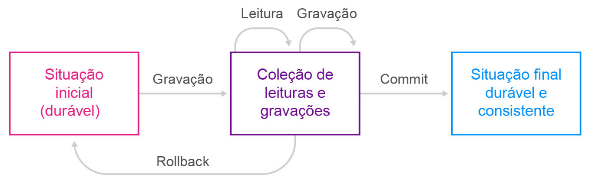

<h1>FASE 5 - Data Universe</h1>
<h2>Capítulo 02: NOT ONLY SQL.</h2>

<h2>1. NOT ONLY SQL</h2>

- na arquitetura de banco de dados, é fundamental armazenar diferentes tipos de dados, especialmente aqueles que são semiestruturados ou não-estruturados, o que é importante para lidar com grandes volumes de dados e garantir alta disponibilidade.
- para atender a essa demanda, surgiu uma nova geração de banco de dados chamada `NoSQL (Not only SQL ou não somente SQL)`, que trouxe novas técnicas e teorias para acessar esses dados. 
- ou seja, além da linguagem SQL (Structured Query Language) usada em bancos de dados relacionais, novas linguagens e formas de tratar os metadados associados a essa nova geração de banco de dados foram desenvolvidas, revolucionando a forma como os dados são armazenados, acessados e processados.

## 1.1 Introdução ao NoSQL

- existem inúmeros motivos para o sucesso do banco de dados relacional: 
	- armazenamento estável, 
	- modelo bem compreendido e fácil de aprender,
	- linguagem de consulta aos dados simples,
	- pode ser acessado a partir de diversas plataformas de programação de aplicativos.
- o modelo do banco de dados relacional atende perfeitamente às necessidades transacionais das empresas e corporações e ainda deve perdurar por várias décadas.
- porém, por uma série de fatores, o modelo relacional não processa facilmente uma grande variedade e volume de dados distribuídos em clusters de servidores, e o NoSQL surge para atender a esse nicho de processamento.
- NoSQL, ou Not Only SQL, é um termo genérico aplicado a alguns bancos de dados não relacionais, que têm uma propriedade chamada `BASE (Basically Available, Soft State, Eventual Consistency)`, como Neo4J, Riak, Cassandra e MongoDB. 
- atualmente, o significado mais aceito para NoSQL é `Not only Structured Query Language` ou, simplesmente, Not only SQL, “não apenas SQL”, termo usado para definir um movimento e não uma tecnologia específica.

## 1.2 Histórico

- o termo “NoSQL” foi usado pela primeira vez em 1998, em um banco de dados relacional de código aberto (Strozzi NoSQL), que armazena seus dados em tabelas em arquivos ASCII. Nelas, as colunas são separadas por tabulações. O nome desse banco oriunda do fato de não usar a linguagem SQL como ferramenta de consulta. Os dados são manipulados por meio de comandos shell scripts, combinados com pipelines do sistema operacional Unix. Apesar da coincidência de nomes, esse NoSQL não tem relação com o NoSQL que conhecemos hoje em dia.
- o termo NoSQL, da forma como é usado nos dias de hoje, foi proposto pelo desenvolvedor Eric Evans da Rackspace, em 2009, em São Francisco.
- Johan Oskarsson, desenvolvedor de software e funcionário da Last.FM, estava em São Francisco para um evento sobre Hadoop e ficou interessado em conhecer mais sobre os bancos de dados não relacionais, então propôs esse encontro informal, o NoSQL Meetup, em que pedia por “bancos de dados não relacionais, distribuídos e de código aberto”. A partir desse evento, o termo NoSQL se popularizou. 
- as palestras realizadas durante a reunião foram sobre os bancos não relacionais Voldemort, Cassandra, Dynomite, HBase, Hypertable, CouchDB e MongoDB.

## 1.3 Diferenças entre SQL e NoSQL

- bancos de dados NoSQL não usam SQL.
- normalmente há linguagem de consulta própria que até pode lembrar o SQL, como o CQL do Cassandra, uma linguagem "exatamente como o SQL, exceto onde não é".
- algumas empresas consagradas estão desenvolvendo um SQL que funcione tanto em bancos de dados relacionais quanto nos não relacionais, mas ainda estão em fase de testes.
- a maioria dos bancos não relacionais é composta por ***projetos de código aberto***; embora o termo NoSQL seja frequentemente aplicado a sistemas de código fechado, existe uma noção de que o NoSQL seja um fenômeno de código aberto.
- de maneira geral, `bancos de dados não relacionais foram desenvolvidos para executar operações em cluster`, decisão estratégica afeta o modelo de dados e a forma como trabalham com a consistência. 
	- `bancos de dados relacionais` trabalham com ***escalabilidade vertical***, ou seja, trocamos de servidor, caso precisemos de mais poder de processamento. 
	- `bancos de dados não relacionais` trabalham com ***escalabilidade horizontal***, ou seja, aumentamos o número de máquinas disponíveis caso precisemos de mais poder de processamento.
- uma característica marcante em bancos de dados não relacionais é que eles `não possuem um esquema`, (***schema free ou schemaless***), indicando que não existe uma estrutura fixa.
	- isso permite que campos possam ser adicionados livremente a um registro do banco de dados, sem que seja necessário efetuar uma alteração prévia na estrutura do registro, podendo-se lidar com campos personalizados e dados não uniformes.
	- em bancos de dados relacionais, é importante distinguir entre a descrição do banco de dados e o próprio banco de dados. A descrição é o chamado esquema de banco de dados, em inglês, schema database, especificado durante o projeto de banco de dados e não se espera que mude com frequência.

### 1.3.1 Soluções diferentes para problemas diferentes
- encontrar a solução para um problema é fácil, encontrar a melhor solução para um problema torna-se mais difícil. 
- os bancos de dados não relacionais apresentam soluções diferentes para problemas diferentes. 
- a seguir, uma lista de modelos de dados e dos bancos que os utilizam.

## 1.4 Características no NoSQL

- algumas características são comuns aos bancos de dados NoSQL, destacando-se `schema less`, `linguagens independentes`, `funcionalidade determina escolha` e `gerenciamento de transações`.

### 1.4.1 Schema Less

- Schema corresponde aos metadados associados às instâncias armazenadas nos bancos de dados. 
- `no SQL`, existe um conjunto de comandos denominados DDL (Data Definition Language) para definir estes metadados – criação dos elementos do modelo relacional – tabelas, views, restrições, entre outros. 
- `nos bancos NoSQL`, os metadados são definidos com os comandos de inserção. 
	- assim, as instâncias dos dados podem sofrer modificações nos seus metadados e nem por isso deixam de ser armazenadas no banco de dados.
	- com o crescimento do volume e diversidade de fontes de dados, é essencial ter ferramentas para democratização de dados dentro das organizações:
		- `catálogos de dados` para acompanhar esses metadados: **ferramenta que "cria e mantém um inventário de ativos de dados por meio da descoberta, descrição e organização de conjuntos de dados distribuídos"**.
- as ferramentas de linhagem de dados documentam o fluxo de dados para dentro e fora dos processos de uma organização e permitem realizar uma análise de impacto adequada em caso de problemas ou alterações nos ativos de dados à medida que eles se movem pelos pipelines. 
- as principais ferramentas open source são: Talend Open Studio, Apatar, CloverETL, Kylo, Dremio, Jaspersoft ETL, Octopai e ASG.

### 1.4.2 Linguagens Independentes

- o padrão SQL ainda não encontra correspondente no universo NoSQL. 
- a maioria dos sistemas NoSQL foi desenvolvida independentemente um do outro não existindo, desse modo, um padrão de acesso.
- com a popularização do uso dos NoSQL, logo surgiram movimentos para uma linguagem de consulta padronizada capaz de extrair dados de todos os tipos de banco de dados NoSQL.
- exemplos:
	- ***SPARQL*** (SPARQL Protocol and RDF Query Language) é um padrão W3C utilizado para representar e manipular dados semânticos construídos no modelo de grafos RDF (Resource Description Framework). Cypher linguagem associada a grafos com seus componentes: nós, arestas, caminhos. 
	- ***CQL*** (Cassandra Query Language) é propositalmente semelhante ao SQL usado em bancos de dados relacionais como MySQL e PostgreSQL. Muitas consultas são muito semelhantes entre as duas. De fato, muitas coisas básicas são exatamente iguais. 
	- ***UnQL*** (Unstructured Query Language) é uma linguagem de consulta não estruturada para JSON, bases de dados semiestruturadas e de documentos. 
	- ***MongoQL*** (Mongo Query Language) e ***RedisQL*** (Redis Query Language) são as linguagens associadas ao MongoDB e Redis, respectivamente. 
- algumas tecnologias adequaram seus comandos para sintaxes mais próximas do SQL para facilitar seu uso entre os desenvolvedores.
- `NewSQL`:
	- surge a partir da necessidade de ter a consistência dos dados e de poder escalonar mais facilmente o sistema.
	- o termo NewSQL foi utilizado pelo analista Matt Aslett, para descrever um novo grupo de bancos de dados, em que o NewSQL é uma classe de sistemas de gerenciamento de bancos de dados relacionais, que procura oferecer o mesmo desempenho e escalabilidade do modelo NoSQL, para cargas de trabalho de leitura e gravação no processamento de transações on-line,mantendo as garantias ACID do modelo relacional e o padrão SQL como linguagem de manipulação. 
	- é essencialmente um rótulo para um conjunto altamente variado de ofertas de banco de dados que preenche a lacuna entre os bancos de dados SGDBRs convencionais e NoSQL. 
	- plataformas NewSQL mais conhecidas incluem Google Spanner, Clustrix, VoltDB, MemSQL, GemFire XD, NuoDB e Trafodion da Pivotal.
- não raro, engenheiros de dados propõem uma `camada de integração entre os diferentes bancos de dados`. 
	- uma das primeiras surgidas é o ***Akzaban***, proposta pelo LinkedIn. 
	- outro exemplo é a ferramenta ***Dremio***, que fica entre diversas fontes de dados, do MongoDB ao Oracle, do CSV ao Parquet e as mais diversas ferramentas de visualização como Tableau, Power BI e até Python com suas inúmeras bibliotecas, via ODBC. 
	- a Paypal processa terabytes de dados todos os dias, com mais de mil nós utilizando esse mix de tecnologias.

### 1.4.3 Funcionalidade determina Escolha

- encontrar a solução para um problema é fácil, encontrar a melhor solução para um problema é que é difícil.
- muito mais do que permitir recuperações de dados baseadas em projeções e uniões presentes nos modelos relacionais, nos NoSQL buscamos recuperar dados de acordo com seu significado e operações inerentes a ele. 
- assim, se estivermos tratando com dados sobre uma localização geográfica como longitude e latitude, vamos querer operações georreferenciadas como cálculo de distâncias, pontos dentro de um polígono ou de um raio, entre outras. 
- da mesma forma, se estivermos tratando com nós e arestas vamos querer saber o menor caminho entre dois nós ou com maior número de conexões no grafo.

### 1.4.4 Gerenciamento de Transações

- transação é uma coleção de operações que desempenha uma função lógica única dentro de uma aplicação do sistema de banco de dados. 
- ou todas as operações são executas com sucesso ou nenhuma delas é considerada.

 
<em>Transação.</em>

- o controle de transações é um aspecto importante a considerar, quando se pensa no desempenho e consistência de bases de dados implementadas num ambiente de computação distribuída.
- SGDBRs garantem as `propriedades ACID` (Atomicidade, Consistência, Isolamento e Durabilidade). Porém, com o surgimento dos NoSQL, ocorreu uma mudança no paradigma de controle de transações passando para BASE (Basically Available, Soft-State, Eventually Consistent) com o teorema CAP. 
- as `características das transações ACID` são:
	- `Atomicidade`: ou uma transação operacional ocorre com sucesso ou falha. Se uma parte da transação falha, toda a transação falha; só se todos os comandos da transação forem bem-sucedidos é que a transação é considerada bem-sucedida. Se algum comando da transação falhar, todas as alterações efetuadas até aquele ponto devem ser revertidas e a base de dados tem de voltar ao estado em que se encontrava antes de iniciar a transação.
	- `Consistência`: assegura que os dados inseridos numa transação têm de respeitar restrições impostas pelo esquema da base de dados, tipos de dados e integridade referencial de tabelas ou linhas.
	- `Isolamento`: quando os mesmos dados são acessados por duas transações concorrentes, cada transação tem de ser executada em total isolamento. Dependendo do nível de isolamento imposto, isso pode significar que o gerenciador de banco de dados pode necessitar bloquear temporariamente a execução de uma transação até que outra tenha terminado.
	- `Durabilidade`: assegura que, depois de uma transação ser executada com sucesso, o seu resultado será representado no banco de dados, mesmo na eventualidade de erros ou falhas de sistema. Isso implica em mecanismos do gerenciador de banco de dados para garantir sua consistência como os Logs.

- o ***teorema CAP*** tem `três pilares`:
	- `Consistência`: diz respeito à atomicidade e isolamento. De uma forma simples, implica que todos os processos executados de forma concorrente visualizem a mesma versão dos dados.
	- `Disponibilidade (Availability)`: significa que o sistema está disponível quando é solicitado. No contexto de um servidor web, refere que cada pedido eventualmente receberá uma resposta.
	- `Tolerância a partição (Partition tolerance)`: implica que o sistema seja capaz de funcionar corretamente, mesmo no caso de falha por parte de algum dos componentes.

> O teorema CAP indica que qualquer sistema que suporte bases de dados distribuídas, apenas consegue, em qualquer momento, responder a dois desses pilares simultaneamente. Existem, então, apenas 3 combinações possíveis: `CP`, `CA` e `AP`.

### a) `Consistência e tolerância à partição, comprometendo a disponibilidade (CP)`:

- na situação em que um nó falha, o sistema pode ficar indisponível por muito tempo, até que o sistema seja restaurado a um estado consistente.
- é um sistema típico em que transações monetárias e o tempo têm um papel importante.
- em muitas situações, os sistemas conseguem recuperar e replicar rapidamente a informação, levando a que o sistema esteja indisponível por um curto espaço de tempo. 
- na maioria dos casos, uma pequena quebra na disponibilidade não é catastrófica e revela-se uma opção viável.

### b) `Consistência e disponibilidade, comprometendo a tolerância à partição (CA)`:

- parte da base de dados não apresenta a preocupação de ser tolerante à falha e recorre à técnica de replicação para garantir a disponibilidade e consistência da informação. 
- normalmente, essa situação é encontrada nas tradicionais bases de dados relacionais.

### c) `Tolerância à partição e disponibilidade, comprometendo a consistência (AP)`:

- em algumas situações, a disponibilidade não pode ser comprometida e o sistema é tão largamente distribuído que também não é possível comprometer a tolerância à partição. 
- nesses sistemas, no entanto, é possível abdicar de uma forte consistência.
- o termo ***fraca consistência*** pode variar entre nenhuma consistência e uma eventual consistência. Uma eventual consistência significa que, após a atualização de um atributo, “eventualmente” todos os nós do sistema sincronizarão essa informação. Esta é uma das bases para o modelo BASE (Basically Available, Soft-state, Eventually consistency):
	- ***Basicamente disponível (Basically Available)*** significa que o sistema garante a disponibilidade dos dados de acordo com as propriedades do teorema CAP. No entanto, a resposta obtida pode ser “Falha” ou “Inconsistência”, se os dados requeridos se encontrarem inconsistentes ou num estado de mudança.
	- ***Estado flexível (soft state)*** significa que os dados acedidos podem estar incorretos ou imprecisos durante um tempo variável, e que esses dados podem mudar ao mesmo tempo em que são utilizados. Mesmo após grandes períodos sem novas inserções de dados, não está garantida a sua total consistência, isso deve-se às implicações relativas ao ponto da “eventual consistência”.
	- ***Eventual consistência (Eventually consistency)*** significa que o sistema irá, eventualmente, tornar-se consistente e é um dos modelos de consistência utilizados no âmbito da programação paralela. Esse modelo indica que, após um longo período sem alterações, todas as atualizações efetuadas sobre os dados de um nó do sistema se propagarão a todos os outros pontos do sistema, e que todas as réplicas da base de dados, eventualmente, atingirão um estado de consistência. Ao contrário dos sistemas ACID, cujo foco está na consistência, os sistemas BASE têm seu foco na disponibilidade.

- **as propriedades BASE garantem que novos dados chegam a cada momento e que eles necessitam de armazenamento imediato, mesmo que isso implique o risco de o sistema ficar dessincronizado por um breve período**. Esses sistemas “relaxam” as regras para assim possibilitarem que queries sejam executadas, mesmo que nem todas as partes da base de dados em causa se encontrem devidamente sincronizadas.
- os sistemas BASE são normalmente mais rápidos e apresentam uma estrutura mais simples; não há a necessidade de escrever código relativo a bloqueios e desbloqueios de recursos. 
- o objetivo a atingir com esta filosofia passa por manter todos os processos em movimento e tratar das partes incompletas ou que falham, num momento posterior.

ACID | BASE
-------|-------------
Consistência forte | Fraca consistência
Isolamento | Foco em disponibilidade
Concentra-se em "commit" | Melhor esforço
Disponibilidade | Mais simples e mais rápido
Conservador (pessimista) | Agressivo (otimista)
Evolução difícil | Evolução mais fácil

<h2>2. BANCOS DE DADOS CHAVE-VALOR</h2>

## 2.1 Definição

- bancos de dados de chave-valor armazenam dados em uma tabela hash simples,
utilizada quando é feito o acesso ao banco de dados, principalmente, por meio de uma chave primária. 
- o usuário pode efetuar buscas, inserir ou até mesmo apagar um valor de uma chave em um banco de dados de chave-valor.
- o uso destes bancos é bastante aceito em cenários onde o tempo de consulta tem que ser muito baixo, tanto que algumas tecnologias utilizam arquitetura totalmente em memória para diminuir ainda mais a latência ao retornar os resultados.
- o valor é armazenado pelo banco de dados sem que este se preocupe com o que ele representa. ***É a aplicação que faz o tratamento e se preocupa com o entendimento do valor***. 
- acessos aos bancos de chave-valor são feitos, sempre, pela chave primária e, por conseguinte, têm ótimo desempenho e podem ser facilmente escaláveis. 
- importante destacar que, entre suas limitações, ***a consulta só pode ser feita pela chave, que retorna o valor; o valor não pode ser consultado pelo atributo***.

## 2.2 Exemplos e recomendações

- exemplos de bancos de chave-valor:
	- Riak.
	- Redis.
	- MemCachedDB.
	- BerkeleyDB.
	- DynamoDB.
	- Voldemort.

- bancos de dados de chaves-valor são indicados para:
	- armazenamento de informações de sessão.
	- perfil de usuário e preferências.
	- dados de carrinho de compra.

- não são indicados para:
	- relacionamento entre dados.
	- transações com múltiplas operações.
	- consultas por dados e atributos.
	- operações por conjuntos.

<h2>3. BANCOS DE DADOS COLUNARES</h2>

## 3.1 Definição

- bancos de dados colunares armazenam dados em famílias de colunas, que agem como linhas que têm muitas colunas associadas e são acessadas por uma chave de linha. 
- de maneira geral, famílias de colunas são grupos de dados relacionados, frequentemente, acessados juntos. 
- os dados são indexados por uma tripla composta por linha, coluna e timestamp. 
- uma das vantagens de usar uma tripla é que podemos identificar diferentes versões do mesmo dado.
- a arquitetura de bancos de dados colunares permite que consultas e agregações em grandes volumes de dados sejam possíveis de forma mais performática, graças a organização interna destes dados.

## 3.2 Exemplos e recomendações

- exemplos de bancos colunares:
	- Cassandra.
	- HBase.
	- Hypertable.

- os bancos de dados colunares são indicados para:
	- Registro de eventos (log).
	- Sistema de Gerenciamento de Conteúdo (CMS).
	- Contadores.

- não são indicados para: Sistemas que requerem ACID para leituras e gravações.

<h2>4. BANCOS DE DADOS ORIENTADOS A GRAFOS</h2>

## 4.1 Definição

- bancos de dados orientados a grafos são baseados na teoria dos grafos e permitem armazenar entidades e os relacionamentos entre essas entidades. 
- neste modelo, o banco pode ser comparado com um multigrafo rotulado e direcionado, no qual cada nó pode ser conectado por mais de uma aresta. 
- possui três componentes básicos: os nós (são os vértices do grafo), os relacionamentos (são as arestas) e as propriedades (ou atributos) dos nós e relacionamentos.
- retornar as possíveis conexões de cada nó, os "caminhos" mais curtos de um nó para outro, e possíveis recomendações a partir de múltiplas arestas conectadas ao mesmo nó, são algumas das principais características deste tipo de banco.
- agregações, detalhamento de dados, performance em consulta com filtros complexões não são os pontos fortes desta tecnologia, tornando-a bastante focada para situações específicas.

## 4.2 Exemplos e recomendações

- exemplos de bancos orientados a grafos:
	- Neo4J.
	- Infinite Graph.
	- OrientDB.
	- FlockDB.

- os bancos de dados orientados a grafos são indicados para:
	- Dados conectados
	- Roteamentos, envio de serviços baseados em Iocalização.
	- Sistemas de recomendação.

- não são indicados para: Sistemas com atualização em lote (nos quais várias entidades são atualizadas em uma operação).

<h2>5. BANCOS DE DADOS ORIENTADOS A DOCUMENTOS</h2>

## 5.1 Definição

- bancos de dados orientados a documentos armazenam e recuperam documentos, que podem ser XML, JSON ou BSON, entre outros.
- eles são, nesse caso, objetos com um código único e um conjunto de campos, que podem ser strings, listas, dados escalares, coleções ou documentos aninhados.
- por ter uma grande familiaridade com estruturas JSON, que são uma das principais formas de armazenamento de dados semiestruturados e integração de APIs, os bancos orientados a documentos tem uma forte sinergia com o desenvolvimento de aplicações, tornando o uso de seus objetos mais amigável para desenvolvedores e menos amigável para analistas de dados (ou outros profissionais mais familiarizados com SQL). 
- dentre os tipos de bancos NoSQL apresentados, os orientados a documentos são os mais populares por serem versáteis e performáticos.

## 5.2 Exemplos e recomendações

- exemplos de bancos orientados a documentos:
	- MongoDB.
	- CouchDB.
	- Terrastore.
	- OrientDB.
	- RavenDB.
	
- os bancos de dados orientados a documentos são indicados para:
	- Registro de eventos (log).
	- Sistema de Gerenciamento de Conteúdo (CMS).
	- Análise web ou em tempo real (analytics).
	- Aplicativos de comércio eletrônico.

- 
- não são indicados para:
	- Transações complexas com diferentes operações.
	- Consultas em estruturas de agregação variáveis.

---

## FAST TEST

### 1. Assinale a alternativa que apresenta corretamente exemplos de bancos de dados NoSQL:
> Cassandra, Riak e Neo4J.
- Correto. São exemplos de bancos de dados NoSQL: Neo4J, Riak, Cassandra e MongoDB. DB2, Oracle, SQL, MySQL, MariaDB, Firebird e PostgreSQL são exemplos de bancos de dados relacionais.

### 2. Os SGBDRs garantem as propriedades ACID. Entretanto, com o surgimento dos bancos de dados NoSQL, ocorreu uma mudança de paradigma de controle de transações passando para BASE, de acordo com as propriedades do teorema CAP. Neste contexto, qual é o significado de CAP?
> Consistency, Availability e Partition tolerance.
- Correto. CAP significa Consistency, Availability e Partition tolerance: Consistência diz respeito à atomicidade e isolamento. Disponibilidade significa o sistema estar disponível quando for solicitado. Tolerância a partição implica que o sistema seja capaz de funcionar corretamente, mesmo no caso de falha por parte de algum dos componentes.

### 3. NoSQL, ou Not Only SQL, é um termo genérico aplicado a alguns bancos de dados não relacionais, que possuem uma propriedade chamada BASE. Aliás, BASE significa:
> Basically Available, Soft-state, Eventually consistency.
- Correto. BASE significa Basically Available, Soft State, Eventual Consistency; Basicamente Disponível (Basically Available) significa que o sistema garante a disponibilidade dos dados de acordo com as propriedades do teorema CAP; Estado Flexível (Soft State) significa que os dados acedidos podem estar incorretos ou imprecisos durante um tempo variável, e que esses dados podem mudar ao mesmo tempo em que são utilizados; e Eventual Consistência (Eventually Consistency) significa que o sistema irá, eventualmente, tornar-se consistente.

--- 

[Voltar ao início!](https://github.com/DigouO/Smart_Cities_FIAP_2024)