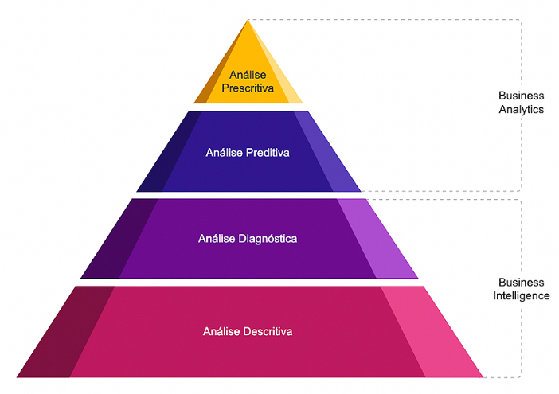

<h1>FASE 5 - Data Universe</h1>
<h2>Capítulo 05: Big Data.</h2>

<h2>1. BIG DATA</h2>

## 1.1 Por que Big Data?

- a sociedade mudou, interagimos através de uma rede on-line e construímos relacionamentos virtuais. 
- as novas gerações (nativos da era digital, nascidos a partir de meados da década de 1990) estão naturalmente conectadas e produzindo a matéria-prima para esta nova era, uma fonte inesgotável.
- a economia também mudou, agora devemos acrescentar dados para compor a equação (Cesar Taurion – Big Data): `Economia = (Capital + Trabalho + Dados)`.
- ***um marco para o Big Data***: vamos usar a frase de Eric Shmidt, da Google, e apontar para o ano de 2003: "a cada dois dias geramos um volume de dados equivalente ao que criamos do início da civilização até 2003".
	- o adjetivo “BIG” é usado para expressar o que realmente mudou de maneira significativa, que é a dimensão de volume de dados produzidos a partir de 2003 (marco simbólico);.
- empresas como Google, Amazon, Facebook, eBay, LinkedIn, Netflix, Airbnb e Uber são exemplos de empresas nativas da era digital, e representam um novo `modelo de negócios estruturado em rede`.
	- redes permitem um crescimento orgânico e acelerado, que transpõe facilmente as fronteiras continentais. 
	- quanto maior a escalabilidade dessas empresas, maior o potencial de criar Big Data(s). 
	- a tecnologia não estava preparada para esse nível de escalabilidade, portanto, as gigantes digitais aprenderam a primeira grande lição da era da informação:

> A inovação deve fazer parte do seu DNA. Só existe uma maneira de continuar crescendo e está diretamente ligada à criação de novas tecnologias. E a capacidade de fazer isso no prazo mais agressivo determina o sucesso dos negócios.

- empresas tradicionais de tecnologia, como Oracle, IBM, Microsoft, entre outras, não almejavam criar soluções para atender startups com propósitos incompreensíveis, do ponto de vista de negócios, e talvez não imaginassem a real capacidade de transformação (inovação) dessas novas empresas. 
- as empresas que direcionam a evolução das tecnologias e arquitetura de Big Data “não” são as empresas tradicionais, e sim os gigantes da era digital. 
- o Gartner usou a `abordagem “The Nexus of Forces”` em 2013 para definir os `pilares para a TI` nesta nova era digital: ***Social Network***, ***Cloud Computing***, ***Mobile*** e ***Big Data***.

## 1.2 A evolução (gerações)

### a) Mainframe (70 - 80): 
- Primeira Geração.
- computação centralizada e monolítica de implementação relativamente simples. 
- poucas empresas têm acesso a computação, devido ao alto custo, principalmente. 
- do ponto de vista de desenvolvimento, os programadores são orientados a eficiência e sabem da importância ($) de otimizar o uso de recursos.

### b) Client Server (90 - 10):
- Segunda Geração.
- computação distribuída, muitas soluções de hardware e softwares foram criadas, existem vários fornecedores e opções para compor uma solução, o que implica em uma arquitetura cada vez mais complexa. 
- na década de 80 e 90 foi fortemente trabalhado para implementar o ERP e CRM. 
- no final da década de 90 se iniciou o “mundo Web” para transformar os negócios em modelos digitais. 
- o desenvolvimento de software desta segunda geração foi orientado a agilidade, devido ao baixo custo de hardware foi perdida um pouco a orientação a eficiência no desenvolvimento. 
- com o avanço da computação cliente-servidor, a TI se tornou mais democrática e praticamente todas as empresas e pessoas possuem acesso a computação.

### c) Cloud (10 - atual):
- Terceira Geração.
- a computação em nuvem é o modelo de arquitetura para a terceira geração. 
- não se engane em definir nuvem apenas como um provedor remoto de computação, mas sim um novo padrão de arquitetura para a TI, desde a engenharia de software, plataformas, implementação e principalmente infraestrutura. 
- os novos modelos são baseados em:
	- Flexibilidade.
	- Elasticidade.
	- Escalabilidade.
	- Economia em escala.
- a arquitetura que suporta os grandes cases de Big Data foram criadas por provedores que adotaram o modelo de arquitetura em nuvem com padrões baseados em `web-scale`, `arquitetura open`, `altamente eficiente`.
- em relação à eficiência, imagine uma otimização de um código do Google, consumindo menos 1KB de memória por conexão ao aplicativo do Google Maps. 
	- os ganhos em escala são fatores fundamentais para manutenção dos serviços e garantia da evolução. 
- com o `time-to-market` cada vez mais agressivo e as necessidades de tomada de decisões real time, a TI tradicional passou a não atender mais as demandas de negócios. 
	- devido à agilidade requerida, este é o principal ponto que impacta negativamente a segunda geração da computação. 
	- precisamos eliminar a burocracia e os serviços operacionais, transformando a TI em uma área estratégica para as empresas, andando à frente do time-to-market, posicionando inovações que transformem os negócios e aumentem as oportunidades.
- a nova arquitetura em nuvem integra os conceitos de dados operacionais e analíticos, em ambientes geograficamente distribuídos. 	
	- com capacidades elásticas on-demand, possibilitando startups como Easy Taxi, Uber, Airbnb, Instagram e Netflix, que construíram cases de referência, incluindo Big Data sobre a plataforma em Nuvem Amazon AWS.
	ERP = MB (megabyte); CRM = GB (gigabyte); WEB = TB (terabyte); BIG DATA = PB (petabyte).

## 1.3 Os 5 Vs de Big Data

- o conceito mais usado para definir os fundamentos de Big Data é baseado em 5 Vs. 

### 1.3.1 Volume
- volume é um conceito relativo, o que é Big Data hoje pode não ser Big Data amanhã. 
- como identificar qual volume é considerado um Big Data?
	- a solução tradicional (cliente-servidor), seja ela um database, uma aplicação ou um hardware, está preparada para atender este volume?
	- ***pense sobre***: `Custo ($)`, `Capacidade` (por exemplo: Armazenamento, Processamento, I/O), `Arquitetura` (por exemplo: Geograficamente Distribuída), `Escalabilidade` (capacidade de um sistema, aplicação ou infraestrutura de se adaptar a um aumento ou diminuição).
	- caso sua resposta seja não, temos aqui a principal motivação para quebrar os paradigmas tradicionais da segunda geração e buscar novas soluções que se enquadrem melhor nas suas necessidades computacionais da terceira geração.
- o que de fato define se o atributo volume requer uma tecnologia de Big Data é a limitação das ferramentas tradicionais para lidar com determinado volume de dados.
- um database tradicional definitivamente não foi concebido para trabalhar com vários terabytes, sua estrutura foi estressada ao longo da evolução para se adaptar ao crescimento de volumes cada vez maiores. Porém, a partir da nova era da informação, a explosão de dados causou um colapso nas arquiteturas de dados tradicionais e chegamos ao seu limite técnico-financeiro, para a maioria das empresas que operam volumes de dados em petabytes.
- portanto, o V de volume para definição de Big Data está ligado a capacidades que excedem as tecnologias tradicionais.
- uma frase famosa foi usada no Fórum Econômico Mundial de 2011: ***“Dados é o novo petróleo.”*** Esta nova era define que quanto mais dados, “melhor”.

> Conforme mencionado no livro Big Data, de Cezar Taurion: "O que o microscópio foi para a medicina e a sociedade, o Big Data também será para as empresas e a própria sociedade. Esta nova era define que quanto mais dados, 'melhor'."

- trabalhar com Big Data possibilita eliminar processos pesados de filtros e agregações que limitam armazenar todas as variáveis para a tomada de decisão, considerando uma análise mais precisa e complexa.

### 1.3.2 Velocidade
- a TI não atende o time-to-market. 
- a velocidade de negócios é imediatista e de caráter emergencial, enquanto a velocidade de TI requer muitos processos vagarosos. 
- ***analisando o modelo clássoico da arquitetura analítica***:
  - dois principais aspectos relativos à velocidade:
    - **Throughput**: velocidade necessária para processar um grande volume de informações.
    - **Latência**: velocidade para análise de informações, ou seja, para chegarmos ao relatório final (D-1 => Data-In-Motion).
  - o fluxo de dados da arquitetura tradicional limita a análise com delta de 1 dia para a tomada de decisão. 
  - as transações que alimentam os bancos de dados operacionais são acumuladas ao longo do dia e estão fragmentadas em várias bases, criando silos de informações com visões diferentes. 
  - através de **processos ETL** (Extract Transform Load–Extração, Transformação e Carga), as informações são extraídas dos bancos de dados operacionais, passam por um processo de transformação e são carregadas diariamente para o Data Warehouse (em um cenário otimista, esse processo funciona diariamente e não ultrapassa o delta de 1 dia), consolidando um modelo de dados dimensional que centraliza os dados com uma visão integrada e consistente na linha do tempo.
- ***agora vamos analisar um modelo do Google, considerando as necessidades das empresas da era digital***:
  - o Google, sem dúvida, é o maior motor de inovação para Big Data, e seu primeiro grande desafio surgiu há mais de uma década, quando encontrou as primeiras barreiras para a evolução do seu algoritmo de PageRank.
  - o coração do nosso software é o `PageRank` (TM), um sistema para dar notas para páginas na web, desenvolvido por nossos fundadores Larry Page e Sergey Brin, na Universidade de Stanford. PageRank continua a ser a base para todas as nossas ferramentas de busca na web.
  - o Google faz uso do PageRank e de outros algoritmos com o objetivo de computar (indexar) e otimizar as buscas na web. 
	- para um exemplo, considere o cenário: volume de 200 TB e capacidade de processamento de 50MB/s (megabytes por segundo). Qual é o tempo estimado para a análise dos 200 TB de dados?
		- o que deverá ser realizado para otimizar a latência de 46 dias (tempo de processamento)?
		- o uso de computação distribuída com capacidades de processamento e armazenamento massivo de dados é o caminho para soluções de Big Data.
		- arquiteturas tradicionais terão dificuldades para escalar velocidade.

### 1.3.3 Variedade
- a variedade dos dados está ligada principalmente à maneira como podemos trabalhar a identificação de sua estrutura.
- definições de dados estruturados, não estruturados e semiestruturados:

Tipo de dado | Descrição
--------------|----------------
Dados estruturados (menor parte) | Provenientes de sistemas estruturados tradicionais.
Dados não estruturados (imensa maioria) | Gerados por e-mails, mídias sociais, documentos eletrônicos, vídeos e imagens, sensores, RFIDs. Estima-se que mais de 80% dos dados gerados atualmente são não estruturados.
Dados semiestruturados | Normalmente registros de sensores, máquinas ou logs, por exemplo.

- a Web 2.0 foi um grande milestone (marco) para avançarmos com a computação de terceira geração. 
- novas semânticas de dados foram criadas com o objetivo de aproximar a linguagem humana da linguagem da máquina.
- os conceitos de colaboração e interoperabilidade dos dados já são pensados há mais de uma década com esse propósito; e com o auxílio da web semântica, conseguimos evoluir adotando padrões que ajudam a integrar aplicações com o objetivo de compartilhar informações com ampla facilidade.

- para facilitar a definição conceitual de variedade, considerar que os dados estruturados são aqueles submetidos a processos de modelagens com objetivo de normalizar e/ou definir um esquema (tabelas, colunas, data type, constraints) mais rígido, basicamente os dados que armazenamos em um SGBDR (Sistema Gerenciador de Banco de Dados Relacional). De maneira simples, todo o restante são dados não estruturados. 
- Big Data não tem o objetivo de tratar apenas os dados não estruturados: sempre haverá uma necessidade de implementar algum tipo de estrutura para evoluir os metadados e facilitar o acesso aos dados. 
- alguns componentes de soluções Big Data são inclusive projetados para suportar SQL (Structured Query Language), por exemplo, um pouco longe dos conceitos de relacionamento, porém com base na sua estrutura tabular.
- um dos grandes diferenciais em relação ao padrão tradicional é a capacidade de manipular os dados não estruturados, considerando que as plataformas de segunda geração da computação (cliente-servidor) não foram projetadas para isso.

### 1.3.4 Veracidade
- o significado de veracidade está intimamente ligado a tudo o que diz respeito à verdade.
- trabalhando com dados estruturados ou não estruturados, é importante garantir que os dados são autênticos e fazem sentido, para evitar tomada de decisões com base na análise de dados incertos e imprecisos.
- pode ser prudente atribuir uma pontuação (score) de veracidade dos dados e classificação de conjuntos específicos de dados para garantir a qualidade da informação.
- diferentemente dos modelos analíticos baseados em BI (Business Intelligence) tradicional, em que podemos confiar de “olhos vendados” nas fontes de dados comuns (ERP, CRM, Aplicações Corporativas); Big Data deve se preocupar muito mais com a veracidade, considerando as várias fontes de dados e a velocidade que precisamos impor para a análise.
- à medida que as empresas avançam na adoção de Big Data, o maior volume de dados poderá ser proveniente da nuvem e corresponder a novas semânticas. Assim, a curadoria dos dados será uma disciplina importante para a governança corporativa.

### 1.3.5 Valor
- informações são comercializadas há muito tempo, em jornais, revistas, filmes, livros etc. Fontes de dados financeiros são produtos valiosos, e empresas como a Serasa Experian e Boa Vista Serviços lucram vendendo informações para o mercado, que depende delas, seja para crédito, seguros, antifraude ou alavancagem de clientes.
- quando trabalhamos com Big Data, os valores que buscamos dos dados devem ser definidos com clareza; este é o maior motivador para direcionar um use case de Big Data.
- não é relevante armazenar um grande volume com possíveis variedades e requisitos de velocidade sem considerar um objetivo claro de extrair valor dos dados.
- como as organizações podem fazer para aumentar receita, reduzir custos, diminuir fraudes e melhorar compliance?
	- a necessidade de gerar valor é o principal objetivo de Big Data. 
	- esse valor pode ocorrer pela agilização da tomada de decisão, aumento da precisão da análise com mais dados sendo correlacionados, redução dos riscos, criação de oportunidades. 
	- e assim justificamos um projeto de Big Data.
- o valor pode ser muito mais do que uma forma de rentabilizar a receita para a corporação, considere os avanços nas pesquisas contra o câncer e doenças graves, a evolução nos controles do uso sustentável da água potável, maior transparência na gestão de contas públicas, e assim estamos sendo induzidos naturalmente a usar os dados para resolver problemas e evoluir com mais precisão nas análises complexas, até pouco tempo atrás inviáveis.

### 1.3.5.1 Monetização dos dados
- qual é o valor do seu ativo de dados?
- o objetivo de monetizar os dados está relacionado à geração de receitas financeiras a partir de fonte de dados disponíveis ou em tempo real. 
	- em resumo, tratar os dados efetivamente como um produto.
- algumas empresas de software especializadas em dados (com domínio de Big Data) estão criando soluções baseadas em modelos de negócios que propõem um compartilhamento de receita (revenue share), e usam o ativo de dados das empresas como matéria-prima para alavancar receitas. Considere o potencial de uma empresa de telecom com enormes volumes de dados e possibilidades de reduzir o custo de campanhas de marketing com propostas mais precisas. 
- empresas não consideram a importância do valor de ativo de dados e pouco investem na estratégia para tratar os dados como um produto. O desafio de direcionar os negócios com base em dados mudará essa postura de negligência e, aos poucos, empresas tradicionais serão naturalizadas como empresas digitais.
- a computação em nuvem ajudou a evolução de soluções com mais escalabilidade, e os modelos de negócios passaram a ser construídos com base em social network (rede), com colaboração e geograficamente distribuídos. 
- podemos criar grandes ativos de dados fazendo uso de estratégias baseadas em `API (Application Programming Interface)`, conceito bastante difundido no desenvolvimento de software na era da computação em nuvem e importante para os novos modelos de arquitetura de TI.
	- a API propõe alguns mecanismos de interfaces para que possamos monetizar bases de dados. 
	- exemplo: o Google possui uma base de geolocalização com o serviço do Google Maps, porém algumas aplicações podem demandar um número de requisições diárias acima do limite considerado free e deverão pagar para usar o serviço. 
- dados são um ativo importante e devem ser usados para alavancar novos negócios. 
- é evidente a necessidade da governança de dados em todos os processos de estratégia de dados, e quando o assunto é monetização, a ética e a segurança devem ser priorizadas.

## 1.4 Big Data e Analytics

- a arte de transformar dados em informação e desbloquear o valor dos dados.
- juntos, Big Data e Analytics (BDA) prometem transformar a maneira com que as empresas fazem negócios.
- são temas que andam juntos. 
- `Big Data`:
	- está relacionado com algumas mudanças de arquitetura da TI, impulsionadas por capacidades que excedem as tecnologias tradicionais,dando origem a novas plataformas e modelos de dados.
	- a possibilidade de alavancar Analytics com o uso destas novas arquiteturas e plataformas de Big Data é a química perfeita para justificar a grande ascensão de Big Data e Analytics no mercado corporativo.
	- conceitualmente existe uma separação dos assuntos Big Data e Analytics.
	- no futuro próximo não discutiremos com tanta ênfase as plataformas de Big Data, mas sim os algoritmos usados para Analytics.

## 1.4.1 Tipos de análises

- os tipos de análises utilizados são: Business Analytics (análise prescritiva e análise preditiva) e Business Intelligence (análise diagnóstica e análise descritiva).

 
<em>Tipos de análises.</em>

Tipo de análise | Deve responder às perguntas | Exemplos
---------------|-------------------|-------------
Análise Descritiva | - O que aconteceu na minha empresa?  - Quando isso aconteceu?  - O que eu sei sobre os meus clientes, concorrentes,fornecedores etc? | - Monitoramento Automatizado/Alertas  - Dashboards  - Scorecards  - OLAP (Cubos, Slice & Dice)  - Consulta ad hoc
Análise Diagnóstica | - Por que algo aconteceu na minha empresa?  - Por qual motivo estou vendendo menos? | - Relatório e Indicadores  - Dashboards  - Scorecards  - OLAP (Cubos, Slice & Dice)
Análise Preditiva | - O que é provável que aconteça?  - Quando acontecerá? - O que é provável que seja verdade sobre meus clientes, concorrentes, fornecedores etc? | - Regressões  - Mineração de dados  - Análises de grandes volumes de dados  - Simulações etc.
Análise Prescritiva | - O que devo fazer?  - Qual a melhor ação dado o que eu sei e o que eu acho que vai acontecer? | - Otimização  - Programação matemática (PL, MIP, QP etc.)  - Algoritmos heurísticos etc.

> O desafio de otimizar os dados em busca de um valor maior da informação eleva a complexidade da análise e, consequentemente, a necessidade de Business Analytics e Advanced Analytics.

- Outra forma de perceber as perguntas analíticas é olhar o passado, o presente e o futuro sob a perspectiva da informação e insights:

. | Passado | Presente | Futuro
----|-------|----------|----------
Informação | O que aconteceu? (Relatório) | O que está acontecendo agora? (Alertas) | O que irá acontecer? (Extrapolação)
Insight (discernimento) | Como e por que isto aconteceu? (Modelagem, design experimental) | Qual é a próxima melhor ação? (Recomendação) | Qual é o melhor/pior que pode acontecer? (Previsão, otimização, simulação)

> Após realizadas as mais diferentes análises sobre o cenário, chega o momento da tomada de decisão – decidir e agir. 

### 1.4.2 Business Analytics (BA)
- refere-se às competências, tecnologias, práticas de explorações iterativas contínuas e análises de desempenho empresarial.
- é um processo científico de transformação de dados em insights para tomar as melhores decisões. 
- é usado para Data-Driven ou tomar decisões baseadas em fatos.
- ***diferente do BI***, Business Analytics tem um foco maior em tirar proveito de dados estatísticos e quantitativos para a modelagem explicativa e preditiva. 
- concentra-se em soluções que criam valor para converter informação em conhecimento. 
- compromete-se com análises complexas, desbloqueando tendências “invisíveis”, sobre comportamentos de compras, padrões operacionais, oportunidades de negócios e assim proporcionando mais insights para a diferenciação no mercado cada vez mais competitivo e integrado.
- os novos insights podem ser usados como entrada para as decisões humanas ou tomar decisões totalmente automatizadas. 
- o termo Analytics é mais contemporâneo e acrescenta análises sofisticadas envolvendo modelos matemáticos e estatísticos.

> Big Data fornece dados em um nível muito baixo de granularidade, com detalhes que podem ser estatisticamente significativos. Antes da era do Big Data, analistas de negócio precisavam agregar os dados, a fim de ter pontos suficientes para análises preditivas com razoável confiança. Agora podemos desenvolver previsões no nível individual do cliente, sem a necessidade de agregar os dados.

### 1.4.3 Advanced Analytics
- segundo o Google Trends, o termo Advanced Analytics começou a ganhar aderência em 2009.
- trata-se de um termo geral, que significa aplicar várias técnicas de análises avançadas de dados, para responder a questões ou solucionar problemas.
- portanto, técnicas de submeter algoritmos matemáticos e estatísticos avançados na análise de dados, principalmente em grandes volumes, definem o principal objetivo do uso de Advanced Analytics.
- com adoção do Advanced Analytics, as empresas iniciam um novo ciclo baseado em Data-Driven Business, ou seja, o negócio guiado por dados.
	- toda a gestão executiva da empresa passa a tratar os dados como um ativo estratégico e projetos que visam coleta e obtenção de dados serão facilmente justificados. 
	- as equipes são preparadas para análises de dados intensivas e passam a agir em conformidade com os dados.
	- decisões estratégicas e operacionais passam a ser sustentadas por dados e devem apresentar análises relevantes.
- ***as empresas devem ter três capacidades mútuas***:
	- devem ser capazes de identificar, combinar e gerenciar múltiplas fontes de dados. 
	- capacidade de construir modelos de análise avançadas para prever e otimizar os resultados. 
	- a estratégia de dados deve possuir musculatura para transformar a organização, para que os dados e modelos realmente produzam as melhores decisões.
- empresas devem se perguntar repetidamente: "Qual é o modelo menos complexo que melhoraria o nosso desempenho?".

<h2>2. CIÊNCIAS DE DADOS (DATA SCIENCE)</h2>

- alguns problemas da ciência de dados atual:
	- Medicina Personalizada.
	- Genomas.
	- Computação para ciências sociais.
	- Indústria 4.0.
	- Neurociência.
	- Astronomia.
	- Nanociência etc.

- a Ciência de Dados é definida pela intersecção das seguintes áreas mustidisciplinares: Computer Science, Math and statistics, Domain knowledge.
- s ciência de dados é responsável pelo avanço do Advanced Analytics, e uma das mais importantes técnicas é o desenvolvimento de algoritmos para aprendizado de máquina (Machine Learning).

## 2.1 Abordagem Tradicional

- na década de 1970, após um projeto de pesquisa no laboratório da IBM conduzido por E. F. Codd, resultou na publicação de um artigo que propunha a criação de um RDBMS, a IBM avançou no projeto desenvolvendo o SEQUEL (Structured English Query Language), e este conjunto de facilidades para manipulação dos dados se expandiu com a Oracle, entre outras empresas. 
- no ano de 1986, foi padronizado para o SQL ANSI (American National Standarts Institute).
- este modelo predomina até hoje como um padrão na manipulação de dados, à medida que deixamos de usar a arquitetura de segunda geração baseada em cliente-servidor e passamos a adotar um novo modelo de arquitetura em nuvem. 
- a computação exige novos padrões e a modelagem relacional começa a ser um ofensor para algumas implementações. 
- o Modelo Entidade Relacionamento (MER) aplicado a transações e à Modelagem Dimensional usada para banco de dados analíticos, determinam algumas regras importantes com os seguintes objetivos:
	- garantir a consistência dos dados.
	- otimização de acesso.
	- definir integridade referencial.
	- definir o tipo dos dados.
	- definir constraints (regras e restrições).
- aplicamos as técnicas de modelagem para criação de um esquema bem definido, assim podemos iniciar o armazenamento dos dados, delegando a responsabilidade de integridade e consistência dos dados para o modelo e RDBMS.
- desta maneira, as constraints(restrições) criadas serão garantidas(exemplos):
	- ***Data Type***: Colunas do tipo string só devem ser preenchidas com valores do tipo string. 
	- ***Nulabilidade***: Colunas do tipo Not Null deverão ser preenchidas, do contrário, o registro não será armazenado. 
	- ***Integridade Referencial***: O registro filho (chave estrangeira) não deve ser orfão, ou seja, se existe um registro de pedido para o cliente na tabela de pedidos, este cliente deverá obrigatoriamente estar registrado na tabela de clientes.
- em relação às regras impostas e, principalmente, considerando as características das aplicações cliente-servidor (ex.: ERP, CRM etc.) que dependem deste modelo e alimentam a base analítica, podemos garantir uma precisão nos dados para a tomada de decisão.
- porém, com todas as regras e burocracias do modelo, será muito complicado conseguirmos armazenar mais dados. 
	- caso tenha a necessidade de adicionar um novo atributo (coluna na tabela), seria necessário: alterar o modelo, implementar o ambiente de desenvolvimento, validar no ambiente de testes (QA) e finalmente aplicar uma mudança (change) em produção.
	- a rigidez do esquema bloqueia a evolução do modelo, dificultando nosso objetivo de receber mais dados.
- a dinâmica dos dados e o time to market, exigem mais flexibilidade e agilidade e, neste ponto, justifica-se a necessidade de trabalhar com dados não estruturados. 
- aceitando novas semânticas criadas com o avanço dos padrões da web, como a notação JSON baseada em Java Script e amplamente adotada para manipulação de dados na web.

> É importante ressaltar que a abordagem de Big Data não substituirá o uso dos bancos de dados relacionais que possuem propriedades como o ACID, fundamentais para alguns tipos de aplicações. Porém, as discussões para banco de dados analíticos estão mais avançadas, e a aplicação dos conceitos que aprendemos sobre os 3Vs de Big Data exigem uma nova abordagem de padrões e tecnologias para a manipulação de grande volume de dados.

- a arquitetura cliente-servidor criou aplicações relativamente estáveis adotando estruturas “monolíticas” (subsistemas de armazenamento compartilhados), o que se tornou um problema para o armazenamento de grandes volumes. 
- a abordagem tradicional aplica técnicas importantes para garantir a precisão dos dados, porém cria uma rigidez que limita a possibilidade de armazenar e processar mais dados.

## 2.3 Abordagem Big Data

- o grande volume de informações tem possibilitado a criação de novos produtos e serviços de dados, novas formas de se otimizar uma tarefa e novas informações para a tomada de decisão estratégica; e para que esses benefícios possam ser alcançados, é necessário inovar, em inúmeros aspectos.
- a captura de métricas necessárias para compor as análises estatísticas depende de colaboração e dados. Quanto mais, melhor!
- na era da informação as pessoas passaram de receptoras para emissoras de conteúdo e estão inundando as grandes plataformas de dados, o que muda a abordagem tradicional, e cada indivíduo ganha poder e voz para falar de igual para igual com empresas e marcas, e de maneira colaborativa, capacitando as plataformas no aprendizado com seus dados.
- ao navegar pela rede, deixamos um rastro digital com informações importantes:
	- Geolocalização.
	- Como consumimos os produtos, mídias e conteúdo.
	- Como tomamos as decisões de compras.
	- Como influenciamos nossa rede de relacionamentos.
	- Porque amamos ou odiamos as marcas.
	- O que procuramos.

> A questão é: como transformar todos estes dados relativamente não estruturados em valor?

- a `teoria dos grafos` é um ramo da matemática que estuda as relações entre os objetos de um determinado conjunto. 
	- há muita semelhança com a álgebra relacional (teoria matemática aplicada no SQL), que de certa forma também trata da relação de determinados conjuntos.
	- a principal diferença é o fato de não ser baseada em SQL (portanto,não requer a modelagem relacional) e assim é possível tratar relacionamentos complexos.
	- estamos criando bases de dados complexas, que demandam Advanced Analytics, e não podemos limitar os dados a uma análise SQL.

- a `análise de ciências sociais (sociometria)` é estudada há décadas, e os dados se proliferam seguindo um dos pilares da nova TI baseada em Social Network e demandam uso de técnicas intensivas de estatística e teoria dos grafos, por exemplo.

## 2.4 Big Data e IoT (Internet of Things)

- a Internet das Coisas atingiu seu hype em 2015, e está pronta para inundar o mundo com dados. 
- geladeiras, carros, televisores, despertadores, tênis, relógios e, assim, todas as coisas poderão ter um endereço IP e produzirão dados a cada minuto.

## 2.5 Big Data e Cidades Inteligentes

- Big Data e Analytics nas cidades inteligentes representam um grande salto na eficiência, sustentabilidade e qualidade de vida. 
- Governos capacitados pelos dados podem abordar os desafios urbanos com confiança e criar um futuro mais seguro e solidário para todos os cidadãos. 
- os desafios incluem áreas urbanas saturadas, populações em expansão, exigências de uma atenção de cidadania eficaz e sustentável e a necessidade contínua de melhorar a qualidade de vida dos cidadãos; no entanto, a implementação de tecnologias avançadas torna-se da máxima necessidade.
- nestas circunstâncias, o Big Data e Analytics desempenham um papel central na gestão dessas cidades e ajudam a fazer com que o governo seja mais eficiente e sólido.
- o Big Data, proveniente de uma variedade de fontes como sensores, dispositivos IoT, redes sociais e sistemas de transporte, oferecem uma visão abrangente e próxima do tempo real das dinâmicas urbanas. 
- essa grande quantidade de dados, quando analisadas por meio de ferramentas de Analytics, e ambientes de Big Data revelam insights valiosos sobre padrões de tráfego, uso de recursos, comportamento do cidadão e muito mais. 
	- a compreensão dessas abordagens permite que os governos ajam proativamente para resolver problemas e otimizar serviços.
- um dos benefícios que Big Data e Analytics proporcionam é a melhoria da eficiência operacional. 
	- ao analisar dados de tráfego, as autoridades podem ajustar os semáforos em tempo real para minimizar congestionamentos, reduzindo o tempo de viagem e as emissões de carbono no meio ambiente. 
- outro benefício em relação à segurança pública é que podem ajudar a detectar comportamentos suspeitos nesses ambientes urbanos monitorados. 
	- é possível desenvolver sistemas de vigilância inteligentes que possam ocasionalmente identificar problemas de segurança e notificar automaticamente autoridades, o que pode ajudar a prevenir crimes e permitir mais rapidez na resposta quando crimes acontecem.
	- Big Data e Analytics permitem que cidadãos ainda forneçam feedback ao governo sobre serviços públicos ou políticas ambientais.

---

## FAST TEST

### 1. Uma empresa gera dados por sensores de grandezas físicas (temperatura, pressão, entre outros) e por documentos internos. Qual característica do Big Data esta presente nesta situação?
> Variedade.

### 2. Até chegarmos nas soluções de Big Data, em termos de evolução, a computação passou por três gerações, que são:
> Mainframe, Client-Server e Cloud.

### 3. Assinale a alternativa que completa corretamente a frase a seguir: "O V de _____________ para definição de Big Data está ligado a capacidades que excedem as tecnologias tradicionais.":
> Volume.

--- 

[Voltar ao início!](https://github.com/DigouO/Smart_Cities_FIAP_2024)