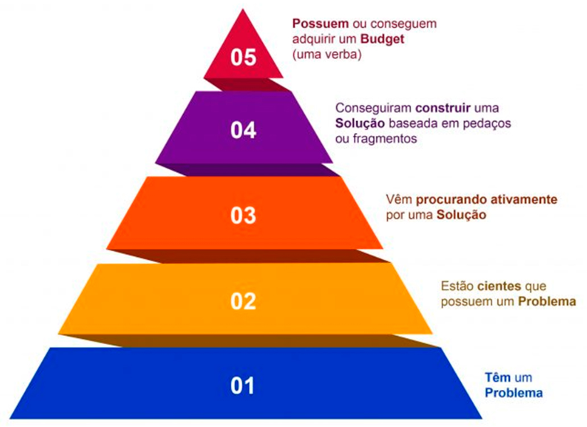

<h1>FASE 5 - Data Universe</h1>
<h2>Capítulo 09: Startup - Validando a Solução.</h2>

<h2>1. STARTUP: VALIDANDO A SOLUÇÃO</h2>

## 1.1 Um pouco de história

- `Startups` são empresas nascentes, com um grande desafio: encontrar um modelo de negócios repetível e escalável, operando sob certo grau de incerteza. 
- equilibrar velocidade, assertividade e recursos escassos são os elementos que fazem dessa tarefa algo não tão trivial. 
- para tanto, é possível contar com algumas metodologias e técnicas já conhecidas, adaptadas de um passado não tão distante, em que a necessidade de criação também era essencial.

## 1.2 Startup enxuta

- `objetivo principal de uma Startup`: descobrir rapidamente a coisa certa a ser criada ou o caminho certo a ser seguido – descobrir a coisa que os clientes querem e pela qual pagarão. D
- a Startup enxuta é "uma nova maneira de considerar o desenvolvimento de produtos novos e inovadores, que enfatiza interação rápida e percepção do consumidor, uma grande visão e grande ambição, tudo ao mesmo tempo".
- utilizando o pensamento enxuto e tendo em mente a escassez de recursos que uma empresa em sua fase inicial de operação possui, como: pessoas, dinheiro e tempo, o ***lema da Startup Enxuta é:*** falhe depressa e, consequentemente, falhe barato. 
- há um diagrama que exemplifica como deve ser o pensamento de um empreendedor, segundo essa máxima: `Construir-medir-aprender`.
  - a atividade principal de uma Startup é transformar simples ideias em produtos, medindo como os clientes reagem e, então, decidir se é preciso pivotar (mudar a estratégia) ou perseverar. 
  - todos os processos de Startups bem-sucedidas devem ter como foco acelerar esse ciclo de feedback.
- ***como dar velocidade a esse modelo, construindo produtos que as pessoas querem?*** 
  - conceito fundamental: **validar a solução até mesmo antes que ela exista**. 
  - podemos fazer isso por meio do `Mínimo Produto Viável (MVP)`.

## 1.3 O menor produto do mundo

- o Mínimo Produto Viável (MVP) é um conceito amplamente difundido, e tem como função ajudar os empreendedores a iniciarem esse processo de aprendizado de forma mais rápida possível. 
- um MVP não é necessariamente o menor produto que se possa imaginar, mas sim uma maneira rápida de percorrer o ciclo construir-medir-aprender com base em feedbacks, com o menor esforço possível.
- a palavra “mínimo” não deve ser o foco, por um simples fato: nem todos os usuários desejarão o seu produto com o mínimo de funcionalidades que você desenhar para le. 
- um número pequeno de pessoas ficará verdadeiramente animado com a sua ideia inicial de negócio - e ainda mais empolgado com a perspectiva do que o produto poderá se tornar um dia - chamados de `earlyevangelists`, ou evangelistas iniciais.

### 1.3.1 Earlyevangelists
- no contexto das Startups, temos recursos limitados, e o foco deve ser o teste e a descoberta de problemas pelos quais o usuário pagaria para serem resolvidos. 
- `Earlyevangelist` é um grupo especial de pessoas propensas e dispostas a correrem riscos com a Startup que você está desenvolvendo e seu produto ou serviço. 
- eles possuem: 
  - (a) ***capacidade de enxergar o potencial do produto ou serviço, e a respectiva habilidade em resolver um problema***; 
  - (b) ***dinheiro para adquirir esse produto ou serviço***. 
- infelizmente, a maioria dos consumidores não tem essas duas características. 
- usualmente, eles são identificados pelas características:

 
<em>Características dos Earlyevangelists.;</em>

- esse grupo especial precisa amar a visão de produto que você deseja construir, e não o produto em si. 
- apaixonados pela visão, eles não se importarão se você errar com o produto, seja ele cheio de bugs, um vilão de memória de processamento, com falhas no código, seja cheio de funcionalidades erradas e faltantes. 
- esse grupo seleto de pessoas, uma vez descoberto, faz parte da sua equipe; são tão apaixonados pela visão do produto, que são capazes de narrar o que será o produto e vender essa ideia para outras pessoas, evangelizando essas pessoas a também se tornarem clientes.
- é na comunicação com os earlyevangelists, e na validação das hipóteses de negócio e de produto do seu negócio, que entra o conceito de MVP.

## 1.4 Mínimo Produto Viável

- em uma definição bastante simples e direta: `O mínimo produto viável é aquela versão de um novo produto que permite uma equipe coletar o máximo de aprendizado de validação a respeito dos clientes com o mínimo de esforço possível`. 
- isso significa que grande parte do esforço desse produto inicial não é de desenvolvimento, mas sim de conversas com clientes, métricas e análises.
  - esse conceito é especialmente importante e aqui fica a lição: ***não adianta sair construindo***.
  - não só o produto, mas o MVP precisa ser validado e pensado. 
- neste pontocabe a importância da formulação de hipóteses a serem validadas. 

## 1.5 Resumindo a história

- este capítulo discutiu a importância de se pensar em testes rápidos, de modo a testar suas hipóteses de negócio. 
- um MVP serve simplesmente ao propósito de cumprir com o ciclo de construir-medir-aprender, do conceito Lean Startup, e não é algo trivial a ser feito. 
- qpesar de poder ser considerado “um pequeno produto”, um MVP não é só isso. É muito mais. Um MVP é a menor experiência que valida as hipóteses de um empreendedor.

## 1.6 Bônus: PoC x Protótipo x MVP

- como um desenvolvedor de software, é importante conhecer não só o que é um MVP e a sua ideia central, mas saber a diferença entre o termo e o conceito em relação à PoC e a ideia de protótipo. 
- há de se considerar alguns detalhes quando se pensa em desenvolver uma das três abordagens:
  - Quem é o público-alvo da técnica a ser empregada?
  - Quem será o público-alvo do produto final?
  - O que você quer validar?
- é importante que o desenvolvedor e o time responsável pela confecção das abordagens reflitam sobre essas três questões. 

### 1.6.1 PoC (Proof of Concept ou Prova de Conceito)
- esse método é uma prova de conceito sobre a viabilidade técnica do uso de uma ferramenta. 
- uma prova de conceito pode ser desenvolvida, geralmente, durante um tempo preestabelecido, de forma a testar o conceito vendido.
- esse método é especialmente eficaz quando o produto já existe e será usado em condições novas, em um cenário nunca testado antes, ou se o produto já existe, mas necessita de novas linhas de código para a adaptação à nova realidade.
- a grande desvantagem é o tempo: certamente uma PoC envolverá o time de desenvolvimento que deverá provar que as funcionalidades definidas no escopo da PoC funcionam como deveriam. 
- além de tempo, esse desenvolvimento fatalmente custará dinheiro e cabe à etapa de negociação validar quem paga essa conta; se a empresa fornecedora, e que desenvolverá a PoC, ou a empresa contratante, que demanda a PoC. 

### 1.6.2 Protótipo
- se uma PoC mostra o que o produto consegue e pode fazer, o protótipo mostra como será feito. 
- um protótipo nada mais é do que uma versão, geralmente funcional, do que será o produto final. 
- dessa forma, é possível tangibilizar o que será feito, tornando palpável aos usuários as possibilidades do produto. 
- com o protótipo correto, você pode atrair investimento, realizar o início de um processo de venda, ou começar um MVP. 

### 1.6.3 MVP
- tem como foco testar o interesse inicial de um grupo sobre determinado negócio ou, ainda, validar um modelo inicial de negócios. 
- validando rápido é possível errar rápido e, consequentemente, mais barato. 
- o MVP pode ser utilizado em contextos distintos.
- é diferente, por exemplo, de uma PoC pois aqui não queremos demonstrar que determinado produto é capaz de fazer alguma coisa, muitas vezes o produto sequer existe. O que queremos aqui é aplicar os conceitos de Startup Enxuta, de forma rápida, e aprendendo sempre.

--- 

## FAST TEST

### 1. A expressão "falhar depressa para falhar barato" resume qual lema?
> O lema da startup enxuta.

### 2. O que são earlyevangelists?
> Earlyevangelists são um grupo especial de pessoas propensas e dispostas a correrem riscos com a startup que você está desenvolvendo, bem como com o seu produto ou serviço.

### 3. Qual destas não é uma das características dos earlyevangelists?
> Conseguem testar rápido a ideia dos outros, oferecendo feedbacks velozes e precisos do que se deve alterar.

### 4. O que são startups?
> Startups são empresas nascentes, com um modelo de negócio repetível e escalável.

### 5. O que é MVP?
> O Mínimo Produto Viável (MVP) é um conceito que define uma maneira rápida de percorrer o ciclo construir-medir-aprender com base em feedbacks e o menor esforço possível.

### 6. A grande desvantagem é o tempo e o custo, já que envolveremos o time de desenvolvimento, o qual deverá garantir as funcionalidades definidas no escopo. Do que estamos falando?
> PoC.

### 7. Qual é o ciclo iterativo da startup enxuta?
> Construir, medir e aprender… repetidas vezes.

### 8. Como poderíamos resumir o modelo de desenvolvimento de cliente elaborado por Steve Blank em 2014?
> Poderíamos resumir esse modelo como "vá para a rua", ou seja, quanto mais rápido tiver contato com os clientes, melhor.

### 9. A menor experiência que valida as hipóteses de um empreendedor sobre a sua ideia chama-se:
> MVP.

### 10.O que é um PoC?
> PoC significa Proof of Concept, ou Prova de Conceito. Como o próprio nome diz, esse método é uma prova de conceito sobre a viabilidade técnica do uso de uma ferramenta.

---

[Voltar ao início!](https://github.com/DigouO/Smart_Cities_FIAP_2024)