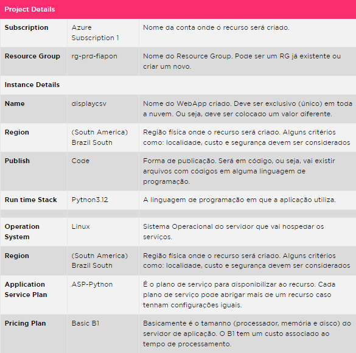

<h1>FASE 6 - DevOps</h1>
<h2>Capítulo 03: Deployment na Nuvem.</h2>

<h2>1. DEPLOYMENT NA NUVEM</h2>

- `deployment de aplicação`:
  - consiste na implantação da aplicação.
  - refere-se ao processo de disponibilizar uma aplicação para uso em um ambiente específico, que pode ser de desenvolvimento, teste, homologação ou produção. 
  - envolve várias etapas, desde a preparação do código-fonte até a configuração do ambiente onde a aplicação será executada.
  - é a ação de colocar em funcionamento uma aplicação (ou suas evoluções/correções) de forma a disponibilizá-la para os usuários acessarem e utilizarem.
  - é uma etapa crítica no ciclo de vida do desenvolvimento de software.
    - o deployment eficiente e bem-feito garante que a aplicação funcione corretamente no ambiente de produção, oferecendo uma experiência positiva aos usuários finais. 
    - um deployment mal executado pode resultar em tempo de inatividade, falhas de segurança, ou desempenho inadequado, afetando diretamente a reputação e os negócios da organização.
  - o processo em nuvem é muito semelhante ao tradicional (on-premises, abordagem de infraestrutura de TI em que o hardware e o software são instalados e operados dentro das instalações físicas da própria organização, sendo esta responsável por todo gerenciamento e manutenção) sendo executado com o mesmo objetivo e praticamente com os mesmos processos. O que se torna diferente são as ferramentas e ambientes, utilizando recursos e infraestruturas fornecidos por provedores de serviços de nuvem como Amazon Web Services (AWS), Microsoft Azure, Google Cloud Platform (GCP), entre outros.

## 1.1 Estratégias de implantação

- a implantação da aplicação pode ser realizada usando diferentes abordagens (estratégias) para garantir segurança, integridade e o mínimo de interrupção possível para os usuários. 
- as principais estratégias incluem:

### 1.1.1 Rolling Deployments
- considerando uma aplicação que seja suportada por múltiplos servidores (nós), o Rolling Deployment atualiza gradualmente as instâncias da aplicação, substituindo-as uma a uma, ou em pequenos grupos, até que todas as instâncias estejam atualizadas com a nova versão.
- `a) Processo`
  - Inicia a atualização de uma pequena parte das instâncias enquanto as outras continuam a atender solicitações.
  - Monitora as novas instâncias para verificar se estão funcionando corretamente.
  - Gradualmente, atualiza mais instâncias até que todas estejam na nova versão.
- `b) Vantagens`
  - Zero downtime: Elimina o tempo de inatividade, pois sempre há instâncias disponíveis para atender às solicitações.
  - Reduz o risco de falhas catastróficas, pois a atualização é feita de forma gradual. Qualquer falha no processo, o rollback é iniciado e as instâncias voltam a sua configuração (versão) anterior.
- `c) Desvantagens`
  - Ambientes com muitas instâncias (nós) podem se tornar complexos e mais difíceis de gerenciar. 
  - A reversão pode ser complicada se muitos nós já tiverem sido atualizados. O processo pode demorar mais para fazer o rollback.

### 1.1.2 Blue-Green Deployment
- mantém duas versões idênticas do ambiente de produção: uma versão ativa (blue) e outra inativa (green). As atualizações são feitas no ambiente inativo (green) e, após a validação automática, os usuários são direcionados para ele. Dessa forma, o ambiente inativo se torna ativo (vai de green para blue) e o ambiente ativo faz o processo inverso (vai de blue para green)
- `a) Processo`
  - Cria uma nova versão da aplicação no ambiente green.
  - Realiza testes e validações no ambiente green.
  - Redireciona o tráfego de usuários do ambiente blue para o green.
  - Mantém o ambiente blue como backup em caso de problemas.
- `b) Vantagens`
  - Facilita a reversão rápida para a versão anterior em caso de problemas.
  - Minimiza o tempo de inatividade e o impacto nos usuários.
- `c) Desvantagens`
  - Requer o dobro dos recursos, pois ambos os ambientes (blue e green) precisam estar disponíveis simultaneamente.
  - Pode ser caro, especialmente para grandes aplicações.

### 1.1.3 Canary Deployment
- Inicialmente, a implantação é realizada para um pequeno grupo especial de usuários. Se a nova versão for bem-sucedida, a implantação é expandida para um grupo maior ou para o restante dos usuários.
- `a) Processo`
  - Implanta a nova versão para uma pequena porcentagem de usuários.
  - Monitora o desempenho e a resposta dos usuários.
  - Gradualmente, aumenta a porcentagem de usuários que recebem a nova versão.
  - Continua a monitorar até que todos os usuários estejam na nova versão.
- `b) Vantagens`
  - Reduz o risco de falhas em grande escala.
  - Permite a coleta de feedback e monitoramento de performance em uma escala menor.
- `c) Desvantagens`
  - Pode ser complexo de configurar e gerenciar. Algumas etapas podem ser manuais, para validar o grupo inicial de usuários.
  - Exige monitoramento contínuo e ajustes frequentes.

### 1.1.4 A/B Testing Deployment
- Essa abordagem é semelhante ao Canary Deployment.
- Pode ser chamado de feature deployment, com a diferença de que diferentes grupos de usuários recebem versões diferentes da aplicação para comparação e análise de desempenho e comportamento. Podem existir muitos grupos diferentes.
- `a) Processo`
  - Define grupos de usuários para receber diferentes versões da aplicação.
  - Implanta as diferentes versões simultaneamente.
  - Monitora e coleta dados sobre o desempenho e comportamento de cada versão.
  - Usa os dados coletados para tomar decisões sobre qual versão deve ser adotada.
- `b) Vantagens`
  - Permite testes de hipóteses e experimentações controladas.
  - Facilita a coleta de dados e feedback para melhorias contínuas.
- `c) Desvantagens`
  - Requer uma infraestrutura robusta para gerenciar múltiplas versões simultaneamente.
  - Pode ser difícil de implementar e analisar os resultados.

### 1.1.5 Recreate Deployment
- Desativa todas as instâncias da versão atual da aplicação antes de ativar a nova versão. Isso garante que não haja coexistência de versões diferentes.
- `a) Processo`
  - Paralisa todas as instâncias da versão atual da aplicação.
  - Implanta a nova versão da aplicação.
  - Inicia as novas instâncias.
- `b) Vantagens`
  - Simples de implementar e gerenciar.
  - Evita problemas de compatibilidade entre versões diferentes.
- `c) Desvantagens`
  - Causa tempo de inatividade, pois todas as instâncias antigas são desativadas antes que as novas sejam ativadas.
  - Pode não ser adequado para aplicações que exigem alta disponibilidade.

### 1.1.6 Shadow Deployment
- Implanta a nova versão da aplicação em paralelo com a versão atual. O tráfego é espelhado (copiado) para a nova versão para testes, mas as respostas não são retornadas aos usuários.
- `a) Processo`
  - Implanta a nova versão da aplicação em paralelo com a versão atual.
  - Espelha o tráfego do usuário para a nova versão.
  - Monitora a nova versão para verificar o desempenho e identificar problemas.
  - Após a validação, promove a nova versão para produção.
- `b) Vantagens`
  - Permite testes em condições reais sem impactar os usuários.
  - Facilita a identificação de problemas de desempenho e compatibilidade.
- `c) Desvantagens`
  - Pode ser complexo e caro de configurar.
  - Requer recursos adicionais para executar ambas as versões simultaneamente.

### 1.1.7 Dark Launching
- Implanta a nova versão da aplicação em produção, mas novos recursos são mantidos ocultos ou desativados para a maioria dos usuários até que estejam prontos para serem lançados.
- `a) Processo`
  - Implanta a nova versão da aplicação em produção.
  - Usa feature flags para manter novos recursos desativados.
  - Ativa os novos recursos para um subconjunto de usuários ou em fases.
  - Monitora o uso e o desempenho dos novos recursos.
  - Gradualmente, ativa os novos recursos para todos os usuários.
- `b) Vantagens`
  - Permite testar novos recursos em um ambiente de produção real.
  - Reduz o risco de falhas catastróficas ao lançar novos recursos gradualmente.
- `c) Desvantagens`
  - Requer um gerenciamento cuidadoso de recursos ocultos.
  - Pode ser difícil de monitorar e testar completamente.

> Cada estratégia de deployment tem suas próprias vantagens e desafios.
- a escolha da estratégia depende de múltiplos fatores, como ***complexidade da aplicação***, ***requisitos de tempo de atividade***, ***recursos disponíveis***, ***risco que a organização está disposta a assumir*** e ***capacidade de monitorar e gerenciar o processo***. 
- os casos de uso para cada tipo de deploy variam conforme as necessidades específicas da aplicação e do negócio; exemplos:
  - **Rolling Deployment**: ideal para serviços críticos que não podem sofrer interrupções, como aplicações de e-commerce e serviços bancários online. 
  - **Blue-Green Deployment**: frequentemente aplicado em aplicações de larga escala que necessitam de testes rigorosos antes da troca de versões, como plataformas de mídia social. 
  - **Canary Deployments**: úteis para aplicações que introduzem novas funcionalidades sensíveis, permitindo uma abordagem conservadora e focada em segmentos de usuário.
  - **Shadow Deployment**: pode ser empregado para testar o desempenho de aplicações sob carga real sem afetar os usuários finais, ideal para atualizações críticas de sistemas como motores de busca ou infraestruturas de dados em grande escala.
- utilizar práticas de DevOps e ferramentas de automação pode ajudar a implementar essas estratégias de forma eficaz, garantindo que as aplicações sejam implantadas de maneira segura e contínua na nuvem.

## 1.2 Ferramentas e serviços para deployment na nuvem

- o processo de implantação de aplicações na nuvem deve ser suportado por ferramentas capazes de atender as necessidades de automação, segurança e integridade. 
- em um cenário histórico, para disponibilizar uma nova aplicação, era necessária a instalação e configuração de serviços (servidores), como um servidor de aplicação (Apache, NginX) e suas bibliotecas e dependências. Muitas vezes a instalação e configuração era realizada de forma manual, o que era demorado, trabalhoso e suscetível a erros.
- com o advento da computação em nuvem, muitas aplicações podem usufruir da facilidade e agilidade que os serviços de nuvem oferecem para colocar uma aplicação no ar em pouco tempo e com relativo baixo custo.
- entre as ferramentas mais comuns e amplamente utilizadas para o deploy de aplicações, destacam-se o Azure App Services, o Google App Engine e o AWS Elastic Beanstalk, sendo que cada uma oferece características únicas que se adequam a diferentes necessidades de desenvolvimento e operação de aplicações.
  - `Azure App Services`:
    - é uma solução de Plataforma como Serviço (PaaS) que facilita a construção e hospedagem de aplicações web e APIs em diversos linguagens e frameworks. 
    - oferece escalabilidade automática que ajusta os recursos conforme a demanda, sem intervenção manual, e suporta integração contínua e entrega contínua (CI/CD) com ferramentas como Azure DevOps e GitHub Actions. 
    - suporta uma ampla gama de linguagens como .NET, Java, PHP, Node.js, Python e Ruby. 
    - pode ser mais custoso do que gerenciar diretamente a infraestrutura, especialmente para aplicações de grande escala. 
    - também pode apresentar limitações em termos de configuração e personalização, pois os usuários estão restritos aos templates e configurações predefinidos pela plataforma.
  - `Google App Engine`:
    - também é uma PaaS que permite aos desenvolvedores criar e hospedar aplicações diretamente na infraestrutura do Google. E
    - oferece suporte a várias linguagens de programação, incluindo Python, Java, PHP, Node.js, Ruby, Go e outras. 
    - também realiza escalabilidade automática, ajustando os recursos conforme a carga de trabalho aumenta ou diminui. 
    - o gerenciamento de aplicações é simplificado com automações para balanceamento de carga, monitoramento e atualizações de segurança. 
    - no entanto, assim como no Azure, o custo pode ser uma consideração importante e há limitações em termos de personalização de configurações, o que pode ser um desafio para projetos que necessitam de ajustes mais específicos.
  - `AWS Elastic Beanstalk`:
    - oferece uma abordagem de PaaS dentro do ecossistema da AWS, suportando múltiplas linguagens de programação e frameworks como Java, .NET, PHP, Node.js, Python, Ruby, Go e containers Docker.
    - a plataforma automatiza vários aspectos do deploy, desde o provisionamento de recursos até a escalabilidade e monitoramento, permitindo aos desenvolvedores se concentrarem no código ao invés da infraestrutura. 
    - também se integra facilmente com outros serviços da AWS, como RDS para bancos de dados, S3 para armazenamento e CloudWatch para monitoramento. 
    - porém, os usuários experimentam um controle menor sobre a infraestrutura subjacente em comparação com soluções IaaS, e os custos podem ser mais altos do que gerenciar a infraestrutura diretamente.
- cada uma dessas ferramentas tem o potencial de oferecer uma solução robusta para deploy de aplicações, com escolhas que dependem do equilíbrio desejado entre facilidade de uso, controle e custo.

## 1.3 Integração Contínua / Entrega Contínua (CI/CD)

- o processo de desenvolvimento e entrega do código em cada ambiente pode ser gerenciado e realizado utilizando práticas e ferramentas que automatizam parte ou todo o processo.
- esse conjunto de práticas é chamado de CI/CD (Continuos Integration / Continuos Delivery) - integração continua / entrega continua.
- o objetivo é automatizar e melhorar o processo de desenvolvimento de software, desde a codificação até a entrega em produção. 
- este conceito é fundamental para práticas modernas de desenvolvimento ágil e DevOps, permitindo que equipes de desenvolvimento entreguem software de alta qualidade de maneira mais rápida e eficiente.

### a) Integração Contínua (CI)
- é uma prática de desenvolvimento de software onde os desenvolvedores combinam seu trabalho em um repositório compartilhado.
- cada integração é verificada por meio de builds automatizados e testes (geralmente executados por um servidor CI) para detectar rapidamente problemas de integração. 
- isso ajuda a garantir que o novo código esteja funcionando corretamente sem quebrar a aplicação.
- esse processo reduz os riscos de implantação, pois faz a integração de pequenas mudanças de forma mais frequente (continua), com isso os desenvolvedores conseguem testar e receber o feedback mais rápido sobre a qualidade do software.

### b) Entrega Contínua (CD - Continuous Delivery) e Implantação Contínua (CD - Continuous Deployment)
- fundamentais para agilizar os ciclos de desenvolvimento de software nas aplicações mais comuns e amplamente adotadas hoje em dia.
- estas práticas garantem que o software esteja sempre pronto para ser lançado, promovendo entregas mais rápidas, consistentes e de alta qualidade.
- a `Entrega Contínua` estende os princípios da Integração Contínua ao assegurar que cada alteração de código permaneça em um estado pronto para produção. 
  - envolve a automação de todas as fases do processo de deploy até a fase final, que geralmente é uma implantação manual.
  - a capacidade de implantar rapidamente novas funcionalidades e correções reduz significativamente o tempo entre a concepção e a utilização pelo usuário final, enquanto minimiza os riscos através da automação extensiva.
- por outro lado, a `Implantação Contínua` avança um passo adicional ao automatizar a implantação em produção de cada alteração de código que passa nos testes automáticos, eliminando a necessidade de intervenções manuais. 
  - isso proporciona um fluxo de trabalho ainda mais fluido e contínuo, permitindo atualizações frequentes que podem incluir melhorias incrementais ou correções críticas quase em tempo real.

### c) Ferramentas Comuns de CI/CD
- `Jenkins` é uma das ferramentas open-source mais utilizadas para automação de CI/CD. Reconhecida por sua grande comunidade e vasta gama de plugins, Jenkins permite uma personalização extensa para atender às necessidades específicas de diferentes projetos. No entanto, sua configuração e manutenção podem ser complexas, exigindo conhecimento técnico aprofundado para aproveitar plenamente suas funcionalidades.
- `GitHub Actions`: integrada diretamente ao GitHub, facilita a automação de workflows de CI/CD dentro do próprio repositório do projeto. Esta ferramenta é especialmente valorizada por sua integração nativa com o GitHub, simplificando a configuração de pipelines de integração e entrega contínuas. Embora seja fácil de usar e configurar, GitHub Actions pode apresentar limitações em comparação com plataformas de CI/CD mais robustas, especialmente em projetos complexos ou de grande escala.
- `GitLab CI/CD`: embutido no GitLab, oferece uma solução de CI/CD altamente integrada que permite aos desenvolvedores configurar pipelines detalhados diretamente através de arquivos YAML no repositório do projeto. A integração nativa com o GitLab simplifica muitos aspectos do processo de CI/CD, mas a riqueza de funcionalidades e a flexibilidade dos pipelines podem ser desafiadoras para usuários iniciantes.
- `Azure DevOps` (da Microsoft): é um conjunto completo de ferramentas que suportam não apenas CI/CD mas também o gerenciamento de projetos e colaboração de equipes. Se destaca pela sua integração com outros serviços Azure e pela robustez de suas funcionalidades, incluindo pipelines complexos e gestão detalhada de artefatos. Contudo, a plataforma pode ter uma curva de aprendizado íngreme e, dependendo da configuração, pode ser mais cara do que outras soluções.
- essas ferramentas são vitais para manter a qualidade e agilidade nos processos de desenvolvimento de software modernos, adaptando-se a uma variedade de necessidades e escalas de projetos.

## 1.4 Preparação para o Deploy na nuvem 

- o objetivo desta seção é orientar a criação e implantação de uma aplicação desenvolvida em Python na nuvem Microsoft Azure, utilizando o GitHub como ferramenta de controle de versão para gerenciar o código-fonte.
- para realizar esta tarefa, serão necessários alguns pré-requisitos e etapas de configuração:
  - a) ***Conta na Microsoft Azure***: é imprescindível ter uma conta ativa na plataforma Microsoft Azure, que permitirá que você acesse os serviços de nuvem necessários para hospedar e executar sua aplicação.
  - b) ***Conta no GitHub***: será usada para armazenar e versionar o código-fonte da aplicação. O GitHub facilita a colaboração e o controle de versões, permitindo que mudanças sejam rastreadas e revertidas se necessário.
  - c) ***Instalação da biblioteca Git***: para interagir com o repositório GitHub diretamente do seu ambiente de desenvolvimento local, é necessário instalar a biblioteca Git em sua máquina. Esta ferramenta de linha de comando permite gerenciar o código-fonte e sincronizar as alterações entre o repositório local e o remoto no GitHub.
- esses componentes formam a base para o desenvolvimento e implantação de uma aplicação robusta e escalável na nuvem, utilizando as ferramentas e serviços oferecidos pela Microsoft Azure e GitHub.

> IMPORTANTE: Além do suporte para Python, o Azure WebApp oferece uma ampla compatibilidade com várias outras linguagens de programação, tornando-o uma escolha versátil para desenvolvedores que desejam implantar aplicações na nuvem. As linguagens suportadas incluem .NET, .NET Core, Java, Ruby, Node.js, PHP, e Docker, permitindo que praticamente qualquer aplicação moderna seja hospedada e gerenciada com eficiência. Esta flexibilidade é ideal para equipes que trabalham com múltiplas tecnologias e buscam uma solução unificada para gestão de infraestrutura. Link do [Azure WebApp](https://azure.microsoft.com/en-us/products/app-service/web/).

- continuando com o desenvolvimento da aplicação, há a opção de usar o [repositório Git existente](https://github.com/rksakai/displaycsv) e efetuar um fork para seu próprio repositório, ou criar uma aplicação Python do zero, seguindo as etapas abaixo:
  - a) ***Criação do diretório do projeto***:
    - na sua máquina local, crie um diretório para o projeto. 
    - pode ser feito através da interface gráfica, como no Windows, ou usando uma IDE de comandos, como o terminal PowerShell no Visual Studio Code.
    - nomeie o diretório como DisplayCSV.
  - b) ***Configuração inicial do diretório***:
    - acesse o diretório recém-criado para começar a desenvolver o projeto.
    - dentro dele, crie um subdiretório chamado ‘templates’, que será utilizado para armazenar as páginas HTML usadas pela aplicação.
  - c) ***Estruturação dos arquivos do projeto***:
    - `app.py`: ponto de entrada da aplicação e deve estar localizado na raiz do diretório do projeto.
    - `requirements.txt`: lista as bibliotecas necessárias para o projeto. Durante o deploy na nuvem, um processo automático verifica este arquivo para instalar as dependências necessárias.
    - `index.html`: contém a página inicial da aplicação, localizado no diretório ‘templates’.
    - `display.html`: responsável pelo processamento e exibição dos dados de um arquivo CSV; também deve ser colocado dentro do diretório ‘templates’.

- o arquivo app.py contém a estrutura principal da aplicação e define os pontos de entrada para cada parte da aplicação:

~~~python
# app.py

from flask import Flask, request, render_template
import pandas as pd
app = Flask(__name__)
@app.route('/')
def index():
    return render_template('index.html')
@app.route('/display', methods=['POST'])
def display_file():
    file = request.files['file']
    if not file:
        return "No file"
    # Tenta ler o arquivo com diferentes codificações
    try:
        df = pd.read_csv(file, delimiter=";")
    except UnicodeDecodeError:
        file.seek(0)  # Reseta o ponteiro do arquivo
        try:
            df = pd.read_csv(file, encoding='latin1', delimiter=";")
        except UnicodeDecodeError:
            file.seek(0)  # Reseta o ponteiro do arquivo
            df = pd.read_csv(file, encoding='ISO-8859-1', delimiter=";")
    # Renderiza o template com os dados do arquivo CSV
    return render_template('display.html', tables=[df.to_html(classes='data')], titles=df.columns.values)
if __name__ == '__main__':
    app.run(debug=True)
~~~

- o arquivo index.html contém a página principal da aplicação. Nesse exemplo é uma página que contém o link para a página de processamento do CSV.

~~~html
<!doctype html>
<html>
    <head>
        <title>Visualização dos dados</title>
    </head>
    <body>
        <h1>Enviar arquivo CSV</h1>
        <form action="/display" method="post" enctype="multipart/form-data">
            <input type="file" name="file">
            <input type="submit">
        </form>
    </body>
</html>
~~~

- o arquivo display.html contém a página que exibe os dados processados do arquivo CSV, formatando a tabela para uma visualização clara.

~~~html
<!doctype html>
<html>
    <head>
        <title>Visualização dos dados</title>
        
    </head>
    <body>
        <h1>Conteudo do arquivo CSV</h1>
        
            {{ table|safe }}
        
         
        <a href="/">Enviar outro arquivo</a>
    </body>
</html>
~~~

- o arquivo requirements.txt contém as bibliotecas utilizadas na aplicação; é utilizado automaticamente para a instalação das bibliotecas no momento do deploy na nuvem.

~~~
Flask
pandas
~~~

- com os arquivos criados e armazenados no local correto, ***a próxima etapa é configurar o GitHub para armazenar o código-fonte da aplicação***. 
  - entre nos repositórios da conta do Github, e clicar em “New”.
  - configure o nome do repositório, no caso “displaycsv”, deixando o acesso público e habilitando o Azure pipelines que poderá ser utilizado posteriormente.
- após criar o repositório, retorne à máquina local para enviar os arquivos previamente criados para o repositório Git. Execute os seguintes comandos:

~~~
echo "# displaycsv" >> README.md
git init
git add README.md
git commit -m "first commit"
git branch -M main
git remote add origin https://github.com/rksakai/displaycsv.git
git push -u origin main
~~~

- toda a parte de codificação e versionamento inicial foi realizada com sucesso.
- a próxima etapa é disponibilizar uma aplicação na nuvem Azure e integrar com o GitHub para poder executar o que foi descrito anteriormente como CI/CD.

## 1.4 Azure WebApp Deploy

- chegou a hora de levar o aplicativo do GitHub ou da sua máquina local para rodar na nuvem, utilizando o Azure WebApp. 
- entre no portal Azure e siga as instruções para fazer o deploy da sua aplicação na Web.
- na tela inicial do portal Azure, procure por “Create Resource”, que é uma das formas mais simples de iniciar a implantação de um serviço na Azure, embora não seja a única.
- selecione WebApp (Aplicativo Web).
- complete a configuração básica, porém essencial, da aplicação conforme tabela abaixo:

 
<em>Dados Básicos do WebApp.</em>

- a próxima parte a ser configurada está na guia “Deployment”. 
  - habilite o ‘Continuos deployment’ para possibilitar que a integração com a ferramenta de CI/CD (Github) seja automática. 
  - na seção ‘Github Account’ configure a conta pessoal e o repositório criado anteriormente. 
  - as abas não mencionadas podem manter a configuração padrão (default). 
  - clique em‘Create’.
  - o processo de deployment da aplicação pode demorar um pouco e pode ser acompanhado.
  - após a finalização do deployment da aplicação é possível navegar rapidamente até o recurso clicando em ‘Go to Resource’. 

- seguindo corretamente todos os passos até aqui, a aplicação em Python já esta entregue (deploy) no WebApp.
- navegando nos menus ‘Deployment’ e selecionando a opção ‘Deployment Center’, podem ser vistas as configurações de integração com o GitHub e os logs que indicam sucesso ou falha.
- em Deployment Center (settings), temos um botão “Browse” que ao ser clicado vai abrir outra aba no navegador com a aplicação que foi desenvolvida. A aplicação simples permite enviar um arquivo CSV (dados separados por ‘;’) para ser processado e visualizar os dados no navegador. 
- após escolher o arquivo e clicar em enviar, o resultado será mostrado no navegador.

---

## FAST TEST

### 1. Leia a definição: "É uma estratégia de implantação de aplicação que mantém duas versões idênticas do ambiente de produção: uma versão ativa e outra inativa". Com base nessa definição, qual é a estratégia de implantação descrita?
> Blue-Green Deployment.

### 2. Assinale a alternativa que completa corretamente a frase a seguir: "O _____________ de aplicação, refere-se ao processo de disponibilizar uma aplicação para uso em um ambiente específico, que pode ser de desenvolvimento, teste, homologação ou produção."
> deployment

### 3. Assinale a alternativa que apresenta estratégias de implantação de uma aplicação.
> Rolling Deployment, Canary Deployment, Recreate Deployment.

--- 

[Voltar ao início!](https://github.com/DigouO/Smart_Cities_FIAP_2024)