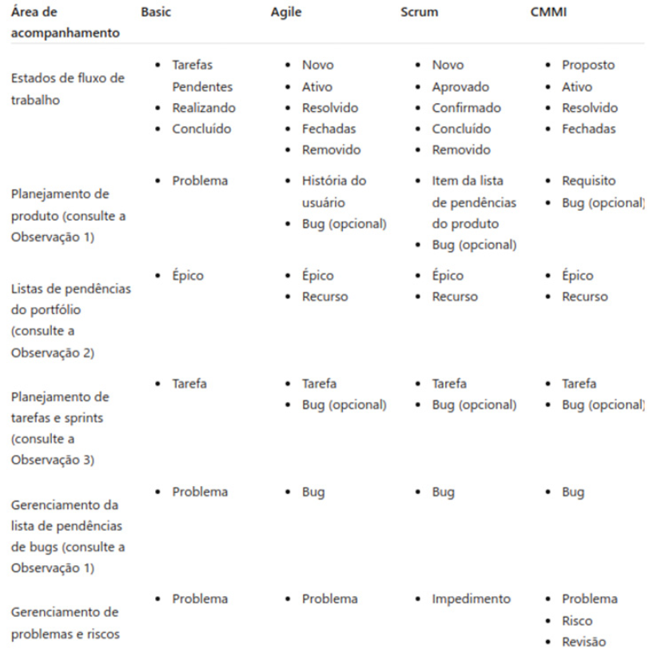
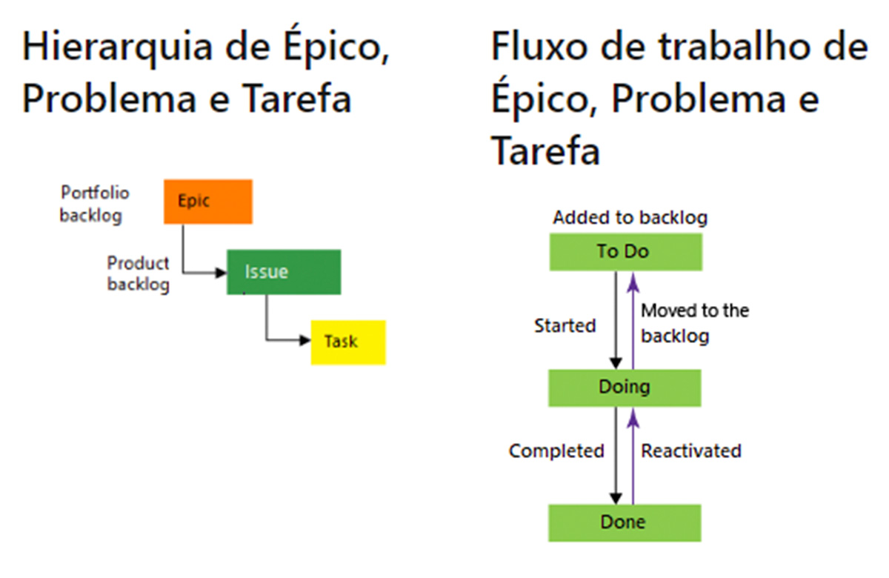
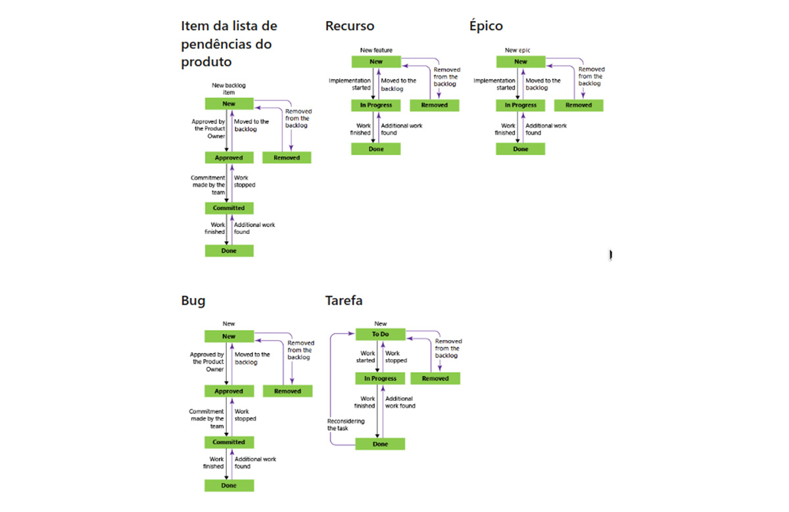
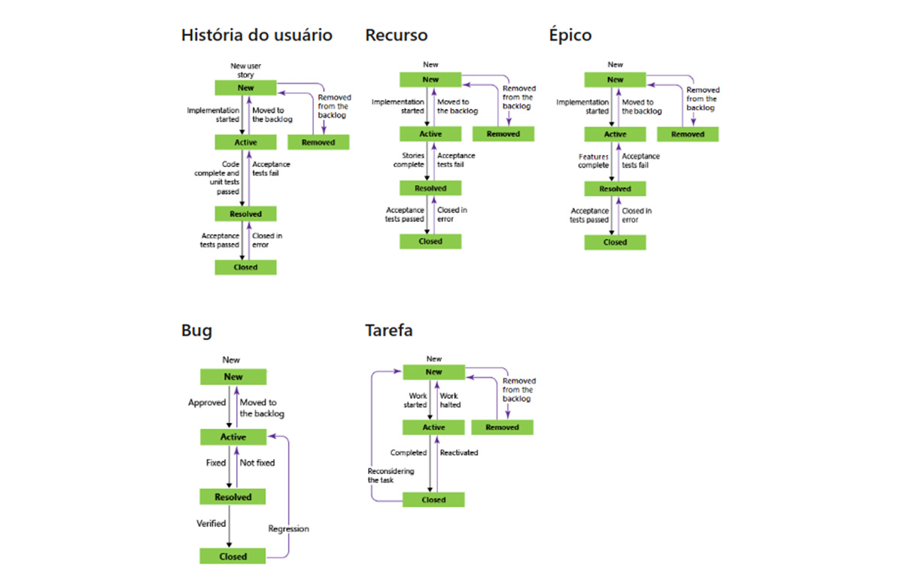
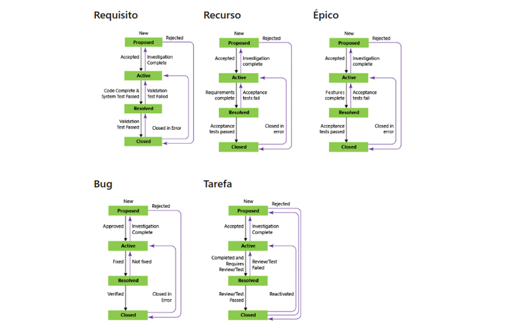

<div align="center">
<a href="https://github.com/DigouO" target="_blank"></a>
<h1>FASE 6 - DevOps</h1>
<h2>Capítulo 04: Azure DevOps e Ferramentas.</h2>
</div>

<div align="center">
<h2>1. AZURE DEVOPS E FERRAMENTAS</h2>
</div>

- Azure DevOps é Plataforma de DevOps da Microsoft que oferece uma série de ferramentas integradas projetadas para suportar desenvolvimento, teste, implantação e monitoração de aplicações em qualquer ambiente, seja na nuvem ou em sistemas locais.
- o Azure DevOps dá suporte a uma cultura colaborativa e um conjunto de processos que reúnem desenvolvedores, gerentes de projetos e colaboradores para desenvolver softwares. 
- permite que as organizações criem e melhorem produtos em ritmos mais acelerados do que o fariam com abordagens tradicionais de desenvolvimento de software.
- com Azure DevOps, as organizações podem acelerar seus ciclos de desenvolvimento, aproveitando recursos de automação e integração contínua, o que permite uma entrega de produtos mais rápida e com maior qualidade do que as metodologias de desenvolvimento de software tradicionais. 
- além disso, a plataforma oferece flexibilidade, permitindo que as equipes escolham as ferramentas e serviços que melhor se adaptam às suas necessidades para complementar e melhorar seus fluxos de trabalho existentes.
- o Azure DevOps fornece recursos integrados que você pode acessar por meio do navegador web ou do cliente de IDE.
- você pode usar todos os serviços incluídos no Azure DevOps ou escolher apenas o que precisa para complementar seus fluxos de trabalho existentes. 
- alguns dos serviços do Azure DevOps:

<div align="center">

Serviço | Descrição
--------|-------------
Azure Boards | Entrega um conjunto de ferramentas Agile para dar apoio ao trabalho de planejamento e acompanhamento, aos defeitos de código e aos problemas de uso dos métodos Kanban e Scrum.
Azure Repos | Fornece repositórios Git ou Team Foundation Version Control(TFVC) para controle da fonte do seu código.
Azure Pipelines | Fornece serviços de compilação e lançamento para dar suporte à integração contínua e à distribuição de seus aplicativos.
Azure Test Plans | Fornece várias ferramentas para testar seus aplicativos, incluindo testes manuais/exploratórios e testes contínuos.
Azure Artifacts | Permite que as equipes compartilhem pacotes como o Maven, npm, NuGet e muitos outros de fontes públicas e privadas e integrem o compartilhamento de pacotes aos seus pipelines.

</div>

- a abordagem ágil no desenvolvimento de software, fundamentada no Manifesto Ágil, destaca a importância da colaboração, resposta a mudanças e entrega funcional. 
- o Azure DevOps encarna esses princípios através de suas ferramentas integradas, oferecendo um ambiente que promove práticas ágeis entre as equipes de desenvolvimento.

> Dica: Para explorar mais sobre os princípios que moldam métodos ágeis e eficazes no desenvolvimento de software, visite o [Manifesto para Desenvolvimento Ágil de Software](https://agilemanifesto.org/iso/ptbr/m/manifesto.html).

## 1.1 Ambiente Azure DevOps

- a preparação do ambiente é um passo crucial para garantir que tenha acesso às ferramentas e recursos necessários para desenvolver, testar e implantar aplicações eficientemente. 
- segue guia detalhado para configurar a conta Azure e garantir que esteja pronto para seguir com o material.

### 1.1.1 Preparação do ambienteA
- pré-requisitos essenciais:
  - ***Conta GitHub***: usaremos o GitHub para gerenciar o código-fonte.
  - ***Acesso ao e-mail institucional***: e-mail @fiap.com.br para procedimentos relacionados ao curso.
  - ***Conta Azure***: conta no Azure configurada com seu e-mail @fiap.com.br para acessar os recursos oferecidos na nuvem.

## 1.2 Configuração da conta Azure

### a) Acesso ao [Portal Azure](https://portal.azure.com/#home): 
- o portal Azure é o seu centro de comando. 
- aqui você gerenciará serviços, visualizará recursos e configurará aspectos essenciais de seus projetos de DevOps. 
- inicie seu acesso ao portal Azure e familiarize-se com a interface, pois ela será sua aliada constante no desenvolvimento e na gestão de aplicações.

### b) Login: 
- utilize seu e-mail @fiap.com.br ou sua conta Microsoft para fazer o login.
- tela de boas-vindas do Azure: painel intuitivo que lhe dá um panorama de suas atividades e recursos disponíveis.

## 1.3 Benefícios do aluno

- para acessar os benefícios de aluno no Azure:
  - ***Explorar Recursos***: Após realizar login, localize e clique no botão "Explorar" na tela inicial.
  - ***Inscrição no Programa para Estudantes***: botão "Inscreva-se agora mesmo". Ao clicar neste botão, você iniciará o processo para ativar seu perfil de estudante, que inclui um crédito de US$ 100 para usar na plataforma. 
  - ***Experimentação Gratuita***: após a inscrição no programa de estudantes, prossiga clicando no botão "Experimente Gratuitamente". Você será guiado através de um processo de autenticação usando seu e-mail @fiap.com.br. 
    - após a conclusão destes passos, será redirecionado para a tela de "Visão Geral".

## 1.4 Ferramental do Azure Devops

### 1.4.1 Azure Boards: Maximizando a gestão de projetos
- Azure Boards é uma ferramenta projetada para melhorar o gerenciamento e o planejamento de projetos de software. 
- funcionando como um quadro ágil interativo, o Azure Boards facilita a colaboração entre as equipes de desenvolvimento, permitindo que visualizem progressos, planejem sprints, registrem bugs e gerenciem tarefas de forma eficiente e intuitiva.
- Azure Boards é versátil, suportando diversos modelos de processos que se adaptam às necessidades de diferentes metodologias de gerenciamento de projetos. 
- cada ***modelo*** é projetado para se adequar a diferentes estilos de trabalho e objetivos de equipe:
  - `Basic`: Ideal para pequenas equipes ou projetos com requisitos simples, focando em tarefas básicas e gerenciamento de bugs.
  - `Scrum` :Perfeito para equipes que seguem metodologias Scrum, facilitando a gestão de sprints, planejamento de produto e revisões de sprint.
  - `Ágil`: Adequado para equipes que implementam práticas ágeis, mas com maior flexibilidade do que o estrito Scrum, permitindo uma abordagem mais fluida ao planejamento iterativo.•
  - `CMMI` (Capability Maturity Model Integration): Recomendado para organizações que necessitam de processos rigorosos de gerenciamento de projetos equalidade, suportando gerenciamento detalhado de requisitos e controle de mudanças.
- algumas ***funcionalidades chave***:
  - `User Stories`: Facilita a captura de requisitos e expectativas dos clientes de uma maneira compreensível para todos os membros da equipe.
  - `Tasks`: Permite a criação de tarefas detalhadas que podem ser atribuídas e rastreadas, garantindo que todos os aspectos do projeto estejam cobertos.
  - `Bugs`: Oferece uma maneira eficiente de registrar, rastrear e corrigir bugs, integrando-se perfeitamente com o ciclo de vida de desenvolvimento do software.

> Azure Boards não apenas ajuda a organizar e monitorar o progresso das atividades, mas também promove uma comunicação melhor e mais clara entre os membros da equipe. A integração com outras ferramentas do Azure DevOps, como Azure Repos e Azure Pipelines, amplia ainda mais sua eficácia, criando um ambiente de desenvolvimento contínuo e integrado.

## 1.5 Azure Repos: Controle e colaboração no gerenciamento de código

- Azure Repos é uma solução robusta de controle de versão, parte integrante do Azure DevOps, que oferece aos desenvolvedores uma plataforma segura e eficiente para gerenciar alterações no código-fonte. 
- independentemente do tamanho do projeto, a implementação de um sistema de controle de versão é crucial para manter a integridade do código, facilitar a colaboração entre membros da equipe e rastrear o histórico de modificações de maneira eficaz.
- Azure Repos suporta ***dois principais tipos de controle de versão***, permitindo que equipes escolham a tecnologia que melhor se adapta às suas necessidades:
  - `Git`: sistema de controle de versão distribuído que permite que cada desenvolvedor tenha uma cópia completa do repositório, incluindo seu histórico completo. Isso facilita a colaboração em escala, pois as alterações podem ser mescladas de um repositório local para o servidor central. O Git é amplamente reconhecido por sua flexibilidade e é o sistema de controle de versão mais utilizado no desenvolvimento moderno de software.
  - `TFVC` (Team Foundation Version Control): sistema de controle de versão centralizado que mantém um único repositório no servidor. TFVC é ideal para projetos que necessitam de uma política centralizada de acesso e controle sobre as operações de check-in.
- ***Benefícios do Azure Repos***:
  - **Colaboração aprimorada**: facilita a colaboração entre equipes distribuídas, permitindo que desenvolvedores trabalhem independentemente e depois sincronizem suas alterações com o repositório central.
  - **Histórico de revisões**: mantém um histórico detalhado de todas as alterações, essencial para a análise de problemas e a recuperação de versões anteriores do software.
  - **Integração contínua**: integra-se perfeitamente com Azure Pipelines para automação de builds e deployment, proporcionando um ciclo de vida de desenvolvimento contínuo e eficiente.
  - **Segurança e controle**: oferece configurações avançadas de segurança e controle de acesso para proteger o código e gerenciar quem pode modificar o quê.

> Ao integrar o Azure Repos em seus projetos, garante não apenas a segurança e a organização do código, mas também um ambiente colaborativo que suporta o crescimento e a eficiência da equipe de desenvolvimento.

## 1.6 Azure Pipelines: Automatizando o ciclo de vida do desenvolvimento de software

- Azure Pipelines é uma ferramenta desenhada para automatizar não apenas o processo de build e teste, mas também a implantação de aplicações em qualquer ambiente, seja na nuvem, híbrido ou on-premises.
- através da integração contínua (CI) e da entrega contínua (CD), o Azure Pipelines facilita a implementação de práticas DevOps, permitindo que equipes de desenvolvimento entreguem software de forma mais rápida, confiável e com maior qualidade.
- ***principais características*** do Azure Pipeline:
  - **Suporte a múltiplos idiomas e plataformas**: projetado para ser extremamente flexível, suporta uma ampla gama de linguagens de programação como Python, Java, JavaScript, C#, Ruby, e muitas outras.
  - **Integração contínua**: automatiza a compilação e o teste do código sempre que uma mudança é feita, proporcionando feedback imediato sobre a saúde do código. Essa prática reduz a complexidade na integração das alterações e melhora a qualidade do software entregue.
  - **Entrega contínua**: permite que as mudanças de código aprovadas sejam automaticamente enviadas para produção; facilita a atualização rápida de aplicações, garantindo que novas características e correções cheguem aos usuários finais de forma mais rápida e segura.
  - **Configuração flexível**: através de pipelines definidos como código (YAML), o Azure Pipelines permite que você configure detalhadamente cada etapa do processo de build e release, desde a execução de testes automatizados até a implantação em diferentes ambientes. Isso proporciona controle total sobre como e quando o software é construído, testado e lançado.
- com sua capacidade de integração contínua, o Azure Pipelines facilita a rápida detecção e correção de bugs ao identificar problemas logo no início do ciclo de desenvolvimento. Isso não apenas minimiza os impactos negativos, mas também acelera o processo de correção. Além disso, as atualizações regulares e a transparência sobre o status do build e do release permitem que as equipes colaborem mais efetivamente. 
- esta visibilidade aprimorada melhora a comunicação e a coordenação em projetos complexos, tornando o processo de desenvolvimento mais coeso e integrado. Outro benefício significativo do Azure Pipelines é a redução do tempo de lançamento no mercado.
- a automação do processo de release permite acelerar o lançamento de novas funcionalidades e melhorias, conferindo uma vantagem competitiva crucial no ambiente de mercado atual. 

> Ao adotar o Azure Pipelines, as organizações não apenas garantem um desenvolvimento de software mais ágil e eficiente, mas também promovem uma cultura de inovação contínua e melhoria constante dos processos dentro de suas equipes.

## 1.7 Azure Test Plans: Aprimorando a qualidade do software com testes colaborativos

- o Azure Test Plans é uma ferramenta projetada para aprimorar a qualidade do software e facilitar a colaboração eficaz durante o processo de desenvolvimento. 
- esta solução baseada em navegador é notavelmente fácil de usar e acessível a todos os membros da equipe, permitindo que tanto desenvolvedores quanto testadores contribuam ativamente para o ciclo de vida do desenvolvimento de software.
- oferece um conjunto robusto de funcionalidades para gestão de testes que abrange desde testes manuais planejados até testes de aceitação do usuário, passando por testes exploratórios e até a coleta de feedback de stakeholders. 
- essas ferramentas não apenas ajudam a garantir que os produtos atendam aos mais altos padrões de qualidade, mas também que sejam alinhados com as necessidades e expectativas dos usuários finais.
- ***algumas características*** do produto:
  - `Testes manuais planejados`: organize e execute conjuntos de testes detalhados que garantem a cobertura completa de todos os aspectos do sistema.
  - `Testes de aceitação do usuário`: facilite a participação dos usuários finais no processo de teste para garantir que o software atenda às suas necessidades práticas.
  - `Testes exploratórios`: permita que os testadores explorem o software sem um conjunto fixo de instruções, incentivando a descoberta de problemas que os testes tradicionais podem não encontrar.
  - `Coleta de feedback`: integre facilmente os stakeholders no processo de testes, permitindo que forneçam insights valiosos que podem direcionar melhorias no produto.

> Implementar Azure Test Plans no processo de desenvolvimento de software é uma estratégia que promove não apenas qualidade, mas também a agilidade. Os feedbacks coletados através dessa ferramenta são integrados deforma contínua, permitindo ajustes rápidos que mantêm os projetos alinhados com as metas estabelecidas e as necessidades dos usuários.

## 1.8 Azure Artifacts: Facilitando a Gestão de Pacotes e Integrações em DevOps

- proporciona uma solução poderosa e flexível para gestão de pacotes e dependências em projetos de desenvolvimento de software. 
- com Azure Artifacts, desenvolvedores podem publicar, consumir e gerenciar pacotes de uma variedade de fontes e formatos, incluindo feeds públicos conhecidos como PyPI, Maven Central e NuGet.org. 
- esta funcionalidade permite integração de componentes de software, garantindo que as equipes possam compartilhar e reutilizar código dentro e fora de suas organizações.
- desempenha um papel crucial na simplificação do processo de publicação e consumo de pacotes, permitindo que desenvolvedores armazenem e gerenciem suas dependências em um local centralizado, o que facilita a governança e o controle de versões, essenciais para manter a qualidade e a integridade do software ao longo de seu ciclo de desenvolvimento. 
- além disso, o Azure Artifacts oferece suporte para uma vasta gama de formatos de pacotes, como NuGet para .NET, npm para JavaScript, Maven para Java, entre outros
- a integração do Azure Artifacts com Azure Pipelines é outro recurso significativo, que permite automatizar a criação, teste e implantação de pacotes no decorrer de um pipeline de CI/CD; assegura que os artefatos de software sejam consistentemente construídos e distribuídos através de ambientes de desenvolvimento, teste e produção, contribuindo para um fluxo de trabalho de desenvolvimento mais eficiente e controlado. Essa melhora a eficiência e a colaboração entre as equipes de desenvolvimento, e assegura a entrega contínua de produtos de alta qualidade.
- ***alguns benefícios do Azure Artifacts***:
  - **Centralização de dependências**: mantenha todas as dependências em um repositório centralizado, facilitando o acesso e a gestão por parte de toda a equipe.
  - **Controle de versão**: gerencie versões de pacotes de forma eficaz, evitando conflitos e problemas de compatibilidade ao longo do ciclo de vida do desenvolvimento.
  - **Segurança e conformidade**: assegure que todos os pacotes usados nos seus projetos estejam em conformidade com as políticas de segurança e licenciamento da sua organização.

> Integrando Azure Artifacts ao ambiente de desenvolvimento, melhora não apenas a gestão de dependências e pacotes, mas também a colaboração e a eficiência das operações de DevOps. Isso leva a um processo de desenvolvimento mais ágil e bem controlado.

<div align="center">
<h2>2. VISÃO GERAL DO AZURE DEVOPS</h2>
</div>

## 2.1 Gerenciando projetos e equipes com eficiência no Azure Board

- o Azure DevOps é estruturado em três segmentos principais:
  - a) `Organização`: 
    - é um mecanismo para organizar e conectar grupos de projetos relacionados, como divisões de negócios, regionais ou outras estruturas empresariais. 
    - é possível criar uma organização para toda a empresa, para uso individual ou para unidades de negócios específicas, o que facilita o gerenciamento de permissões, políticas e a visibilidade dos processos em diferentes níveis da empresa, promovendo uma governança de TI eficiente e centralizada.
  - b) `Projeto`: 
    - um projeto no Azure DevOps contém diversos recursos, incluindo quadros e backlogs para planejamento ágil, pipelines para integração e implantação contínuas, repositórios para controle de versão e gerenciamento de código-fonte, além de integração contínua de testes em todo o ciclo de vida do projeto.
    - um projeto permite a configuração detalhada de segurança e controle de acesso, garantindo que somente usuários autorizados possam fazer alterações ou visualizar informações sensíveis. 
    - cada organização pode conter um ou mais projetos.
  - c) `Equipe`: 
    - uma equipe é uma unidade dentro do Azure DevOpsque suporta diversas ferramentas configuráveis pela própria equipe. 
    - essas ferramentas auxiliam no planejamento e gerenciamento do trabalho, facilitando a colaboração. 
    - cada equipe possui seu próprio backlog e pode configurar suas próprias sprints, estabelecer metas específicas e utilizar dashboards customizados para monitorar progressos e métricas chave.

## 2.2 Explorando e navegando nas organizações

- `Organizações` são estruturas que permitem agrupar e conectar projetos relacionados dentro do Azure DevOps, como divisões de negócios ou unidades regionais. 
- elas ajudam a gerenciar permissões, políticas e a visibilidade dos processos, promovendo uma governança centralizada e eficiente.
- passos para acessá-la no Azure DevOps:
  - a. Digite "Azure DevOps" na barra de pesquisa e, em seguida, clique na opção Azure DevOps Organizations.
  - b. Na janela do Azure DevOps, clique no link My Azure DevOps Organizations; inserir suas credenciais da conta @fiap.com.br, e será redirecionado para a página principal das suas Organizações no Azure DevOps.
  - c. Na janela seguinte, atualize o nome conforme necessário e clique em Continue para avançar para a próxima etapa.
  - d. Em seguida, clique no botão Create New Organization para iniciar o processo de criação de uma nova organização.
  - e. Clique em Continue para prosseguir com a criação da nova organização.
  - f. Na janela que aparece, informe o nome da organização (utilizando, por exemplo, o alias do e-mail). Em seguida, clique em Continue para avançar.
    - DICA: Para melhores práticas, considere utilizar o nome da empresa ao criar uma organização.
- Após criar a organização, você será levado para a tela de criação de um projeto. 
  - não se esqueça de verificar o canto superior esquerdo, onde o nome da nova organização estará visível.

> iMPORTANTE: Para acessar a URL da organização diretamente pelo navegador, use o padrão https://dev.azure.com/{Nome da Organização}. 

## 2.3 Criando e configurando um novo projeto

- desenvolvimento do primeiro projeto no Azure DevOps, chamado "fiap-on". 
- este projeto servirá como uma plataforma de demonstração para praticarmos a gestão de projetos de software e entendermos como aplicar as metodologias ágeis no desenvolvimento.
- passos para criar o projeto "fiap-on":
  - ***Informação dos dados do projeto***:
    - `Nome do Projeto`: insira "fiap-on" como o nome do projeto. 
    - `Descrição`: forneça uma breve descrição para o projeto, como "Projeto de software demonstração". Esta descrição deve oferecer uma visão clara do propósito e dos objetivos do projeto, facilitando o entendimento para novos membros da equipe e stakeholders.
    - `Configuração de Privacidade`: marque a opção Private para garantir que o acesso ao projeto seja restrito aos membros da equipe e pessoas convidadas, proporcionando segurança e controle sobre quem pode visualizar e interagir com o projeto.
    - `Configurações Avançadas`: expanda o item Advanced. Dentro das opções avançadas, clique em Work item processe selecione Scrum. A escolha do processo Scrum é ideal para equipes que desejam adotar uma metodologia ágil que enfatiza iterações rápidas, revisões regulares e adaptação contínua.
    - `Criação do Projeto`: após preencher todas as informações e configurar as opções desejadas, clique em Create Project para criar oficialmente o seu projeto no Azure DevOps.
- ao completar esses passos, o projeto "fiap-on" estará configurado e pronto para ser utilizado.

> IMPORTANTE: Para acessar a URL do projeto diretamente pelo navegador, use o padrão https://dev.azure.com/{Nome da Organização}/{Nome do Projeto}.

## 2.4 Adicionando e gerenciando usuários

- inicialmente, todo projeto possui apenas um usuário: o proprietário do projeto. 
- vamos adicionar usuários à organização para garantir que todos os envolvidos possam colaborar de forma eficaz:
  - a. Saia do projeto atual e acesse a organização clicando no ícone Azure DevOps no canto superior esquerdo da tela.
  - b. Na tela seguinte, acesse o menu Organization settings, localizado no canto inferior esquerdo da tela.
  - c. No menu lateral esquerdo, clique no item Users.
- na próxima tela, você verá a lista de usuários adicionados à organização; inicialmente, apenas o seu usuário (proprietário) está listado.
- nesta mesma tela, você pode adicionar novos usuários à organização.
  - a. Clique em Add users.
  - b. Na janela Add new users, acesse a caixa de texto Users or Service Principals e digite os e-mails das pessoas que irão participar do projeto.
  - c. Clique em Add to projects e selecione o(s) projeto(s) ao qual o usuário terá acesso.
  - d. Em seguida, clique em Add para confirmar a adição do usuário e click em Add para adicionar.

## 2.5 Processos no Azure Boards

- ao aprofundar no uso do Azure DevOps, especialmente no Azure Boards, é fundamental compreender a flexibilidade oferecida pela escolha de processos adequados para gerenciar itens de trabalho.
- a seleção correta do processo é um elemento chave para otimizar o fluxo de trabalho de um projeto e assegurar seu sucesso.
- este aspecto de personalização permite que equipes de desenvolvimento de software ajustem suas ferramentas de gerenciamento de projetos às necessidades específicas do projeto e à metodologia de trabalho da equipe.
- a escolha entre esses modelos depende da complexidade do projeto, da cultura da equipe, e das necessidades específicas de gerenciamento e reporte. 
- cada modelo vem com seu próprio conjunto de tipos de item de trabalho e estados configurados, que ajudam as equipes a manterem-se organizadas e alinhadas com os objetivos do projeto.
- principais distinções entre os tipos de item de trabalho e os estados usados pelos quatro processos padrão:

<div align="center">
<br>
<em>Comparação de modelos de processo.</em><br>
</div>

- os estados do fluxo de trabalho no Azure DevOps são essenciais para monitorar e gerenciar o progresso dos itens de trabalho ao longo de seu ciclo de vida. 
- desde o estado inicial "New" até o estado final "Closed" ou "Done", o sistema de fluxo de trabalho proporciona uma estrutura clara para acompanhar as mudanças no status dos itens. 
- essa estrutura não só inclui os estados, mas também as transições válidas entre eles e os motivos específicos para essas transições, garantindo que todas as mudanças sejam bem documentadas e justificadas.
- cada modelo de processo no Azure DevOps define seu próprio conjunto de regras para o fluxo de trabalho, incluindo regressões a estados anteriores e transições para estados que podem ser removidos em determinadas circunstâncias. 
- os diagramas a seguir ilustram a progressão típica dos tipos de itens de trabalho dentro dos quatro processos padrão usados para rastrear e gerenciar defeitos e código. 
- cada diagrama destaca não apenas as transições padrão entre os estados, mas também inclui exemplos das regressões para estados anteriores e os motivos padrão associados a cada transição. 

### 2.5.1 Basic:
- o modelo Basic é ideal para equipes que necessitam de um processo de gerenciamento de tarefas direto e sem complicações. 
- foca em proporcionar uma visualização clara do ciclo de vida do item de trabalho, com menos estados e transições simplificadas, facilitando para equipes pequenas ou projetos menos complexos.

<div align="center">
<br>
<em>Transição de estados do processo básico.</em><br>
</div>

### 2.5.2 Scrum:
- adaptado para equipes que seguem a metodologia Scrum, este modelo enfatiza sprints, backlogs de sprint e revisões de sprint. 
- é projetado para suportar o ritmo rápido e iterativo do Scrum, com estados que refletem as fases de planejamento, desenvolvimento, revisão e lançamento de software.

<div align="center">
<br>
<em>Transição de estados do processo Scrum.</em><br>
</div>

### 2.5.3 Agile: 
- suporta uma abordagem mais flexível do que o Scrum, ideal para equipes que utilizam práticas ágeis, mas necessitam de mais liberdade do que as estruturas tradicionais do Scrum. 
- permite uma variedade maior de tipos de itens de trabalho e transições mais fluidas, suportando um ambiente dinâmico de desenvolvimento.

<div align="center">
<br>
<em>Transição de estados do processo Agile.</em><br>
</div>

### 2.5.4 CMMI (Capability Maturity Model Integration): 
- o modelo CMMI é destinado a projetos que requerem um alto nível de governança e documentação. 
- este modelo é caracterizado por processos mais formais e um controle rigoroso sobre as alterações, adequado para indústrias e projetos que necessitam de aderência estrita a padrões e regulamentações.

<div align="center">
<br>
<em>Transição de estados do processo CMMI.</em><br>
</div>

> Para visualizar a progressão típica dos tipos de item de trabalho em cada um desses modelos de processo, diagramas específicos podem ser extremamente úteis, pois mostram a sequência de estados, além das possíveis regressões e transições removidas, destacando o motivo padrão associado a cada transição. 

## 2.6 Critérios para escolha de modelos de processo

- cada modelo oferece um conjunto distinto de características que são projetadas para otimizar a eficiência e a clareza no acompanhamento e gestão de itens de trabalho. 
- entender as peculiaridades de cada modelo ajudará a garantir que você selecione o mais adequado para a dinâmica e os objetivos do seu projeto.

### a) Basic:
- opte pelo modelo Basic se sua equipe busca uma abordagem direta e sem complicações. 
- utiliza tipos de itens de trabalho como Problema, Tarefa e Épico, simplificando o rastreamento de atividades rotineiras e permitindo uma visualização clara do progresso das tarefas. 
- ideal para projetos menores ou equipes que não necessitam de processos complexos de gerenciamento.

### b) Scrum:
- escolha perfeita para equipes que já implementam esta metodologia ágil. 
- é especialmente eficaz para gerenciar a lista de pendências do produto e bugs, utilizando um quadro Kanban para visualizar o fluxo de trabalho. 
- suporta sprints e ajuda a manter todos na equipe alinhados com os objetivos do sprint e do projeto.

### c) Agile:
- se sua equipe utiliza métodos de planejamento Agile mais flexíveis, incluindo Scrum, o modelo Agile pode ser o mais adequado. 
- permite rastrear Histórias de Usuários e, opcionalmente, bugs de maneira eficiente, também por meio de um quadro Kanban. 
- este modelo favorece equipes que precisam de flexibilidade para adaptar seus processos de trabalho conforme o projeto evolui.

### d) CMMI:
- para projetos que exigem aderência a processos formais e proporcionam uma estrutura rigorosa para aperfeiçoamento contínuo, o modelo CMMI é ideal. 
- recomendado para equipes que seguem metodologias de projeto mais estruturadas e que necessitam de um registro auditável de decisões e mudanças. 
- este modelo é muitas vezes preferido em ambientes que requerem altos níveis de conformidade e governança.

> Para este curso específico, estamos utilizando o modelo de processo Scrum. 

## 2.7 Backlog (Lista de Pendências)

- o backlog, ou lista de pendências, é uma ferramenta que permite um planejamento eficaz e rápido de projetos através da adição de user stories (histórias de usuário) ou requisitos. 
- esta lista organizada e priorizada de itens de trabalho serve como o coração do esforço de desenvolvimento, orientando a equipe ao longo do ciclo de vida do desenvolvimento de software.
- não apenas ajuda a gerenciar o escopo do projeto, mas também facilita a comunicação e colaboração entre todos os envolvidos.
- utilizar o backlog efetivamente permite realizar diversas tarefas críticas:
  - `Definição de Itens`: Incluir histórias de usuários ou requisitos específicos que detalhem as necessidades e expectativas para o produto final.
  - `Reorganização e Priorização`: Ajustar a ordem dos itens no backlog conforme a prioridade e os prazos, assegurando que os recursos da equipe sejam alocados de maneira eficiente.
  - `Detalhamento e Estimação`: Adicionar detalhes e estimativas a cada item para melhor planejamento e alocação de recursos.
  - `Atualização em Massa`: Facilitar atualizações rápidas em vários itens do backlog de uma só vez para manter a lista atualizada com as mudanças de projeto.
  - `Integração com Sprints`: Arrastar itens do backlog para sprints específicos, ajudando a planejar iterações detalhadas e focadas.
  - `Mapeamento Hierárquico`: Organizar itens de backlog dentro de uma hierarquia para visualizar a relação e dependência entre tarefas e requisitos.
  - `Análise de Portfólio`: Examinar a hierarquia e o portfólio de trabalho distribuído entre várias equipes, proporcionando uma visão clara da distribuição de tarefas.
  - `Previsão e Monitoramento`: Utilizar o backlog para prever o trabalho e monitorar o progresso através de acumulações, contagens ou totais de itens concluídos e pendentes. No Azure Board, o backlog é prontamente acessível dentro do projeto, garantindo que todos na equipe possam contribuir e interagir com ele de forma transparente.

- ***para acessar e gerenciar seu backlog***:
  - `acesso ao Projeto`: Clique no ícone Azure DevOps e selecione o projeto fiap-on.
  - `navegação no Backlog`: No menu lateral esquerdo, selecione Boards e clique em Backlogs para visualizar e interagir com a lista de pendências.

## 2.8 Work Items (Itens da Lista de Pendências)

- dentro do modelo de processos Scrum no Azure DevOps, os itens de trabalho, conhecidos como work items, são categorizados em dois tipos principais para simplificar a gestão do backlog de produto. 
  - estes tipos são: ***Product Backlog Item*** e ***Bug***. 
  - cada um desempenha um papel vital na organização e priorização das tarefas a serem desenvolvidas e dos problemas a serem corrigidos, respectivamente.

- passos básicos para adicionar novos itens ao backlog:
  - `Criação de Novos Itens de Trabalho`: Clique no botão New Work Itempara iniciar a adição de novos itens ao backlog.
  - `Entrada de Dados`: Insira o nome do item e clique em Add to top para adicionar o item ao topo da lista do backlog, garantindo alta visibilidade e prioridade.
    - os itens que serão adicionados incluem:
      - Tela inicial.
      - Cadastro de Usuário.
      - Cadastro de Perfil.
      - Tela de Dashboard.
      - Aplicativo Mobile iOS.
      - Aplicativo Mobile Android.
    - ao final do processo, o backlog exibirá uma configuração com estes seis itens essenciais.
  - `Alteração do Modo de Visualização`: Para uma gestão mais eficaz, altere a visualização para Board, acessando pelo menu lateral Boards.
    - a tela do modo Board exibirá todos os itens de trabalho de forma visual, facilitando a organização e priorização.

## 2.9 Personalização e Gerenciamento do Board

- no gerenciamento do Azure Board, personalização e organização são fundamentais para um fluxo de trabalho eficiente.
- uma das funcionalidades é a capacidade de reordenar os cards dentro do board, simplesmente arrastando e soltando os cards, o que permite ajustar dinamicamente a sequência de prioridades dos itens de trabalho. 
  - essa reorganização não só é intuitiva, mas também ajuda a equipe a visualizar e priorizar tarefas d emaneira mais eficaz, adaptando-se às mudanças nas necessidades do projeto.
- outra opção de personalização é a renomeação das colunas dentro do board, que permite que as colunas reflitam mais precisamente as fases do seu processo de desenvolvimento. 
  - personalizar os nomes das colunas ajuda a clarificar os estágios do processo para todos os membros da equipe, garantindo que todos tenham uma compreensão clara do status dos projetos em andamento.

## 2.10 Atribuição de atividades

- cada card representa uma atividade específica que precisa ser realizada. 
- estes cards são inicialmente colocados na coluna Novo, indicando que os trabalhos associados ainda não foram iniciados. 
- a movimentação destes cards para outras colunas reflete o progresso nas tarefas e ajuda a equipe a visualizar o estado atual do desenvolvimento.

## 2.10 Atribuição de atividades

- na gestão de projetos usando o Azure Board, cada card representa uma atividade específica que precisa ser realizada. 
- estes cards são inicialmente colocados na coluna Novo, indicando que os trabalhos associados ainda não foram iniciados. 
- a movimentação destes cards para outras colunas reflete o progresso nas tarefas e ajuda a equipe a visualizar o estado atual do desenvolvimento.
- exemplo: card Tela Inicial, que precisa ser movido para a coluna Aprovado para indicar que a atividade passou pela revisão inicial e está pronta para ser executada; passos:
	- a) `Movimentação do Card`: Selecione o card Tela Inicial e arraste-o para a coluna Aprovado. Isso altera o status do card para refletir que ele foi aprovado para progressão.
	- b) `Atribuição de Responsabilidade`: Clique no card movido e insira os detalhes do usuário responsável pela execução da tarefa. Isso garante que cada membro da equipe saiba quem é responsável por cada parte do projeto.
	- c) `Salvar Alterações`: Após atribuir o responsável, clique em Save and Close para finalizar a atualização do card.

> IMPORTANTE: Para garantir que todas as atividades sejam progressivamente aprovadas e atribuídas, continue movendo outros cards para a coluna Aprovado e atribuindo-os aos membros responsáveis. Este processo não apenas organiza o fluxo de trabalho, mas também promove a transparência e a eficiência, pois cada membro da equipe pode visualizar claramente as expectativas e as responsabilidades atribuídas. Esta prática de gestão visual e atribuição detalhada ajuda a manter o projeto no caminho certo e assegura que todos os componentes necessários para a conclusão do projeto sejam adequadamente monitorados e executados.

<div align="center">
<h2>3. Integração com repositórios de código</h2>
</div>

- a integração dos cards no Azure Board com commits, pull requests e branches em repositórios de código como GitHub ou Azure Repos é uma prática que potencializa a rastreabilidade e a sincronização entre a gestão de projetos e o desenvolvimento de software. 
- este processo permite uma conexão direta entre as atividades planejadas e as modificações no código, assegurando que todo o progresso seja claramente documentado e facilmente acessível.
- inicialmente, vamos configurar um repositório que será usado ao longo do curso. Trata-se do repositório [simple-api-java](https://github.com/acnaweb/simple-api-java/), que é uma aplicação Java com uma API implementada em Spring Boot. 
- esta aplicação acessa uma base de dados MySQL e tem um Dockerfile configurado. 
- o objetivo do fork é permitir que você pratique as atividades no seu próprio ambiente.

## 3.1 Criando um Fork do Repositório

- navegue até o repositório https://github.com/acnaweb/simple-api-java/.
- clique no botão Fork para criar uma cópia do repositório na sua conta GitHub.
- na tela Create a new Fork, confirme a criação clicando em Create Fork.
- verifique o repositório recém-criado na sua conta.

## 3.2 Conectar o Azure Board ao GitHub

- conectar o Azure Board ao GitHub é uma prática que aprimora a gestão e a visibilidade dos projetos de desenvolvimento de software, integrando a gestão de tarefas com o controle de versão e colaboração de código. 
- esta conexão estabelece um vínculo direto entre as atividades planejadas no Azure Board e as alterações efetivas no código armazenadas nos repositórios do GitHub. 
- como e por que realizar essa integração:
	- 1. `Acesso às Configurações do Projeto`: Comece selecionando o projeto desejado e acessando as Project settings no menu inferior esquerdo.
	- 2. `Estabelecimento da Conexão com GitHub`: Clique em GitHub Connections para começar o processo de vinculação com sua conta GitHub. 
	- 3. `Autorização do Azure Boards no GitHub`: Selecione Connect your GitHub account e proceda com a autorização no GitHub. 
	- 4. `Autorize o Acesso`: Clique em Authorize AzureBoards para permitir que o Azure Boards interaja com seu GitHub. 
	- 5. `Seleção do Repositório`: Escolha o repositório que você deseja conectar ao Azure Boards e salve essa configuração. 
	- 6. `Finalize a Autorização`: Confirme a autorização clicando em Approve, Install & Authorize.

## 3.3 Por que fazer isso?

- esta integração permite que desenvolvedores e gestores de projeto vejam o impacto direto de suas alterações de código nos itens de trabalho, facilitando a avaliação de progresso e a eficácia das soluções implementadas. 
- além disso, melhora a colaboração entre a equipe ao vincular discussões de código com tarefas específicas e objetivos de projeto, proporcionando uma visão clara de como as mudanças no código contribuem para os objetivos gerais do projeto. 
- implementar essa conexão é um passo estratégico para alavancar a eficiência e a precisão na gestão de projetos de software.

## 3.4 Associando Cards a Commits

- integrar de forma eficaz os cards do Azure Board com as alterações de código no GitHub é uma prática que transforma a maneira como as equipes de desenvolvimento gerenciam e rastreiam o progresso dos projetos. 
- essa integração não apenas facilita a visualização do impacto direto das alterações de código nos itens de trabalho, mas também melhora significativamente a comunicação e a coordenação entre os membros da equipe. 
- processo para associar commits aos cards do Azure Board:
	- 1. `Atribuição de um card`: Selecione um card na coluna Aprovado no board. Este card deve representar uma tarefa ou recurso que você está prestes a trabalhar. Atribua este card a si mesmo e anote o ID do card para futura referência. 
	- 2. `Clone e configuração do repositório`: Clone o repositório onde você fará as mudanças usando o comando Git: 

```
git clone https://github.com/antonioclj/simple-api-java.git
cd simple-api-java
git config user.email "seuemail@dominio.com"
git config user.name "Seu Nome"
```

  - 3. `Edição e preparação para o commit`: abra o arquivo README.md com um editor de texto ou sua IDE favorita e faça as alterações necessárias. Salve o arquivo após as modificações e em seguida aplique o commit usando o comando git add README.md. Isso adiciona suas mudanças ao "stage" do Git, preparando-as para serem commitadas.
  - 4. `Criação do commit`: Crie um commit com uma mensagem que referencia o ID do card no Azure Board. Isso é feito utilizando o formato AB#{id docard}. Este comando cria um registro no repositório que está diretamente ligado ao item de trabalho no Azure Board. Por exemplo:

~~~
git commit -m "Adicionado comentário para AB#3"
~~~

- 5. `Envio das alterações`: Envie suas alterações para o repositório remoto com git push. Isso atualiza o repositório com seu commit mais recente, que agora
está vinculado ao card no Azure Board.
- 6. `Verificação no Azure Board`: Retorne ao Azure Board e verifique que o card associado mostra um novo ícone indicando que um commit foi realizado referente a esse item. Isso proporciona uma visualização imediata do trabalho que foi feito e como ele se relaciona com o planejamento no board.

> Este procedimento detalhado de vincular cards do Azure Boards a commits no GitHub é essencial para garantir uma integração fluida e eficaz entre o planejamento de tarefas e a execução de código. Esta integração melhora a rastreabilidade e a responsabilidade dentro do projeto, além de manter uma transparência total para toda a equipe.

- ao seguir estas etapas, as equipes conseguem uma correspondência clara entre as tarefas planejadas e as ações realizadas, garantindo que todas as mudanças de código sejam diretamente vinculadas aos itens de trabalho correspondentes no Azure Boards.
- além disso, essa conexão entre os sistemas de gestão de tarefas e controle de versões facilita a gestão eficaz do projeto, proporcionando alinhamento entre as expectativas e os resultados reais. 
- cada alteração de código torna-se um registro auditável associado diretamente a um item de trabalho específico, assegurando que todas as tarefas sejam gerenciadas eficientemente dentro do contexto mais amplo do projeto. 
- este nível de integração ajuda a fortalecer a accountability e a precisão no acompanhamento do progresso do projeto, contribuindo para uma execução mais disciplinada e orientada a resultados.

---

## FAST TEST

### 1. Qual é o serviço do ecossistema Azure DevOps que oferece aos desenvolvedores uma plataforma segura e eficiente para gerenciar alterações no código-fonte?
> Azure Repos.

### 2. Sobre backlog, assinale a alternativa correta:
> O backlog, ou lista de pendências, é uma ferramenta essencial no Azure Boards que permite um planejamento eficaz e rápido de projetos através da adição de user stories (histórias de usuário) ou requisitos.

### 3. Qual serviço do ecossistema Azure é utilizado para automatizar o processo de build e teste, e também a implantação de aplicações em qualquer ambiente, seja ele na nuvem, híbrido ou on-premises?
> Azure Pipelines.

### 4. A escolha adequada de um modelo de processo no Azure DevOps é crucial para alinhar as ferramentas de gerenciamento de projetos às necessidades específicas da equipe e do projeto. O modelo CMMI é mais adequado para:
> Equipes que seguem metodologias de projeto mais estruturadas e que necessitam de um registro auditável de decisões e mudanças.

--- 

[Voltar ao início!](https://github.com/DigouO/Smart_Cities_FIAP_2024)